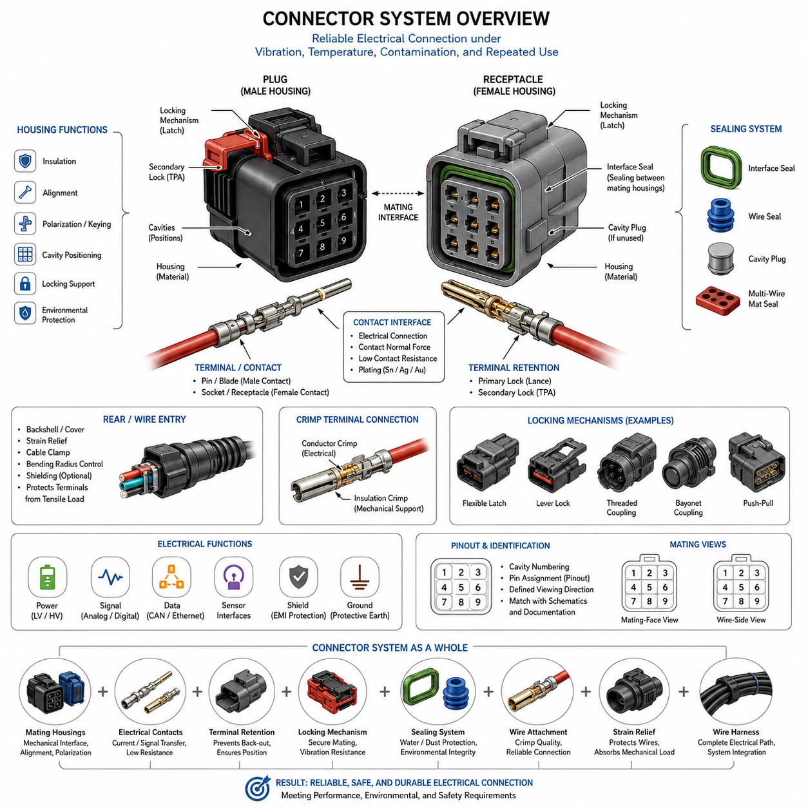
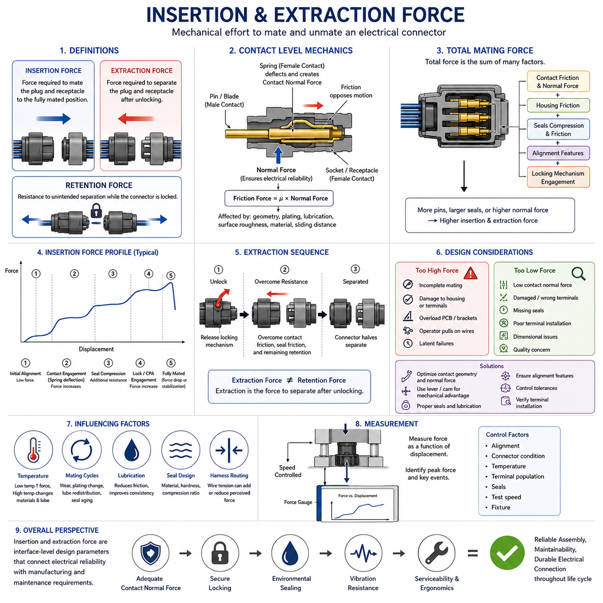
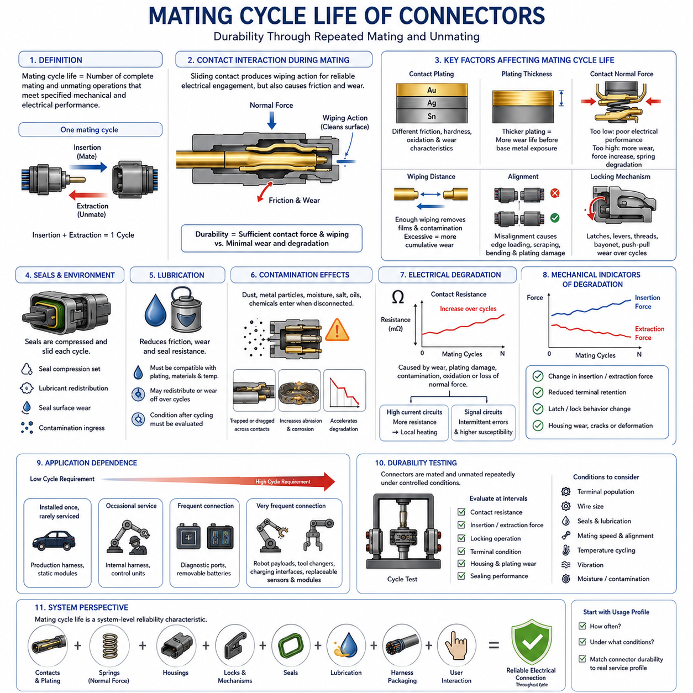
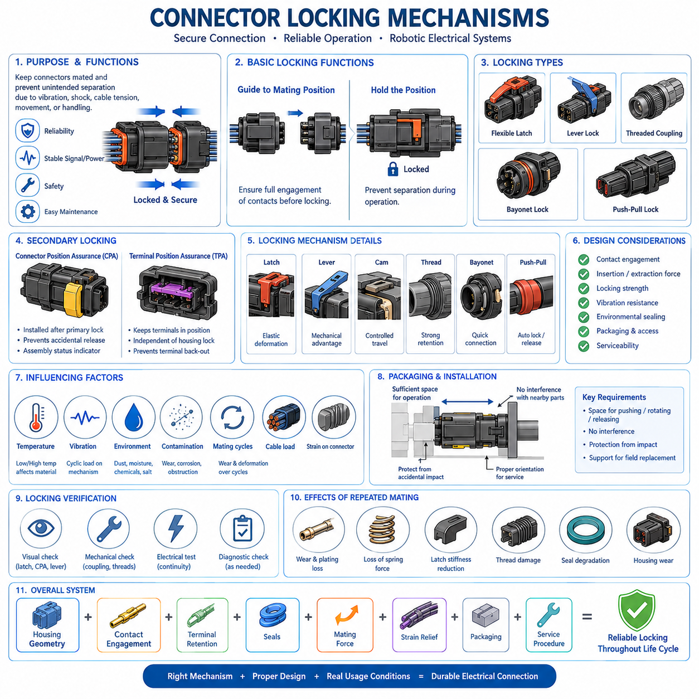
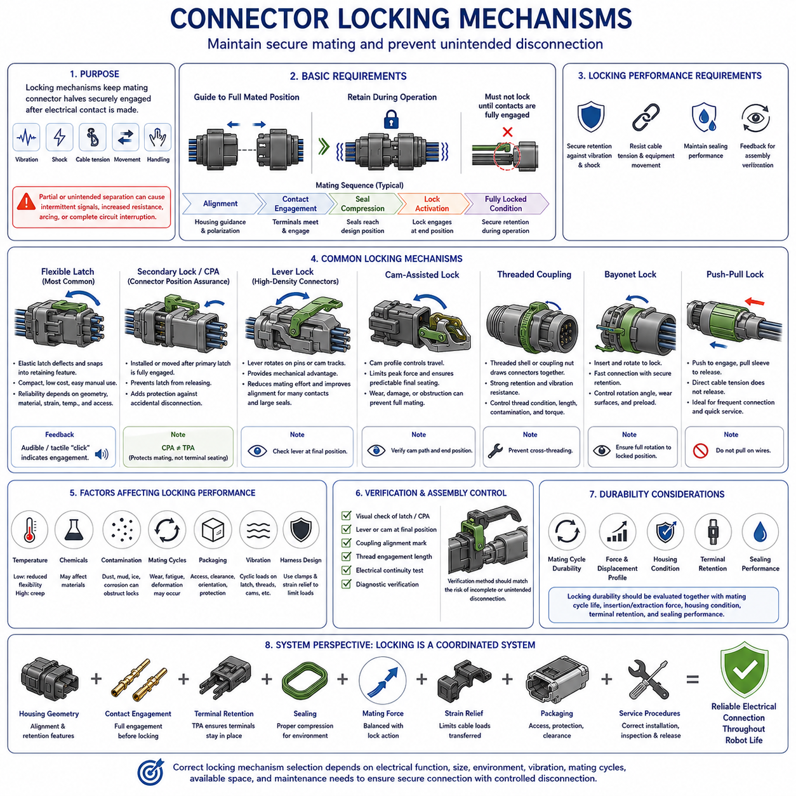
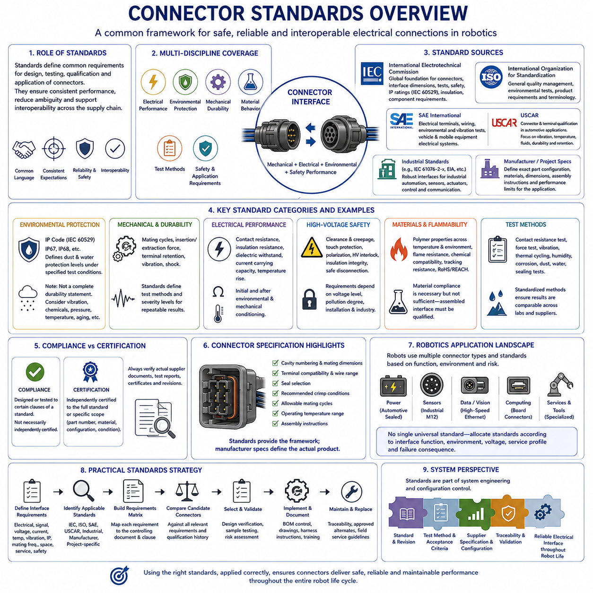

**Volume 03. Connector Engineering**

# Chapter 01. Connector Fundamentals

## 01.01. Connector Structure and Terminology

{width="7.268055555555556in" height="7.268055555555556in"}

A connector is an engineered electromechanical interface that allows electrical power, signals, data, or grounding paths to pass between components while preserving mechanical alignment and serviceability. In robotics and vehicle electrical systems, the connector is not merely a detachable joint. It forms part of the complete electrical path and must maintain stable contact under vibration, temperature variation, contamination, repeated maintenance, and mechanical loading.

The basic connector assembly is commonly divided into a plug side and a receptacle or mating side. Depending on the product family, these may also be described as male and female housings, although modern engineering documentation preferably distinguishes the housing from the electrical contact itself. The housing provides mechanical support, polarization, cavity positioning, insulation, and environmental protection, while the terminals or contacts establish the conductive electrical interface.

A contact is the conductive element that transfers current or signals across the mating interface. Typical terminology includes pin, socket, blade, tab, receptacle, terminal, and contact. A pin or blade generally represents the projecting contact geometry, while a socket or receptacle receives the mating contact. However, terminology varies among manufacturers, so engineers should rely on the supplier\'s interface drawings and contact definitions rather than assuming that housing gender always determines terminal geometry.

Each terminal is normally retained inside a defined cavity in the connector housing. The cavity controls terminal position and prevents adjacent conductive elements from contacting each other. Primary terminal retention is usually provided by a locking lance, spring feature, or molded housing geometry. Many automotive and robotic connectors also employ a secondary retention mechanism, often called a Terminal Position Assurance device, that reduces the possibility of terminal back-out after assembly.

Connector housings perform several functions simultaneously. They maintain contact spacing, provide electrical insulation, support locking features, define mating orientation, and protect terminals from direct mechanical damage. Housing materials are typically selected for dielectric strength, temperature resistance, dimensional stability, chemical compatibility, and mechanical durability. Their geometry also determines important characteristics such as creepage distance, clearance, polarization, keying, and allowable contact density.

Polarization and keying prevent incorrect connector mating. Polarization establishes the permitted orientation between mating connector halves, while mechanical keying distinguishes interfaces that may have similar dimensions but different electrical functions. These features are particularly important in robots containing repeated motors, sensors, controllers, and distributed power branches. Proper keying reduces assembly errors and prevents a physically compatible but electrically incorrect connection from being made during production or field service.

The mating interface is the region where the two connector halves mechanically engage and their contacts establish electrical continuity. Reliable mating requires accurate alignment, sufficient contact normal force, controlled insertion depth, and secure retention after engagement. Connector design must therefore treat mechanical and electrical behavior as a coupled system. A connector that appears fully assembled externally may still contain an improperly seated terminal, damaged contact, incomplete lock, or displaced seal.

A locking mechanism keeps the connector halves engaged after mating. Common arrangements include flexible latches, lever locks, threaded couplings, bayonet mechanisms, push-pull systems, and connector-position-assurance features. The lock must resist separation caused by vibration, cable loading, shock, and handling while still supporting the intended maintenance process. Lock geometry also influences insertion and extraction force, service access, packaging space, and the probability of incomplete mating.

Sealed connectors introduce additional components around the mating interface and wire-entry region. An interface seal prevents moisture or contaminants from passing between the mating housings, while individual wire seals or a multi-wire mat seal protect the rear cable-entry area. Unused cavities may require cavity plugs to maintain environmental performance. Seal effectiveness depends not only on connector design but also on correct wire diameter, terminal position, assembly condition, and compression of the sealing elements.

The rear portion of a connector forms the transition between the terminals and the wire harness. Crimped terminals are widely used because a properly engineered crimp provides both electrical conduction and mechanical retention without solder. The conductor crimp establishes the electrical joint with the stripped wire strands, while an insulation support or strain-relief region controls mechanical loading. Incorrect stripping, crimp height, wire size, or terminal selection can compromise the entire connector interface.

A backshell, cover, boot, strain-relief feature, or cable clamp may be added behind the primary connector housing. These components protect the wire exit, control bending radius, transfer tensile loads away from the terminals, and sometimes provide shielding or environmental protection. In mobile robots, this region deserves particular attention because harness motion, chassis vibration, service handling, and repeated flexing can create loads that are not apparent when the connector is evaluated as an isolated component.

Electrical terminology must distinguish nominal circuit function from physical connector construction. A connector may carry low-voltage power, high-current power, analog signals, digital communication, Ethernet, CAN, sensor interfaces, shielding, or protective grounding. A single housing may contain several contact sizes or functional groups. Engineers therefore define connectors using identifiers, cavity numbers, terminal part numbers, wire specifications, circuit names, and mating-interface references rather than relying only on connector appearance.

Pinout refers to the assignment of electrical functions to individual connector cavities or contacts. Each cavity should have an unambiguous identifier that corresponds with schematics, harness drawings, interface-control documents, manufacturing data, and diagnostic information. Pin numbering must be interpreted from the specified viewing direction because mating-face and wire-side views are mirror-related. Ambiguous viewing conventions are a frequent source of wiring errors during prototype construction and troubleshooting.

Connector gender terminology requires special care because housing gender and contact gender are not always identical concepts. A housing described as a plug may contain socket contacts, while another connector family may use different conventions. For engineering communication, the most reliable description combines the connector family, housing part number, mating part number, terminal type, cavity designation, and specified mating view. This avoids assumptions created by informal descriptions such as simply calling an assembly male or female.

A complete connector interface should therefore be considered a system consisting of mating housings, electrical contacts, terminal retention, locks, seals, wire attachments, strain relief, optional shielding, and the associated harness. Its performance depends on the interaction of all these elements rather than on any single component. This system perspective provides the foundation for later analysis of insertion and extraction force, mating-cycle durability, locking mechanisms, contact physics, environmental sealing, and connector selection.

## 01.02. Insertion/Extraction Force

{width="7.268055555555556in" height="7.268055555555556in"}

Insertion and extraction force describe the mechanical effort required to mate and unmate an electrical connector. Insertion force is the force applied while the plug and receptacle move toward the fully mated position, whereas extraction force is required to separate them. These forces directly influence assembly ergonomics, terminal integrity, locking reliability, serviceability, and the mechanical loads transferred into the wire harness and surrounding structure.

At the contact level, insertion force is generated primarily by friction and elastic deformation between mating conductive surfaces. When a pin, blade, or tab enters a socket or receptacle contact, the spring elements of the female contact deflect and create contact normal force. This normal force is essential for maintaining a stable electrical interface, but it also produces friction that must be overcome during mating and therefore contributes directly to connector insertion force.

Contact geometry strongly affects the force profile. A tapered pin, rounded entry feature, guided blade, or properly designed receptacle lead-in can gradually deflect the contact spring and reduce peak insertion force. Sharp transitions or poor alignment can produce sudden force increases, contact damage, or terminal displacement. The mechanical design must therefore establish sufficient normal force for electrical reliability without creating excessive resistance during connector assembly.

The relationship between contact normal force and friction can be approximated conceptually by considering friction force as proportional to normal force and the effective coefficient of friction. Real connector behavior is more complicated because surface roughness, plating material, lubrication, contact geometry, elastic deformation, and sliding distance influence the force. Nevertheless, increasing contact normal force generally increases insertion and extraction forces when other conditions remain unchanged.

In a multi-pin connector, total mating force results from the combined behavior of many individual contacts together with housing friction, seals, alignment features, and locking mechanisms. A connector containing dozens of terminals can therefore require substantial insertion force even when the force associated with each individual contact is relatively small. Contact engagement may occur simultaneously or sequentially depending on terminal length, cavity geometry, and connector architecture.

Environmental sealing can contribute significantly to insertion force. Interface seals are compressed as the mating housings approach their final position, while radial or axial sealing surfaces may slide against the housing. Seal material, hardness, lubrication, compression ratio, temperature, and dimensional tolerance all influence this resistance. In highly sealed automotive and robotic connectors, the seal may account for a substantial portion of the force observed near the end of the mating stroke.

The insertion-force curve is not necessarily constant throughout connector travel. Initial movement may require relatively little force while alignment features engage. Force then increases as terminals begin mating and contact springs deflect. Additional resistance appears when environmental seals become compressed, and another characteristic force change may occur when the primary latch, lever, or connector-position-assurance mechanism reaches its locking position.

Extraction force follows a related but different mechanical sequence. Before separation begins, the locking mechanism normally has to be released or disengaged. Once unlocked, the operator must overcome contact friction, seal friction, and any mechanical retention remaining between the connector halves. Extraction force should therefore be distinguished from connector retention force, because retention describes resistance to unintended separation while the locking mechanism is still engaged.

Excessively high insertion force creates several engineering problems. Operators may fail to achieve full mating, particularly when access is restricted or the connector is located deep inside a robot chassis. High force can also deform brackets, damage housings, push terminals backward, overload printed circuit board interfaces, or encourage technicians to pull and push on wires rather than the connector body. These conditions can introduce latent failures that are difficult to detect visually.

Insertion force that is unexpectedly low can also indicate a problem. Insufficient contact normal force, damaged terminals, incorrect contact selection, missing seals, incomplete terminal installation, or dimensional abnormalities may reduce mating resistance. For this reason, mating force can sometimes serve as an indirect process-quality indicator. However, force alone cannot prove correct electrical assembly because several independent mechanical and electrical conditions contribute to the measured value.

Lever-assisted connectors reduce the manual force required to mate high-density interfaces. A lever, cam, or sliding mechanism converts a relatively long operator movement into controlled axial connector travel with mechanical advantage. This approach is particularly useful when numerous terminals and large interface seals would otherwise produce excessive direct push force. The mechanism can also improve alignment and provide more consistent final seating of the mating housings.

Extraction design must consider service conditions as carefully as initial assembly. A connector that is easy to install during manufacturing may become difficult to disconnect after exposure to heat, dust, moisture, chemicals, or long-term seal compression. Service technicians must be able to release the locking feature and apply separation force without damaging adjacent wiring. Appropriate finger access, tool access, grip surfaces, and cable slack should therefore be considered during packaging design.

Wire harness routing can unintentionally influence perceived insertion and extraction force. If a harness branch is too short, highly bent, or constrained near the connector, wire tension may oppose mating or assist unintended separation. The resulting operator force then includes both connector resistance and harness mechanical loading. Connector force evaluation should therefore distinguish the intrinsic mating characteristics of the connector from external loads introduced by installation geometry.

Temperature can change mating behavior because polymers, elastomers, lubricants, and metallic contacts respond differently to thermal conditions. Seal stiffness may increase at low temperature, raising insertion or extraction force, while elevated temperature can alter material compliance and lubrication characteristics. Connector qualification should consequently evaluate mechanical operation across the intended environmental range rather than relying exclusively on measurements performed at room temperature.

Repeated mating cycles may also change force characteristics. Contact surfaces experience sliding wear, plating modification, lubricant redistribution, and small geometric changes, while seals and housing features undergo repeated compression and relaxation. Insertion and extraction forces measured on a new connector may therefore differ from those observed after extended service. Force trends should be evaluated together with mating-cycle life and contact-resistance stability rather than as an isolated mechanical parameter.

Measurement typically requires controlled connector alignment and a defined mating or unmating speed. A force gauge or mechanical test system records force as a function of displacement, allowing engineers to identify peak force and characteristic events during the mating sequence. Consistent fixtures, connector condition, temperature, terminal population, seals, and test speed are important because uncontrolled differences can make force measurements difficult to compare across samples.

For robotic electrical architecture, insertion and extraction force should ultimately be treated as an interface-level design parameter connecting electrical reliability with manufacturing and maintenance requirements. The selected connector must provide adequate contact normal force, secure locking, environmental sealing, and vibration resistance while remaining practical to assemble and service. Proper force design therefore supports reliable production, repeatable field maintenance, and durable electrical connectivity throughout the robot life cycle.

## 01.03. Mating Cycle Life

{width="7.268055555555556in" height="7.268055555555556in"}

Mating cycle life defines the number of complete connector mating and unmating operations that an electrical connector can withstand while continuing to satisfy specified mechanical and electrical performance requirements. One mating cycle normally consists of one complete insertion followed by one complete extraction. The rating is therefore a durability parameter describing repeated interface use rather than the calendar service life of the connector.

Every mating cycle produces mechanical interaction between the male and female contacts. As a pin, blade, socket, or receptacle slides across its mating surface, contact normal force creates the wiping action required for reliable electrical engagement. The same movement also produces friction and microscopic wear. Connector durability therefore depends on balancing sufficient contact force and wiping action against excessive mechanical degradation of the contact surfaces.

Contact plating is particularly important to mating cycle life because the mating surfaces experience repeated sliding. Tin, silver, and gold finishes have different friction, hardness, oxidation, and wear characteristics. The plating system must maintain an electrically suitable interface throughout the intended number of operations. If repeated mating removes or damages the functional plating layer, the underlying base material may become exposed and contact resistance can become less stable.

Plating thickness influences how much mechanical wear a contact surface can tolerate before the underlying material becomes significant. A thin functional coating may be adequate for a connector intended to remain connected for most of its operating life, while interfaces requiring frequent disconnection may require a more durable contact system. Plating material and thickness must therefore be evaluated together with contact geometry, normal force, environment, and expected maintenance frequency.

Contact normal force has a dual influence on mating durability. Adequate force helps penetrate surface films and maintains a stable low-resistance electrical interface, especially under vibration. However, excessive normal force increases friction and surface stress during every insertion and extraction. Over many cycles, this can accelerate plating wear, increase mating force, deform contact springs, or change the geometry responsible for maintaining electrical contact.

The wiping distance is the relative sliding distance between mating contact surfaces during engagement. Controlled wiping can remove light contamination and surface films before the contact reaches its final operating position. Excessive sliding distance, however, increases cumulative wear. The contact system must therefore provide enough wiping action to establish a clean electrical interface without unnecessarily consuming the available wear life of the plating and contact geometry.

Mating cycle life also depends on alignment. Proper housing guidance and polarization features ensure that the contacts enter their intended positions before significant contact loading occurs. Misalignment can create edge loading, scraping, bending, or localized plating damage. Repeated misaligned mating can degrade a connector much faster than correctly controlled operation, even when the nominal number of mating cycles remains below the manufacturer\'s specified durability rating.

Connector housings and locking mechanisms experience cyclic loading together with the contacts. Flexible latches, lever locks, secondary locks, threads, bayonet features, and push-pull mechanisms repeatedly deform or slide whenever the connector is operated. Wear, plastic deformation, cracking, or loss of locking engagement can therefore become the limiting durability mechanism even when the electrical contacts themselves remain functional.

Environmental seals are also subjected to repeated mechanical interaction. Interface seals may be compressed and released during every mating cycle, while sealing surfaces can experience sliding friction during insertion and extraction. Repeated operation can alter seal geometry, redistribute lubricant, damage sealing lips, or introduce contamination. Consequently, a connector may retain acceptable electrical continuity while its environmental protection gradually deteriorates.

Lubrication can reduce friction, contact wear, and seal resistance when it is correctly specified for the connector system. Its effectiveness depends on compatibility with contact plating, polymers, elastomers, temperature range, and the expected environment. Repeated cycling may redistribute or remove lubricant from critical surfaces. Connector life assessment should therefore consider the condition of lubrication after repeated operation rather than assuming that its initial condition remains unchanged.

Contamination can significantly accelerate mating-related degradation. Dust, metallic particles, moisture, salt, oils, and industrial chemicals may enter an interface during maintenance or when disconnected. Subsequent mating can trap or drag these materials across the contact surface, increasing abrasion or promoting corrosion. Protective caps, controlled maintenance practices, appropriate sealing, and careful connector placement are therefore important for interfaces that are repeatedly opened in field environments.

Electrical degradation during repeated cycling is commonly observed through changes in contact resistance. Mechanical wear, plating damage, contamination, oxidation, or loss of normal force can increase resistance or make it unstable. Small changes may be particularly important in high-current circuits because additional resistance produces localized heating. Signal circuits can instead experience intermittent communication, voltage errors, or increased susceptibility to vibration-induced discontinuity.

Mechanical indicators of degradation include changes in insertion force, extraction force, terminal retention, latch behavior, and housing condition. A progressive decrease in extraction force may indicate reduced contact normal force or mechanical wear, while an abnormal increase may result from deformation, contamination, seal changes, or damaged contact surfaces. Force trends can therefore provide useful information when evaluated together with electrical measurements and physical inspection.

The required mating cycle life varies substantially with connector application. A production connector installed once and rarely serviced may require relatively few lifetime operations, whereas diagnostic interfaces, removable batteries, modular robot payloads, charging interfaces, tool changers, and frequently replaceable sensors may experience repeated connection throughout operation. The expected usage profile should therefore be established before selecting a connector rather than treating cycle rating as a secondary catalog parameter.

Robotic systems can impose particularly demanding mating patterns because modular hardware is frequently exchanged during development, testing, maintenance, and field operation. A connector intended for an internal harness may experience only occasional service, while a payload interface or replaceable module can be disconnected many times. Using the same connector philosophy for both applications can result in unnecessary cost in one location and inadequate durability in another.

Durability testing is performed by repeatedly mating and unmating representative connector samples under controlled conditions. After specified cycle intervals, engineers can evaluate contact resistance, insertion and extraction force, locking operation, terminal condition, housing damage, plating wear, and sealing performance as applicable. The objective is not simply to count operations but to confirm that the interface continues to meet its functional requirements after accumulated mechanical use.

Test conditions must represent the intended connector configuration because terminal population, wire size, seals, lubrication, mating speed, alignment, and environmental exposure can influence the result. A partially populated laboratory connector may behave differently from a fully populated production assembly. Where the application includes vibration, temperature cycling, moisture, or contamination, mating durability should also be considered together with these environmental stresses rather than as an isolated bench characteristic.

Mating cycle life should ultimately be treated as a system-level reliability characteristic involving contacts, plating, springs, housings, locks, seals, lubrication, harness packaging, and user interaction. Proper connector selection begins by defining how frequently the interface will be operated and under what conditions. Matching connector durability to the real service profile helps preserve low contact resistance, secure locking, environmental protection, and practical maintainability throughout the electrical system life cycle.

## 01.04. Connector Locking Mechanisms

{width="7.268055555555556in" height="7.268055555555556in"}

{width="7.268055555555556in" height="7.268055555555556in"}

Connector locking mechanisms maintain mechanical engagement between mating connector halves after electrical contact has been established. Their purpose is to prevent unintended separation caused by vibration, shock, cable tension, equipment movement, or handling. In robotic electrical systems, the locking mechanism is therefore part of the reliability architecture rather than a simple convenience feature, because partial separation can produce intermittent signals, increased resistance, arcing, or complete circuit interruption.

A basic locking mechanism must perform two related functions: guide the connector toward a defined fully mated position and retain that position during operation. The electrical contacts should reach their intended engagement depth before the connector is considered locked. If mechanical locking can occur while terminals remain only partially engaged, the interface may appear correctly assembled even though electrical contact area, contact normal force, sealing compression, or terminal alignment is inadequate.

Flexible latch mechanisms are among the most common locking arrangements in compact electrical connectors. A molded plastic latch elastically deflects as the connector halves are pushed together and then returns into a retaining feature when the final mating position is reached. This approach provides low cost, compact packaging, and simple manual operation. Its reliability depends on latch geometry, polymer properties, allowable strain, temperature exposure, repeated cycling, and adequate access for intentional release.

Latch designs often provide an audible or tactile indication when engagement occurs. A noticeable click helps assembly operators recognize that the connector has reached its locking position, although this indication should not be treated as absolute proof of correct terminal engagement. Restricted access, high insertion force, damaged components, or foreign material can create misleading feedback. Critical interfaces may therefore require visual inspection, secondary locking confirmation, or controlled assembly verification.

Secondary locking devices improve protection against accidental release of the primary lock. A Connector Position Assurance device, commonly abbreviated CPA, can be installed or moved into position only after the primary connector latch has substantially completed engagement. The CPA then restricts movement of the latch toward its release position. This provides an additional mechanical barrier against unintended disconnection and can also serve as an assembly-status indicator during manufacturing or service inspection.

Connector Position Assurance should be distinguished from Terminal Position Assurance, or TPA. CPA primarily confirms or protects the mating condition between connector housings, whereas TPA supports correct retention of individual terminals inside their cavities. Both may exist in the same connector assembly, but they address different failure mechanisms. A connector can be fully locked while containing an improperly seated terminal, so housing locking and terminal retention must be independently controlled.

Lever-lock mechanisms are commonly applied to high-density connectors requiring substantial mating force. Instead of pushing the connector halves directly together, the operator rotates a lever that engages pins, tracks, or cam surfaces on the mating housing. The lever provides mechanical advantage and converts rotational movement into controlled axial displacement. This reduces operator effort while improving alignment and enabling numerous contacts and large environmental seals to be engaged more consistently.

Cam-assisted locking follows the same general principle of controlled mechanical advantage. Carefully designed cam profiles can establish the required connector travel while limiting peak operator force and producing predictable final seating. The mechanism must nevertheless withstand repeated loading without excessive wear or deformation. Incorrect lever position, damaged cam tracks, obstruction, or forced operation can prevent complete mating and may damage the housing even when the external mechanism appears close to its final position.

Threaded coupling mechanisms are widely used where strong retention, controlled engagement, and resistance to vibration are required. One connector half contains a threaded shell or coupling nut that engages the mating interface and draws the connectors together as it rotates. Circular industrial, aerospace, instrumentation, and robotic connectors frequently use this approach. Proper performance depends on thread condition, engagement length, tightening control, contamination, anti-rotation features, and prevention of cross-threading.

Bayonet locking provides rapid connection with positive mechanical retention by combining axial insertion with a limited rotational movement. Pins or lugs enter corresponding slots and move into retaining positions as the connector is rotated. Compared with fully threaded coupling, bayonet systems can reduce connection time while still providing secure engagement. Their design must control rotational travel, wear surfaces, spring preload, and end-position retention so that vibration does not gradually release the coupling.

Push-pull locking mechanisms are useful where frequent connection and rapid service are important. The connector locks automatically when pushed into the mating receptacle, while intentional pulling of a release sleeve or outer shell disengages the retention mechanism. Direct cable tension should not normally release the connector. This distinction allows secure operation combined with fast servicing and is particularly useful for instrumentation, sensors, removable robotic modules, and equipment requiring repeated configuration changes.

Locking mechanisms must be designed together with insertion and extraction force. A lock should not require the operator to overcome unnecessarily high force after the electrical contacts and seals have already reached their intended positions. Conversely, a mechanism that engages too easily may allow false locking before complete mating. The force and displacement profile should provide a clear transition between alignment, contact engagement, seal compression, lock activation, and the final mechanically retained condition.

Vibration resistance is a major requirement for mobile robots, vehicles, manipulators, and industrial equipment. Repeated micro-movement can apply cyclic loads to latches, threads, cams, and retaining surfaces. The locking system must prevent these loads from producing progressive connector separation. However, the lock should not be expected to compensate for poor harness routing. Cable mass and motion should be controlled through clamps and strain relief so that excessive dynamic loads are not continuously transferred into the connector.

Environmental conditions can change locking performance throughout the connector life cycle. Low temperatures may reduce polymer flexibility, high temperatures may promote creep, and chemicals can alter housing properties. Dust, mud, corrosion products, or ice may obstruct moving locking features. Outdoor and industrial robotic connectors should therefore be evaluated according to their real installation environment, including contamination exposure and accessibility for cleaning, inspection, and release during field maintenance.

Repeated mating cycles can gradually change the behavior of a locking mechanism. Flexible latches may lose stiffness, cam surfaces can wear, threads may become damaged, and retaining features can develop dimensional changes. The connector may still provide electrical continuity while mechanical retention has deteriorated. Lock durability should consequently be evaluated together with mating-cycle life, insertion and extraction force, housing condition, terminal retention, and environmental sealing performance.

Packaging strongly affects whether a theoretically reliable locking mechanism works correctly in the finished robot. Operators need sufficient space to push, rotate, release, or visually inspect the lock. Nearby structures should not interfere with lever travel, coupling rotation, or CPA installation. At the same time, exposed locking features should be protected from accidental impact. Connector orientation should support both secure installation and realistic field replacement without requiring technicians to pull directly on wires.

Locking verification can be incorporated into manufacturing and maintenance procedures. Visual confirmation of latch position, CPA installation, lever end position, coupling alignment marks, or specified thread engagement can provide useful assembly evidence. For safety-critical or high-reliability interfaces, mechanical inspection may be combined with electrical continuity testing and diagnostic checks. The verification method should correspond to the actual failure consequences associated with incomplete or unintended connector separation.

Connector locking should ultimately be considered a coordinated system involving housing geometry, contact engagement, terminal retention, seals, mating force, strain relief, packaging, and service procedures. The appropriate mechanism depends on electrical function, connector size, environmental exposure, vibration, expected mating cycles, available space, and maintenance frequency. Correct selection ensures that the electrical interface remains fully engaged while still allowing intentional, controlled disconnection throughout the robot\'s operating life.

## 01.05. Connector Standards Overview

{width="7.268055555555556in" height="7.268055555555556in"}

Connector standards provide a common engineering framework for defining how electrical connectors are designed, tested, qualified, documented, and applied. They reduce ambiguity between connector manufacturers, harness suppliers, system integrators, and equipment developers by establishing consistent terminology and performance expectations. In robotics, connector standards help translate electrical, mechanical, environmental, manufacturing, and safety requirements into measurable interface criteria.

No single standard defines every aspect of a connector. Connector engineering normally involves several overlapping categories of requirements, including dimensional compatibility, electrical performance, environmental protection, mechanical durability, material behavior, test methods, and application-specific safety. Engineers must therefore identify which standards apply to the connector itself, which apply to its test procedure, and which originate from the vehicle, machine, robot, or installation environment.

International standards developed by the International Electrotechnical Commission, or IEC, provide an important foundation for connector engineering. IEC documents address connectors for electronic equipment, industrial interfaces, environmental protection, insulation coordination, and numerous component-specific requirements. Their value lies in establishing internationally recognized definitions and test principles that can be referenced across manufacturers and industries rather than relying solely on proprietary specifications.

IEC 60529 is especially relevant when connectors are exposed to dust and water because it defines the IP Code, or Ingress Protection classification. Ratings such as IP67 or IP68 describe specified levels of protection provided by an enclosure against solid objects and water under defined test conditions. An IP rating should not be interpreted as a universal statement of connector durability because vibration, chemicals, mating condition, pressure, temperature, and long-term aging require separate consideration.

Connector product families may also be governed by IEC standards that define interface dimensions and performance characteristics. Circular connectors such as industrial M8 and M12 interfaces illustrate the importance of standardized mating geometry. Standardized interfaces can support interoperability between products from different suppliers, but mechanical compatibility alone does not guarantee identical current capacity, shielding, environmental performance, coding, materials, or application suitability.

Automotive connector engineering commonly uses standards and test practices developed by organizations such as ISO, SAE International, USCAR, and individual vehicle manufacturers. Automotive requirements emphasize vibration, temperature cycling, humidity, fluid exposure, terminal retention, mechanical shock, electrical continuity, and long-term contact stability. These conditions are highly relevant to mobile robots because robots can experience similar combinations of vibration, thermal variation, contamination, and repeated field maintenance.

USCAR connector specifications are widely recognized within automotive electrical component qualification. They establish structured approaches for evaluating terminals, connectors, and related electrical connection systems under mechanical, electrical, and environmental stresses. The important engineering principle is that a connector should not be selected merely because its dimensions and current rating appear suitable. Qualification must represent the expected operating stresses and failure mechanisms of the intended application.

SAE standards contribute additional practices related to electrical terminals, wiring, environmental testing, and vehicle electrical systems. Depending on the application, SAE documents may complement rather than replace IEC, ISO, or manufacturer-specific requirements. A connector development program should therefore maintain a clear standards applicability matrix showing which document controls each requirement and preventing multiple specifications with different conditions from being treated as automatically equivalent.

Industrial connector standards place strong emphasis on reliable interfaces for machinery, factory automation, sensors, actuators, communication networks, and control equipment. Standardized circular and rectangular interfaces simplify equipment integration and replacement. However, industrial installations can differ significantly from automotive environments. Stationary machinery may prioritize chemical resistance and repeated maintenance, while mobile equipment can add continuous vibration, cable motion, shock, and constrained packaging.

Environmental qualification standards define how connector performance is evaluated under conditions such as temperature, humidity, vibration, mechanical shock, corrosion, dust, and water exposure. The test method is as important as the nominal rating because severity depends on temperature limits, dwell time, vibration spectrum, acceleration, exposure duration, mounting condition, and sample configuration. Two connectors described with similar marketing terms may therefore have substantially different qualification histories.

Electrical connector standards also address characteristics such as contact resistance, insulation resistance, dielectric withstand capability, current carrying performance, and temperature rise. These parameters are interdependent. Increased contact resistance can generate localized heating, while contamination or insufficient insulation distance can reduce electrical isolation. Connector qualification should therefore confirm both initial performance and performance after environmental and mechanical conditioning.

High-voltage connector applications introduce additional requirements beyond conventional low-voltage interfaces. Clearance, creepage distance, touch protection, polarization, high-voltage interlock functions, insulation integrity, and safe disconnection become increasingly important. Applicable requirements depend on system voltage, pollution conditions, installation architecture, and industry. High-voltage connector selection should consequently be integrated with the electrical safety architecture rather than treated as an isolated component decision.

Material and flammability requirements may also apply to connector housings, seals, backshells, and related components. Polymer materials must maintain mechanical and insulating properties across the specified temperature and environmental range. Depending on the system, requirements can include flame resistance, chemical compatibility, resistance to tracking, and limitations on hazardous substances. Material compliance does not automatically demonstrate complete connector performance because the assembled interface must still be qualified.

Standards are particularly valuable for defining repeatable test methods. Contact resistance measurements, insertion and extraction force testing, terminal retention testing, mating-cycle durability, vibration exposure, thermal cycling, and sealing tests require controlled fixtures and procedures. Without standardized conditions, results from different laboratories or suppliers may not be directly comparable. A clearly referenced test method therefore forms part of the technical definition of every reported connector performance value.

Compliance and certification should not be confused. A component may be designed or tested according to particular clauses of a standard without being independently certified to the entire document. Likewise, a connector family may have certifications that apply only to specific part numbers, materials, configurations, or operating conditions. Engineers should verify the actual supplier documentation, test reports, certificates, and applicable revisions instead of assuming compliance from a product-family description.

Manufacturer specifications remain essential even when standardized interfaces are used. The supplier drawing defines details such as cavity numbering, mating dimensions, terminal compatibility, wire range, seal selection, recommended crimp conditions, allowable mating cycles, operating temperature, and assembly instructions. Standards establish common frameworks, but the manufacturer specification defines the actual component configuration that must be controlled in the production bill of materials and harness documentation.

Robotics frequently combines automotive, industrial, computing, and specialized connector technologies within a single machine. A mobile robot may use automotive sealed connectors for power distribution, M12 interfaces for industrial sensors, high-speed connectors for cameras and Ethernet, and compact board connectors inside computing modules. A single universal connector standard is therefore unrealistic. Standards should instead be allocated according to interface function, environment, voltage, service profile, and failure consequence.

A practical connector standards strategy begins by defining the interface requirements before selecting a connector family. Electrical load, signal type, voltage, current, temperature, vibration, ingress protection, mating frequency, packaging, serviceability, and safety requirements establish the qualification envelope. Candidate connectors can then be compared against the relevant IEC, ISO, SAE, USCAR, industrial, manufacturer, and project-specific requirements rather than being selected primarily by familiarity or catalog availability.

Connector standards should ultimately be treated as part of system engineering and configuration control. The applicable standard, revision, test method, acceptance criterion, supplier specification, and approved component configuration should remain traceable throughout development and production. This disciplined approach allows connector selection, validation, manufacturing, maintenance, and future replacement to use the same technical baseline, supporting reliable electrical interfaces throughout the robot life cycle.
