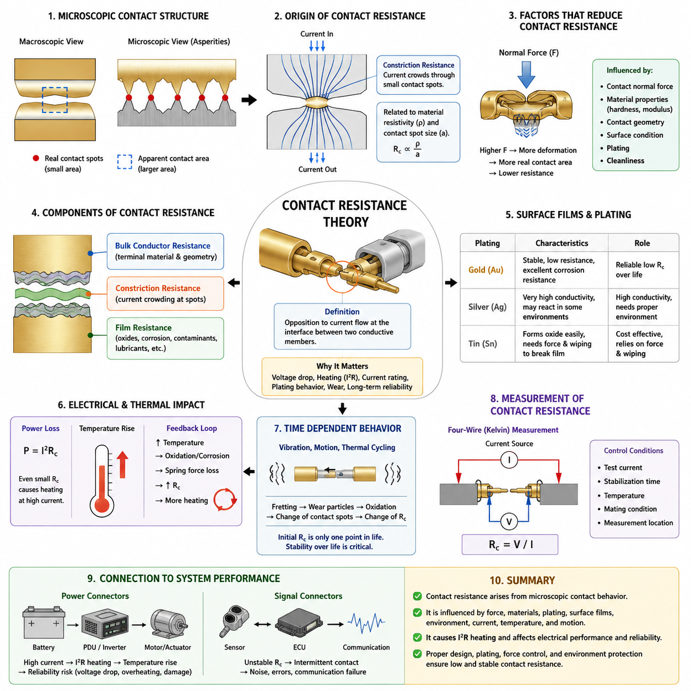
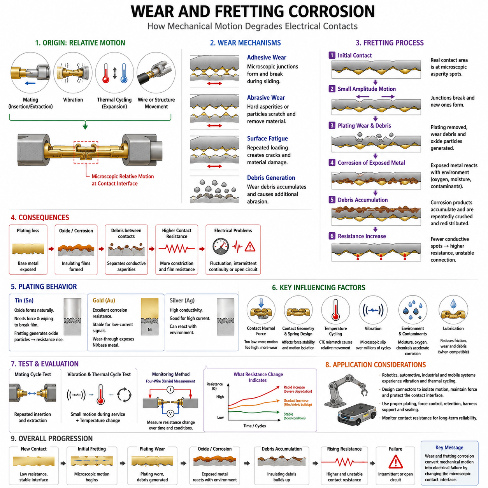
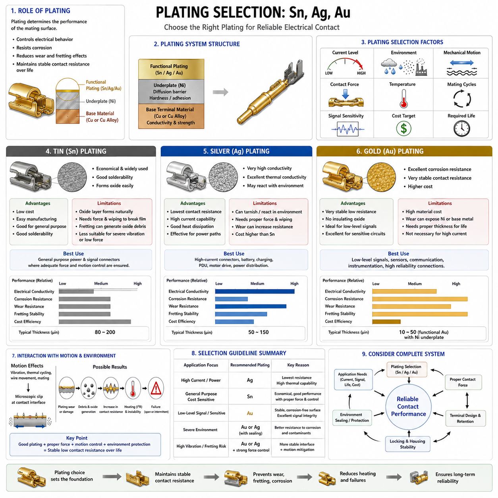
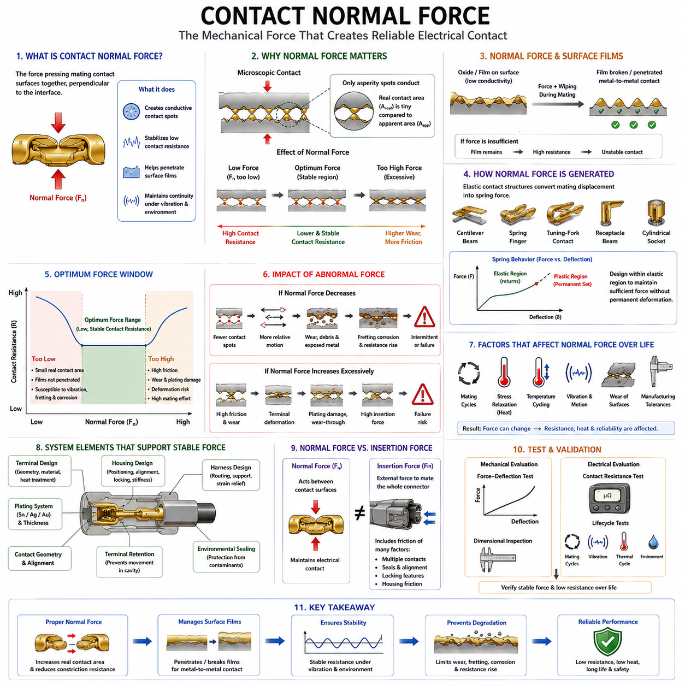
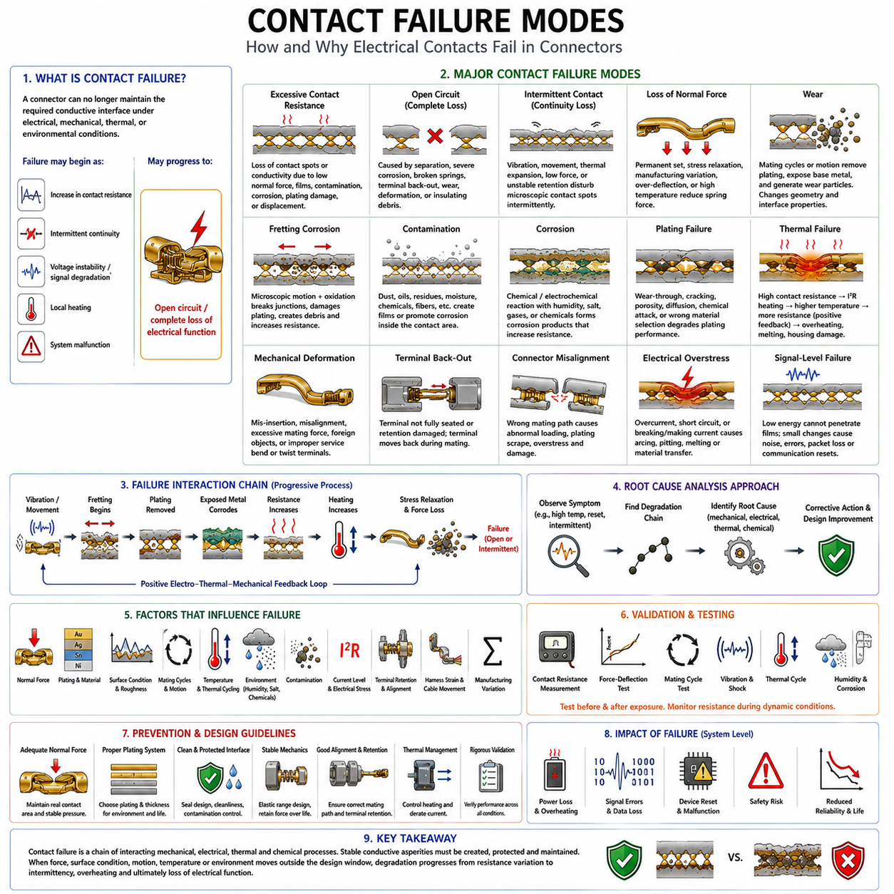

**Volume 03. Connector Engineering**

# Chapter 02. Contact Physics

## 02.01. Contact Resistance Theory

{width="7.268055555555556in" height="7.268055555555556in"}

전기 접촉 저항(Electrical Contact Resistance)은 두 도전성 부재가 접촉하는 경계면에서 발생하는 전류 흐름에 대한 저항으로, 벌크 재료(Bulk Material) 자체의 비저항(Resistivity)이 매우 낮더라도 존재한다. 커넥터 엔지니어링(Connector Engineering)에서는 이 저항이 결합 접점(Mating Contact)이 실제로 접촉하는 미세 영역에 집중된다. 따라서 접촉 저항은 접촉 물리학(Contact Physics)의 핵심 주제이며, 커넥터 발열, 전압 강하(Voltage Drop), 전류 정격(Current Rating), 도금(Plating), 마모(Wear), 장기 전기적 신뢰성(Electrical Reliability)을 이해하기 위한 이론적 기반을 제공한다.

거시적 관점에서 매끄럽게 보이는 커넥터 접점(Connector Contact)의 표면은 실제로는 애스퍼리티(Asperity)라고 하는 미세한 돌기와 골로 구성되어 있다. 두 접점이 결합되면 겉보기 기하학적 면적(Apparent Geometric Area)의 극히 일부만 실제 금속 대 금속 접촉(Metal-to-Metal Contact)을 형성한다. 따라서 전류는 전체 공칭 표면(Nominal Surface)에 균일하게 흐르는 것이 아니라 여러 개의 불연속적인 미세 접촉점(Microscopic Contact Spot)을 통해 흐르게 된다. 이러한 겉보기 접촉 면적과 실제 접촉 면적의 차이는 접촉 저항 이론(Contact Resistance Theory)의 핵심 개념이다.

전류가 각각의 미세 접촉점에 접근하면 비교적 넓은 도체 단면에서 매우 작은 도전 영역으로 전류 경로가 수렴한 후, 접촉 경계를 통과하면서 다시 확산된다. 이러한 현상으로 인해 수축 저항(Constriction Resistance)이 발생한다. 단순화된 원형 접촉점(Circular Contact Spot)의 경우 저항은 접점 재료의 전기 비저항(Electrical Resistivity)과 관련되며, 도전 접촉점의 대표 크기에는 반비례한다. 따라서 접촉점이 크고 그 수가 많을수록 접촉 경계면의 저항은 감소한다.

실제 접촉 면적(Real Contact Area)은 접촉 수직력(Contact Normal Force)과 결합 재료의 기계적 특성에 크게 좌우된다. 수직력이 증가하면 애스퍼리티가 탄성 변형(Elastic Deformation)을 일으키며, 국부 응력이 충분히 높아지면 소성 변형(Plastic Deformation)이 발생한다. 이러한 변형은 기존 도전 접촉점을 확대하고 새로운 접촉점을 형성하여 수축 저항을 감소시킨다. 따라서 커넥터 단자(Connector Terminal)는 스프링 빔(Spring Beam), 캔틸레버(Cantilever), 튜닝 포크(Tuning Fork), 소켓(Socket) 등의 구조를 이용하여 사용 수명 동안 제어된 수직력을 유지한다.

공학적으로 유용한 근사 방법에서는 접촉 저항(Contact Resistance)을 벌크 도체 저항(Bulk Conductor Resistance), 수축 저항(Constriction Resistance), 표면 피막(Surface Film)에 의한 저항으로 구분한다. 벌크 저항은 단자 재료와 형상에서 발생하며, 수축 저항은 미세 접촉 영역 주변의 전류 집중(Current Crowding)에서 발생한다. 피막 저항(Film Resistance)은 산화물(Oxide), 부식 생성물(Corrosion Product), 오염물질(Contaminant), 윤활제(Lubricant) 또는 도전 표면 사이에 존재하는 기타 층에 의해 형성된다. 실제 커넥터에서는 후자의 두 요소 변화가 노화 거동(Aging Behavior)을 지배하는 경우가 많다.

표면 피막(Surface Film)은 특히 중요하다. 환경에 노출된 금속 표면은 완전히 깨끗한 상태를 지속적으로 유지하기 어렵기 때문이다. 주석(Tin), 구리(Copper), 은(Silver) 등의 접점 재료에는 온도, 습도, 대기 오염물질 및 주변 화학물질에 따라 산화막(Oxide Film), 황화물(Sulfide), 부식층(Corrosion Layer)이 형성될 수 있다. 일부 피막은 충분한 도전성을 유지하지만 다른 피막은 접촉 경계면 저항을 크게 증가시킨다. 따라서 신뢰성 높은 접점 설계에서는 이러한 피막을 관통하거나 제거하고, 성장을 제어하거나 전기적으로 문제가 되는 수준까지 형성되지 않도록 해야 한다.

접점 도금(Contact Plating)은 모재 단자 재료(Base Terminal Material)와 외부 환경 사이에 공학적으로 설계된 경계면을 제공한다. 주석(Tin), 은(Silver), 금(Gold) 도금 시스템은 각각 전기적, 기계적, 화학적 및 마찰학적(Tribological) 특성이 다르기 때문에 서로 다른 거동을 나타낸다. 금은 안정적인 저저항 접촉 경계와 뛰어난 내식성(Corrosion Resistance)을 제공하며, 주석은 일반적으로 표면 산화막을 제거하기 위해 충분한 수직력과 와이핑 작용(Wiping Action)을 필요로 한다. 은은 높은 전도성(Conductivity)을 제공하지만 환경 노출과 표면 반응을 적절히 고려해야 한다.

커넥터 전체에서 측정되는 저항은 일반적으로 매우 작으며 흔히 밀리옴(Milliohm) 범위에 있지만, 접점을 통해 상당한 전류가 흐르는 경우 이러한 작은 저항도 중요해진다. 접점에서 발생하는 전력 손실(Contact Power Dissipation)은 P = I²R 관계를 따르므로 발열은 전류의 제곱에 비례하여 증가한다. 신호 수준 전류(Signal-Level Current)에서는 무시할 수 있는 저항도 수십 또는 수백 암페어가 흐르는 배터리(Battery), 모터(Motor), 액추에이터(Actuator), 인버터(Inverter), 충전(Charging), 전력 분배(Power Distribution) 연결에서는 중요한 열원(Thermal Source)이 될 수 있다.

이러한 전기적 발열(Electrical Heating)은 중요한 피드백 메커니즘(Feedback Mechanism)을 형성한다. 접촉 저항이 증가하면 추가적인 열이 발생하여 단자 온도가 상승한다. 온도 상승은 재료 비저항을 변화시키고 산화 및 부식을 가속하며, 응력 완화(Stress Relaxation)를 통해 스프링력을 감소시키고, 폴리머 하우징(Polymer Housing)과 도금 특성에도 영향을 줄 수 있다. 이러한 변화는 다시 접촉 저항을 증가시킬 수 있다. 따라서 커넥터 설계에서는 이러한 전기-열 열화(Electro-Thermal Degradation)가 과도한 전압 강하, 국부 과열(Local Overheating), 단자 손상 또는 전기적 연속성(Electrical Continuity) 상실로 발전하지 않도록 방지해야 한다.

따라서 접촉 저항은 벌크 비저항(Bulk Resistivity)과 같은 고정된 재료 물성이 아니라 시스템 수준의 경계면 특성(System-Level Interface Characteristic)이다. 접촉 저항은 단자 형상, 접촉력(Contact Force), 표면 마감(Surface Finish), 도금 두께(Plating Thickness), 재료 경도(Material Hardness), 오염, 결합 이력(Mating History), 온도, 진동 및 환경 노출의 영향을 받는다. 동일한 도전성 합금으로 제조된 두 접점이라도 운용 중 수직력, 표면 상태, 접촉 형상 또는 기계적 안정성이 다르면 서로 다른 저항 특성을 나타낼 수 있다.

기계적 움직임(Mechanical Motion)은 접촉 저항을 시간에 따라 변화하게 만들 수 있다. 진동, 열팽창(Thermal Expansion), 케이블 하중(Cable Loading), 치수 공차(Dimensional Tolerance)로 발생하는 미세한 상대 운동은 접촉 경계면을 반복적으로 교란한다. 이러한 움직임은 보호 표면층을 제거하고 모재를 노출시키며 마모 입자(Wear Particle)를 발생시키고 산화를 촉진할 수 있다. 그 결과 프레팅(Fretting) 과정은 도전성 애스퍼리티의 수와 품질을 점진적으로 변화시키며, 접촉 저항 이론을 마모 및 프레팅 부식(Fretting Corrosion)과 직접 연결한다.

따라서 새롭게 조립된 커넥터의 초기 저항(Initial Resistance)은 전체 전기적 수명에서 하나의 상태만을 나타낸다. 공학적 평가에서는 반복 결합(Mating Cycle), 진동, 열 사이클(Thermal Cycling), 습도 노출, 오염 및 노화 이후의 저항 안정성(Resistance Stability)도 고려해야 한다. 초기 저항이 약간 높더라도 안정적으로 유지되는 커넥터가 초기 저항은 매우 낮지만 기계적 또는 환경적 스트레스에서 급격히 증가하는 커넥터보다 높은 실질적 신뢰성을 제공할 수 있다. 따라서 수명에 따른 저항 변화(Resistance Change)는 초기 절대 저항값만큼 중요하다.

낮은 접촉 저항을 정확하게 측정하려면 측정 리드(Measurement Lead)와 시험 치구(Test Fixture)의 저항이 평가 대상 저항과 비슷한 수준일 수 있으므로 신중한 시험 방법이 필요하다. 전류 공급 경로와 전압 측정 경로를 분리하기 위해 일반적으로 4선식 측정(Four-Wire Measurement), 즉 켈빈 측정(Kelvin Measurement)을 사용한다. 제어된 시험 전류를 접점에 흘리면서 원하는 접촉 경계면의 전압을 독립적으로 측정하고, R = V/I를 이용하여 측정 리드 저항의 영향을 최소화한 접촉 저항을 계산한다.

시험 전류 자체가 접촉 경계면에 영향을 줄 수 있으므로 측정 조건(Measurement Condition)을 명확하게 정의해야 한다. 저수준 측정(Low-Level Measurement)은 표면 피막을 의도적으로 파괴하지 않고 접점의 본질적인 상태를 평가하는 데 유용하지만, 높은 시험 전류는 국부 발열이나 약한 표면 피막의 전기적 파괴(Electrical Breakdown)를 일으킬 수 있다. 따라서 커넥터 검증(Connector Qualification)에서는 전류, 안정화 시간(Stabilization Time), 온도, 결합 상태, 측정 위치 및 계측 조건을 일관되게 관리해야 저항값을 의미 있게 비교할 수 있다.

접촉 저항은 또한 미시적인 접촉 물리학과 커넥터 전류 정격 엔지니어링(Current-Rating Engineering)을 직접 연결한다. 접촉 경계면의 미세 구조가 저항을 결정하고, 이 저항이 I²R 손실을 발생시키며, 그 손실이 단자의 온도 상승(Temperature Rise)에 기여한다. 따라서 커넥터의 전류 용량(Current Capacity)은 접촉 경계면의 거동과 독립적으로 평가할 수 없으며, 접촉 저항에 대한 이해는 이후의 전류 정격 시험(Current Rating Test)과 접점 온도 상승 평가의 물리적 기반이 된다.

로보틱스(Robotics) 및 자율이동로봇(AMR, Autonomous Mobile Robot) 전기 시스템에서는 커넥터가 지속적인 진동, 반복적인 가감속, 온도 변화, 먼지, 습기, 정비 과정 및 높은 액추에이터 전류에 동시에 노출될 수 있기 때문에 안정적인 접촉 저항이 특히 중요하다. 배터리, 전력분배장치(PDU, Power Distribution Unit), 모터 드라이브(Motor Drive), 충전 및 접지(Grounding) 인터페이스는 접촉 저항이 증가하면 시스템 수준의 신뢰성 제약 요소가 될 수 있다. 따라서 커넥터 선정에서는 공칭 전압과 전류뿐 아니라 기계적 유지력, 환경 보호, 도금, 수직력 및 수명 주기 안정성도 함께 고려해야 한다.

신호 커넥터(Signal Connector)에서도 열 손실이 중요하지 않은 경우조차 접촉 저항의 영향은 존재한다. 불안정한 미세 접촉 경계면은 간헐적인 전기적 단절(Intermittent Continuity), 전압 변동, 추가적인 노이즈(Noise), 통신 오류(Communication Error)를 발생시킬 수 있다. 저전류 센서 및 통신 회로는 동작 전류가 저항성 표면 피막을 파괴하기에 충분한 전기적 또는 열적 에너지를 제공하지 못할 수 있으므로 오염이나 표면 피막의 영향을 특히 민감하게 받을 수 있다. 따라서 안정적인 경계면 화학 특성과 기계적 접촉 건전성(Contact Integrity)은 전력 연결뿐 아니라 신호 연결에서도 필수적이다.

결국 접촉 저항 이론(Contact Resistance Theory)은 커넥터 신뢰성이 단순히 전도성이 높은 금속을 선택하는 문제로 환원될 수 없는 이유를 설명한다. 전기적 성능은 미세 표면 형상, 기계적 접촉력, 재료 특성, 도금, 환경 화학(Environmental Chemistry), 전류, 온도 및 움직임이 상호작용한 결과로 결정된다. 이러한 관계를 이해하는 것은 이후 접촉 물리학(Contact Physics)에서 다루는 마모 및 프레팅 부식(Wear and Fretting Corrosion), 도금 선정(Plating Selection), 접촉 수직력(Contact Normal Force), 접촉 고장 모드(Contact Failure Modes)를 이해하기 위한 기반이 되며, 전체 커넥터 엔지니어링(Connector Engineering)의 체계적인 설계와 검증을 뒷받침한다.

## 02.02. Wear and Fretting Corrosion

{width="7.268055555555556in" height="7.268055555555556in"}

마모(Wear)와 프레팅 부식(Fretting Corrosion)은 결합된 전기 접점(Electrical Contact)이 상대적인 기계적 움직임(Relative Mechanical Motion)을 경험할 때 발생하는 점진적인 열화 메커니즘(Degradation Mechanism)이다. 커넥터 시스템(Connector System)에서 접촉 경계면(Contact Interface)은 전기적 연속성(Electrical Continuity)과 기계적 안정성(Mechanical Stability)을 동시에 유지해야 한다. 반복적인 미끄럼, 진동, 열팽창, 케이블 움직임 또는 결합 사이클(Mating Cycle)은 미세 접촉 영역을 변화시켜 접촉 저항(Contact Resistance)을 점진적으로 증가시키고 전력 및 신호 연결의 신뢰성을 저하시킬 수 있다.

마모(Wear)는 기계적 상호작용으로 인해 서로 접촉하는 표면에서 재료가 제거되거나 이동하거나 변형되는 현상을 의미한다. 커넥터 접점은 삽입(Insertion)과 분리(Extraction) 과정에서 결합 표면이 수직력(Normal Force)을 받으며 서로 미끄러지기 때문에 마모가 발생할 수 있다. 결합이 완료된 이후에도 미세한 움직임이 계속될 수 있다. 마모의 정도는 접점 형상, 수직력, 표면 경도, 도금 재료, 도금 두께, 윤활(Lubrication), 표면 거칠기(Surface Roughness), 상대 변위의 크기에 따라 달라진다.

전기적 접촉 경계면에서는 여러 종류의 마모 메커니즘(Wear Mechanism)이 발생할 수 있다. 접착 마모(Adhesive Wear)는 미세 접촉 결합부가 일시적으로 결합된 후 미끄럼에 의해 파괴될 때 발생한다. 연마 마모(Abrasive Wear)는 단단한 애스퍼리티(Asperity)나 입자가 더 부드러운 재료를 긁어 제거할 때 발생한다. 반복적인 기계 하중은 표면 피로(Surface Fatigue)를 발생시킬 수 있으며, 축적된 마모 잔해(Debris)는 추가적인 연마 작용을 유발할 수 있다. 도금 접점에서는 과도한 마모가 보호 도금층을 관통하여 하부 재료를 노출시킬 수 있으므로 특히 중요하다.

프레팅(Fretting)은 명목상 결합 상태를 유지하는 두 표면 사이에서 반복적으로 발생하는 작은 진폭의 상대 운동(Small-Amplitude Relative Motion)과 관련된 특수한 형태의 접촉 열화이다. 커넥터를 삽입하거나 분리할 때 발생하는 비교적 큰 미끄럼 변위와 달리 프레팅 운동(Fretting Motion)은 미세한 거리에서도 발생할 수 있다. 커넥터 하우징이 완전히 잠긴 상태에서도 진동, 열 사이클(Thermal Cycling), 구조 변형, 와이어 움직임, 공차 변화 및 기계적 하중으로 이러한 미세 변위가 발생할 수 있다.

프레팅의 전기적 영향은 도전성 접촉점(Conductive Contact Spot)이 반복적으로 교란되는 것에서 시작된다. 한 번의 움직임 사이클 동안 기존 애스퍼리티 접합부가 파괴되고 인접한 위치에 새로운 접합부가 형성될 수 있다. 반복적인 움직임은 실제 접촉 면적(Real Contact Area)을 변화시키고 접촉 경계면의 전류 경로를 재분배한다. 초기에는 이러한 움직임이 표면 피막(Surface Film)을 파괴하여 일시적으로 저항을 낮출 수도 있지만, 지속적인 움직임은 도금을 제거하고 잔해를 발생시키며 반응성이 높은 재료를 노출하여 결국 불안정하거나 높은 저항을 갖는 접촉 영역을 만들 수 있다.

프레팅 부식(Fretting Corrosion)은 기계적 프레팅과 화학적인 표면 반응(Chemical Surface Reaction)이 함께 작용할 때 발생한다. 마모는 보호 표면층을 제거하거나 손상시키고 새로운 금속 표면을 산소, 수분 및 환경 오염물질에 노출시킨다. 노출된 재료는 산화 또는 부식될 수 있으며, 이후의 움직임이 생성된 부식 생성물(Corrosion Product)을 입자 형태로 파괴한다. 이러한 입자는 접촉 영역 주변에 축적되고 결합 표면 사이에서 반복적으로 압착되거나 이동 및 재분배될 수 있다.

이렇게 생성된 잔해는 일반적으로 원래의 접점 재료보다 전기 전도성(Electrical Conductivity)이 낮다. 부식 생성물이 축적되면 도전성 애스퍼리티 사이를 분리하여 유효한 금속 대 금속 접촉 면적(Metal-to-Metal Contact Area)을 감소시킬 수 있다. 그 결과 전류가 더 적은 수의 도전 접촉점을 통해 흐르게 되어 수축 저항(Constriction Resistance)과 피막 저항(Film Resistance)이 증가한다. 따라서 커넥터는 안정적인 저저항 경계면에서 저항 변동, 간헐적 연속성(Intermittent Continuity), 최종적으로는 지속적인 고저항 또는 개방 회로(Open Circuit) 상태로 진행될 수 있다.

주석 도금 접점(Tin-Plated Contact)은 주석 표면에 자연적으로 산화 피막(Oxide Film)이 형성되기 때문에 프레팅을 특별히 고려해야 한다. 적절하게 설계된 주석 접점은 충분한 접촉 수직력(Contact Normal Force)과 와이핑 작용(Wiping Action)을 이용하여 결합 과정에서 이러한 피막을 관통하거나 제거한다. 그러나 반복적인 미세 운동은 새로운 마모 잔해와 산화물 입자를 지속적으로 생성할 수 있다. 이러한 생성물이 접촉 영역에 축적되면 커넥터가 기계적으로 정상 결합되어 있고 외관상 손상이 없어 보이는 경우에도 저항이 크게 증가할 수 있다.

금 도금 접점(Gold-Plated Contact)은 금이 우수한 내식성(Corrosion Resistance)을 제공하고 안정적인 전기적 표면을 유지하기 때문에 다른 거동을 나타낸다. 이러한 특성으로 금은 저전류 신호(Low-Current Signal) 및 매우 안정적인 저항이 필요한 인터페이스에 적합하다. 그러나 금 도금도 기계적 마모에서 완전히 자유롭지는 않다. 반복적인 움직임으로 금층이 제거되거나 관통되면 니켈 하도금(Nickel Underplate)이나 모재(Base Material)가 노출되고, 부식 생성물이 발생하여 귀금속 표면(Noble-Metal Surface)이 제공하던 원래의 장점이 저하될 수 있다.

은 도금 접점(Silver-Plated Contact)은 높은 전기 전도성과 열전도성(Thermal Conductivity)을 제공하며 고전류 응용 분야에서 유용하게 사용될 수 있다. 마모 특성은 접촉력, 표면 마감, 환경 조건 및 기계적 움직임에 따라 달라진다. 또한 은 표면은 환경 오염물질과 반응할 수 있으므로 도금 선정(Plating Selection)을 전도성만으로 결정해서는 안 된다. 전체 접촉 시스템에서 전기 부하, 예상 움직임, 화학물질 노출, 온도, 결합 빈도 및 요구 수명을 함께 고려해야 한다.

접촉 수직력(Contact Normal Force)은 마모와 프레팅 거동 모두에 큰 영향을 미친다. 적절한 수직력은 안정적인 도전성 접촉점을 형성하고 작은 교란이 전기적 단절로 이어지는 것을 방지한다. 그러나 지나치게 높은 수직력은 마찰, 삽입력(Insertion Force), 기계적 마모를 증가시킬 수 있다. 반대로 수직력이 부족하면 상대 운동이 증가하고 접촉 경계면이 피막을 관통하는 능력이 감소할 수 있다. 따라서 커넥터 설계에서는 단순히 접촉 압력을 최대화하는 것이 아니라 제어된 적정 수직력 범위를 확보해야 한다.

접점 형상(Contact Geometry) 역시 프레팅에 대한 민감도에 영향을 미친다. 스프링 빔(Spring Beam)과 같은 탄성 구조는 진동과 열팽창 조건에서도 접촉력을 유지하면서 치수 공차를 흡수해야 한다. 접촉점 위치, 스프링 강성(Spring Stiffness), 결합 정렬(Mating Alignment), 단자 유지 구조(Terminal Retention), 와이어 지지 구조는 외부 움직임이 전기적 접촉 경계면에 전달되는 정도를 결정한다. 잘 설계된 하우징과 단자 시스템은 케이블 진동과 구조적 움직임으로부터 미세 접촉 영역을 가능한 한 격리한다.

온도 사이클(Temperature Cycling)은 명확한 외부 진동원이 없는 경우에도 프레팅을 발생시킬 수 있다. 커넥터를 구성하는 재료, 와이어, 하우징, 단자 및 장착 구조는 서로 다른 열팽창계수(Coefficient of Thermal Expansion)를 갖는다. 따라서 반복적인 가열과 냉각은 작은 치수 변화를 발생시켜 접촉 경계면에서 상대 운동을 유발할 수 있다. 특히 고전류 커넥터에서는 전기적 I²R 발열이 외부 운용 환경에서 발생하는 온도 변화에 추가적인 국부 온도 사이클(Local Temperature Cycle)을 발생시킬 수 있다.

진동(Vibration)은 로보틱스(Robotics), 자동차 시스템, 산업 기계 및 이동 플랫폼에서 프레팅 열화를 발생시키는 또 다른 중요한 경로이다. 모터, 기어박스, 휠, 펌프, 냉각 팬, 매니퓰레이터(Manipulator) 및 차량 움직임은 커넥터 어셈블리(Connector Assembly)를 지속적으로 가진할 수 있다. 단자 유지 구조, 하네스 지지 또는 커넥터 장착 구조가 이러한 진동을 접촉 경계면까지 전달하면 수백만 회의 사이클에 걸쳐 미세 슬립(Microscopic Slip)이 발생하고, 기계적 움직임이 점진적으로 전기적 불안정성으로 전환될 수 있다.

일부 접촉 시스템에서는 윤활(Lubrication)을 이용하여 마찰을 감소시키고 마모를 제한하며 산소의 접근을 억제하고 잔해의 생성 또는 이동을 줄일 수 있다. 윤활 효과는 접점 재료, 도금, 폴리머(Polymer), 온도 범위, 전기적 요구사항 및 환경 조건과의 적합성에 따라 달라진다. 따라서 윤활제(Lubricant)는 부적절하게 설계된 기계적 접촉 경계면을 보완하기 위한 보편적인 해결책이 아니라 공학적으로 설계된 접촉 시스템의 구성 요소로 다루어야 한다.

마모 평가(Wear Evaluation)에서는 초기 표면 상태뿐 아니라 누적된 기계적 작동 횟수도 고려해야 한다. 결합 사이클 시험(Mating-Cycle Test)은 반복적인 삽입과 분리로 발생하는 손상을 평가하고, 진동 시험(Vibration Test)과 열 사이클 시험(Thermal-Cycle Test)은 실제 사용 중 발생하는 보다 작은 움직임의 영향을 평가한다. 미세 접촉 영역에서 발생하는 열화는 육안 검사만으로 확인하기 어려울 수 있으므로 환경 노출 전후뿐 아니라 가능한 경우 시험 과정에서도 저항 변화를 모니터링해야 한다.

4선식 켈빈 측정(Four-Wire Kelvin Measurement)은 이러한 시험에서 발생하는 작은 접촉 저항 변화를 추적하는 데 유용하다. 안정적인 커넥터는 단순히 낮은 초기 저항값을 만족하는 것을 넘어 허용 가능한 범위 내에서 저항을 유지해야 한다. 갑작스러운 저항 스파이크(Resistance Spike)는 도전성 애스퍼리티의 순간적인 손실을 나타낼 수 있으며, 점진적인 저항 증가는 피막 축적, 도금 마모, 부식, 수직력 감소 또는 잔해 축적을 나타낼 수 있다. 따라서 저항 변화 이력(Resistance History)은 접촉 경계면의 열화 과정을 파악하는 중요한 정보를 제공한다.

로보틱스 및 자율이동로봇(AMR, Autonomous Mobile Robot)에서는 전기 커넥터가 기계적으로 매우 동적인 환경에서 작동하기 때문에 프레팅 위험을 특히 중요하게 고려해야 한다. 배터리 팩(Battery Pack), 전력분배장치(PDU, Power Distribution Unit), 모터 드라이브(Motor Drive), 휠 모듈(Wheel Module), 조향 액추에이터(Steering Actuator), 센서, 컴퓨팅 장치(Compute Unit), 충전 인터페이스(Charging Interface)는 서로 다른 수준의 진동과 열 사이클을 경험할 수 있다. 따라서 하네스 라우팅(Harness Routing)과 스트레인 릴리프(Strain Relief)는 커넥터 잠금, 단자 유지 구조, 도금 및 수직력과 함께 작동하여 전기 접촉 안정성을 보호해야 한다.

결국 마모(Wear)와 프레팅 부식(Fretting Corrosion)은 커넥터 신뢰성이 기계적 움직임, 표면 화학(Surface Chemistry), 전기 전도(Electrical Conduction)의 상호작용에 의해 결정된다는 것을 보여준다. 미세 운동은 접촉점을 변화시키고, 마모는 도금을 변형하거나 제거하며, 노출된 표면은 주변 환경과 반응하고, 잔해가 축적되면서 접촉 저항이 불안정해진다. 이러한 진행 과정을 이해하는 것은 이후의 도금 선정(Plating Selection), 접촉 수직력 설계(Contact Normal Force Design), 접촉 고장 모드(Contact Failure Mode) 분석을 위한 필수적인 기반이 된다.

## 02.03. Plating Selection (Sn, Ag, Au)

{width="7.268055555555556in" height="7.268055555555556in"}

접점 도금(Contact Plating)은 커넥터 접점(Connector Contact)의 전기적, 기계적 및 환경적 거동을 제어하기 위해 사용되는 핵심적인 인터페이스 기술(Interface Technology)이다. 단자 본체(Terminal Body)가 구조적 강도와 벌크 전도성(Bulk Conductivity)을 제공하는 반면, 도금은 실제 결합 표면(Mating Surface)의 여러 특성을 결정한다. 주석(Sn, Tin), 은(Ag, Silver), 금(Au, Gold)은 전도성, 내식성, 마모 특성, 접촉 안정성, 전류 용량 및 비용 측면에서 서로 다른 균형을 제공하기 때문에 널리 사용된다.

도금 선정(Plating Selection)은 단순히 코팅 재료(Coating Material)의 전기 전도성만을 기준으로 결정할 수 없다. 접촉 경계면(Contact Interface)은 수직력(Normal Force), 결합 과정의 미끄럼, 운용 중 미세 운동, 온도 변화, 습도, 오염물질 및 반복적인 결합 사이클(Mating Cycle)을 경험한다. 이러한 조건은 표면 화학(Surface Chemistry) 및 기계적 마모와 상호작용한다. 따라서 적절한 도금은 새 커넥터에서 단순히 높은 전도성을 제공하는 것을 넘어 목표 운용 수명 동안 충분히 낮고 안정적인 접촉 저항(Contact Resistance)을 유지해야 한다.

도금 시스템(Plating System)은 일반적으로 모재 단자 재료(Base Terminal Material), 선택적인 하도금(Underplate), 기능성 표면 코팅(Functional Surface Coating)으로 구성된다. 구리(Copper) 또는 구리 합금(Copper Alloy)은 전기 전도성과 스프링 접점(Spring Contact)에 적합한 기계적 특성을 함께 제공하기 때문에 단자 재료로 널리 사용된다. 니켈(Nickel)은 확산 방지막(Diffusion Barrier)을 제공하고 표면 경도를 향상시키거나 외부 코팅의 성능을 지원하기 위한 하도금으로 적용될 수 있다. 따라서 전체 적층 구조를 하나의 공학적으로 설계된 접촉 시스템으로 고려해야 한다.

주석(Sn, Tin)은 비용, 제조성(Manufacturability), 납땜성(Solderability), 적절한 전기적 성능을 실용적으로 결합할 수 있기 때문에 범용 전기 커넥터에 광범위하게 사용된다. 특히 커넥터 사용 수량이 많고 경제성이 중요한 응용 분야에서 유리하다. 그러나 주석은 표면에 산화막(Oxide Film)을 쉽게 형성한다. 따라서 신뢰성 있는 전기 접촉을 위해서는 산화막을 관통하거나 제거하고 도전성 금속 대 금속 접촉(Metal-to-Metal Contact)을 형성할 수 있는 접촉력(Contact Force)과 기계적 와이핑(Mechanical Wiping)이 필요하다.

주석의 기계적 거동(Mechanical Behavior)은 신중하게 고려해야 한다. 주석 도금 결합 표면은 안정적인 접촉점을 유지할 수 있는 충분한 수직력과 결합 과정에서 표면 피막(Surface Film)을 교란할 수 있는 적절한 와이핑 작용(Wiping Action)을 가져야 한다. 그러나 결합 후 과도한 미세 운동은 프레팅(Fretting)을 발생시킬 수 있다. 마모 입자(Wear Particle)와 새롭게 노출된 주석이 산화되면 접점 사이에 잔해(Debris)가 축적되어 접촉 저항을 점진적으로 증가시킬 수 있다.

따라서 주석은 커넥터의 기계적 설계가 결합 이후의 상대 운동(Relative Motion)을 제한할 수 있을 때 가장 효과적으로 사용될 수 있다. 단자 유지 구조(Terminal Retention), 하우징 강성(Housing Stiffness), 커넥터 잠금(Connector Locking), 하네스 지지(Harness Support), 스트레인 릴리프(Strain Relief)는 모두 전기 접촉 경계면의 움직임을 줄여 도금 성능 유지에 기여한다. 안정적인 환경에서는 주석 도금 커넥터가 우수한 성능을 제공할 수 있지만, 심한 진동이나 반복적인 미세 변위에 노출되면 동일한 표면 시스템에서도 저항 불안정성이 발생할 수 있다.

은(Ag, Silver)은 매우 높은 전기 전도성(Electrical Conductivity)과 열전도성(Thermal Conductivity)을 제공하므로 상당한 전류를 전달하는 접점에 특히 적합하다. 낮은 전기 저항은 접촉 경계면의 I²R 손실을 감소시키며, 높은 열전도성은 국부 접촉 영역에서 발생한 열을 효과적으로 확산시키는 데 도움을 준다. 이러한 특성으로 은은 전력 커넥터(Power Connector), 배터리 연결, 충전 인터페이스(Charging Interface), 전력 분배 장치 및 전류 용량과 열 성능이 중요한 응용 분야에서 유용하다.

그러나 은은 환경 화학(Environmental Chemistry)의 영향을 고려해야 한다. 은 표면은 주변 대기의 오염물질과 반응할 수 있으며, 그 결과 생성된 화합물이 접촉 경계면의 거동을 변화시킬 수 있다. 이러한 반응의 영향은 접촉 압력(Contact Pressure), 온도, 환경 노출, 전류 수준 및 기계적 와이핑에 따라 달라진다. 따라서 은의 높은 전도성이 모든 조건에서 자동적으로 신뢰성 있는 성능을 보장하는 것은 아니며, 은 도금 커넥터 설계에서도 환경 검증(Environmental Qualification)이 필수적이다.

은 도금 접점(Silver-Plated Contact)에서도 기계적 하중(Mechanical Loading)은 중요한 설계 요소이다. 적절한 접촉력은 충분한 실제 접촉 면적(Real Contact Area)을 유지하여 수축 저항(Constriction Resistance)을 감소시킨다. 표면 마감(Surface Finish), 도금 두께(Plating Thickness), 결합 형상(Mating Geometry), 예상 수명 사이클은 운용 중 코팅이 변화하는 속도에 영향을 준다. 고전류 응용에서는 열화로 인한 저항 증가가 추가적인 발열을 발생시키므로 전기적, 기계적, 열적 설계 요구사항을 함께 평가해야 한다.

금(Au, Gold)은 최소 재료 비용보다 안정적인 낮은 접촉 저항과 우수한 환경 내식성(Environmental Corrosion Resistance)이 중요할 때 널리 선택된다. 금은 귀금속(Noble Metal)으로서 많은 모재 금속에서 발생하는 절연성 산화막(Insulating Oxide Film)을 쉽게 형성하지 않는다. 따라서 깨끗하고 전기적으로 안정된 접촉 경계면을 유지할 수 있으며, 저레벨 신호(Low-Level Signal), 센서, 통신 회로, 계측 시스템(Instrumentation) 및 기타 민감한 전기 연결에 특히 적합하다.

금의 장점은 저전류 및 저전압 조건에서 더욱 중요하다. 이러한 회로는 저항성 표면 피막(Resistive Surface Film)을 파괴할 만큼 충분한 전기적 또는 열적 에너지를 제공하지 못할 수 있다. 따라서 내식성이 높은 금 접촉 경계면은 전류에 의한 피막 파괴에 크게 의존하지 않고 안정적인 전도성을 유지할 수 있다. 통신 및 센서 시스템에서는 이러한 안정성이 접촉 저항 변화로 발생하는 간헐적 연결, 신호 변동, 노이즈 및 오류를 감소시키는 데 기여한다.

그러나 금 도금(Gold Plating) 역시 기계적 마모로부터 보호되어야 한다. 금은 비용이 높기 때문에 일반적으로 접점 전체를 금으로 제작하는 대신 제어된 두께의 코팅으로 적용한다. 반복적인 결합이나 프레팅은 기능성 금층을 점진적으로 마모시킬 수 있다. 금층이 관통되면 니켈 하도금(Nickel Underplate)이나 모재(Base Material)가 노출될 수 있으며, 노출된 재료가 환경과 반응하여 부식 생성물(Corrosion Product)을 형성하면 기존의 전기적 안정성이 저하될 수 있다.

따라서 금 도금 접점 설계에서는 도금 두께와 예상 기계적 수명(Mechanical Life)을 연계하여 결정해야 한다. 많은 결합 사이클이나 상당한 와이핑 변위를 경험하는 커넥터는 장기간 결합된 상태로 유지되는 커넥터보다 견고한 도금 시스템이 필요할 수 있다. 접점 형상, 표면 경도, 필요한 경우의 윤활(Lubrication), 수직력 및 결합 정렬(Mating Alignment)은 모두 마모 속도에 영향을 준다. 따라서 금은 단순한 고급 코팅이 아니라 완전한 마찰학적(Tribological) 및 전기적 시스템의 일부로 다루어야 한다.

주석, 은, 금을 직접 비교하면 모든 조건에서 보편적으로 우수한 단일 도금 재료는 존재하지 않는다는 것을 알 수 있다. 주석은 적절한 접촉력과 기계적 안정성을 유지할 수 있는 환경에서 경제적인 성능을 제공한다. 은은 고전류 인터페이스에 유용한 뛰어난 전기적 및 열적 특성을 제공한다. 금은 민감한 저레벨 전기 연결에서 뛰어난 표면 안정성과 내식성을 제공한다. 따라서 도금은 응용 분야의 주요 고장 메커니즘(Failure Mechanism)과 성능 요구사항에 맞추어 선정해야 한다.

전류 수준(Current Level)은 주요 도금 선정 파라미터 중 하나이다. 고전류 접점에서는 작은 접촉 저항 증가도 상당한 I²R 발열을 발생시킬 수 있으므로 낮은 경계면 저항이 필요하다. 따라서 전류와 온도 상승이 주요 설계 요소인 경우 은이 유리할 수 있다. 신호 수준 접점에서는 시간에 따른 안정적인 연속성과 저항 유지가 더욱 중요하므로 금이 유리한 경우가 많다. 주석은 기계적 접촉 경계면이 적절하게 제어되는 경우 비용 효율적인 다양한 응용 분야에서 매우 유용하다.

환경 조건(Environmental Condition)은 또 다른 중요한 도금 선정 기준이다. 습도, 산소, 산업 오염물질, 염분, 먼지, 온도 및 화학물질은 표면 반응에 영향을 줄 수 있다. 커넥터 하우징과 밀봉 시스템(Sealing System)은 이러한 환경 노출을 줄여주지만 도금 거동에 대한 고려 자체를 제거하지는 않는다. 따라서 IP 등급(IP Rating)을 가진 하우징만으로 장기간의 전기 접촉 안정성이 보장된다고 가정해서는 안 되며, 환경 보호 요구사항과 함께 적절한 도금 시스템을 선정해야 한다.

진동 및 프레팅 요구사항 역시 도금 선정에 반영해야 한다. 도금층은 미세 운동이 발생하는 실제 접촉 경계면에서 직접 작동하기 때문이다. 커넥터가 완전히 잠겨 있어도 작은 상대 변위가 표면을 마모시키고 잔해를 생성할 수 있다. 주석은 산화된 프레팅 잔해를 생성할 수 있으며, 금은 마모로 하부 재료가 노출되면 내식성이라는 장점을 잃을 수 있다. 따라서 도금 선정은 접촉력, 단자 유지 구조, 잠금 메커니즘(Locking Mechanism), 하네스 스트레인 릴리프와 연계되어야 한다.

제조 및 수명 주기 경제성(Lifecycle Economics)도 기술적 성능과 함께 고려해야 한다. 모든 연결부에 금을 사용하면 불필요하게 비용이 증가할 수 있으며, 반대로 경제성만을 이유로 주석을 선택하면 매우 안정적인 저레벨 신호가 필요한 응용 분야에서 신뢰성 문제가 발생할 수 있다. 은은 까다로운 전력 경로(Power Path)에 효과적인 해결책이 될 수 있지만 모든 회로에 필요한 것은 아니다. 따라서 커넥터 엔지니어링에서는 전기적 기능, 환경 심각도(Environmental Severity), 기계적 운용 조건 및 신뢰성 목표에 따라 도금을 배정해야 한다.

로보틱스(Robotics) 및 자율이동로봇(AMR, Autonomous Mobile Robot)에서는 하나의 전기 아키텍처(Electrical Architecture) 내에서도 서로 다른 도금 기술을 함께 사용할 수 있다. 배터리, 충전, 모터 드라이브(Motor Drive), 전력 분배 연결은 전류 용량과 열적 안정성을 중요하게 고려하는 반면, 카메라, 센서, 통신 네트워크 및 제어 전자장치는 신호 무결성(Signal Integrity)과 저항 안정성을 중요하게 고려한다. 지속적인 진동에 노출되는 커넥터에서는 도금, 수직력, 단자 유지 구조, 하우징 설계 및 하네스 지지를 종합적으로 조정해야 한다.

결국 도금 선정(Plating Selection)은 접촉 저항(Contact Resistance)과 프레팅 부식(Fretting Corrosion)의 원리를 실제 커넥터 설계 의사결정으로 전환하는 과정이다. 주석(Sn), 은(Ag), 금(Au)은 각각 서로 다른 방식으로 접촉 경계면을 관리하며, 그 성능은 전류, 접촉력, 움직임, 환경, 온도 및 수명 주기 요구사항에 따라 결정된다. 적절한 도금 시스템의 선정은 이후 다루게 될 접촉 수직력(Contact Normal Force)의 제어와 접촉 고장 모드(Contact Failure Mode)의 예방을 위한 중요한 기반을 제공한다.

## 02.04. Contact Normal Force

{width="7.268055555555556in" height="7.268055555555556in"}

접촉 수직력(Contact Normal Force)은 두 결합 전기 접점(Mating Electrical Contact)의 표면을 접촉 경계면(Contact Interface)에 대략 수직인 방향으로 서로 밀착시키는 기계적 힘이다. 전기 전도(Electrical Conduction)는 미세 접촉점(Microscopic Contact Spot)을 통해서만 이루어지기 때문에 접촉 수직력은 커넥터 성능을 결정하는 기본 변수 중 하나이다. 적절한 수직력은 이러한 도전 영역을 형성하고 유지하며, 접촉 저항(Contact Resistance)을 안정화하고, 표면 피막(Surface Film)의 관통을 지원하며, 진동과 환경 하중에서도 전기적 연속성(Electrical Continuity)을 유지하도록 한다.

커넥터 접점(Connector Contact)은 비교적 넓은 기하학적 면적에서 서로 접촉하는 것처럼 보이지만, 실제 표면에는 미세한 애스퍼리티(Asperity)가 존재한다. 실제 전기 전도는 서로 마주보는 애스퍼리티가 물리적으로 접촉하는 위치에서만 발생한다. 수직력을 가하면 이러한 지점에 높은 국부 압력(Local Pressure)이 발생하여 탄성 변형(Elastic Deformation)과 경우에 따라 소성 변형(Plastic Deformation)이 일어난다. 이러한 변형은 기존 도전 접촉점을 확대하고 새로운 접촉점을 형성하여 실제 접촉 면적(Real Contact Area)을 증가시키면서 접촉 경계면의 수축 저항(Constriction Resistance)을 감소시킨다.

따라서 수직력과 접촉 저항의 관계는 접촉 저항 이론(Contact Resistance Theory)과 밀접하게 연결된다. 수직력이 매우 낮으면 제한된 수의 애스퍼리티만 전류를 전달하므로 유효 접촉 면적이 작고 상대적으로 높은 저항이 발생한다. 수직력이 증가하면 더 많은 애스퍼리티가 전도에 참여하고 기존 접촉점의 크기도 증가한다. 일반적으로 저항은 안정적인 영역을 향해 감소하지만, 정확한 관계는 접점 형상(Contact Geometry), 재료 경도(Material Hardness), 표면 상태(Surface Condition), 도금(Plating)에 따라 달라진다.

접촉 수직력은 표면 피막을 관리하는 데에도 중요한 역할을 한다. 주석(Tin)과 같은 금속에는 모재보다 전도성이 상당히 낮은 산화막(Oxide Layer)이 형성될 수 있다. 결합 과정에서 접촉 압력(Contact Pressure)과 와이핑 운동(Wiping Motion)이 함께 작용하면 이러한 피막을 파괴하거나 관통 또는 이동시켜 도전 영역을 노출시킬 수 있다. 수직력이 부족하면 결합이 기계적으로 완료된 것처럼 보이는 경우에도 저항성 피막(Resistive Film)이 접촉면 사이에 남아 불안정한 저항을 발생시킬 수 있다.

커넥터 단자(Connector Terminal)는 하우징 자체가 아니라 탄성 접촉 구조(Elastic Contact Structure)를 통해 수직력을 발생시킨다. 캔틸레버 빔(Cantilever Beam), 스프링 핑거(Spring Finger), 튜닝 포크 접점(Tuning-Fork Contact), 리셉터클 빔(Receptacle Beam), 원통형 소켓 구조(Cylindrical Socket Structure)는 결합 과정에서 변형되는 대표적인 메커니즘이다. 이들의 형상과 재료 특성은 결합 변위(Mating Displacement)를 스프링력(Spring Force)으로 변환한다. 단자는 영구 변형 없이 충분한 힘을 유지할 수 있도록 적절한 기계적 작동 범위에서 동작해야 한다.

따라서 스프링 거동(Spring Behavior)은 수직력 설계의 핵심이다. 탄성 영역(Elastic Region) 내에서는 결합 하중이 제거된 후 접점 빔이 대체로 원래 형상으로 복귀한다. 그러나 변위나 응력이 재료의 허용 능력을 초과하면 영구 변형(Permanent Set)이 발생할 수 있다. 이후의 결합에서는 설계된 접촉력의 일부가 손실될 수 있다. 따라서 단자 형상, 빔 길이, 두께, 재료 탄성계수(Material Modulus), 항복 강도(Yield Strength), 열처리(Heat Treatment), 성형 공정(Forming Process)을 상호 연계하여 설계해야 한다.

높은 수직력이 항상 좋은 것은 아니다. 수직력을 증가시키면 전기적 접촉 안정성이 향상될 수 있지만 결합 표면 사이의 마찰(Friction)도 증가한다. 높은 마찰은 삽입력(Insertion Force)과 분리력(Extraction Force)을 증가시키고 미끄럼 과정에서 도금 마모(Plating Wear)를 가속할 수 있다. 과도한 힘은 단자를 변형시키거나 코팅을 손상시키고 커넥터 결합 작업을 어렵게 하며 하우징 구조에 과부하를 줄 수 있다. 따라서 공학적 설계에서는 가능한 최대 수직력이 아니라 최적의 힘 범위(Optimum Force Window)를 확보하는 것이 중요하다.

수직력이 부족한 경우에는 다른 종류의 위험이 발생한다. 낮은 접촉 압력은 실제 금속 대 금속 접촉 면적(Metal-to-Metal Contact Area)을 감소시키고 수축 저항을 증가시킬 수 있다. 표면 피막이 충분히 관통되지 않을 수 있으며, 진동으로 인해 남아 있는 도전성 애스퍼리티가 더욱 쉽게 교란될 수 있다. 그 결과 접촉 경계면은 저항 변동, 간헐적 연속성(Intermittent Continuity), 프레팅(Fretting), 부식(Corrosion)에 취약해질 수 있다. 따라서 낮은 수직력은 비교적 작은 기계적 교란을 전기적 고장으로 전환시킬 수 있다.

접촉 수직력과 프레팅 부식(Fretting Corrosion)은 밀접하게 연관되어 있다. 적절한 하중이 유지되는 접촉 경계면은 안정적인 도전 영역을 유지하고 제어되지 않은 미세 운동(Micro-Motion)을 제한하는 경향이 있다. 수직력이 감소하면 접촉 경계면에서 상대 운동이 더욱 쉽게 발생할 수 있다. 반복적인 미세 운동은 접촉점을 교란하고 도금을 마모시키며 잔해(Debris)를 생성하고 반응성이 높은 재료를 노출시킨다. 이후 산화된 마모 입자가 접점 사이에 축적되면서 저항이 점진적으로 증가하고 전기적 불안정성이 더욱 심해질 수 있다.

필요한 수직력은 선정된 도금 시스템(Plating System)에 따라서도 달라진다. 주석 도금 접점(Tin-Plated Contact)은 일반적으로 산화 피막을 관리하기 위한 충분한 접촉력과 와이핑 작용을 필요로 한다. 금 도금 접점(Gold-Plated Contact)은 화학적으로 안정적인 표면이라는 장점을 갖지만 신뢰성 있는 도전 접촉점을 유지하려면 여전히 적절한 기계적 힘이 필요하다. 은 도금 전력 접점(Silver-Plated Power Contact)은 상당한 전류를 전달할 수 있는 낮은 저항의 접촉 경계면을 형성하기 위해 제어된 접촉력이 필요하다. 따라서 도금과 접촉력은 서로 상호작용하는 설계 파라미터로 다루어야 한다.

도금 두께(Plating Thickness)와 표면 경도(Surface Hardness) 역시 기계적 상호작용을 변화시킨다. 얇은 기능성 코팅(Functional Coating)은 국부 압력이나 미끄럼 마모가 지나치게 크면 손상될 수 있으며, 반대로 접촉 압력이 부족하면 안정적인 도전 영역을 형성하지 못할 수 있다. 니켈(Nickel)과 같은 하도금(Underplate)은 표면 경도와 마모 특성에 영향을 줄 수 있다. 따라서 단자 재료, 하도금, 기능성 도금, 접점 형상 및 수직력의 전체적인 조합이 최종적인 접촉 경계면의 거동을 결정한다.

초기의 단자 설계가 올바르더라도 커넥터의 수명 동안 접촉 수직력은 변화할 수 있다. 반복적인 결합 사이클(Mating Cycle)은 접점 형상을 변화시키고 표면을 마모시킬 수 있다. 높은 온도에서 기계적 응력이 지속되면 응력 완화(Stress Relaxation)가 발생하여 스프링력이 점진적으로 감소할 수 있다. 열 사이클(Thermal Cycling)은 단자와 하우징의 치수를 반복적으로 변화시킬 수 있으며, 제조 공차(Manufacturing Tolerance) 또한 실제 접점 변위를 공칭 설계값에서 벗어나게 할 수 있다.

응력 완화는 발열 부품 주변에서 작동하거나 상당한 전류를 전달하는 커넥터에서 특히 중요하다. 접촉 저항은 I²R 발열(I²R Heating)을 발생시켜 단자 온도를 상승시킨다. 높은 온도는 스프링 재료의 응력 완화를 가속하여 수직력을 감소시킬 수 있다. 수직력이 낮아지면 다시 접촉 저항이 증가하여 더 많은 열이 발생할 수 있다. 충분한 열적 및 기계적 마진(Margin)이 확보되지 않으면 이러한 전기-열-기계 피드백 메커니즘(Electro-Thermo-Mechanical Feedback Mechanism)이 점진적인 열화를 발생시킬 수 있다.

하우징 설계(Housing Design)는 수직력의 안정성에 간접적이지만 매우 중요한 영향을 준다. 하우징은 결합 단자의 위치를 결정하고 정렬(Alignment)을 제어하며 원하지 않는 변위를 제한하고 단자 유지 구조를 지원한다. 정렬이 불량하면 의도하지 않은 영역에 힘이 집중되거나 비정상적인 단자 변형이 발생할 수 있다. 유지력이 부족하면 단자가 캐비티(Cavity) 내부에서 움직일 수 있다. 따라서 커넥터 위치 보증(Connector Position Assurance), 단자 위치 보증(Terminal Position Assurance), 잠금 구조(Locking Feature), 치수 관리는 설계된 접촉력 상태를 유지하는 데 기여한다.

하네스 설계(Harness Design)도 접촉 경계면에 작용하는 힘에 영향을 준다. 와이어 장력(Wire Tension), 굽힘 하중(Bending Load), 불충분한 스트레인 릴리프(Strain Relief), 제대로 지지되지 않은 하네스 질량은 외부의 기계적 힘을 단자로 전달할 수 있다. 이동 기계에서는 이러한 하중이 진동과 움직임에 따라 지속적으로 변화할 수 있다. 적절한 라우팅(Routing), 클리핑(Clipping), 서비스 루프(Service Loop), 굽힘 제어(Bend Control), 스트레인 릴리프는 전기 접촉을 유지하는 작은 스프링 구조가 하네스 하중에 의해 교란되는 것을 방지한다.

삽입력(Insertion Force)은 접촉 수직력과 관련되어 있지만 동일한 파라미터로 취급해서는 안 된다. 수직력은 접촉 표면 사이에서 작용하는 힘인 반면, 커넥터 삽입력은 전체 커넥터를 결합하기 위해 외부에서 가해야 하는 힘이다. 삽입력에는 여러 단자의 마찰뿐 아니라 씰(Seal), 정렬 구조 및 기계적 잠금 구조에서 발생하는 힘도 포함된다. 따라서 다핀 커넥터(Multi-Pin Connector)는 개별 접점의 수직력이 비교적 작더라도 전체적으로 상당한 결합력을 요구할 수 있다.

접촉 수직력 검증(Normal-Force Validation)에는 기계적 평가와 전기적 평가가 모두 필요하다. 힘-변위 측정(Force-Deflection Measurement)을 통해 결합 변위에 따라 단자력이 어떻게 변화하는지 확인할 수 있으며, 치수 검사는 이러한 변위를 결정하는 형상을 검증한다. 접촉 저항 측정은 형성된 접촉 경계면이 안정적인 전기 전도를 제공하는지 확인한다. 이후 결합 사이클, 진동, 열 사이클 및 환경 시험을 통해 설계된 접촉력이 실제 수명 조건을 대표하는 노출 이후에도 효과적으로 유지되는지를 평가한다.

고전류 커넥터(High-Current Connector)에서는 불충분한 실제 접촉 면적이 저항과 I²R 발열을 증가시키기 때문에 접촉 수직력이 열적 성능에 직접적으로 영향을 준다. 따라서 배터리, 전력분배장치(PDU, Power Distribution Unit), 인버터(Inverter), 모터 드라이브(Motor Drive), 충전 연결에서는 충분한 도체 단면적뿐 아니라 기계적으로 안정적인 접촉 경계면도 필요하다. 단자가 충분히 크더라도 접촉력이 저하되면 커넥터가 과열될 수 있으며, 이는 벌크 도체 용량만으로 전력 연결의 신뢰성을 결정할 수 없음을 보여준다.

저전류 신호 연결(Low-Current Signal Connection)에서도 접촉 수직력은 다른 이유로 동일하게 중요하다. 센서, 통신 네트워크, 제어 전자장치 및 측정 회로는 불안정한 표면 피막을 제거할 만큼 충분한 전기 에너지를 제공하지 못할 수 있다. 따라서 깨끗하고 일관된 도전 접촉점을 유지하는 것이 필수적이다. 적절한 도금과 안정적인 수직력을 결합하면 미세 접촉 경계면의 불안정성으로 발생하는 간헐적 신호, 저항 변동, 노이즈 및 통신 오류를 방지할 수 있다.

로보틱스(Robotics) 및 자율이동로봇(AMR, Autonomous Mobile Robot)은 커넥터가 진동, 가속, 열 사이클, 케이블 움직임 및 반복적인 정비를 경험하기 때문에 까다로운 운용 조건을 형성한다. 배터리 시스템과 액추에이터(Actuator)는 낮은 저항의 전력 접점을 요구하며, 카메라, 라이다(LiDAR), 센서 및 통신 시스템은 안정적인 신호 인터페이스를 필요로 한다. 따라서 단자 스프링 설계, 도금, 잠금, 단자 유지 구조, 하네스 지지 및 환경 밀봉(Environmental Sealing)이 함께 작동하여 차량 운용 수명 동안 적절한 수직력을 유지해야 한다.

결국 접촉 수직력(Contact Normal Force)은 커넥터의 기계적 설계와 미세한 전기 접촉 물리학(Electrical Contact Physics)을 연결하는 핵심 요소이다. 적절한 힘은 실제 접촉 면적을 증가시키고 수축 저항을 감소시키며 표면 피막을 관리하고 전기 전도를 안정화한다. 수직력이 너무 낮으면 저항 불안정성과 프레팅이 촉진되는 반면, 지나치게 높으면 결합력, 마모 및 기계적 응력이 증가한다. 따라서 적절한 힘의 범위를 설정하고 수명 동안 이를 유지하는 것은 이후 접촉 물리학(Contact Physics)에서 다루는 접촉 고장 모드(Contact Failure Modes)를 예방하기 위한 기본적인 요구사항이다.

## 02.05. Contact Failure Modes

{width="7.268055555555556in" height="7.268055555555556in"}

전기 접촉 고장(Electrical Contact Failure)은 커넥터(Connector)가 전기적, 기계적, 열적 또는 환경적 운용 조건에서 요구되는 도전성 접촉 경계면(Conductive Interface)을 더 이상 유지할 수 없을 때 발생한다. 고장이 항상 완전한 개방 회로(Open Circuit)의 형태로 나타나는 것은 아니다. 작은 접촉 저항(Contact Resistance)의 증가, 간헐적 연속성(Intermittent Continuity), 전압 불안정, 국부 발열(Local Heating), 신호 열화(Signal Degradation)로 시작하여 점진적으로 시스템 수준의 오작동으로 발전할 수 있다.

기본적인 고장 모드(Failure Mode) 중 하나는 과도한 접촉 저항(Excessive Contact Resistance)이다. 전류는 일반적으로 미세한 애스퍼리티 접촉점(Asperity Contact Spot)을 통해 흐르므로 이러한 접촉점의 수, 크기 또는 전도성이 감소하면 저항이 증가할 수 있다. 접촉 수직력(Contact Normal Force)의 손실, 오염, 표면 피막(Surface Film), 부식, 도금 손상 또는 기계적 변위는 모두 이러한 도전 영역을 변화시킬 수 있다. 그 결과 발생하는 저항 증가는 전력 전달뿐 아니라 저레벨 신호 무결성(Low-Level Signal Integrity)에도 영향을 준다.

개방 회로 고장(Open-Circuit Failure)은 연속적인 도전 경로가 상실되는 극단적인 상태를 의미한다. 단자 분리, 심각한 부식, 스프링 구조 파손, 단자 후퇴(Terminal Back-Out), 과도한 마모, 변형 또는 절연성 잔해(Insulating Debris)의 축적으로 인해 발생할 수 있다. 일부 개방 회로는 영구적으로 발생하지만, 다른 경우에는 진동이나 움직임 중에 간헐적으로 나타난다. 간헐적 개방(Intermittent Open)은 정적인 검사에서는 정상적인 연속성을 보일 수 있기 때문에 특히 진단하기 어렵다.

간헐적 접촉 고장(Intermittent Contact Failure)은 전기적 접촉 경계면이 허용 가능한 저항 상태와 허용할 수 없는 저항 상태 사이를 반복적으로 전환할 때 발생한다. 진동, 케이블 움직임, 열팽창(Thermal Expansion), 불충분한 수직력 또는 불안정한 단자 유지 구조(Terminal Retention)가 미세한 도전 접촉점을 교란할 수 있다. 회로가 정지 상태에서는 정상적으로 작동하지만 움직임 중에는 순간적인 단절이 발생할 수 있다. 센서, 통신 및 제어 회로에서는 매우 짧은 교란도 데이터 손상, 리셋(Reset), 통신 오류를 발생시킬 수 있다.

접촉 수직력 손실(Loss of Contact Normal Force)은 많은 전기적 고장의 중요한 기계적 원인이다. 접점 빔(Contact Beam)은 제어된 탄성 범위(Elastic Range)에서 작동하도록 설계되지만 영구 변형(Permanent Deformation), 응력 완화(Stress Relaxation), 제조 편차, 과도한 결합 변위 또는 높은 온도는 스프링력을 감소시킬 수 있다. 수직력이 낮아지면 실제 접촉 면적(Real Contact Area)이 감소하고 접촉 경계면은 표면 피막, 진동, 프레팅(Fretting), 저항 불안정성에 더욱 취약해진다.

마모 관련 고장(Wear-Related Failure)은 결합 사이클(Mating Cycle)이나 운용 중 움직임으로 인해 표면 재료가 제거되거나 재분배되면서 발생한다. 반복적인 미끄럼은 기능성 도금(Functional Plating)을 얇게 만들고 하도금(Underplate)이나 모재(Base Material)를 노출시키며 마모 입자(Wear Particle)를 생성할 수 있다. 보호 도금층이 관통되면 노출된 재료가 환경과 더욱 쉽게 반응할 수 있다. 따라서 마모는 기계적 형상뿐 아니라 접촉 경계면의 화학적 및 전기적 특성까지 변화시킨다.

프레팅 부식(Fretting Corrosion)은 미세한 상대 운동과 산화 또는 기타 화학 반응이 결합하여 발생한다. 작은 움직임은 접촉 접합부(Contact Junction)를 반복적으로 파괴하고 표면 코팅을 손상시킨다. 새롭게 노출된 재료는 산소, 수분 또는 오염물질과 반응하고, 이후의 움직임은 부식 생성물(Corrosion Product)을 잔해 형태로 변화시킨다. 이러한 입자가 결합 표면 사이에 축적되면 도전성 애스퍼리티가 서로 분리되어 접촉 저항이 점진적으로 높아지고 불안정해질 수 있다.

오염(Contamination)은 접촉 고장으로 이어지는 또 다른 경로를 제공한다. 먼지, 오일, 제조 잔류물(Manufacturing Residue), 수분, 화학물질, 섬유 및 기타 이물질이 접촉 영역으로 유입되거나 내부에 남아 있을 수 있다. 일부 오염물질은 전기적으로 저항성이 높은 피막을 형성하며, 다른 오염물질은 부식을 촉진하거나 수분을 유지한다. 밀봉 커넥터(Sealed Connector)도 밀봉면, 와이어 씰(Wire Seal), 캐비티 플러그(Cavity Plug), 조립 공정 또는 정비 작업이 부적절하면 오염의 영향을 받을 수 있다.

부식 고장(Corrosion Failure)은 접점이나 단자 재료가 주변 환경과 화학적 또는 전기화학적으로 반응할 때 발생한다. 습도, 염분, 산업용 가스, 결로(Condensation), 화학물질 노출은 표면 열화를 가속할 수 있다. 부식 생성물은 접촉 경계면의 저항을 증가시키고 도금을 손상시키며 단자 재료를 약화시키거나 노출된 표면을 따라 확산될 수 있다. 따라서 재료 적합성(Material Compatibility)과 환경 밀봉(Environmental Sealing)은 전기 접촉 건전성(Contact Integrity)을 유지하는 데 직접적으로 기여한다.

도금 고장(Plating Failure)은 마모 관통(Wear-Through), 균열, 기공(Porosity), 확산(Diffusion), 화학적 공격 또는 부적절한 재료 선정으로 발생할 수 있다. 주석(Tin), 은(Silver), 금(Gold)은 각각 서로 다른 접촉 특성과 고장 민감도를 갖는다. 한 환경에서 우수한 성능을 나타내는 도금 시스템이 다른 환경에서는 적합하지 않을 수 있다. 따라서 기능성 코팅 두께, 하도금 설계, 표면 경도, 결합 운동, 수직력, 온도 및 예상 수명 주기(Lifecycle)를 함께 고려해야 한다.

열적 고장(Thermal Failure)은 전기 저항과 밀접하게 결합되어 있다. 접점에서 소모되는 전력은 P = I²R 관계를 따르므로 접촉 저항이 증가하면 고전류 조건에서 상당한 국부 발열이 발생할 수 있다. 높은 온도는 도체 저항을 증가시키고 산화, 응력 완화, 폴리머 열화(Polymer Degradation), 도금 열화를 가속할 수 있다. 이러한 영향은 다시 접촉 저항을 증가시켜 심각한 과열로 진행할 수 있는 양의 전기-열 피드백 루프(Positive Electro-Thermal Feedback Loop)를 형성한다.

극단적인 경우 열적 열화(Thermal Degradation)는 단자의 변색, 커넥터 하우징의 연화 또는 변형, 씰 손상, 주변 재료의 탄화(Carbonization), 접촉 경계면의 파괴를 발생시킬 수 있다. 따라서 벌크 단자 단면적(Bulk Terminal Cross-Section)이 공칭 전류에 충분해 보이는 경우에도 커넥터가 고장날 수 있다. 전류 정격(Current Rating)은 접촉 경계면 저항, 주변 온도, 인접한 부하 접점, 도체 크기, 공기 흐름, 하우징 재료 및 수명에 따른 열화를 함께 고려해야 한다.

기계적 변형(Mechanical Deformation)은 또 다른 주요 고장 메커니즘이다. 잘못된 삽입, 정렬 불량(Misalignment), 과도한 결합력, 이물질, 손상된 하우징 또는 부적절한 정비 절차로 단자가 휘거나 비틀릴 수 있다. 변형된 접점은 물리적으로 결합되더라도 잘못된 접촉 위치나 감소된 수직력을 형성할 수 있다. 이러한 숨겨진 손상(Hidden Damage)은 외부에서 명확한 고장 징후가 보이지 않는 상태에서도 높은 저항이나 간헐적인 접촉 문제를 발생시킬 수 있다.

단자 후퇴(Terminal Back-Out)는 단자가 커넥터 캐비티(Connector Cavity) 내부에 올바르게 고정되지 않았거나 유지 메커니즘(Retention Mechanism)이 손상되었을 때 발생한다. 결합 과정에서 단자가 상대 접점과 완전히 결합하는 대신 뒤쪽으로 밀려날 수 있다. 커넥터 하우징은 완전히 결합되고 잠긴 것처럼 보이지만 실제 전기 접촉은 부분적이거나 존재하지 않을 수 있다. 이러한 조립 관련 고장 위험을 줄이기 위해 단자 위치 보증(Terminal Position Assurance) 메커니즘이 일반적으로 사용된다.

커넥터 정렬 불량(Connector Misalignment)은 비정상적인 접촉 하중과 손상을 발생시킬 수 있다. 결합 단자가 설계된 경로를 따라 삽입되지 않으면 접점 빔이 과도한 응력을 받고 도금이 긁히며 국부적인 힘이 설계된 탄성 범위를 초과할 수 있다. 정렬 불량은 하우징 공차, 손상된 극성 구조(Polarization Feature), 부적절한 장착, 케이블 하중 또는 강제 조립으로 발생할 수 있다. 따라서 기계적 가이드(Mechanical Guidance) 역시 전기적 신뢰성의 일부이다.

전기적 과응력(Electrical Overstress)은 전류가 설계된 용량을 초과하거나 비정상적인 사건으로 높은 국부 에너지가 발생할 때 접점을 손상시킬 수 있다. 과전류(Overcurrent)는 접점 발열을 증가시키며 단락(Short Circuit)은 접촉 경계면에 심각한 열적 응력을 가할 수 있다. 부적절한 조건에서 전류를 연결하거나 차단하면 전기 아크(Electrical Arcing)가 발생할 수도 있다. 아크 에너지는 접점 재료를 용융, 피팅(Pitting), 산화 또는 이동시켜 결합 표면을 영구적으로 변화시키고 저항을 증가시킬 수 있다.

신호 수준 접점(Signal-Level Contact)은 눈에 보이는 열 손상 없이도 고장날 수 있다. 저전류 회로는 산화막이나 오염 피막을 관통할 만큼 충분한 에너지를 갖지 못할 수 있기 때문에 접촉 경계면의 작은 변화에도 민감하다. 접촉 저항 변동은 전압 오류, 노이즈, 간헐적인 센서 신호, 패킷 손실(Packet Loss), 통신 리셋을 발생시킬 수 있다. 이러한 응용에서는 높은 전류 용량보다 표면 안정성과 내식성 도금(Corrosion-Resistant Plating)이 더욱 중요할 수 있다.

고장 메커니즘은 대부분 독립적으로 작동하지 않는다. 진동이 프레팅을 시작하고, 프레팅이 도금을 제거하며, 노출된 재료가 부식되고, 부식 생성물이 저항을 증가시키며, 증가된 저항이 추가적인 열을 발생시킬 수 있다. 이후 상승한 온도가 응력 완화를 가속하여 수직력을 감소시키고 접촉 경계면의 움직임을 더욱 증가시킬 수 있다. 따라서 커넥터 고장은 기계적, 화학적, 전기적 및 열적 과정이 상호작용하는 점진적인 열화 사슬(Degradation Chain)인 경우가 많다.

고장 분석(Failure Analysis)에서는 최종적인 증상만 확인하는 것이 아니라 열화 사슬을 식별해야 한다. 예를 들어 소손된 단자(Burned Terminal)는 과도한 전류를 의미할 수도 있지만, 수직력 감소에 이어 접촉 저항이 증가하고 국부적인 I²R 발열이 발생한 최종 결과일 수도 있다. 마찬가지로 통신 오류는 소프트웨어 증상으로 나타날 수 있지만 근본적인 원인은 간헐적인 커넥터 접촉 경계면일 수 있다. 따라서 근본 원인 분석(Root-Cause Analysis)은 전체 접촉 시스템을 검토해야 한다.

검증(Validation)은 커넥터의 전체 수명 동안 예상되는 응력을 재현해야 한다. 접촉 저항 측정, 힘-변위 평가(Force-Deflection Evaluation), 치수 검사, 결합 사이클 시험, 진동, 기계적 충격(Mechanical Shock), 열 사이클, 습도, 오염 및 부식 노출 시험을 통해 서로 다른 고장 메커니즘을 확인할 수 있다. 시험 전후의 측정도 유용하지만 동적 시험 중 저항을 모니터링하면 정적인 측정에서는 발견되지 않는 순간적인 단절(Transient Discontinuity)을 확인할 수 있다.

로보틱스(Robotics)와 자율이동로봇(AMR, Autonomous Mobile Robot)은 커넥터 열화를 가속할 수 있는 여러 조건을 동시에 갖는다. 휠, 모터, 기어박스, 매니퓰레이터(Manipulator), 냉각 시스템에서 발생하는 지속적인 진동이 열 사이클, 외부 오염, 충전 사이클 및 정비 작업과 함께 작용할 수 있다. 전력 커넥터에서는 저항 증가에 따른 발열이 발생할 수 있으며, 센서 및 네트워크 커넥터의 간헐적 고장은 인지(Perception), 위치추정(Localization), 제어(Control), 통신(Communication)을 방해할 수 있다.

따라서 접촉 고장을 예방하려면 하나의 커넥터 사양에 의존하는 것이 아니라 통합적인 설계(Coordinated Design)가 필요하다. 접점 형상, 접촉 수직력, 도금, 단자 유지 구조, 잠금, 밀봉, 하네스 라우팅(Harness Routing), 스트레인 릴리프(Strain Relief), 전류 디레이팅(Current Derating), 열 관리(Thermal Management), 제조 관리 및 검증이 하나의 시스템으로 작동해야 한다. 커넥터를 둘러싼 기계적 및 환경적 아키텍처 안에서 미세한 전기 접촉 경계면이 안정적으로 유지될 때 비로소 신뢰성 있는 커넥터라고 할 수 있다.

접촉 고장 모드(Contact Failure Modes)는 접촉 저항(Contact Resistance), 마모 및 프레팅 부식(Wear and Fretting Corrosion), 도금 선정(Plating Selection), 접촉 수직력(Contact Normal Force)을 하나의 공통 신뢰성 모델(Reliability Model)로 통합함으로써 접촉 물리학(Contact Physics)의 전체 구조를 완성한다. 안정적인 도전성 애스퍼리티는 전체 사용 수명 동안 형성되고 보호되며 유지되어야 한다. 접촉력, 표면 상태, 움직임, 온도 또는 환경이 의도된 설계 범위(Design Window)를 벗어나면 열화는 저항 변동에서 간헐적 고장, 과열, 그리고 최종적인 전기 기능 상실로 진행될 수 있다.
