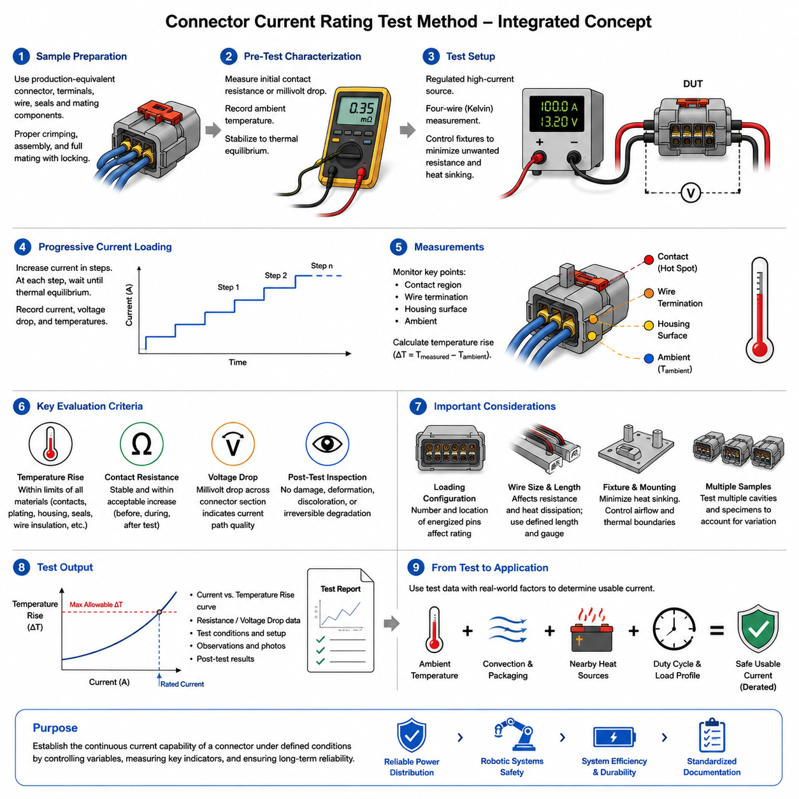
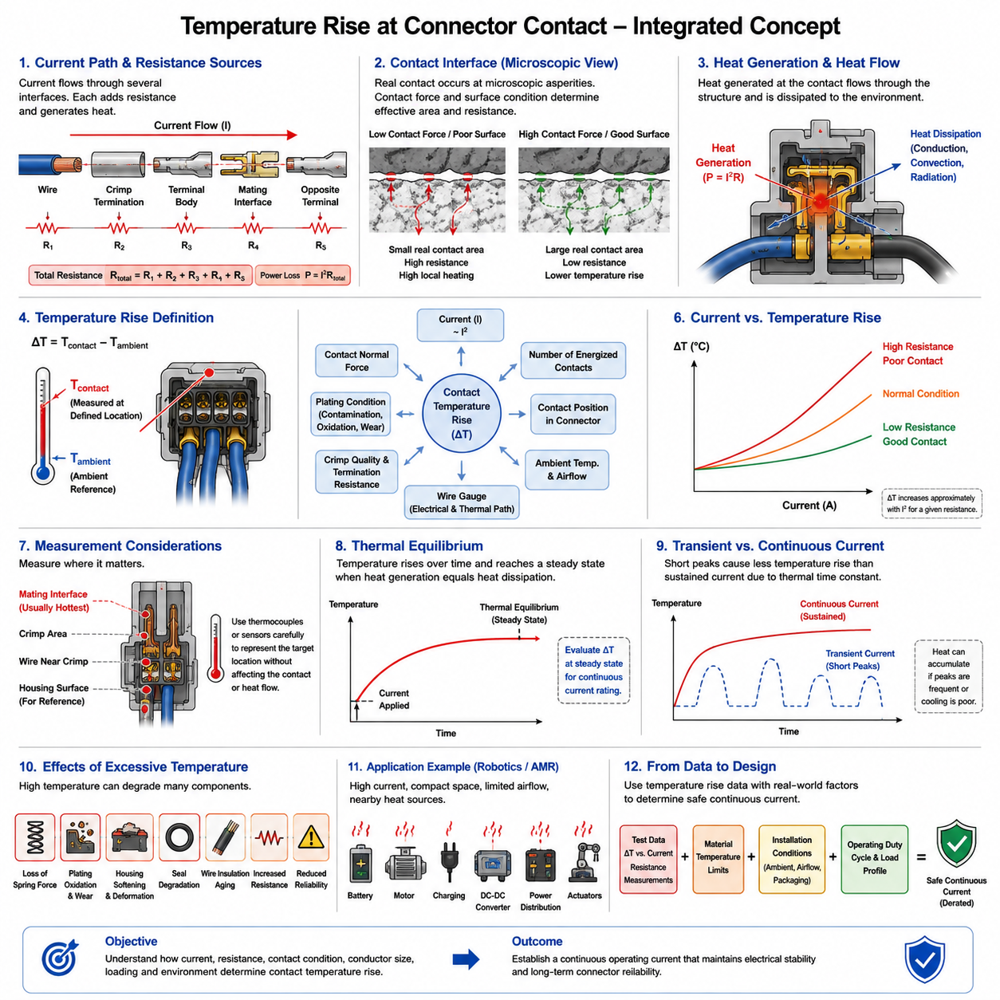
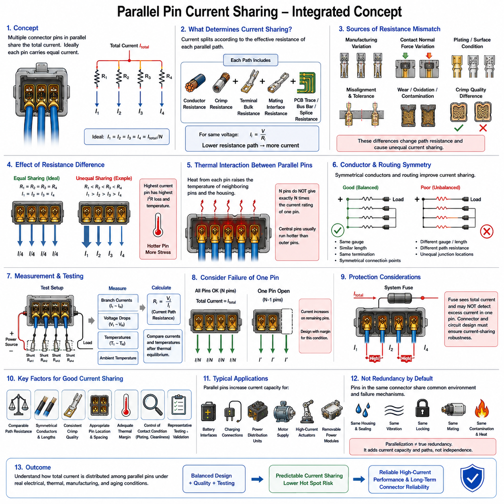
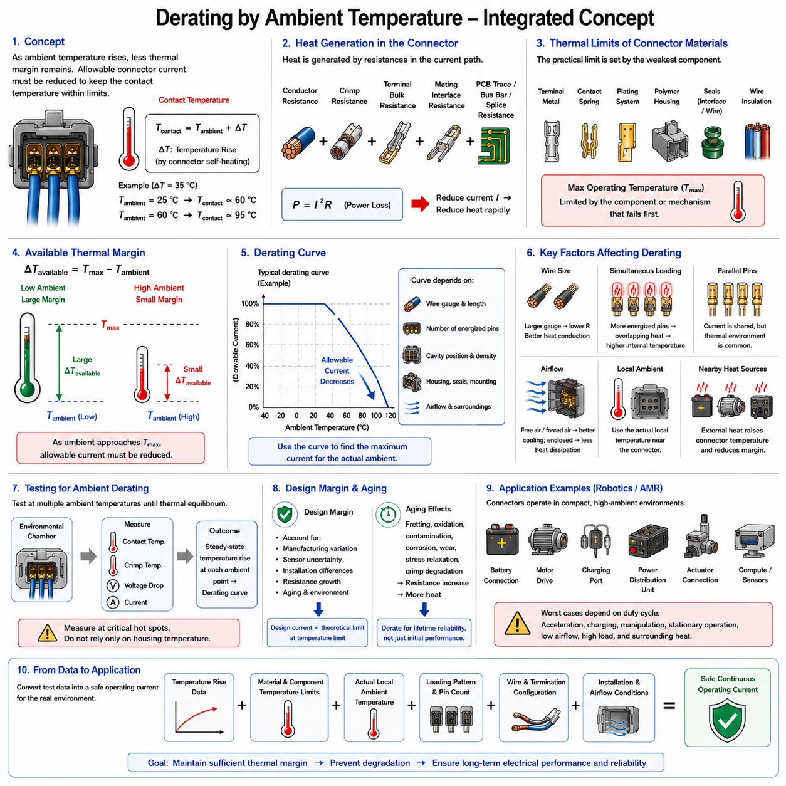
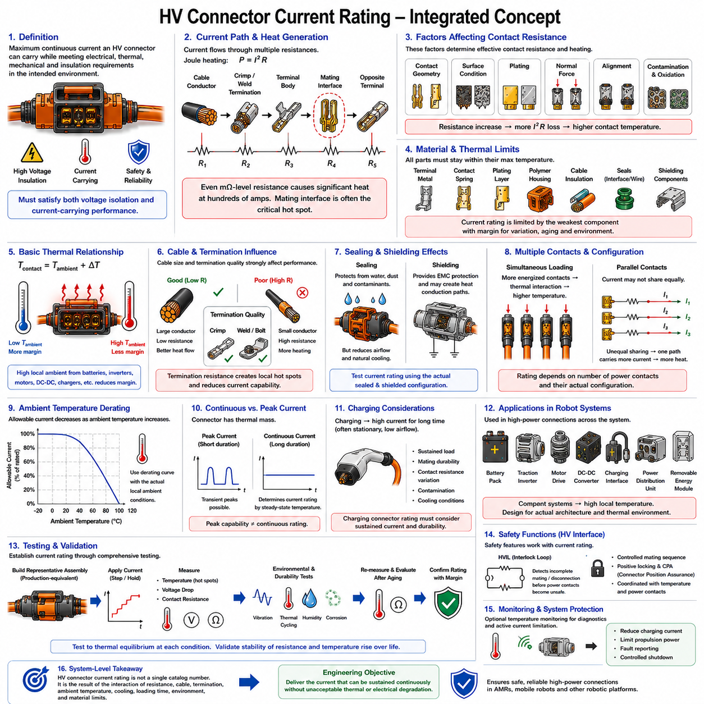

**Volume 03. Connector Engineering**


# Chapter 03. Current Rating and Derating

##  

## 03.01. Current Rating Test Method

{width="7.268055555555556in" height="7.268055555555556in"}

Current rating testing determines the continuous electrical current that a connector can carry while maintaining acceptable thermal and electrical performance. The rating is not simply the maximum current that can physically pass through a contact. It is established under defined test conditions by observing temperature rise, voltage drop, contact stability, and evidence of material degradation as current is applied.

A typical test begins with representative connector samples assembled using the specified terminals, conductor sizes, insulation types, seals, and mating components. Production-equivalent crimping and assembly processes should be used because conductor termination resistance can contribute significantly to measured heating. Samples must also be fully mated and locked so that contact normal force and interface geometry represent actual service conditions.

Before electrical loading, the test configuration is characterized at ambient conditions. Initial contact resistance or millivolt drop measurements establish a baseline for detecting changes during and after the thermal test. Ambient temperature is measured near the specimen without allowing the sensor to be strongly influenced by connector heating. The complete setup should reach thermal equilibrium before meaningful current-rating measurements begin.

Current is normally supplied from a regulated high-current source through conductors selected to represent the intended application or the applicable qualification procedure. The electrical path must be arranged so that unwanted resistance in fixtures, bus bars, clamps, and measurement leads does not distort connector performance. Four-wire Kelvin measurement is particularly useful when resistance or millivolt drop must be measured accurately across low-resistance contact interfaces.

Rather than immediately applying the expected rated current, testing commonly uses progressive current steps. Current is increased in controlled increments and maintained at each level until the connector approaches thermal equilibrium. Temperature, current, voltage drop, and relevant environmental conditions are recorded throughout the test. This procedure produces a relationship between applied current and connector temperature rise rather than only a single pass-or-fail observation.

Temperature rise is one of the primary criteria because electrical losses are converted into heat approximately according to the relationship P = I²R. Even a small increase in contact or termination resistance can therefore produce substantial additional heating at high current. Temperature sensors are placed at thermally significant locations such as contact regions, conductor terminations, housing surfaces, or other points specified by the applicable test procedure.

The reported temperature rise is generally evaluated relative to the measured ambient temperature rather than using connector temperature alone. If the surrounding air is at 25 °C and the measured connector location reaches 55 °C, the temperature rise is 30 °C. This distinction is important because the same electrical loading can produce different absolute temperatures when the connector operates in a cold laboratory, a warm enclosure, or a hot robot compartment.

Thermal equilibrium must be defined consistently because connector temperature usually increases rapidly after current application and then approaches a steady condition gradually. A measurement taken too early can underestimate the true operating temperature. Test procedures therefore establish a stabilization criterion based on a sufficiently small temperature change over a defined period, ensuring that current-rating decisions represent approximately steady-state thermal behavior.

The allowable current is constrained by more than contact temperature alone. Contact plating, spring material, terminal base metal, plastic housing, seals, wire insulation, and nearby components each have temperature limitations. Excessive heating may relax contact springs, accelerate oxidation, soften polymer structures, degrade sealing materials, or damage insulation. Consequently, the lowest relevant thermal limit can determine the practical continuous-current capability of the connector assembly.

Contact resistance should be monitored because temperature rise and electrical resistance are strongly coupled. A connector may initially satisfy the thermal requirement but develop increasing resistance because of poor crimping, contamination, insufficient contact force, surface degradation, or unstable interfaces. Comparing resistance before, during, and after current loading helps distinguish predictable conductor heating from abnormal localized heating associated with the electrical connection itself.

Voltage-drop measurement provides another practical indicator of current-path quality. Measuring the millivolt drop across a defined connector section allows its effective resistance to be calculated using R = V/I. When test boundaries are carefully controlled, this measurement can reveal abnormal terminals or cavities that may not be obvious from housing-surface temperature measurements. Localized electrical defects can otherwise remain hidden inside a multi-position connector.

Multi-pin connectors require special attention because current rating depends strongly on the number and location of simultaneously energized contacts. A single energized contact can dissipate heat into surrounding unused cavities more effectively than a densely loaded connector. When many adjacent terminals carry current, their thermal fields interact and the internal housing temperature rises. Current ratings must therefore identify the applicable loading configuration rather than treating every pin independently.

Wire size also affects the result. A larger conductor generally reduces wire resistance and can conduct heat away from the terminal more effectively, while a smaller conductor may generate additional heat close to the crimp region. Consequently, a current rating obtained with one wire gauge cannot automatically be transferred to every permitted conductor size. Test documentation should associate electrical loading with the actual wire and termination configuration used.

The length of wire attached to the specimen must also be controlled because conductors function as both electrical elements and thermal paths. Very short heavy-gauge leads may remove heat from a terminal more aggressively than an actual harness, producing an unrealistically favorable result. Conversely, an unsuitable laboratory lead arrangement may introduce additional heating. Standardized conductor lengths and routing improve repeatability between samples and laboratories.

Test fixtures must minimize unintended heat sinking. Metallic mounting plates, large clamps, or massive bus structures located close to the connector can conduct heat away from the specimen and artificially increase the apparent current capability. The connector should therefore be mounted according to the defined procedure, with surrounding airflow and thermal boundaries controlled. Natural convection and forced airflow must not be mixed without explicitly documenting the condition.

Several samples are normally desirable because current capability can vary with manufacturing tolerances. Contact normal force, plating thickness, crimp geometry, conductor strand distribution, and assembly position introduce small variations that can become important at high current. Testing multiple cavities and specimens helps identify whether the measured performance represents a robust design characteristic or merely the favorable behavior of one particular connector sample.

After the current-loading sequence, the specimen should be allowed to cool and then inspected and electrically remeasured. Permanent resistance increase, discoloration, housing deformation, terminal movement, seal damage, loss of contact force, or evidence of insulation deterioration indicates that the electrical loading may have exceeded a sustainable operating condition. A connector that survives temporarily but experiences irreversible degradation should not be considered adequately rated.

Current rating and current derating should remain conceptually separate. The rating test establishes connector behavior under specified laboratory conditions, whereas derating translates that capability into a usable design limit for real applications. The chapter structure places the test method before contact temperature rise, parallel-pin current sharing, ambient-temperature derating, and high-voltage connector rating, reflecting this progression from measurement to engineering application.

Ambient temperature is especially important when interpreting results because the available thermal margin decreases as environmental temperature rises. A connector demonstrating acceptable temperature rise in room-temperature testing may exceed housing, terminal, seal, or wire limits inside a warm electrical enclosure. The current-rating test therefore provides fundamental thermal data, while application engineering must combine those data with expected ambient conditions and component temperature limits.

For robotic systems, installation conditions can differ substantially from laboratory environments. Connectors may be located near batteries, motor drivers, DC-DC converters, brakes, actuators, or enclosed power distribution assemblies. Harness bundles may restrict convection, and continuous propulsion loads can maintain elevated temperatures for long periods. Connector current capability should therefore be validated against realistic operating duty, packaging, and surrounding heat sources.

AMRs and other mobile robots also experience rapidly changing load profiles. Motor acceleration can create high transient current, while cruising produces lower sustained current and charging interfaces may experience long periods of relatively constant high current. Continuous-current testing primarily establishes steady-state capability; transient overload behavior requires separate consideration of thermal time constants, contact mass, conductor heating, and protection-system response.

A technically complete current-rating report should preserve enough information for another engineer to reproduce and interpret the test. Important information includes connector identification, terminal and plating configuration, conductor size and type, crimping method, energized cavity pattern, ambient condition, mounting arrangement, current steps, stabilization criterion, measurement locations, resistance or voltage-drop data, temperature results, and post-test inspection findings.

The final engineering value of the test is therefore not merely a catalog ampere number. It establishes an experimentally supported relationship among current, resistance, temperature rise, connector construction, conductor configuration, and thermal environment. When these variables are controlled and documented, current-rating testing becomes the foundation for subsequent derating, harness sizing, protection coordination, connector selection, and reliable power-distribution design in robotic electrical architectures.

전류 정격 시험(Current Rating Testing)은 커넥터(Connector)가 허용 가능한 열적 및 전기적 성능(Thermal and Electrical Performance)을 유지하면서 지속적으로 전달할 수 있는 전류를 결정하는 시험이다. 정격은 단순히 접점(Contact)을 통해 물리적으로 흘릴 수 있는 최대 전류를 의미하지 않는다. 정의된 시험 조건에서 전류를 인가하면서 온도 상승(Temperature Rise), 전압 강하(Voltage Drop), 접점 안정성(Contact Stability), 재료 열화(Material Degradation) 등을 관찰하여 결정한다.

일반적인 시험은 지정된 단자(Terminal), 도체 크기(Conductor Size), 절연재(Insulation), 실(Seal), 결합 부품(Mating Component)을 사용하여 실제 제품을 대표할 수 있는 커넥터 시편(Connector Sample)을 구성하는 것에서 시작한다. 도체 종단 저항(Conductor Termination Resistance)이 발열에 상당한 영향을 줄 수 있으므로 실제 양산과 동등한 압착(Crimping) 및 조립 공정을 적용해야 한다. 또한 접점 수직력(Contact Normal Force)과 인터페이스 형상(Interface Geometry)이 실제 사용 조건을 대표하도록 완전히 체결하고 잠금 상태를 유지해야 한다.

전기 부하(Electrical Loading)를 인가하기 전에 시험 구성(Test Configuration)을 주변 환경 조건에서 특성화한다. 초기 접촉 저항(Contact Resistance) 또는 밀리볼트 전압 강하(Millivolt Drop)를 측정하여 열 시험 중과 시험 후의 변화를 판단할 수 있는 기준값(Baseline)을 설정한다. 주변 온도(Ambient Temperature)는 커넥터 자체의 발열 영향을 크게 받지 않는 시편 근처에서 측정하며, 의미 있는 전류 정격 측정을 시작하기 전에 전체 시험 구성이 열평형(Thermal Equilibrium)에 도달하도록 해야 한다.

전류는 일반적으로 의도된 적용 환경이나 해당 인증 절차(Qualification Procedure)를 대표하도록 선정된 도체를 통해 정전류 전원(Regulated High-Current Source)에서 공급된다. 시험 치구(Fixture), 버스바(Bus Bar), 클램프(Clamp), 측정 리드(Measurement Lead)에서 발생하는 불필요한 저항이 커넥터 성능을 왜곡하지 않도록 전기 경로를 구성해야 한다. 특히 낮은 저항의 접점 인터페이스를 정확하게 측정해야 하는 경우 4선식 켈빈 측정(Four-Wire Kelvin Measurement)이 유용하다.

예상 정격 전류를 즉시 인가하기보다는 일반적으로 단계적 전류 인가(Progressive Current Step) 방식을 사용한다. 전류를 제어된 간격으로 증가시키고 각 단계에서 커넥터가 열평형에 가까워질 때까지 유지한다. 시험 과정에서 온도, 전류, 전압 강하 및 관련 환경 조건을 지속적으로 기록한다. 이러한 절차를 통해 단순한 합격 또는 불합격(Pass-or-Fail) 결과가 아니라 인가 전류(Applied Current)와 커넥터 온도 상승 사이의 관계를 확보할 수 있다.

온도 상승(Temperature Rise)은 전기적 손실(Electrical Loss)이 대략 P = I²R 관계에 따라 열로 변환되기 때문에 가장 중요한 평가 기준 중 하나이다. 접점 또는 종단 저항이 조금만 증가해도 높은 전류에서는 상당한 추가 발열이 발생할 수 있다. 따라서 온도 센서(Temperature Sensor)는 접점 영역(Contact Region), 도체 종단부(Conductor Termination), 하우징 표면(Housing Surface) 또는 해당 시험 절차에서 지정한 열적으로 중요한 위치에 설치한다.

보고되는 온도 상승은 일반적으로 커넥터의 절대 온도만을 사용하는 것이 아니라 측정된 주변 온도를 기준으로 평가한다. 예를 들어 주변 공기가 25 °C이고 커넥터 측정 위치가 55 °C에 도달했다면 온도 상승은 30 °C이다. 이러한 구분은 동일한 전기 부하에서도 저온 시험실, 고온 인클로저(Enclosure), 뜨거운 로봇 내부 공간과 같이 주변 환경에 따라 절대 온도가 달라질 수 있기 때문에 중요하다.

열평형(Thermal Equilibrium)은 일관된 기준으로 정의해야 한다. 전류를 인가한 직후에는 커넥터 온도가 빠르게 상승하지만 이후에는 점차 정상 상태(Steady State)에 접근하기 때문이다. 너무 이른 시점에서 측정하면 실제 운전 온도를 과소평가할 수 있다. 따라서 시험 절차에서는 일정 시간 동안 충분히 작은 온도 변화만 허용하는 안정화 기준(Stabilization Criterion)을 설정하여 전류 정격 판단이 정상 상태의 열적 거동을 대표하도록 한다.

허용 전류(Allowable Current)는 접점 온도만으로 결정되지 않는다. 접점 도금(Contact Plating), 스프링 재료(Spring Material), 단자 모재(Terminal Base Metal), 플라스틱 하우징(Plastic Housing), 실(Seal), 전선 절연재(Wire Insulation), 주변 부품에는 각각 허용 온도 한계가 존재한다. 과도한 발열은 접점 스프링의 응력 완화, 산화 가속, 폴리머 구조의 연화, 실 재료 열화 또는 절연 손상을 유발할 수 있으므로 가장 낮은 관련 열적 한계가 실제 연속 전류 능력을 결정할 수 있다.

접촉 저항(Contact Resistance)은 온도 상승과 전기 저항이 밀접하게 연결되어 있으므로 함께 관찰해야 한다. 커넥터가 초기에는 열적 요구사항을 만족하더라도 불량 압착(Poor Crimping), 오염(Contamination), 부족한 접촉력(Contact Force), 표면 열화(Surface Degradation), 불안정한 인터페이스로 인해 저항이 증가할 수 있다. 전류 인가 전, 인가 중, 인가 후의 저항을 비교하면 정상적인 도체 발열과 전기 접속부에서 발생하는 비정상적인 국부 발열(Localized Heating)을 구분하는 데 도움이 된다.

전압 강하 측정(Voltage-Drop Measurement)은 전류 경로(Current Path)의 품질을 판단하는 또 다른 실용적인 지표이다. 정의된 커넥터 구간의 밀리볼트 전압 강하를 측정하면 R = V/I 관계를 이용하여 유효 저항(Effective Resistance)을 계산할 수 있다. 시험 경계를 정확하게 설정하면 하우징 표면 온도만으로 발견하기 어려운 비정상적인 단자나 캐비티(Cavity)를 식별할 수 있으며, 다극 커넥터(Multi-Position Connector) 내부의 국부적인 전기 결함을 검출하는 데 유용하다.

다핀 커넥터(Multi-Pin Connector)는 동시에 통전되는 접점의 수와 위치에 따라 전류 정격이 크게 달라지므로 특별한 주의가 필요하다. 하나의 접점만 통전하면 주변의 사용하지 않는 캐비티를 통해 열을 상대적으로 쉽게 방출할 수 있다. 반대로 인접한 여러 단자에 동시에 전류가 흐르면 각 단자의 열장(Thermal Field)이 서로 영향을 주어 하우징 내부 온도가 상승한다. 따라서 전류 정격은 모든 핀에 독립적으로 적용하기보다 실제 통전 구성(Loading Configuration)을 명확하게 정의해야 한다.

전선 크기(Wire Size) 역시 시험 결과에 영향을 준다. 큰 도체는 일반적으로 전선 저항을 감소시키고 단자에서 발생한 열을 효과적으로 전달할 수 있지만, 작은 도체는 압착 영역 주변에서 추가적인 발열을 발생시킬 수 있다. 따라서 특정 전선 게이지(Wire Gauge)에서 얻은 전류 정격을 허용 가능한 모든 도체 크기에 자동으로 적용해서는 안 된다. 시험 문서에는 사용한 실제 전선과 종단 구성(Termination Configuration)을 전기 부하 조건과 함께 명확하게 기록해야 한다.

시편에 연결되는 전선 길이(Wire Length)도 제어해야 한다. 도체는 전기적 요소인 동시에 열 전달 경로(Thermal Path)로 기능하기 때문이다. 지나치게 짧고 굵은 시험용 리드는 실제 하네스(Harness)보다 단자의 열을 효과적으로 제거하여 비현실적으로 좋은 결과를 만들 수 있다. 반대로 부적절한 시험 리드 구성은 추가 발열을 발생시킬 수 있다. 표준화된 도체 길이와 배선 경로(Routing)를 사용하면 시편과 시험실 사이의 반복성(Repeatability)을 향상시킬 수 있다.

시험 치구(Test Fixture)는 의도하지 않은 방열(Heat Sinking)을 최소화해야 한다. 커넥터 가까이에 위치한 금속 장착판(Mounting Plate), 대형 클램프 또는 큰 버스 구조물은 시편의 열을 외부로 전달하여 실제보다 높은 전류 능력을 나타내게 할 수 있다. 따라서 커넥터는 정의된 시험 절차에 따라 장착하고 주변 공기 흐름(Airflow)과 열적 경계 조건(Thermal Boundary Condition)을 제어해야 한다. 자연 대류(Natural Convection)와 강제 대류(Forced Airflow)를 혼용하는 경우에는 해당 조건을 명확하게 기록해야 한다.

전류 능력(Current Capability)은 제조 공차(Manufacturing Tolerance)에 따라 변할 수 있으므로 여러 개의 시편을 시험하는 것이 바람직하다. 접점 수직력(Contact Normal Force), 도금 두께(Plating Thickness), 압착 형상(Crimp Geometry), 도체 소선 분포(Conductor Strand Distribution), 조립 위치 등의 작은 편차가 높은 전류에서 중요한 차이를 만들 수 있다. 여러 캐비티와 시편을 시험하면 측정된 성능이 설계 자체의 강건한 특성인지 특정 시편의 우수한 결과인지 판단할 수 있다.

전류 부하 시험이 종료되면 시편을 냉각한 후 다시 외관 검사와 전기적 측정을 수행해야 한다. 영구적인 저항 증가(Permanent Resistance Increase), 변색(Discoloration), 하우징 변형(Housing Deformation), 단자 이동(Terminal Movement), 실 손상(Seal Damage), 접촉력 감소 또는 절연재 열화가 발견되면 지속 가능한 운전 조건을 초과했을 가능성이 있다. 일시적으로 전류를 견뎠더라도 비가역적인 열화(Irreversible Degradation)가 발생한 커넥터는 적절한 정격을 확보했다고 판단해서는 안 된다.

전류 정격(Current Rating)과 전류 디레이팅(Current Derating)은 개념적으로 구분해야 한다. 정격 시험은 지정된 실험실 조건에서 커넥터의 기본 성능을 확립하는 과정이며, 디레이팅은 이러한 능력을 실제 설계에서 사용할 수 있는 안전한 한계로 변환하는 과정이다. 본 장의 구조에서도 시험 방법 이후에 접점 온도 상승, 병렬 핀 전류 분배(Parallel-Pin Current Sharing), 주변 온도에 따른 디레이팅, 고전압 커넥터 전류 정격을 다루도록 구성되어 있어 측정에서 실제 설계 적용으로 이어지는 흐름을 형성한다.

시험 결과를 해석할 때 주변 온도(Ambient Temperature)는 특히 중요하다. 환경 온도가 증가할수록 사용할 수 있는 열적 여유(Thermal Margin)가 감소하기 때문이다. 실온 시험에서 허용 가능한 온도 상승을 나타낸 커넥터도 고온 전기 인클로저 내부에서는 하우징, 단자, 실 또는 전선의 허용 온도를 초과할 수 있다. 따라서 전류 정격 시험은 기본적인 열 데이터를 제공하고, 실제 적용 설계에서는 예상 주변 온도와 각 구성품의 온도 한계를 함께 고려해야 한다.

로봇 시스템(Robotic System)의 실제 설치 조건은 실험실 환경과 크게 다를 수 있다. 커넥터가 배터리(Battery), 모터 드라이버(Motor Driver), DC-DC 컨버터(DC-DC Converter), 브레이크(Brake), 액추에이터(Actuator), 전력 분배 장치(Power Distribution Assembly) 근처에 배치될 수 있다. 하네스 번들(Harness Bundle)은 대류를 제한할 수 있으며 지속적인 추진 부하는 장시간 높은 온도를 유지할 수 있으므로 실제 운전 듀티(Operating Duty), 패키징(Packaging), 주변 열원을 고려하여 전류 능력을 검증해야 한다.

자율이동로봇(AMR)과 기타 이동 로봇(Mobile Robot)은 빠르게 변화하는 부하 프로파일(Load Profile)을 가진다. 모터 가속 시 높은 과도 전류(Transient Current)가 발생할 수 있고, 정속 주행에서는 상대적으로 낮은 지속 전류가 흐르며, 충전 인터페이스(Charging Interface)는 비교적 높은 전류가 장시간 유지될 수 있다. 연속 전류 시험은 주로 정상 상태 능력을 평가하므로 과도 과부하(Transient Overload)는 열 시정수(Thermal Time Constant), 접점 열용량, 도체 발열 및 보호 시스템 응답을 별도로 고려해야 한다.

기술적으로 완전한 전류 정격 시험 보고서(Current Rating Test Report)는 다른 엔지니어가 시험을 재현하고 결과를 해석할 수 있을 정도의 정보를 보존해야 한다. 커넥터 식별 정보, 단자 및 도금 구성, 도체 크기와 종류, 압착 방법, 통전 캐비티 패턴(Energized Cavity Pattern), 주변 환경, 장착 방식, 전류 단계, 안정화 기준, 측정 위치, 저항 또는 전압 강하 데이터, 온도 결과, 시험 후 검사 결과 등이 포함되어야 한다.

따라서 전류 정격 시험의 최종적인 공학적 가치(Engineering Value)는 단순한 카탈로그상의 암페어(Ampere) 숫자를 결정하는 데 있지 않다. 이 시험은 전류(Current), 저항(Resistance), 온도 상승(Temperature Rise), 커넥터 구조(Connector Construction), 도체 구성(Conductor Configuration), 열 환경(Thermal Environment) 사이의 관계를 실험적으로 확립한다. 이러한 변수를 체계적으로 제어하고 기록하면 전류 정격 시험은 이후의 디레이팅, 하네스 크기 선정, 보호 협조(Protection Coordination), 커넥터 선정 및 로봇 전력 분배 설계의 신뢰성을 확보하기 위한 기본 근거가 된다.

##  

## 03.02. Temperature Rise at Contact

{width="7.268055555555556in" height="7.268055555555556in"}

Temperature rise at a connector contact is the increase in local temperature produced when electrical current passes through the resistance of the contact system. Although connector resistance is normally very small, the resulting power loss follows approximately P = I²R. Because heating increases with the square of current, relatively small increases in current or resistance can create significant thermal stress in high-current connector applications.

A connector contact is not an ideal continuous conductor. Electrical current passes through a sequence of interfaces including the wire, crimp termination, terminal body, mating contact surfaces, and the corresponding terminal on the opposite side. Each region contributes resistance to the current path. Localized resistance at the mating interface and termination region can concentrate heat, producing temperatures substantially higher than those measured on the external connector housing.

The microscopic nature of electrical contact strongly influences this heating process. Two apparently smooth metallic surfaces actually touch through a limited number of microscopic asperities. Current is constricted through these small conductive regions, creating constriction resistance. Contact normal force, surface roughness, plating condition, contamination, oxidation, and wear determine the effective conductive area and therefore influence both contact resistance and local temperature generation.

Contact temperature rise can be represented conceptually as the balance between internally generated electrical heat and heat transferred into the surrounding structure. Heat generated at the contact travels through the terminal, conductor, housing, and adjacent contacts before being dissipated through conduction, convection, and radiation. The resulting temperature therefore depends not only on electrical resistance and current but also on the complete thermal path surrounding the contact.

The basic temperature-rise quantity is normally expressed as ΔT = Tcontact − Tambient, where Tcontact represents the measured or estimated temperature at a defined connector location and Tambient represents the surrounding reference temperature. This relative value is particularly useful because it separates connector-generated heating from the environmental temperature. The absolute operating temperature remains important because material limits apply to the total temperature experienced by the component.

Current has a dominant influence on temperature rise because Joule heating increases approximately with I². If resistance remained constant, doubling the current would theoretically produce four times the electrical power loss. Actual connector behavior is more complex because electrical resistance, thermal conductivity, convection, and material properties can change with temperature. Consequently, measured current-versus-temperature-rise curves are generally more useful for engineering decisions than simple linear extrapolation.

Resistance and temperature can also create a reinforcing thermal relationship. As metallic conductors become hotter, their electrical resistivity generally increases. Increased resistance produces additional I²R heating, which can further increase temperature. A properly designed connector reaches a stable thermal equilibrium where generated heat equals dissipated heat. If heat generation becomes excessive or thermal dissipation is inadequate, operating temperature can approach damaging material limits.

Contact normal force is especially important because it influences the real conductive area between mating surfaces. Adequate normal force helps maintain stable asperity contact and low electrical resistance. If force decreases because of poor design, mechanical deformation, wear, vibration, or thermal stress relaxation, contact resistance may rise. The resulting localized heating can accelerate further degradation, creating a progressive mechanism that eventually produces an electrically unstable connection.

Plating materials influence thermal behavior indirectly through their electrical and surface characteristics. Tin, silver, and gold contact systems exhibit different resistance, oxidation, wear, and environmental behavior. A plating system that becomes contaminated, oxidized, fretted, or mechanically damaged can develop higher interface resistance even when the bulk terminal remains conductive. This explains why contact condition must be considered together with nominal terminal current capacity.

The crimp termination must also be included when investigating connector heating. A poorly formed crimp can create excessive resistance between conductor strands and the terminal barrel, producing a hot spot near the rear of the contact rather than directly at the mating interface. Measuring only one location may therefore lead to an incorrect diagnosis. Temperature measurements should cover the regions most likely to contain electrical and thermal bottlenecks.

Wire gauge affects connector temperature because the attached conductor participates in both electrical conduction and heat transfer. A larger conductor normally has lower electrical resistance and can provide a more effective thermal path away from the terminal. A smaller conductor can generate additional wire heating and may transfer heat toward the connector. Connector temperature-rise data must therefore be interpreted together with the conductor size used during testing.

The number of simultaneously energized contacts is another major variable. When only one terminal carries current, surrounding terminals and housing material can help absorb and distribute its heat. When many adjacent contacts are energized, each contact becomes a heat source and their thermal fields overlap. The internal connector temperature can therefore become considerably higher even when the current through each individual terminal remains unchanged.

Contact position can consequently affect thermal performance within a multi-pin connector. A terminal located near an outer edge may dissipate heat differently from one surrounded by energized contacts near the center. Dense connector arrangements can create internal thermal hot spots that are not predicted by a single-contact test. Current capability should therefore consider cavity position, energized-contact pattern, connector geometry, and simultaneous loading conditions.

Ambient temperature determines the remaining thermal margin available to the connector. For example, the same 35 °C temperature rise produces an absolute temperature of 60 °C in a 25 °C environment but 95 °C in a 60 °C environment. The electrical behavior may initially appear similar, yet the second condition places much greater stress on the housing, seals, plating, spring materials, and wire insulation.

Airflow and installation geometry also influence the observed temperature. A connector operating in open air may dissipate heat effectively through natural or forced convection, whereas the same connector inside a sealed enclosure can retain considerably more heat. Harness bundles, protective sleeves, covers, nearby electronics, batteries, motor controllers, and structural components can modify the thermal environment and change the relationship between current and contact temperature.

Accurate measurement of contact temperature can be challenging because the hottest region may be located inside the connector and inaccessible after mating. Thermocouples or other temperature sensors must be positioned carefully so that they represent the desired location without significantly changing contact force, housing geometry, or heat flow. External housing temperature alone should not automatically be assumed to represent the maximum internal contact temperature.

Temperature measurements should be recorded together with current, ambient temperature, voltage drop, and contact resistance whenever practical. Correlating these quantities helps identify the physical origin of abnormal heating. A contact exhibiting both elevated resistance and elevated temperature suggests an electrical interface problem, while similar heating across multiple contacts may indicate system-level thermal loading, insufficient conductor size, restricted cooling, or excessive simultaneous current demand.

Thermal equilibrium is essential when evaluating continuous-current performance. Immediately after current is applied, electrical heating begins faster than the connector reaches its final temperature. The measured temperature then rises according to the thermal mass and heat-transfer characteristics of the assembly. A stable value is reached when heat generation and heat dissipation become approximately balanced, providing the appropriate basis for continuous-current temperature-rise assessment.

Transient current must be distinguished from continuous current because connector thermal response has a finite time constant. Short acceleration peaks in motors or actuators may produce currents substantially above the continuous rating without immediately creating the same temperature reached under sustained loading. However, repeated peaks, long acceleration periods, high duty cycles, or insufficient cooling can accumulate heat, making the average and time-dependent load profile important.

Excessive temperature can damage more than the electrical interface itself. High temperature may reduce spring force, accelerate plating oxidation, soften polymer housings, deform terminal retention features, degrade seals, age wire insulation, and increase nearby component temperatures. These effects can permanently increase resistance or reduce mechanical integrity. Thermal performance must therefore be evaluated against the temperature limits of the entire connector assembly rather than the contact metal alone.

For robotic platforms such as AMRs, connector heating is especially important in battery, motor, charging, DC-DC converter, power-distribution, and actuator circuits. These systems can combine sustained current, frequent acceleration peaks, compact packaging, limited airflow, and nearby heat-generating electronics. A connector that performs adequately in an isolated laboratory configuration may therefore require substantial application derating when installed inside the robot.

Temperature-rise characterization ultimately provides the physical basis for connector current rating and subsequent derating. The objective is not merely to identify the current at which a connector becomes hot, but to understand how current, resistance, contact condition, conductor size, simultaneous pin loading, ambient temperature, and heat dissipation interact. This relationship allows engineers to establish a continuous operating current that preserves electrical stability and long-term connector reliability.

A robust connector design therefore treats temperature rise as a system-level electrical and thermal parameter rather than an isolated contact property. Current-rating test data, resistance measurements, material temperature limits, installation conditions, and real operating duty cycles must be evaluated together. This approach provides the engineering foundation for reliable connector selection, current derating, harness integration, protection coordination, and power-distribution design in robotic electrical architectures.

커넥터 접점의 온도 상승(Temperature Rise at Contact)은 전류가 접점 시스템(Contact System)의 전기 저항(Electrical Resistance)을 통과할 때 발생하는 국부적인 온도 증가를 의미한다. 커넥터의 저항은 일반적으로 매우 작지만, 그에 따른 전력 손실(Power Loss)은 대략 P = I²R 관계를 따른다. 발열은 전류의 제곱에 따라 증가하기 때문에 고전류 커넥터(High-Current Connector)에서는 전류나 저항이 비교적 조금만 증가해도 상당한 열적 스트레스(Thermal Stress)가 발생할 수 있다.

커넥터 접점(Connector Contact)은 이상적인 연속 도체(Continuous Conductor)가 아니다. 전류는 전선(Wire), 압착 종단부(Crimp Termination), 단자 본체(Terminal Body), 결합 접촉면(Mating Contact Surface), 그리고 반대편의 대응 단자(Corresponding Terminal)를 순차적으로 통과한다. 각 영역은 전류 경로(Current Path)에 저항을 추가한다. 특히 결합 인터페이스(Mating Interface)와 종단 영역(Termination Region)의 국부 저항은 열을 집중시켜 외부 커넥터 하우징에서 측정되는 온도보다 훨씬 높은 온도를 발생시킬 수 있다.

전기 접촉(Electrical Contact)의 미시적 특성은 이러한 발열 과정에 큰 영향을 미친다. 겉으로 매끄럽게 보이는 두 금속 표면도 실제로는 제한된 수의 미세 돌기(Asperity)를 통해 접촉한다. 전류는 이러한 작은 전도 영역을 통해 집중적으로 흐르며 수축 저항(Constriction Resistance)을 발생시킨다. 접점 수직력(Contact Normal Force), 표면 거칠기(Surface Roughness), 도금 상태(Plating Condition), 오염(Contamination), 산화(Oxidation), 마모(Wear)는 실제 전도 면적을 결정하며 접촉 저항과 국부적인 온도 발생에 영향을 준다.

접점 온도 상승(Contact Temperature Rise)은 개념적으로 내부에서 발생하는 전기적 열(Electrical Heat)과 주변 구조로 전달되는 열 사이의 균형으로 표현할 수 있다. 접점에서 발생한 열은 단자, 도체, 하우징 및 인접 접점을 통해 이동한 후 전도(Conduction), 대류(Convection), 복사(Radiation)를 통해 방출된다. 따라서 최종 온도는 전기 저항과 전류뿐만 아니라 접점을 둘러싼 전체 열 전달 경로(Thermal Path)의 영향을 받는다.

기본적인 온도 상승량(Temperature-Rise Quantity)은 일반적으로 ΔT = Tcontact − Tambient로 표현한다. 여기서 Tcontact는 정의된 커넥터 위치에서 측정하거나 추정한 온도이며, Tambient는 주변 기준 온도(Ambient Reference Temperature)를 의미한다. 이러한 상대값은 환경 온도와 커넥터 자체에서 발생한 발열을 구분할 수 있기 때문에 특히 유용하다. 그러나 재료의 온도 한계(Material Limit)는 부품이 실제로 경험하는 전체 온도에 적용되므로 절대 운전 온도(Absolute Operating Temperature) 역시 중요하다.

전류(Current)는 줄 발열(Joule Heating)이 대략 I²에 비례하여 증가하기 때문에 온도 상승에 지배적인 영향을 미친다. 저항이 일정하다고 가정하면 전류가 두 배로 증가할 때 이론적으로 전력 손실은 네 배가 된다. 그러나 실제 커넥터에서는 전기 저항, 열전도도(Thermal Conductivity), 대류 및 재료 특성이 온도에 따라 변화할 수 있다. 따라서 단순한 선형 외삽(Linear Extrapolation)보다 실제 측정된 전류-온도 상승 곡선(Current-versus-Temperature-Rise Curve)이 공학적 판단에 더 유용하다.

저항과 온도 사이에는 서로를 강화하는 열적 관계(Thermal Relationship)가 형성될 수도 있다. 금속 도체의 온도가 상승하면 일반적으로 전기 비저항(Electrical Resistivity)도 증가한다. 증가한 저항은 추가적인 I²R 발열을 발생시키고, 이는 다시 온도를 상승시킬 수 있다. 적절하게 설계된 커넥터는 발생하는 열과 방출되는 열이 같아지는 안정적인 열평형(Thermal Equilibrium)에 도달하지만, 발열이 과도하거나 방열 능력이 부족하면 운전 온도가 재료의 손상 한계에 접근할 수 있다.

접점 수직력(Contact Normal Force)은 결합 표면 사이의 실제 전도 면적에 영향을 주기 때문에 특히 중요하다. 충분한 수직력은 안정적인 미세 돌기 접촉(Asperity Contact)을 유지하고 낮은 전기 저항을 확보하는 데 도움이 된다. 설계 불량, 기계적 변형, 마모, 진동 또는 열 응력 완화(Thermal Stress Relaxation)로 접촉력이 감소하면 접촉 저항이 증가할 수 있다. 이로 인한 국부 발열은 추가적인 열화를 가속하여 결국 전기적으로 불안정한 접속 상태를 만들 수 있다.

도금 재료(Plating Material)는 전기적 특성과 표면 특성을 통해 간접적으로 열적 거동에 영향을 준다. 주석(Tin), 은(Silver), 금(Gold) 접점 시스템은 저항, 산화, 마모 및 환경적 특성이 서로 다르다. 도금 표면이 오염되거나 산화되고, 프레팅(Fretting)이 발생하거나 기계적으로 손상되면 단자 본체의 전도성이 충분하더라도 인터페이스 저항(Interface Resistance)이 증가할 수 있다. 따라서 접점 상태(Contact Condition)는 단자의 명목상 전류 용량과 함께 고려해야 한다.

커넥터 발열을 조사할 때는 압착 종단부(Crimp Termination)도 반드시 포함해야 한다. 부적절하게 형성된 압착부는 도체 소선(Conductor Strand)과 단자 배럴(Terminal Barrel) 사이에 과도한 저항을 발생시켜 결합 인터페이스가 아니라 접점 후방에서 열점(Hot Spot)을 만들 수 있다. 따라서 한 위치의 온도만 측정하면 잘못된 원인 분석으로 이어질 수 있으며, 온도 측정은 전기적 및 열적 병목(Electrical and Thermal Bottleneck)이 발생할 가능성이 높은 영역을 포함해야 한다.

전선 게이지(Wire Gauge)는 연결된 도체가 전기 전도뿐만 아니라 열 전달에도 참여하기 때문에 커넥터 온도에 영향을 준다. 큰 도체는 일반적으로 전기 저항이 낮고 단자에서 발생한 열을 외부로 전달하는 효과적인 열 경로를 제공한다. 반대로 작은 도체는 추가적인 전선 발열을 발생시키고 열을 커넥터 방향으로 전달할 수 있다. 따라서 커넥터 온도 상승 데이터는 시험에 사용된 도체 크기(Conductor Size)와 함께 해석해야 한다.

동시에 통전되는 접점(Simultaneously Energized Contact)의 수도 중요한 변수이다. 하나의 단자만 전류를 전달하면 주변 단자와 하우징 재료가 열을 흡수하고 분산시키는 데 도움을 줄 수 있다. 그러나 여러 인접 접점이 동시에 통전되면 각각의 접점이 열원(Heat Source)으로 작용하고 열장(Thermal Field)이 서로 중첩된다. 따라서 각 단자를 통과하는 전류가 동일하더라도 커넥터 내부 온도는 상당히 높아질 수 있다.

따라서 다핀 커넥터(Multi-Pin Connector)에서는 접점 위치(Contact Position)에 따라 열적 성능이 달라질 수 있다. 외곽에 위치한 단자는 통전된 접점으로 둘러싸인 중앙 단자와 다른 방식으로 열을 방출할 수 있다. 고밀도 커넥터(Dense Connector)에서는 단일 접점 시험으로 예측하기 어려운 내부 열점이 형성될 수 있으므로 전류 용량을 결정할 때 캐비티 위치(Cavity Position), 통전 접점 패턴, 커넥터 형상 및 동시 부하 조건을 함께 고려해야 한다.

주변 온도(Ambient Temperature)는 커넥터가 사용할 수 있는 잔여 열적 여유(Thermal Margin)를 결정한다. 예를 들어 동일하게 35 °C의 온도 상승이 발생하더라도 주변 온도가 25 °C이면 절대 온도는 60 °C이지만 주변 온도가 60 °C이면 절대 온도는 95 °C가 된다. 초기 전기적 거동은 유사하게 보일 수 있지만 후자의 조건에서는 하우징, 실, 도금, 스프링 재료 및 전선 절연재에 훨씬 큰 열적 스트레스가 가해진다.

공기 흐름(Airflow)과 설치 형상(Installation Geometry) 역시 측정되는 온도에 영향을 준다. 개방된 공간에서 작동하는 커넥터는 자연 대류 또는 강제 대류를 통해 효과적으로 열을 방출할 수 있지만, 밀폐된 인클로저(Sealed Enclosure) 내부의 동일한 커넥터는 훨씬 많은 열을 축적할 수 있다. 하네스 번들(Harness Bundle), 보호 슬리브(Protective Sleeve), 커버, 인접 전자장치, 배터리, 모터 컨트롤러 및 구조물도 열 환경을 변화시켜 전류와 접점 온도의 관계에 영향을 줄 수 있다.

접점 온도(Contact Temperature)를 정확하게 측정하는 것은 가장 높은 온도가 커넥터 내부의 접근하기 어려운 위치에 존재할 수 있기 때문에 쉽지 않다. 열전대(Thermocouple) 또는 다른 온도 센서(Temperature Sensor)는 접촉력, 하우징 형상 또는 열 흐름을 크게 변화시키지 않으면서 원하는 위치를 대표하도록 신중하게 설치해야 한다. 외부 하우징 온도만으로 내부 접점의 최대 온도를 대표한다고 자동으로 가정해서는 안 된다.

가능하다면 온도 측정값은 전류, 주변 온도, 전압 강하(Voltage Drop), 접촉 저항(Contact Resistance)과 함께 기록해야 한다. 이러한 값의 상관관계를 분석하면 비정상 발열의 물리적 원인을 파악하는 데 도움이 된다. 높은 저항과 높은 온도가 동시에 나타나는 접점은 전기 인터페이스 문제를 의미할 가능성이 높으며, 여러 접점에서 유사한 발열이 발생하면 시스템 수준의 열 부하, 부족한 도체 크기, 제한된 냉각 또는 과도한 동시 전류 요구가 원인일 수 있다.

연속 전류 성능(Continuous-Current Performance)을 평가할 때는 열평형(Thermal Equilibrium)이 중요하다. 전류를 인가하면 즉시 전기적 발열이 시작되지만 커넥터가 최종 온도에 도달하는 데는 일정한 시간이 필요하다. 측정 온도는 조립체의 열용량(Thermal Mass)과 열 전달 특성에 따라 점차 상승한다. 열 발생과 열 방출이 거의 균형을 이루는 안정 상태가 형성되면 연속 전류의 온도 상승을 평가하기 위한 적절한 기준값을 얻을 수 있다.

커넥터의 열 응답에는 유한한 시정수(Time Constant)가 존재하기 때문에 과도 전류(Transient Current)와 연속 전류(Continuous Current)를 구분해야 한다. 모터나 액추에이터의 짧은 가속 피크에서는 연속 정격보다 훨씬 높은 전류가 흐르더라도 지속 부하와 동일한 온도까지 즉시 상승하지 않을 수 있다. 그러나 반복적인 피크, 긴 가속 시간, 높은 듀티 사이클(Duty Cycle), 부족한 냉각 조건에서는 열이 누적될 수 있으므로 평균 부하와 시간에 따른 부하 프로파일(Load Profile)을 함께 고려해야 한다.

과도한 온도는 전기 인터페이스 자체뿐만 아니라 다른 구성 요소에도 손상을 줄 수 있다. 높은 온도는 스프링 접촉력을 감소시키고, 도금 산화를 가속하며, 폴리머 하우징(Polymer Housing)을 연화시키고, 단자 유지 구조(Terminal Retention Feature)를 변형시키며, 실과 전선 절연재의 노화를 촉진하고 주변 부품의 온도를 증가시킬 수 있다. 이러한 영향은 영구적인 저항 증가 또는 기계적 건전성(Mechanical Integrity) 저하로 이어질 수 있으므로 열적 성능은 접점 금속만이 아니라 전체 커넥터 조립체의 온도 한계를 기준으로 평가해야 한다.

자율이동로봇(AMR)과 같은 로봇 플랫폼(Robotic Platform)에서는 배터리, 모터, 충전, DC-DC 컨버터(DC-DC Converter), 전력 분배(Power Distribution), 액추에이터 회로에서 커넥터 발열이 특히 중요하다. 이러한 시스템에서는 지속 전류, 빈번한 가속 피크, 고밀도 패키징(Compact Packaging), 제한된 공기 흐름, 인접한 발열 전자장치가 동시에 존재할 수 있다. 따라서 독립적인 실험실 구성에서 충분한 성능을 보인 커넥터도 실제 로봇 내부에 설치할 때는 상당한 적용 디레이팅(Application Derating)이 필요할 수 있다.

온도 상승 특성화(Temperature-Rise Characterization)는 궁극적으로 커넥터 전류 정격(Current Rating)과 이후의 디레이팅(Derating)을 결정하기 위한 물리적 기반을 제공한다. 목적은 단순히 커넥터가 뜨거워지는 전류를 찾는 것이 아니라 전류, 저항, 접점 상태, 도체 크기, 동시 핀 부하(Simultaneous Pin Loading), 주변 온도 및 방열 조건이 서로 어떻게 영향을 주는지를 이해하는 것이다. 이러한 관계를 통해 전기적 안정성과 장기적인 커넥터 신뢰성을 유지할 수 있는 연속 운전 전류를 설정할 수 있다.

따라서 강건한 커넥터 설계(Robust Connector Design)에서는 온도 상승을 단순히 개별 접점의 특성으로 보지 않고 시스템 수준의 전기적·열적 파라미터(System-Level Electrical and Thermal Parameter)로 취급해야 한다. 전류 정격 시험 데이터(Current-Rating Test Data), 저항 측정값, 재료 온도 한계, 설치 조건 및 실제 운전 듀티 사이클을 함께 평가해야 한다. 이러한 접근은 로봇 전기 아키텍처(Robotic Electrical Architecture)에서 신뢰성 높은 커넥터 선정, 전류 디레이팅, 하네스 통합(Harness Integration), 보호 협조(Protection Coordination), 전력 분배 설계를 위한 공학적 기반을 제공한다.

##  

## 03.03. Parallel Pin Current Sharing

{width="7.268055555555556in" height="7.268055555555556in"}

When several connector pins are connected electrically in parallel, the total circuit current is divided among multiple contact paths rather than being carried by a single terminal. Ideally, identical parallel contacts would carry equal current, so N identical pins carrying a total current Itotal would each conduct approximately Itotal/N. Real connectors, however, contain small electrical and thermal differences that prevent perfectly uniform current sharing.

Each parallel current path includes more than the resistance of the mating contact itself. The complete path contains conductor resistance, crimp resistance, terminal bulk resistance, mating-interface resistance, and resistance associated with PCB traces, bus bars, splices, or other interconnections. Small differences anywhere along these paths can alter current distribution because current preferentially flows through paths having lower total electrical resistance.

For parallel paths exposed to the same voltage, branch current follows the basic relationship Ii = V/Ri. A branch with lower resistance therefore carries more current than a branch with higher resistance. The total current is the sum of all individual branch currents. This means that current-sharing analysis should use the complete effective resistance of each parallel branch rather than assuming that identical connector terminal part numbers automatically produce identical currents.

Manufacturing variation is one source of resistance mismatch. Crimp dimensions, conductor strand distribution, terminal alignment, contact normal force, plating thickness, surface condition, and dimensional tolerances can differ slightly between cavities. These differences may appear insignificant when terminals are evaluated individually, but in parallel operation they can determine which contact receives a larger fraction of the total current and therefore experiences greater electrical and thermal stress.

Contact resistance can also change during service. Vibration, fretting, oxidation, contamination, repeated mating cycles, corrosion, mechanical relaxation, and wear may increase the resistance of one contact relative to neighboring contacts. Current then redistributes toward the lower-resistance paths. The remaining contacts may consequently carry more current than originally intended even though the total system current has not changed.

Temperature introduces an additional coupling between resistance and current sharing. As a terminal and its conductor become hotter, their metallic resistance generally increases. This resistance increase can shift some current toward cooler parallel paths, providing a degree of natural balancing. However, contact interfaces affected by degradation may behave less predictably, and localized heating can accelerate oxidation, stress relaxation, or surface damage that further changes the resistance distribution.

Parallel pins also interact thermally. If several adjacent contacts carry current simultaneously, each generates I²R losses and transfers heat into the same connector housing. The resulting thermal fields overlap, reducing the ability of individual terminals to dissipate heat. Consequently, four parallel contacts normally cannot be assumed to provide exactly four times the usable continuous-current capability of one isolated contact.

Pin location within the connector influences this thermal interaction. Contacts near the center of a densely populated connector may be surrounded by other energized terminals and can operate at higher temperatures than contacts near the housing perimeter. For this reason, parallel-pin capability depends on the selected cavity arrangement as well as the number of pins. Separating high-current contacts can sometimes improve heat distribution when connector architecture permits it.

External conductor geometry is equally important. If one parallel terminal is connected through a shorter wire, larger conductor, wider PCB trace, or lower-resistance bus path, that branch may attract more current. Symmetrical routing therefore improves current sharing. Parallel conductors should preferably have comparable gauge, length, termination construction, and electrical path geometry from the common source node to the common load node.

The electrical junction points should also be considered carefully. If parallel branches are joined at physically different locations along a bus bar or PCB copper region, resistance in the common conductor can create unequal branch voltages. A geometrically symmetric connection or balanced star-like arrangement can reduce this effect. The objective is to make the impedance seen by each parallel connector path as similar as practical.

Crimp quality becomes especially significant because a parallel system can temporarily hide a defective termination. If one crimp develops excessive resistance, neighboring branches may continue carrying the load and the system may remain electrically functional. This apparent redundancy can conceal progressive degradation while increasing current in the healthy contacts. Diagnostic strategies should therefore detect abnormal resistance or temperature before redistribution produces secondary overload.

A simple example illustrates the principle. If four nominally identical pins carry 80 A, ideal sharing would produce 20 A per pin. If one branch develops greater resistance, its current may fall while the other three branches rise above 20 A. The exact distribution depends on branch resistance values. Engineering evaluation must therefore consider the maximum probable current in an individual contact rather than relying only on the arithmetic average.

Connector manufacturers may specify current capability for one contact, multiple energized contacts, or particular loading patterns. These conditions must not be treated as interchangeable. A single-pin laboratory rating often benefits from relatively effective heat dissipation, whereas a fully populated connector creates substantially greater internal heating. Parallel-pin design should therefore be based on applicable multi-contact data whenever such characterization is available.

Testing provides the most reliable method for evaluating a critical parallel-pin configuration. Representative samples should use production-equivalent terminals, wire gauges, crimps, seals, housings, and cavity locations. The intended total current is applied while individual branch currents, voltage drops, and temperatures are measured where practical. Testing should continue until thermal equilibrium is reached so that steady-state current distribution and temperature rise can be evaluated together.

Individual branch current can be measured using suitable low-resistance shunts, calibrated current sensors, or other instrumentation that does not significantly disturb the original circuit impedance. Measurement methods must be selected carefully because adding unequal shunt resistance or excessive lead resistance can itself change the current distribution being investigated. Instrumentation should therefore preserve electrical symmetry as closely as possible.

Voltage-drop measurements provide another useful indication of parallel-path condition. Measurements across corresponding sections of each branch can reveal resistance differences caused by crimps, terminals, mating interfaces, or conductors. When combined with measured branch current, effective resistance can be estimated using R = V/I. Trending these values during thermal stabilization can reveal whether current distribution remains stable as connector temperature increases.

Temperature should be monitored at several parallel contacts because equal current does not necessarily guarantee equal thermal conditions. Differences in cavity position, nearby energized contacts, airflow, conductor heat transfer, and housing geometry can create different contact temperatures. The hottest contact or termination, rather than the average connector temperature, usually represents the most important thermal constraint for continuous operation.

Failure of one branch must be considered when parallel contacts perform a critical power function. If one of N parallel paths becomes open circuit, its current is redistributed among the remaining N−1 paths. A design operating close to the normal capability of every contact may therefore overload the remaining terminals immediately after a single-contact failure. Whether this condition must be tolerated depends on system safety goals and required fault behavior.

Fuse and protection coordination can become complicated when multiple pins form one power path. A system-level fuse primarily responds to total current and may not detect excessive current concentrated in one connector contact while the overall circuit remains below the protection threshold. Connector thermal protection therefore cannot rely exclusively on the upstream fuse. Current-sharing robustness must be established through connector, conductor, and circuit design.

For AMRs and other robotic platforms, parallel contacts may be attractive in battery interfaces, removable power modules, charging connections, power distribution units, motor supply circuits, and high-current actuator connections. They can increase practical current capacity without immediately requiring a physically larger single contact, but they also introduce additional dependence on assembly quality, balanced routing, thermal management, and long-term contact stability.

Parallel pins should not automatically be interpreted as electrical redundancy. If all pins are housed in the same connector, exposed to the same contamination, vibration, thermal environment, locking mechanism, and mating event, they may share common-cause failure mechanisms. Parallelization primarily provides additional conductive paths and potentially greater current capability; true redundancy requires a separate analysis of independence, fault containment, and system architecture.

Design margin is therefore essential. The intended total current should be distributed using conservative assumptions about current imbalance, simultaneous contact heating, ambient temperature, manufacturing variation, aging, and possible branch degradation. Applying a simple multiplication factor to the single-contact current rating can overestimate usable capacity. Derating should reflect the actual connector configuration and its expected operating environment.

The relationship between parallel-pin current sharing and temperature rise is particularly important within connector engineering. Unequal resistance produces unequal current, unequal current changes I²R heating, and shared thermal paths determine the resulting temperatures. Temperature can then alter branch resistance and redistribute current again. Electrical and thermal behavior are therefore coupled and should be analyzed as one interacting system rather than as independent calculations.

A robust parallel-pin design ultimately seeks predictable current distribution rather than mathematically perfect equality. Comparable branch resistance, symmetrical conductors, consistent crimping, suitable cavity selection, controlled contact condition, adequate thermal margin, and representative testing reduce the probability that one terminal becomes disproportionately loaded. These principles allow multiple connector contacts to carry high current while maintaining stable electrical performance and long-term reliability.

Parallel-pin current sharing therefore forms an important bridge between individual contact rating and practical connector-level current capacity. The engineering objective is to determine how the total load is actually distributed across contacts under realistic electrical, thermal, manufacturing, and aging conditions. This understanding provides the basis for connector derating, fault assessment, harness design, protection coordination, and reliable high-current power distribution in robotic electrical systems.

여러 개의 커넥터 핀(Connector Pin)이 전기적으로 병렬(Parallel) 연결되면 전체 회로 전류는 하나의 단자가 모두 전달하는 대신 여러 접점 경로(Contact Path)로 분배된다. 이상적으로 동일한 N개의 병렬 접점이 전체 전류 Itotal을 전달한다면 각 핀에는 약 Itotal/N의 전류가 흐른다. 그러나 실제 커넥터에는 미세한 전기적·열적 차이가 존재하기 때문에 완전히 균등한 전류 분배(Current Sharing)는 이루어지지 않는다.

각 병렬 전류 경로(Parallel Current Path)에는 결합 접점(Mating Contact) 자체의 저항만 존재하는 것이 아니다. 전체 경로에는 도체 저항(Conductor Resistance), 압착 저항(Crimp Resistance), 단자 체적 저항(Terminal Bulk Resistance), 결합 인터페이스 저항(Mating-Interface Resistance), 그리고 PCB 패턴(PCB Trace), 버스바(Bus Bar), 스플라이스(Splice) 또는 기타 상호 연결부의 저항이 포함된다. 이러한 경로 중 어느 위치에서든 작은 저항 차이가 발생하면 전류는 전체 저항이 낮은 경로로 더 많이 흐르게 된다.

동일한 전압이 인가되는 병렬 경로에서 분기 전류(Branch Current)는 기본적으로 Ii = V/Ri 관계를 따른다. 따라서 저항이 낮은 분기는 저항이 높은 분기보다 더 많은 전류를 전달한다. 전체 전류는 모든 개별 분기 전류의 합이다. 이는 동일한 커넥터 단자 부품을 사용한다고 해서 자동으로 동일한 전류가 흐른다고 가정해서는 안 되며, 전류 분배 분석(Current-Sharing Analysis)에서는 각 병렬 분기의 전체 유효 저항(Effective Resistance)을 고려해야 한다는 의미이다.

제조 편차(Manufacturing Variation)는 저항 불균형(Resistance Mismatch)을 발생시키는 원인 중 하나이다. 압착 치수(Crimp Dimension), 도체 소선 분포(Conductor Strand Distribution), 단자 정렬(Terminal Alignment), 접점 수직력(Contact Normal Force), 도금 두께(Plating Thickness), 표면 상태(Surface Condition), 치수 공차(Dimensional Tolerance)는 캐비티마다 조금씩 다를 수 있다. 이러한 차이는 단자를 개별적으로 평가할 때는 미미해 보이지만 병렬 운전에서는 어느 접점이 전체 전류 중 더 큰 비율을 담당하고 더 높은 전기적·열적 스트레스를 받는지를 결정할 수 있다.

접촉 저항(Contact Resistance)은 실제 사용 중에도 변화할 수 있다. 진동(Vibration), 프레팅(Fretting), 산화(Oxidation), 오염(Contamination), 반복적인 결합 사이클(Mating Cycle), 부식(Corrosion), 기계적 응력 완화(Mechanical Relaxation), 마모(Wear)로 인해 하나의 접점 저항이 인접 접점보다 증가할 수 있다. 이 경우 전류는 저항이 낮은 다른 경로로 재분배되며, 전체 시스템 전류가 변하지 않았더라도 나머지 접점은 초기 설계보다 더 많은 전류를 전달하게 된다.

온도(Temperature)는 저항과 전류 분배 사이에 추가적인 결합 관계(Coupling)를 만든다. 단자와 도체의 온도가 상승하면 일반적으로 금속의 전기 저항도 증가한다. 이러한 저항 증가는 일부 전류를 상대적으로 온도가 낮은 병렬 경로로 이동시켜 어느 정도 자연적인 균형 효과를 제공할 수 있다. 그러나 열화된 접점 인터페이스(Contact Interface)는 보다 불규칙하게 거동할 수 있으며, 국부 발열(Localized Heating)은 산화, 응력 완화 또는 표면 손상을 가속하여 저항 분포를 더욱 변화시킬 수 있다.

병렬 핀(Parallel Pin)은 열적으로도 서로 영향을 준다. 여러 인접 접점에 동시에 전류가 흐르면 각각의 접점에서 I²R 손실이 발생하고 동일한 커넥터 하우징(Connector Housing)으로 열이 전달된다. 그 결과 각 접점의 열장(Thermal Field)이 서로 중첩되어 개별 단자가 열을 방출할 수 있는 능력이 감소한다. 따라서 네 개의 병렬 접점을 사용한다고 해서 하나의 독립된 접점보다 정확히 네 배의 연속 전류 용량을 사용할 수 있다고 가정해서는 안 된다.

커넥터 내부의 핀 위치(Pin Location)도 이러한 열적 상호작용에 영향을 준다. 고밀도로 통전된 커넥터의 중앙에 위치한 접점은 다른 통전 단자로 둘러싸여 있기 때문에 하우징 외곽에 위치한 접점보다 높은 온도에서 작동할 수 있다. 따라서 병렬 핀의 전류 용량은 핀의 개수뿐만 아니라 선택된 캐비티 배치(Cavity Arrangement)에 따라 달라진다. 커넥터 구조가 허용한다면 고전류 접점을 서로 분리하여 배치하는 것이 열 분산을 개선하는 데 도움이 될 수 있다.

외부 도체 형상(External Conductor Geometry)도 마찬가지로 중요하다. 하나의 병렬 단자가 더 짧은 전선, 더 큰 도체, 더 넓은 PCB 패턴 또는 더 낮은 저항의 버스 경로에 연결되어 있다면 해당 분기에 더 많은 전류가 집중될 수 있다. 따라서 대칭적인 배선(Symmetrical Routing)은 전류 분배를 개선한다. 병렬 도체는 공통 전원 노드(Common Source Node)에서 공통 부하 노드(Common Load Node)까지 가능한 한 유사한 게이지, 길이, 종단 구조 및 전기적 경로 형상을 가져야 한다.

전기적 접속점(Electrical Junction Point) 역시 신중하게 고려해야 한다. 병렬 분기가 버스바 또는 PCB 구리 영역의 서로 다른 물리적 위치에서 결합되면 공통 도체의 저항으로 인해 각 분기에 서로 다른 전압이 형성될 수 있다. 기하학적으로 대칭적인 연결 또는 균형 잡힌 스타형 구성(Balanced Star-Like Arrangement)은 이러한 영향을 줄일 수 있다. 핵심 목적은 각각의 병렬 커넥터 경로에서 바라보는 임피던스(Impedance)를 가능한 한 동일하게 만드는 것이다.

압착 품질(Crimp Quality)은 병렬 시스템이 불량한 종단부를 일시적으로 숨길 수 있기 때문에 특히 중요하다. 하나의 압착부에서 과도한 저항이 발생하면 인접 분기가 계속 부하를 전달하여 시스템이 전기적으로 정상 작동하는 것처럼 보일 수 있다. 이러한 외관상의 이중화(Apparent Redundancy)는 정상 접점의 전류를 증가시키면서 점진적인 열화를 숨길 수 있다. 따라서 진단 전략(Diagnostic Strategy)은 전류 재분배가 2차 과부하를 발생시키기 전에 비정상적인 저항이나 온도를 검출할 수 있어야 한다.

간단한 예를 통해 이 원리를 설명할 수 있다. 명목상 동일한 네 개의 핀이 80 A를 전달한다면 이상적인 전류 분배에서는 각 핀에 20 A가 흐른다. 그러나 하나의 분기에서 더 높은 저항이 발생하면 해당 분기의 전류는 감소하고 나머지 세 분기의 전류는 20 A 이상으로 증가할 수 있다. 정확한 전류 분배는 각 분기의 저항값에 따라 결정되므로 공학적 평가에서는 단순한 산술 평균이 아니라 개별 접점에서 발생할 수 있는 최대 예상 전류(Maximum Probable Current)를 고려해야 한다.

커넥터 제조사(Connector Manufacturer)는 하나의 접점, 여러 개의 통전 접점 또는 특정 부하 패턴(Loading Pattern)에 대한 전류 용량을 각각 규정할 수 있다. 이러한 조건을 서로 동일하게 취급해서는 안 된다. 단일 핀 시험(Single-Pin Test)은 일반적으로 비교적 효과적인 방열 조건을 가지지만, 모든 핀이 통전된 커넥터(Fully Populated Connector)는 훨씬 큰 내부 발열을 발생시킨다. 따라서 병렬 핀 설계에서는 가능한 경우 실제 다중 접점 시험 데이터(Multi-Contact Data)를 기준으로 판단해야 한다.

중요한 병렬 핀 구성(Parallel-Pin Configuration)을 평가하는 가장 신뢰성 높은 방법은 실제 시험이다. 대표 시편에는 양산과 동등한 단자, 전선 게이지, 압착부, 실(Seal), 하우징 및 캐비티 위치를 적용해야 한다. 의도된 전체 전류를 인가하면서 가능한 경우 개별 분기 전류, 전압 강하(Voltage Drop), 온도를 측정한다. 정상 상태의 전류 분포와 온도 상승을 함께 평가할 수 있도록 시험은 열평형(Thermal Equilibrium)에 도달할 때까지 지속해야 한다.

개별 분기 전류는 적절한 저저항 션트(Low-Resistance Shunt), 교정된 전류 센서(Calibrated Current Sensor) 또는 원래 회로의 임피던스를 크게 변화시키지 않는 기타 계측 장비를 사용하여 측정할 수 있다. 측정 과정에서 불균일한 션트 저항이나 과도한 리드 저항(Lead Resistance)이 추가되면 측정하려는 전류 분포 자체가 변할 수 있으므로 계측 방법을 신중하게 선택해야 한다. 따라서 측정 시스템에서도 가능한 한 전기적 대칭성을 유지해야 한다.

전압 강하 측정(Voltage-Drop Measurement)은 병렬 경로의 상태를 판단할 수 있는 또 다른 유용한 방법이다. 각 분기의 동일한 구간에서 전압 강하를 측정하면 압착부, 단자, 결합 인터페이스 또는 도체에서 발생하는 저항 차이를 확인할 수 있다. 측정된 분기 전류와 함께 사용하면 R = V/I를 이용하여 유효 저항을 추정할 수 있다. 열적 안정화 과정에서 이러한 값을 추적하면 커넥터 온도가 상승할 때 전류 분포가 안정적으로 유지되는지 확인할 수 있다.

전류가 동일하게 분배되더라도 열적 조건이 동일하다는 것을 의미하지 않으므로 여러 병렬 접점의 온도를 함께 관찰해야 한다. 캐비티 위치, 인접 통전 접점, 공기 흐름(Airflow), 도체의 열 전달, 하우징 형상의 차이로 인해 각 접점의 온도가 달라질 수 있다. 일반적으로 연속 운전 조건을 제한하는 가장 중요한 열적 요소는 커넥터의 평균 온도가 아니라 가장 높은 온도를 나타내는 접점 또는 종단부이다.

병렬 접점이 중요한 전력 기능을 담당한다면 하나의 분기가 고장나는 경우도 고려해야 한다. N개의 병렬 경로 중 하나가 개방 회로(Open Circuit)가 되면 해당 경로가 담당하던 전류가 나머지 N−1개의 경로로 재분배된다. 각 접점을 정상 운전 용량에 가깝게 사용하는 설계에서는 하나의 접점이 고장난 직후 나머지 단자가 즉시 과부하될 수 있다. 이러한 상태를 허용해야 하는지는 시스템 안전 목표(System Safety Goal)와 요구되는 고장 거동(Fault Behavior)에 따라 결정된다.

여러 핀이 하나의 전력 경로를 구성하면 퓨즈 및 보호 협조(Fuse and Protection Coordination)가 복잡해질 수 있다. 시스템 수준의 퓨즈(System-Level Fuse)는 주로 전체 전류에 반응하므로 전체 회로 전류가 보호 임계값보다 낮더라도 하나의 커넥터 접점에 과도한 전류가 집중되는 현상을 검출하지 못할 수 있다. 따라서 커넥터의 열 보호(Thermal Protection)를 상위 퓨즈에만 의존해서는 안 되며, 커넥터, 도체 및 회로 설계를 통해 전류 분배의 강건성(Current-Sharing Robustness)을 확보해야 한다.

자율이동로봇(AMR) 및 기타 로봇 플랫폼(Robotic Platform)에서는 배터리 인터페이스(Battery Interface), 탈착식 전원 모듈(Removable Power Module), 충전 연결부(Charging Connection), 전력 분배 장치(Power Distribution Unit), 모터 전원 회로 및 고전류 액추에이터 연결부에서 병렬 접점을 활용할 수 있다. 병렬 접점은 더 큰 단일 접점을 즉시 적용하지 않고도 실용적인 전류 용량을 높일 수 있지만 조립 품질, 균형 잡힌 배선, 열 관리 및 장기적인 접점 안정성에 대한 의존성도 증가시킨다.

병렬 핀(Parallel Pin)을 자동적으로 전기적 이중화(Electrical Redundancy)로 해석해서는 안 된다. 모든 핀이 동일한 커넥터 내부에 존재하고 동일한 오염, 진동, 열 환경, 잠금 메커니즘(Locking Mechanism), 결합 동작(Mating Event)에 노출된다면 공통 원인 고장(Common-Cause Failure)을 공유할 수 있다. 병렬화(Parallelization)는 기본적으로 추가적인 전도 경로와 더 높은 전류 용량을 제공하는 것이며, 진정한 이중화(True Redundancy)를 확보하려면 독립성(Independence), 고장 격리(Fault Containment), 시스템 아키텍처(System Architecture)를 별도로 분석해야 한다.

따라서 설계 여유(Design Margin)가 필수적이다. 의도된 전체 전류는 전류 불균형(Current Imbalance), 동시 접점 발열, 주변 온도(Ambient Temperature), 제조 편차, 노화(Aging), 잠재적인 분기 열화 등을 보수적으로 고려하여 분배해야 한다. 단일 접점의 전류 정격에 단순한 배수를 적용하면 실제 사용 가능한 전류 용량을 과대평가할 수 있다. 디레이팅(Derating)은 실제 커넥터 구성과 예상 운전 환경을 반영해야 한다.

병렬 핀 전류 분배(Parallel-Pin Current Sharing)와 온도 상승(Temperature Rise)의 관계는 커넥터 엔지니어링에서 특히 중요하다. 불균일한 저항은 불균일한 전류를 만들고, 불균일한 전류는 I²R 발열을 변화시키며, 공유되는 열 전달 경로가 최종 온도를 결정한다. 다시 온도가 분기 저항을 변화시켜 전류를 재분배할 수 있으므로 전기적 거동과 열적 거동은 서로 결합되어 있으며 독립적인 계산이 아니라 하나의 상호작용 시스템(Interacting System)으로 분석해야 한다.

강건한 병렬 핀 설계(Robust Parallel-Pin Design)의 궁극적인 목적은 수학적으로 완벽하게 동일한 전류 분배를 만드는 것이 아니라 예측 가능한 전류 분포(Predictable Current Distribution)를 확보하는 것이다. 유사한 분기 저항, 대칭적인 도체, 일관된 압착, 적절한 캐비티 선택, 제어된 접점 상태, 충분한 열적 여유 및 대표성 있는 시험을 통해 특정 단자에 과도한 전류가 집중될 가능성을 줄일 수 있다. 이러한 원칙을 적용하면 여러 커넥터 접점을 이용하여 높은 전류를 전달하면서 안정적인 전기적 성능과 장기적인 신뢰성을 유지할 수 있다.

따라서 병렬 핀 전류 분배(Parallel-Pin Current Sharing)는 개별 접점 정격(Individual Contact Rating)과 실제 커넥터 수준의 전류 용량(Connector-Level Current Capacity)을 연결하는 중요한 개념이다. 공학적 목적은 실제 전기적·열적 조건, 제조 편차 및 노화 조건에서 전체 부하가 각 접점에 어떻게 분배되는지를 파악하는 것이다. 이러한 이해는 로봇 전기 시스템(Robotic Electrical System)에서 커넥터 디레이팅, 고장 평가(Fault Assessment), 하네스 설계(Harness Design), 보호 협조 및 신뢰성 높은 고전류 전력 분배(High-Current Power Distribution)를 수행하기 위한 기반을 제공한다.

##  

## 03.04. Derating by Ambient Temperature

{width="7.268055555555556in" height="7.268055555555556in"}

Ambient-temperature derating is the process of reducing the allowable connector current as the surrounding environmental temperature increases. A connector generates heat internally through conductor, crimp, terminal, and contact resistance, while the environment establishes the starting temperature from which this self-heating occurs. As ambient temperature rises, less thermal margin remains before connector materials reach their allowable temperature limits.

The fundamental relationship can be understood through the absolute operating temperature of the connector. If a contact produces a temperature rise ΔT above ambient, its approximate operating temperature becomes Tcontact = Tambient + ΔT. A connector producing a 35 °C rise at 25 °C ambient therefore reaches approximately 60 °C, while the same rise at 60 °C ambient would produce approximately 95 °C.

Every connector contains materials with finite temperature capability. Terminal base metals, contact springs, plating systems, polymer housings, interface seals, wire seals, and conductor insulation may have different maximum operating temperatures. The practical thermal limit of the assembly is governed by the component or degradation mechanism that becomes unacceptable first, rather than by the temperature capability of the metallic contact alone.

Current-generated heating is strongly related to electrical resistance through approximately P = I²R. Reducing current therefore reduces internal heat generation rapidly because current appears as a squared term. Ambient-temperature derating takes advantage of this relationship by lowering allowable current when environmental temperature increases, thereby limiting self-generated heat and keeping the resulting connector temperature within the permitted thermal envelope.

A simple thermal interpretation considers the maximum available temperature rise as ΔTavailable = Tmax − Tambient. When ambient temperature is low, a relatively large temperature rise may be available before reaching the component temperature limit. As ambient temperature approaches Tmax, the available rise becomes progressively smaller. At sufficiently high ambient temperature, continuous electrical loading may need to be severely restricted regardless of the connector\'s room-temperature current rating.

Derating curves express this relationship in a practical engineering form. The horizontal axis typically represents ambient temperature, while the vertical axis represents allowable current or a percentage of rated current. The curve generally decreases as ambient temperature increases. Such a curve converts thermal characterization into a usable design rule, allowing engineers to determine an appropriate current limit for a specified operating environment.

A derating curve should not be interpreted as a universal property independent of test configuration. Connector temperature rise depends on wire gauge, conductor length, number of energized contacts, cavity position, housing configuration, seals, mounting arrangement, airflow, and surrounding structures. A curve generated under one configuration may therefore produce inaccurate results if applied directly to a substantially different connector installation.

The reference current rating is especially important. If a manufacturer specifies a current rating under a defined ambient temperature and contact-loading condition, that value provides a starting point rather than an unconditional operating limit. Engineers must identify the associated test conditions before applying the rating. Using a catalog current value without understanding its thermal assumptions can result in insufficient design margin.

Wire size affects ambient derating because conductors serve simultaneously as electrical paths and thermal paths. Larger conductors generally have lower electrical resistance and can conduct more heat away from the terminal, whereas smaller conductors can generate additional I²R heating. Consequently, allowable connector current at elevated ambient temperature may depend strongly on the wire gauge and termination configuration used in the actual harness.

Simultaneous contact loading also changes the required derating. A single energized contact may transfer heat into unused terminals and surrounding housing regions, while many energized contacts generate overlapping thermal fields. Dense loading reduces effective heat dissipation and increases internal connector temperature. Therefore, elevated ambient temperature combined with high pin utilization can require substantially greater current reduction than either condition considered independently.

Parallel pins require similar caution. Dividing total current among several contacts can reduce the electrical load per contact, but the contacts still share the same thermal environment. Their combined heat raises the temperature of the connector housing and neighboring terminals. Unequal current sharing may also cause one contact to run hotter than expected, so ambient derating should consider both current distribution and simultaneous thermal interaction.

Airflow is another major factor. A connector operating in free air can dissipate heat through natural convection, while forced airflow may improve cooling further. In contrast, a connector inside a sealed enclosure, cable cover, protective sleeve, or tightly packed electrical compartment may retain heat. Ambient temperature measured outside such an enclosure may not accurately represent the local thermal environment experienced by the connector.

The correct ambient reference should therefore represent the temperature surrounding the connector during operation rather than a convenient remote measurement. In robotic systems, internal electrical compartments may become substantially warmer than the external atmosphere because of batteries, motor drivers, DC-DC converters, computers, charging electronics, and power distribution equipment. Local ambient temperature is the relevant quantity for connector derating.

Heat from neighboring components can further reduce thermal margin. A connector mounted near an inverter, motor controller, battery module, resistor, contactor, or high-power converter may receive heat through air, wiring, or structural conduction. In this situation, connector temperature results from both its own electrical losses and external thermal sources. Derating based only on nominal vehicle or room ambient temperature can therefore underestimate actual thermal stress.

Transient operating conditions should be distinguished from continuous ambient-temperature derating. Short current peaks may be tolerated because the connector possesses thermal mass and does not reach steady-state temperature immediately. However, repeated acceleration events, frequent actuator operation, charging cycles, or high-duty motor loads can accumulate heat. The relevant design condition depends on both current magnitude and the duration and repetition of the load.

Thermal equilibrium remains the principal reference for continuous-current derating. During testing, current should be maintained long enough for the connector temperature to stabilize under each relevant ambient condition. Measurements taken before stabilization can underestimate the eventual temperature rise. The resulting steady-state data can then be used to establish the relationship among ambient temperature, current, and maximum connector temperature.

Environmental chambers provide a controlled method for characterizing this relationship. Representative connector assemblies can be operated at several ambient temperatures while current is applied and temperatures are monitored at critical contacts, crimps, conductors, and housing locations. Testing multiple ambient points allows the allowable-current boundary to be established experimentally rather than relying solely on theoretical thermal assumptions.

The maximum measured temperature should be compared with the applicable material and component limits. Particular attention should be given to internal hot spots because external housing temperature may remain significantly lower than contact or crimp temperature. Temperature sensors must therefore be located where they can represent the critical thermal regions without significantly disturbing contact geometry, contact force, or normal heat transfer.

A useful derating method combines measured temperature-rise data with the maximum permissible operating temperature and an engineering safety margin. The safety margin accounts for manufacturing variation, sensor uncertainty, aging, resistance growth, installation differences, and environmental uncertainty. The resulting design current should therefore normally be lower than the theoretical current that would place the hottest connector location exactly at its temperature limit.

Aging is important because connector resistance may not remain at its initial value throughout service life. Fretting, oxidation, contamination, corrosion, plating wear, contact-force relaxation, and crimp degradation can increase resistance. Since additional resistance produces additional I²R heating, a connector operating with little thermal margin when new may become thermally unacceptable after extended use. Derating should therefore support lifetime reliability rather than only initial performance.

High ambient temperature can itself accelerate these aging mechanisms. Elevated temperature may increase oxidation rates, promote polymer aging, reduce spring-force retention, degrade seals, and accelerate insulation deterioration. This creates an important reliability interaction: high ambient temperature reduces immediate thermal margin while also potentially increasing the rate at which the connector\'s electrical and mechanical properties degrade over time.

For AMRs and other robotic platforms, ambient derating is particularly relevant because connectors frequently operate inside compact enclosed structures. Battery compartments, motor-drive enclosures, charging modules, power distribution units, and actuator assemblies can experience temperatures considerably above room conditions. Low-speed operation or stationary charging may also reduce airflow even when electrical loading remains high.

Robotic duty cycles can create location-specific worst cases. A traction connector may experience maximum heating during repeated acceleration, while a charging connector may experience its highest continuous temperature when the robot is stationary. An actuator connector may be stressed during repetitive manipulation, and a power-distribution connector may carry simultaneous loads from compute, sensing, motors, and auxiliary equipment. Derating should reflect these realistic operating states.

Temperature monitoring can also be incorporated into advanced power systems when thermal conditions vary widely. Sensors located near critical connectors or within power-distribution assemblies can provide information for diagnostics, current limiting, charging control, or protective shutdown. Such monitoring does not replace proper connector derating, but it can provide an additional layer of protection against abnormal cooling conditions, unexpected resistance growth, or unusual system loads.

Ambient-temperature derating ultimately converts laboratory current-rating and temperature-rise information into a practical application limit. The process connects contact heating, material temperature capability, local environment, simultaneous pin loading, conductor configuration, installation geometry, and operating duty. Its purpose is not simply to reduce current conservatively, but to establish a defensible current level that maintains sufficient thermal margin.

A robust connector design therefore evaluates current rating, temperature rise, parallel-pin behavior, and ambient-temperature derating as related parts of the same electrical-thermal problem. The usable current is the value that remains acceptable under realistic worst-case conditions rather than the highest value demonstrated under favorable laboratory conditions. This approach provides the basis for reliable connector selection, harness integration, protection coordination, and power distribution in robotic electrical architectures.

주변 온도 디레이팅(Ambient-Temperature Derating)은 주변 환경 온도가 상승함에 따라 커넥터의 허용 전류(Allowable Current)를 감소시키는 과정이다. 커넥터 내부에서는 도체(Conductor), 압착부(Crimp), 단자(Terminal), 접점(Contact)의 저항으로 인해 열이 발생하며, 주변 환경은 이러한 자체 발열(Self-Heating)이 시작되는 기준 온도를 결정한다. 주변 온도가 상승할수록 커넥터 재료의 허용 온도 한계에 도달하기 전까지 사용할 수 있는 열적 여유(Thermal Margin)는 감소한다.

기본적인 관계는 커넥터의 절대 운전 온도(Absolute Operating Temperature)를 통해 이해할 수 있다. 접점이 주변 온도보다 ΔT만큼 온도 상승을 발생시킨다면 대략적인 운전 온도는 Tcontact = Tambient + ΔT로 표현할 수 있다. 예를 들어 25 °C의 주변 온도에서 35 °C의 온도 상승이 발생하면 접점 온도는 약 60 °C가 되며, 동일한 온도 상승이 60 °C의 주변 환경에서 발생하면 약 95 °C에 도달한다.

모든 커넥터에는 제한된 온도 허용 능력(Temperature Capability)을 가진 재료가 포함되어 있다. 단자 모재(Terminal Base Metal), 접점 스프링(Contact Spring), 도금 시스템(Plating System), 폴리머 하우징(Polymer Housing), 인터페이스 실(Interface Seal), 전선 실(Wire Seal), 도체 절연재(Conductor Insulation)는 서로 다른 최대 운전 온도를 가질 수 있다. 따라서 조립체의 실제 열적 한계는 금속 접점 자체의 온도 능력이 아니라 가장 먼저 허용 불가능한 상태에 도달하는 부품이나 열화 메커니즘(Degradation Mechanism)에 의해 결정된다.

전류에 의해 발생하는 발열(Current-Generated Heating)은 대략 P = I²R 관계에 따라 전기 저항과 밀접하게 연관된다. 전류가 제곱 항으로 작용하기 때문에 전류를 감소시키면 내부 발열이 빠르게 감소한다. 주변 온도 디레이팅은 이러한 관계를 이용하여 환경 온도가 상승할 때 허용 전류를 낮춤으로써 자체 발생 열을 제한하고 최종적인 커넥터 온도가 허용 가능한 열적 범위(Thermal Envelope) 내에 유지되도록 한다.

간단한 열적 해석에서는 사용 가능한 최대 온도 상승을 ΔTavailable = Tmax − Tambient로 표현할 수 있다. 주변 온도가 낮을 때는 부품의 온도 한계에 도달하기 전까지 비교적 큰 온도 상승을 허용할 수 있다. 그러나 주변 온도가 Tmax에 가까워질수록 사용 가능한 온도 상승 폭은 점차 감소한다. 주변 온도가 충분히 높아지면 실온에서의 커넥터 전류 정격과 관계없이 연속적인 전기 부하를 크게 제한해야 할 수 있다.

디레이팅 곡선(Derating Curve)은 이러한 관계를 실용적인 공학적 형태로 표현한다. 일반적으로 수평축은 주변 온도를 나타내고 수직축은 허용 전류 또는 정격 전류(Rated Current)의 백분율을 나타낸다. 주변 온도가 증가하면 곡선은 일반적으로 감소한다. 이러한 곡선을 이용하면 열적 특성 데이터를 실제 설계 규칙으로 변환하여 특정 운전 환경에 적합한 전류 한계를 결정할 수 있다.

디레이팅 곡선을 시험 구성과 무관한 보편적인 특성으로 해석해서는 안 된다. 커넥터의 온도 상승은 전선 게이지(Wire Gauge), 도체 길이(Conductor Length), 통전 접점 수(Number of Energized Contacts), 캐비티 위치(Cavity Position), 하우징 구성(Housing Configuration), 실(Seal), 장착 방식, 공기 흐름(Airflow), 주변 구조물의 영향을 받는다. 따라서 특정 구성에서 생성된 곡선을 크게 다른 커넥터 설치 조건에 직접 적용하면 부정확한 결과가 발생할 수 있다.

기준 전류 정격(Reference Current Rating)은 특히 중요하다. 제조사가 정의된 주변 온도와 접점 부하 조건(Contact-Loading Condition)에서 전류 정격을 규정했다면 해당 값은 무조건적인 운전 한계가 아니라 설계의 출발점으로 사용해야 한다. 엔지니어는 정격을 적용하기 전에 관련 시험 조건을 확인해야 하며, 열적 가정을 이해하지 않은 상태에서 카탈로그의 전류값만 사용하는 것은 설계 여유를 부족하게 만들 수 있다.

전선 크기(Wire Size)는 도체가 전기 경로인 동시에 열 전달 경로(Thermal Path)로 기능하기 때문에 주변 온도 디레이팅에 영향을 준다. 큰 도체는 일반적으로 전기 저항이 낮고 단자에서 더 많은 열을 외부로 전달할 수 있지만, 작은 도체에서는 추가적인 I²R 발열이 발생할 수 있다. 따라서 높은 주변 온도에서 허용 가능한 커넥터 전류는 실제 하네스(Harness)에 사용되는 전선 게이지와 종단 구성(Termination Configuration)에 크게 의존할 수 있다.

동시 접점 부하(Simultaneous Contact Loading) 역시 필요한 디레이팅 수준을 변화시킨다. 하나의 접점만 통전되면 사용하지 않는 단자와 주변 하우징 영역으로 열을 전달할 수 있지만, 여러 접점이 동시에 통전되면 각각의 열장(Thermal Field)이 중첩된다. 높은 접점 밀도는 효과적인 방열 능력을 감소시키고 커넥터 내부 온도를 상승시킨다. 따라서 높은 주변 온도와 높은 핀 사용률(Pin Utilization)이 동시에 발생하면 각각을 독립적으로 고려할 때보다 훨씬 큰 전류 감소가 필요할 수 있다.

병렬 핀(Parallel Pin)에서도 유사한 주의가 필요하다. 전체 전류를 여러 접점으로 분배하면 개별 접점의 전기적 부하는 감소할 수 있지만 모든 접점은 동일한 열 환경을 공유한다. 접점에서 발생하는 열이 합쳐져 커넥터 하우징과 주변 단자의 온도를 상승시킬 수 있으며, 불균일한 전류 분배(Unequal Current Sharing)로 인해 특정 접점이 예상보다 뜨거워질 수도 있다. 따라서 주변 온도 디레이팅에서는 전류 분배와 동시 열적 상호작용을 모두 고려해야 한다.

공기 흐름(Airflow)도 중요한 요소이다. 자유 공간(Free Air)에서 작동하는 커넥터는 자연 대류(Natural Convection)를 통해 열을 방출할 수 있으며, 강제 공기 흐름(Forced Airflow)이 존재하면 냉각 성능이 더욱 향상될 수 있다. 반대로 밀폐 인클로저(Sealed Enclosure), 케이블 커버(Cable Cover), 보호 슬리브(Protective Sleeve), 고밀도 전장 공간 내부의 커넥터는 열을 더 많이 축적할 수 있다. 이러한 경우 인클로저 외부에서 측정한 주변 온도는 커넥터가 실제로 경험하는 국부 열 환경(Local Thermal Environment)을 정확하게 나타내지 못할 수 있다.

따라서 올바른 주변 온도 기준(Ambient Reference)은 편리한 원격 측정 위치가 아니라 실제 운전 중 커넥터를 둘러싸는 온도를 나타내야 한다. 로봇 시스템(Robotic System)의 내부 전장 공간은 배터리(Battery), 모터 드라이버(Motor Driver), DC-DC 컨버터(DC-DC Converter), 컴퓨터(Computer), 충전 전자장치(Charging Electronics), 전력 분배 장치(Power Distribution Equipment)에서 발생하는 열로 인해 외부 대기보다 상당히 높은 온도에 도달할 수 있다. 따라서 커넥터 디레이팅에는 국부 주변 온도(Local Ambient Temperature)를 사용해야 한다.

인접 부품에서 발생하는 열은 열적 여유를 더욱 감소시킬 수 있다. 인버터(Inverter), 모터 컨트롤러(Motor Controller), 배터리 모듈(Battery Module), 저항기(Resistor), 접촉기(Contactor), 고전력 컨버터(High-Power Converter) 근처에 설치된 커넥터는 공기, 배선 또는 구조물을 통한 전도에 의해 추가적인 열을 받을 수 있다. 이 경우 커넥터 온도는 자체 전기 손실과 외부 열원의 영향을 모두 받으므로 명목상의 차량 또는 실내 주변 온도만을 기준으로 디레이팅하면 실제 열적 스트레스를 과소평가할 수 있다.

과도 운전 조건(Transient Operating Condition)은 연속적인 주변 온도 디레이팅과 구분해야 한다. 커넥터에는 열용량(Thermal Mass)이 존재하기 때문에 짧은 전류 피크(Current Peak)는 즉시 정상 상태 온도에 도달하지 않아 허용될 수 있다. 그러나 반복적인 가속, 빈번한 액추에이터 작동, 충전 사이클(Charging Cycle), 높은 듀티의 모터 부하는 열을 축적할 수 있다. 따라서 실제 설계 조건은 전류 크기뿐만 아니라 부하의 지속 시간과 반복 빈도에도 영향을 받는다.

열평형(Thermal Equilibrium)은 연속 전류 디레이팅의 주요 기준으로 유지되어야 한다. 시험에서는 각 주변 온도 조건에서 커넥터 온도가 안정화될 때까지 충분한 시간 동안 전류를 유지해야 한다. 안정화 이전의 측정값을 사용하면 최종적인 온도 상승을 과소평가할 수 있다. 이렇게 확보된 정상 상태 데이터(Steady-State Data)를 이용하여 주변 온도, 전류 및 최대 커넥터 온도 사이의 관계를 설정할 수 있다.

환경 챔버(Environmental Chamber)는 이러한 관계를 제어된 조건에서 특성화할 수 있는 방법을 제공한다. 실제 제품을 대표하는 커넥터 조립체를 여러 주변 온도 조건에서 운전하면서 전류를 인가하고 주요 접점, 압착부, 도체 및 하우징 위치의 온도를 측정할 수 있다. 여러 주변 온도 지점에서 시험하면 이론적인 열 가정에만 의존하지 않고 실험적으로 허용 전류 경계(Allowable-Current Boundary)를 설정할 수 있다.

측정된 최대 온도(Maximum Measured Temperature)는 적용되는 재료 및 부품의 온도 한계와 비교해야 한다. 외부 하우징 온도는 내부 접점 또는 압착부 온도보다 상당히 낮을 수 있으므로 내부 열점(Internal Hot Spot)에 특히 주의해야 한다. 따라서 온도 센서는 접점 형상, 접촉력 또는 정상적인 열 전달을 크게 방해하지 않으면서 중요한 열적 영역을 대표할 수 있는 위치에 배치해야 한다.

실용적인 디레이팅 방법(Derating Method)은 측정된 온도 상승 데이터, 최대 허용 운전 온도(Maximum Permissible Operating Temperature), 공학적 안전 여유(Engineering Safety Margin)를 함께 사용한다. 안전 여유는 제조 편차, 센서 불확도(Sensor Uncertainty), 노화(Aging), 저항 증가, 설치 차이 및 환경 불확실성을 고려하기 위한 것이다. 따라서 실제 설계 전류는 가장 뜨거운 커넥터 위치가 이론적으로 온도 한계에 정확히 도달하는 전류보다 일반적으로 낮게 설정해야 한다.

커넥터 저항은 사용 수명 동안 초기값으로 유지되지 않을 수 있기 때문에 노화(Aging)도 중요하다. 프레팅(Fretting), 산화(Oxidation), 오염(Contamination), 부식(Corrosion), 도금 마모(Plating Wear), 접촉력 완화(Contact-Force Relaxation), 압착부 열화(Crimp Degradation)는 저항을 증가시킬 수 있다. 추가적인 저항은 추가적인 I²R 발열을 발생시키므로 신품 상태에서 열적 여유가 거의 없는 커넥터는 장기간 사용 후 열적으로 허용되지 않는 상태가 될 수 있다. 따라서 디레이팅은 초기 성능뿐만 아니라 수명 신뢰성(Lifetime Reliability)을 지원해야 한다.

높은 주변 온도 자체도 이러한 노화 메커니즘을 가속할 수 있다. 고온은 산화 속도를 증가시키고, 폴리머 노화(Polymer Aging)를 촉진하며, 스프링 접촉력 유지 능력을 감소시키고, 실과 절연재의 열화를 가속할 수 있다. 이는 중요한 신뢰성 상호작용(Reliability Interaction)을 형성한다. 즉 높은 주변 온도는 즉각적인 열적 여유를 감소시키는 동시에 장기적으로 커넥터의 전기적·기계적 특성이 열화되는 속도도 증가시킬 수 있다.

자율이동로봇(AMR) 및 기타 로봇 플랫폼(Robotic Platform)에서는 커넥터가 고밀도의 밀폐 구조 내부에서 작동하는 경우가 많기 때문에 주변 온도 디레이팅이 특히 중요하다. 배터리 공간(Battery Compartment), 모터 드라이브 인클로저(Motor-Drive Enclosure), 충전 모듈(Charging Module), 전력 분배 장치(Power Distribution Unit), 액추에이터 조립체(Actuator Assembly)는 실온보다 상당히 높은 온도에 도달할 수 있다. 저속 주행 또는 정지 상태의 충전에서는 전기 부하가 높은 상태에서도 공기 흐름이 감소할 수 있다.

로봇의 듀티 사이클(Robotic Duty Cycle)은 위치별로 서로 다른 최악 조건(Worst-Case Condition)을 만들 수 있다. 구동용 커넥터(Traction Connector)는 반복적인 가속 중 가장 높은 발열을 경험할 수 있으며, 충전 커넥터(Charging Connector)는 로봇이 정지한 상태에서 가장 높은 연속 온도에 도달할 수 있다. 액추에이터 커넥터는 반복적인 조작 과정에서 높은 스트레스를 받을 수 있고, 전력 분배 커넥터는 컴퓨팅, 센싱, 모터 및 보조 장치의 부하를 동시에 전달할 수 있다. 따라서 디레이팅은 이러한 실제 운전 상태를 반영해야 한다.

열적 조건이 크게 변화하는 고급 전력 시스템(Advanced Power System)에서는 온도 모니터링(Temperature Monitoring)을 통합할 수도 있다. 주요 커넥터 또는 전력 분배 조립체 근처에 설치된 센서는 진단(Diagnostics), 전류 제한(Current Limiting), 충전 제어(Charging Control), 보호 정지(Protective Shutdown)를 위한 정보를 제공할 수 있다. 이러한 모니터링이 적절한 커넥터 디레이팅을 대체하는 것은 아니지만 비정상적인 냉각 조건, 예상하지 못한 저항 증가 또는 비정상적인 시스템 부하에 대한 추가적인 보호 계층을 제공할 수 있다.

주변 온도 디레이팅(Ambient-Temperature Derating)은 궁극적으로 실험실에서 확보한 전류 정격(Current Rating) 및 온도 상승(Temperature Rise) 정보를 실제 적용 가능한 전류 한계로 변환하는 과정이다. 이 과정은 접점 발열(Contact Heating), 재료 온도 허용 능력, 국부 환경(Local Environment), 동시 핀 부하, 도체 구성, 설치 형상 및 운전 듀티를 서로 연결한다. 목적은 단순히 보수적으로 전류를 감소시키는 것이 아니라 충분한 열적 여유를 유지할 수 있는 공학적으로 타당한 전류 수준을 설정하는 것이다.

따라서 강건한 커넥터 설계(Robust Connector Design)에서는 전류 정격(Current Rating), 온도 상승(Temperature Rise), 병렬 핀 거동(Parallel-Pin Behavior), 주변 온도 디레이팅(Ambient-Temperature Derating)을 동일한 전기적·열적 문제(Electrical-Thermal Problem)의 상호 연관된 요소로 평가해야 한다. 실제 사용 가능한 전류는 유리한 실험실 조건에서 확인된 최대값이 아니라 현실적인 최악 조건에서도 허용 가능한 값이어야 한다. 이러한 접근은 로봇 전기 아키텍처(Robotic Electrical Architecture)에서 신뢰성 높은 커넥터 선정, 하네스 통합(Harness Integration), 보호 협조(Protection Coordination), 전력 분배(Power Distribution)를 위한 기반을 제공한다.

##  

## 03.05. HV Connector Current Rating

{width="7.268055555555556in" height="7.268055555555556in"}

High-voltage connector current rating defines the continuous current that an HV connector can carry while maintaining acceptable electrical, thermal, mechanical, and insulation performance. Although voltage determines insulation and clearance requirements, current determines conductor and contact heating. An HV connector must therefore satisfy both voltage isolation and current-carrying requirements simultaneously under the intended operating environment.

The basic thermal mechanism remains Joule heating, approximately described by P = I²R. Current passes through the cable conductor, crimp or welded termination, terminal body, mating interface, and corresponding terminal on the opposite side. Each portion contributes resistance. Because current can reach hundreds of amperes in high-power systems, even milliohm-level resistance becomes important and can generate substantial localized heat.

The mating interface is often a critical thermal region because current flows through microscopic contact areas maintained by mechanical normal force. Contact geometry, surface condition, plating, terminal alignment, and contact force determine the effective interface resistance. If resistance increases because of contamination, wear, oxidation, mechanical relaxation, or improper mating, I²R losses increase and the contact temperature can rise significantly.

HV connector current capability must therefore be established from temperature-rise behavior rather than from conductor cross-sectional area alone. A large terminal may possess substantial bulk conductivity while the mating interface or cable termination becomes the actual thermal bottleneck. Testing should evaluate the complete connector assembly, including terminals, cable, seals, housing, shielding structures, and the production-equivalent termination process.

The operating temperature can be represented approximately as Tcontact = Tambient + ΔT, where ΔT is the connector-generated temperature rise. This relationship becomes especially important in HV systems because connectors may be located close to batteries, inverters, motor drives, DC-DC converters, charging electronics, or other heat-generating equipment. High local ambient temperature directly reduces the remaining thermal margin available for current-induced heating.

Material limits constrain the usable current rating. HV connectors contain terminal metals, contact springs, plating layers, polymer housings, cable insulation, interface seals, wire seals, shielding components, and sometimes internal interlock elements. The allowable continuous current must keep all relevant components within their specified thermal capability, including sufficient margin for manufacturing variation, aging, and abnormal environmental conditions.

Cable size strongly influences HV connector thermal performance. Large HV conductors reduce electrical resistance and can conduct heat away from the terminal, while undersized cables generate additional heat near the termination. The cable is therefore part of the connector\'s thermal system rather than merely an external load connection. A current rating established with one cable cross-section should not automatically be applied to a substantially different cable configuration.

Termination quality is equally important. High-current HV terminals may use crimped, welded, bolted, or other engineered conductor interfaces depending on the connector architecture. Excessive termination resistance creates localized heating that can propagate into the contact and housing. Production tooling, process control, conductor preparation, dimensional inspection, and electrical resistance verification are therefore closely related to the achievable current capability.

HV connectors frequently incorporate environmental sealing, but sealing can affect thermal performance. Sealed housings reduce exposure to water and contamination while also restricting natural airflow around internal terminals. Cable seals, interface seals, covers, backshells, and protective structures can modify heat-transfer paths. Consequently, current-rating tests should reproduce the sealed configuration intended for the actual application whenever practical.

Shielding structures can also influence heat transfer. Many HV connectors use metallic shells, shielding rings, cable braids, or conductive interfaces to provide electromagnetic compatibility. These components may create additional thermal conduction paths, but their effect depends on geometry and installation. Current capability should therefore be validated using the complete shielded connector configuration rather than assuming that shielding always improves or worsens cooling.

HV connectors may contain two or more high-current contacts located close together. Simultaneous loading causes their thermal fields to interact, raising the internal housing temperature compared with isolated-contact operation. The rated current must therefore correspond to the actual number of energized power contacts and their configuration. Single-contact test results cannot automatically represent a complete multi-pole HV connector operating under full load.

Parallel high-current contacts require additional consideration because current may not divide equally. Small differences in contact resistance, termination resistance, cable length, or conductor geometry can cause one branch to carry more current than another. The higher-current path experiences greater I²R heating. Parallelization can increase total current capability, but the resulting rating must account for current imbalance and shared thermal conditions.

Current rating also depends on ambient-temperature derating. A connector that safely carries a specified current at 25 °C may require a lower continuous current at 60 °C or 80 °C because less thermal margin remains before material limits are reached. HV connector specifications should therefore be interpreted together with applicable derating curves rather than treating the room-temperature current value as universally available.

The local ambient temperature is more relevant than the external vehicle or room temperature. An HV connector installed inside a battery enclosure or power electronics compartment can experience an environment substantially hotter than the surrounding atmosphere. Heat transferred from bus bars, battery cells, inverters, contactors, converters, or nearby cables can further increase connector temperature even without an increase in connector current.

Continuous current and peak current must be distinguished carefully. Traction motors and high-power actuators can produce short current peaks during acceleration, while charging and sustained propulsion may create long-duration loads. A connector can tolerate some transient overload because its thermal mass delays temperature rise, but repeated peaks or high duty cycles can accumulate heat. Peak-current capability therefore cannot replace continuous-current thermal qualification.

Charging applications present a particularly demanding continuous-current condition. During charging, high current may be maintained for extended periods while the robot or vehicle remains stationary, potentially reducing airflow. Contact resistance at the charging interface can also change through repeated mating cycles and environmental exposure. Charging connector current rating should therefore consider sustained load, mating durability, contamination, and realistic cooling conditions.

For mobile robots and AMRs, HV connectors may be used between battery packs, power distribution units, traction inverters, motor drives, high-power DC-DC converters, charging interfaces, and removable energy modules. Compact packaging can place several heat-generating devices in the same enclosure. Connector selection must therefore reflect the actual electrical architecture and thermal environment rather than only the nominal battery current.

HV systems also introduce safety functions that interact with connector design. A high-voltage interlock loop, commonly called HVIL, may detect incomplete mating or disconnection before the main power contacts become unsafe. The interlock does not determine the current rating itself, but it supports safe connection management. Power-contact temperature, mating sequence, locking integrity, and interlock behavior should remain coordinated within the complete HV interface design.

Connector mating condition is particularly important at high current. Partial engagement can reduce effective contact area or normal force and create severe localized resistance. Mechanical keying, positive locking, connector position assurance, and appropriate mating-sequence features help ensure that the electrical interface reaches its intended geometry. Current-rating performance assumes correct assembly and should not be interpreted as tolerance for incomplete mating.

Contact resistance measurement provides an important indicator of HV connector condition. Four-wire Kelvin measurement can be used to characterize low resistance across defined portions of the current path. Initial measurements establish a baseline, while measurements during qualification or after environmental exposure can identify degradation. Increasing resistance is important because relatively small changes can produce significant additional heating at high current.

Temperature-rise testing should use representative HV connector assemblies and production-equivalent cable terminations. Current is applied in controlled steps while temperatures are measured at critical locations such as mating contacts, termination regions, cable conductors, and housing areas. Voltage drop and resistance should also be recorded where practical. Testing continues until thermal equilibrium is reached at each relevant condition.

Environmental testing should be connected with current-rating validation because vibration, mechanical shock, thermal cycling, humidity, contamination, and corrosion can alter contact resistance over service life. A connector that meets its current requirement when new may perform differently after environmental aging. Repeating resistance and temperature-rise measurements after relevant durability tests provides evidence that the current capability remains stable.

Thermal cycling deserves particular attention because HV connectors combine metals, polymers, seals, cables, and contact springs having different thermal expansion characteristics. Repeated heating and cooling can influence terminal position, contact force, sealing compression, and termination integrity. Current-rating validation should therefore consider whether the connector maintains acceptable resistance and temperature rise after representative thermal and mechanical aging.

Protection devices cannot completely protect a connector from every thermal failure. A fuse or circuit breaker responds primarily to circuit current, while a damaged contact can develop excessive local resistance and overheat even when total current remains below the protection threshold. Proper connector current rating, installation control, temperature margin, and resistance stability are therefore necessary independently of upstream overcurrent protection.

Some high-power systems use temperature sensing near HV connectors to provide additional diagnostics or active current limitation. A measured temperature approaching a defined threshold can trigger reduced charging current, propulsion limitation, fault reporting, or controlled shutdown. Such monitoring can improve system robustness, but it should supplement rather than replace appropriate passive current rating and ambient-temperature derating.

A reliable HV connector rating must therefore combine current-rating test data, contact temperature rise, cable and termination configuration, simultaneous contact loading, ambient-temperature derating, environmental aging, and application duty cycle. The engineering objective is not to identify the highest current that can briefly pass through the connector, but the current that can be sustained without unacceptable thermal or electrical degradation.

Within robotic electrical architecture, this rating becomes an input to cable sizing, fuse and contactor coordination, power distribution design, charging strategy, thermal management, packaging, and service procedures. Maintaining sufficient margin between expected operating current and validated connector capability reduces resistance growth, thermal aging, insulation damage, and unexpected power-path failures throughout the system lifetime.

HV connector current rating should ultimately be treated as a system-level electrical-thermal qualification rather than a single catalog number. The usable current emerges from the interaction of contact resistance, conductor size, termination quality, ambient temperature, cooling, loading duration, environmental exposure, and material limits. Evaluating these factors together provides the foundation for safe and reliable high-power connections in AMRs, mobile robots, and other robotic platforms.

고전압 커넥터 전류 정격(HV Connector Current Rating)은 고전압 커넥터(HV Connector)가 허용 가능한 전기적, 열적, 기계적 및 절연 성능을 유지하면서 연속적으로 전달할 수 있는 전류를 정의한다. 전압(Voltage)은 절연 및 이격 거리 요구사항을 결정하는 반면, 전류(Current)는 도체와 접점의 발열을 결정한다. 따라서 고전압 커넥터는 의도된 운전 환경에서 전압 절연과 전류 전달 요구사항을 동시에 만족해야 한다.

기본적인 열 발생 메커니즘(Thermal Mechanism)은 P = I²R로 근사할 수 있는 줄 발열(Joule Heating)이다. 전류는 케이블 도체(Cable Conductor), 압착 또는 용접 종단부(Crimp or Welded Termination), 단자 본체(Terminal Body), 결합 인터페이스(Mating Interface), 반대편의 대응 단자를 통과한다. 각 부분은 저항에 기여하며, 고전력 시스템에서는 수백 암페어의 전류가 흐를 수 있기 때문에 밀리옴 수준의 작은 저항도 상당한 국부 발열(Localized Heat)을 발생시킬 수 있다.

결합 인터페이스(Mating Interface)는 기계적 수직력(Mechanical Normal Force)에 의해 유지되는 미세한 접촉 영역을 통해 전류가 흐르기 때문에 중요한 열적 영역이 되는 경우가 많다. 접점 형상(Contact Geometry), 표면 상태, 도금(Plating), 단자 정렬(Terminal Alignment), 접촉력이 유효 인터페이스 저항을 결정한다. 오염, 마모, 산화, 기계적 응력 완화 또는 불완전한 결합으로 저항이 증가하면 I²R 손실도 증가하여 접점 온도가 크게 상승할 수 있다.

따라서 고전압 커넥터의 전류 용량(Current Capability)은 도체 단면적만으로 판단하지 않고 온도 상승 거동(Temperature-Rise Behavior)을 기준으로 설정해야 한다. 큰 단자는 충분한 체적 전도성(Bulk Conductivity)을 가지고 있어도 결합 인터페이스 또는 케이블 종단부가 실제 열적 병목(Thermal Bottleneck)이 될 수 있다. 시험에서는 단자, 케이블, 실(Seal), 하우징, 차폐 구조(Shielding Structure), 양산과 동등한 종단 공정을 포함한 전체 커넥터 조립체를 평가해야 한다.

운전 온도(Operating Temperature)는 대략 Tcontact = Tambient + ΔT로 표현할 수 있으며, 여기서 ΔT는 커넥터 자체에서 발생한 온도 상승이다. 이 관계는 고전압 시스템에서 특히 중요하다. 커넥터가 배터리(Battery), 인버터(Inverter), 모터 드라이브(Motor Drive), DC-DC 컨버터(DC-DC Converter), 충전 전자장치(Charging Electronics) 또는 기타 발열 장비 근처에 배치될 수 있기 때문이다. 높은 국부 주변 온도(Local Ambient Temperature)는 전류 발열에 사용할 수 있는 열적 여유(Thermal Margin)를 직접 감소시킨다.

재료 한계(Material Limit)는 실제 사용할 수 있는 전류 정격을 제한한다. 고전압 커넥터에는 단자 금속(Terminal Metal), 접점 스프링(Contact Spring), 도금층(Plating Layer), 폴리머 하우징(Polymer Housing), 케이블 절연재(Cable Insulation), 인터페이스 실(Interface Seal), 전선 실(Wire Seal), 차폐 부품(Shielding Component), 경우에 따라 내부 인터록 요소(Interlock Element)가 포함된다. 허용 연속 전류는 제조 편차, 노화 및 비정상 환경 조건에 대한 충분한 여유를 포함하여 모든 관련 부품을 규정된 열적 허용 범위 내에 유지해야 한다.

케이블 크기(Cable Size)는 고전압 커넥터의 열적 성능에 큰 영향을 준다. 큰 고전압 도체는 전기 저항을 감소시키고 단자에서 발생한 열을 외부로 전달할 수 있지만, 지나치게 작은 케이블은 종단부 근처에서 추가적인 열을 발생시킨다. 따라서 케이블은 단순한 외부 부하 연결부가 아니라 커넥터 열 시스템(Thermal System)의 일부이다. 특정 케이블 단면적에서 설정된 전류 정격을 크게 다른 케이블 구성에 자동으로 적용해서는 안 된다.

종단 품질(Termination Quality)도 마찬가지로 중요하다. 고전류 고전압 단자는 커넥터 구조에 따라 압착(Crimp), 용접(Welding), 볼트 체결(Bolted Connection) 또는 기타 설계된 도체 인터페이스를 사용할 수 있다. 과도한 종단 저항은 국부 발열을 발생시켜 접점과 하우징으로 열을 전달할 수 있다. 따라서 양산 공구(Production Tooling), 공정 관리(Process Control), 도체 준비, 치수 검사 및 전기 저항 검증은 확보 가능한 전류 용량과 밀접하게 연관된다.

고전압 커넥터에는 환경 실링(Environmental Sealing)이 적용되는 경우가 많지만 실링은 열적 성능에도 영향을 줄 수 있다. 밀폐된 하우징은 물과 오염물질의 유입을 줄이는 동시에 내부 단자 주변의 자연적인 공기 흐름을 제한한다. 케이블 실, 인터페이스 실, 커버, 백쉘(Backshell), 보호 구조는 열 전달 경로를 변화시킬 수 있다. 따라서 가능한 경우 전류 정격 시험은 실제 적용에서 사용되는 밀폐 구성을 재현해야 한다.

차폐 구조(Shielding Structure)도 열 전달에 영향을 줄 수 있다. 많은 고전압 커넥터는 전자기 적합성(Electromagnetic Compatibility)을 확보하기 위해 금속 쉘(Metallic Shell), 차폐 링(Shielding Ring), 케이블 브레이드(Cable Braid), 전도성 인터페이스를 사용한다. 이러한 부품은 추가적인 열전도 경로를 형성할 수 있지만 그 영향은 형상과 설치 조건에 따라 달라진다. 따라서 차폐가 항상 냉각을 개선하거나 악화한다고 가정하지 말고 완전한 차폐 커넥터 구성으로 전류 용량을 검증해야 한다.

고전압 커넥터에는 서로 가까이 배치된 두 개 이상의 고전류 접점(High-Current Contact)이 포함될 수 있다. 이러한 접점을 동시에 통전하면 각 접점의 열장(Thermal Field)이 서로 영향을 주어 단독 접점 운전보다 내부 하우징 온도가 높아진다. 따라서 정격 전류는 실제 통전되는 전력 접점의 수와 구성에 대응해야 하며, 단일 접점 시험 결과를 전체 부하 상태의 다극 고전압 커넥터(Multi-Pole HV Connector)에 자동으로 적용해서는 안 된다.

병렬 고전류 접점(Parallel High-Current Contact)에서는 추가적인 고려가 필요하다. 접촉 저항, 종단 저항, 케이블 길이 또는 도체 형상의 작은 차이로 인해 전류가 균일하게 분배되지 않을 수 있다. 더 많은 전류가 흐르는 경로에서는 더 큰 I²R 발열이 발생한다. 병렬화(Parallelization)를 통해 전체 전류 용량을 증가시킬 수 있지만 최종 정격은 전류 불균형(Current Imbalance)과 공유되는 열적 조건을 함께 고려해야 한다.

전류 정격은 주변 온도 디레이팅(Ambient-Temperature Derating)의 영향도 받는다. 25 °C에서 특정 전류를 안전하게 전달할 수 있는 커넥터라도 60 °C 또는 80 °C에서는 재료의 온도 한계에 도달하기 전까지 사용할 수 있는 열적 여유가 감소하기 때문에 연속 전류를 낮춰야 할 수 있다. 따라서 고전압 커넥터 사양은 실온 전류값을 모든 조건에서 사용할 수 있다고 판단하지 말고 적용되는 디레이팅 곡선(Derating Curve)과 함께 해석해야 한다.

외부 차량 또는 실내 온도보다 국부 주변 온도(Local Ambient Temperature)가 더 중요하다. 배터리 인클로저(Battery Enclosure)나 전력 전자장치 공간(Power Electronics Compartment)에 설치된 고전압 커넥터는 외부 대기보다 훨씬 높은 온도에 노출될 수 있다. 버스바(Bus Bar), 배터리 셀(Battery Cell), 인버터, 접촉기(Contactor), 컨버터 또는 인접 케이블에서 전달되는 열은 커넥터 전류가 증가하지 않더라도 커넥터 온도를 추가적으로 상승시킬 수 있다.

연속 전류(Continuous Current)와 피크 전류(Peak Current)는 명확하게 구분해야 한다. 구동 모터(Traction Motor)와 고전력 액추에이터는 가속 중 짧은 전류 피크를 발생시킬 수 있지만 충전이나 지속적인 추진에서는 장시간 부하가 발생할 수 있다. 커넥터는 열용량(Thermal Mass)으로 인해 일부 과도 과부하(Transient Overload)를 견딜 수 있지만 반복적인 피크 또는 높은 듀티 사이클(Duty Cycle)은 열을 축적시킬 수 있다. 따라서 피크 전류 능력이 연속 전류에 대한 열적 검증을 대체할 수는 없다.

충전 적용(Charging Application)은 특히 까다로운 연속 전류 조건을 형성한다. 충전 중에는 로봇이나 차량이 정지하여 공기 흐름이 감소할 수 있는 상태에서 높은 전류가 장시간 유지될 수 있다. 또한 충전 인터페이스의 접촉 저항은 반복적인 결합 사이클과 환경 노출에 따라 변화할 수 있다. 따라서 충전 커넥터의 전류 정격은 지속 부하, 결합 내구성(Mating Durability), 오염 및 실제 냉각 조건을 함께 고려해야 한다.

자율이동로봇(AMR) 및 이동 로봇(Mobile Robot)에서는 고전압 커넥터가 배터리 팩(Battery Pack), 전력 분배 장치(Power Distribution Unit), 구동 인버터(Traction Inverter), 모터 드라이브, 고전력 DC-DC 컨버터, 충전 인터페이스 및 탈착식 에너지 모듈(Removable Energy Module) 사이에 사용될 수 있다. 고밀도 패키징(Compact Packaging)은 여러 발열 장치를 동일한 공간에 배치할 수 있으므로 커넥터 선정은 명목상의 배터리 전류만이 아니라 실제 전기 아키텍처와 열 환경을 반영해야 한다.

고전압 시스템은 커넥터 설계와 상호작용하는 안전 기능(Safety Function)도 포함한다. 일반적으로 고전압 인터록 루프(HVIL, High-Voltage Interlock Loop)는 주 전력 접점이 위험한 상태가 되기 전에 불완전한 결합이나 분리를 감지할 수 있다. 인터록 자체가 전류 정격을 결정하지는 않지만 안전한 연결 관리(Connection Management)를 지원한다. 전력 접점 온도, 결합 순서(Mating Sequence), 잠금 건전성(Locking Integrity), 인터록 동작은 전체 고전압 인터페이스 설계에서 서로 조정되어야 한다.

고전류에서는 커넥터의 결합 상태(Mating Condition)가 특히 중요하다. 불완전한 결합(Partial Engagement)은 유효 접촉 면적이나 접촉 수직력을 감소시켜 심각한 국부 저항을 발생시킬 수 있다. 기계적 키잉(Mechanical Keying), 확실한 잠금(Positive Locking), 커넥터 위치 보증(Connector Position Assurance), 적절한 결합 순서 기능은 전기 인터페이스가 의도된 형상에 도달하도록 지원한다. 전류 정격 성능은 올바른 조립 상태를 전제로 하며 불완전한 결합을 허용하는 능력으로 해석해서는 안 된다.

접촉 저항 측정(Contact Resistance Measurement)은 고전압 커넥터의 상태를 판단하는 중요한 지표이다. 4선식 켈빈 측정(Four-Wire Kelvin Measurement)을 이용하면 정의된 전류 경로 구간의 낮은 저항을 측정할 수 있다. 초기 측정값은 기준값(Baseline)을 제공하며 인증 시험이나 환경 노출 이후의 측정은 열화를 확인하는 데 사용할 수 있다. 고전류에서는 비교적 작은 저항 증가도 상당한 추가 발열을 발생시킬 수 있으므로 저항 증가는 중요한 관리 대상이다.

온도 상승 시험(Temperature-Rise Testing)은 실제 제품을 대표하는 고전압 커넥터 조립체와 양산과 동등한 케이블 종단부를 사용해야 한다. 전류를 제어된 단계로 증가시키면서 결합 접점, 종단 영역, 케이블 도체, 하우징 등의 주요 위치에서 온도를 측정한다. 가능한 경우 전압 강하(Voltage Drop)와 저항도 함께 기록하며, 각 관련 조건에서 열평형(Thermal Equilibrium)에 도달할 때까지 시험을 지속해야 한다.

진동(Vibration), 기계적 충격(Mechanical Shock), 열 사이클(Thermal Cycling), 습도(Humidity), 오염 및 부식이 사용 수명 동안 접촉 저항을 변화시킬 수 있으므로 환경 시험(Environmental Testing)은 전류 정격 검증과 연계되어야 한다. 신품 상태에서 전류 요구사항을 만족한 커넥터라도 환경 노화(Environmental Aging) 이후에는 성능이 달라질 수 있다. 관련 내구 시험 후 저항 및 온도 상승 측정을 반복하면 전류 용량이 안정적으로 유지되는지 검증할 수 있다.

열 사이클(Thermal Cycling)은 고전압 커넥터가 서로 다른 열팽창 특성을 가진 금속, 폴리머, 실, 케이블 및 접점 스프링으로 구성되기 때문에 특히 중요하다. 반복적인 가열과 냉각은 단자 위치, 접촉력, 실 압축(Seal Compression), 종단부 건전성(Termination Integrity)에 영향을 줄 수 있다. 따라서 전류 정격 검증에서는 대표적인 열적·기계적 노화 이후에도 허용 가능한 저항과 온도 상승을 유지하는지 고려해야 한다.

보호 장치(Protection Device)가 모든 커넥터 열 고장을 완전히 방지할 수 있는 것은 아니다. 퓨즈(Fuse)나 회로 차단기(Circuit Breaker)는 주로 회로 전류에 반응하지만 손상된 접점은 전체 전류가 보호 임계값 이하인 상태에서도 높은 국부 저항으로 인해 과열될 수 있다. 따라서 상위 과전류 보호(Overcurrent Protection)와 별개로 적절한 커넥터 전류 정격, 설치 관리, 온도 여유 및 저항 안정성을 확보해야 한다.

일부 고전력 시스템(High-Power System)에서는 추가적인 진단 또는 능동 전류 제한(Active Current Limitation)을 위해 고전압 커넥터 주변에 온도 센서를 적용한다. 측정 온도가 정의된 임계값에 접근하면 충전 전류 감소, 추진 출력 제한, 고장 보고(Fault Reporting), 제어된 시스템 정지(Controlled Shutdown)를 수행할 수 있다. 이러한 모니터링은 시스템 강건성을 향상시킬 수 있지만 적절한 수동 전류 정격과 주변 온도 디레이팅을 대체해서는 안 된다.

따라서 신뢰할 수 있는 고전압 커넥터 정격(Reliable HV Connector Rating)은 전류 정격 시험 데이터, 접점 온도 상승, 케이블 및 종단 구성, 동시 접점 부하, 주변 온도 디레이팅, 환경 노화 및 적용 듀티 사이클을 종합적으로 고려해야 한다. 공학적 목적은 커넥터를 통해 순간적으로 통과할 수 있는 가장 높은 전류를 찾는 것이 아니라 허용할 수 없는 열적 또는 전기적 열화 없이 지속적으로 전달할 수 있는 전류를 결정하는 것이다.

로봇 전기 아키텍처(Robotic Electrical Architecture)에서 이러한 정격은 케이블 크기 선정(Cable Sizing), 퓨즈 및 접촉기 협조(Fuse and Contactor Coordination), 전력 분배 설계(Power Distribution Design), 충전 전략(Charging Strategy), 열 관리(Thermal Management), 패키징 및 정비 절차(Service Procedure)의 입력값이 된다. 예상 운전 전류와 검증된 커넥터 용량 사이에 충분한 여유를 유지하면 시스템 수명 동안 저항 증가, 열적 노화, 절연 손상 및 예상하지 못한 전력 경로 고장을 줄일 수 있다.

궁극적으로 고전압 커넥터 전류 정격(HV Connector Current Rating)은 하나의 카탈로그 숫자가 아니라 시스템 수준의 전기적·열적 적합성 검증(System-Level Electrical-Thermal Qualification)으로 다루어야 한다. 실제 사용할 수 있는 전류는 접촉 저항, 도체 크기, 종단 품질, 주변 온도, 냉각 조건, 부하 지속 시간, 환경 노출 및 재료 한계의 상호작용으로 결정된다. 이러한 요소를 통합적으로 평가하는 것이 자율이동로봇(AMR), 이동 로봇 및 기타 로봇 플랫폼에서 안전하고 신뢰성 높은 고전력 연결(High-Power Connection)을 구현하기 위한 기반이 된다.
