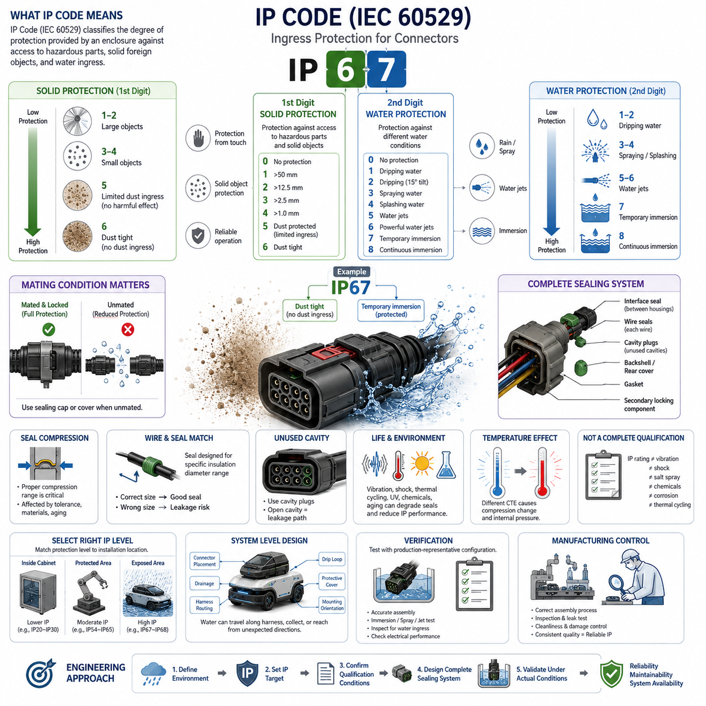
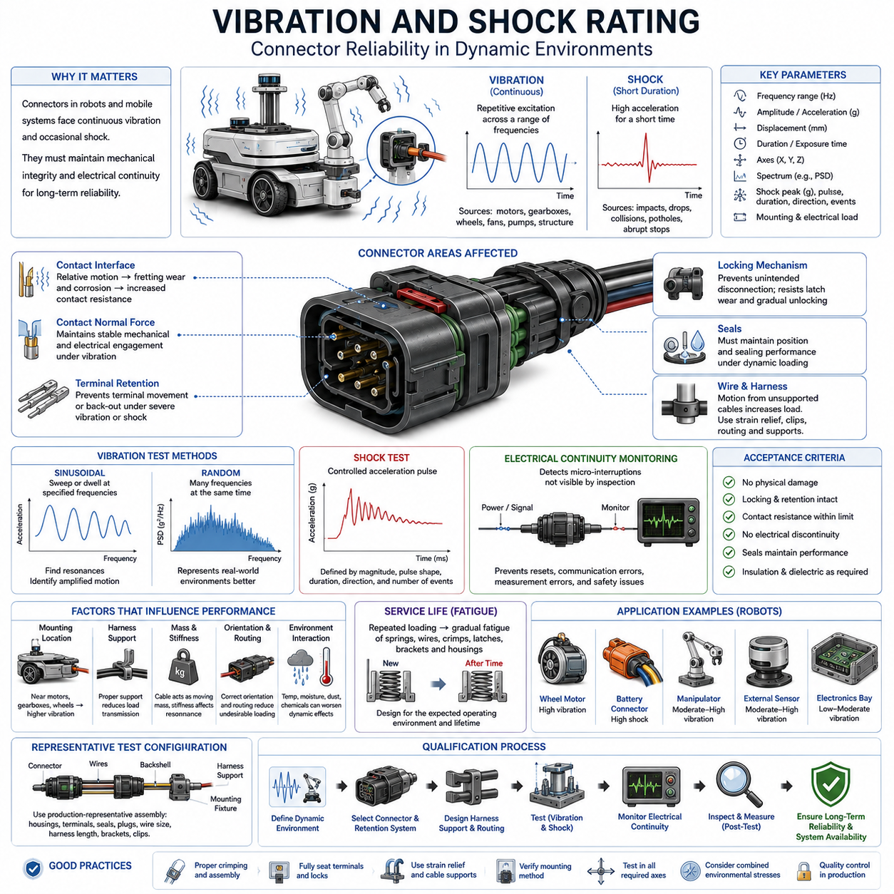
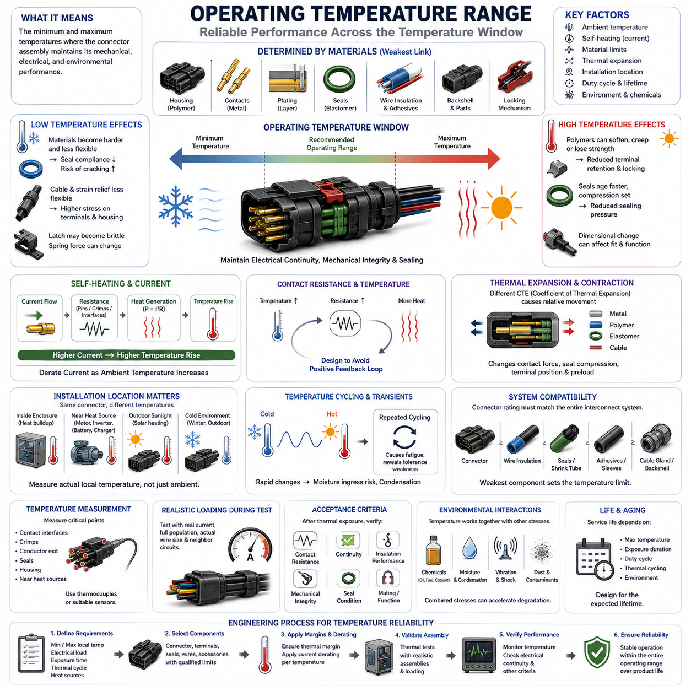
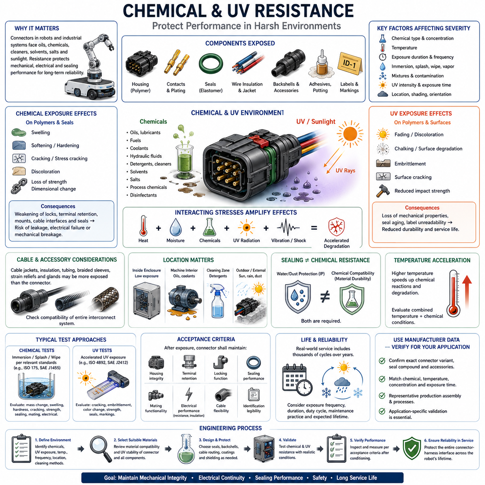
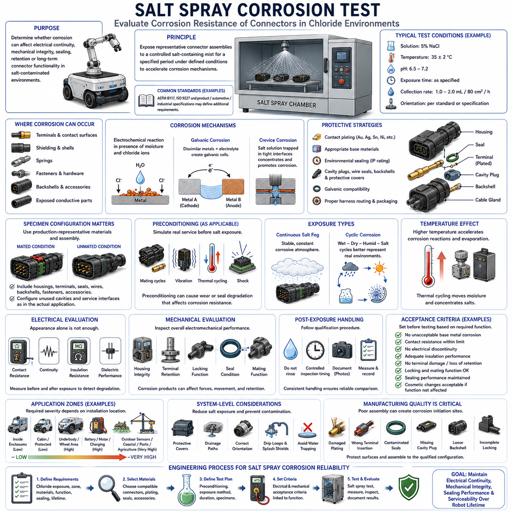

**Volume 03. Connector Engineering**

# Chapter 04. Environmental Rating

## 04.01. IP Code (IEC 60529)

{width="7.268055555555556in" height="7.268055555555556in"}

The IP Code defined by IEC 60529 is a standardized classification system used to describe the degree of protection provided by an enclosure against access to hazardous parts, ingress of solid foreign objects, and ingress of water. For connector engineering, the IP Code provides a common language for specifying environmental protection at electrical interfaces exposed to dust, moisture, cleaning processes, rain, or temporary immersion.

An IP designation normally begins with the letters "IP" followed by two characteristic numerals. The first numeral describes protection against access to hazardous parts and the penetration of solid foreign objects, while the second numeral describes protection against water ingress. These two ratings address different environmental mechanisms and must therefore be evaluated independently rather than interpreted as a single general measure of connector durability.

The first characteristic numeral progresses from limited protection against large objects toward increasingly effective exclusion of smaller particles. Ratings commonly encountered in electrical equipment range from basic finger or tool protection to IP5X and IP6X classifications associated with dust. IP5X permits only limited dust ingress that does not interfere with satisfactory operation, whereas IP6X represents the highest conventional dust-protection classification and requires a dust-tight enclosure.

The second characteristic numeral describes resistance to specified forms of water exposure. Lower classifications address dripping or spraying water, while progressively higher ratings cover water jets, powerful jets, temporary immersion, and continuous immersion under specified conditions. Consequently, a connector rated for rain or spray cannot automatically be considered suitable for immersion, pressure washing, or prolonged exposure to standing water without additional qualification.

IP67 is frequently specified for automotive, mobile robotic, and outdoor electrical connectors. The "6" indicates dust-tight protection, while the "7" indicates protection against temporary immersion under the conditions defined by the applicable test requirements. This combination is useful for connectors located near wheels, vehicle undersides, outdoor sensors, actuators, and other areas where contamination and occasional water exposure are reasonably foreseeable.

IP68 extends the water-ingress requirement beyond the temporary immersion represented by IP67. However, IP68 should not be interpreted as one universal depth-and-duration capability applicable to every product. The actual immersion conditions are established according to the relevant standard provisions and agreed product requirements. Engineers should therefore verify the manufacturer's declared test depth, duration, configuration, and qualification conditions instead of relying only on the IP68 marking.

Higher water-pressure applications require separate consideration. Equipment exposed to aggressive washdown, close-range high-pressure water, or elevated-temperature cleaning may require protection beyond ordinary immersion ratings. A connector that successfully passes an immersion test may still experience leakage when subjected to concentrated water jets because the pressure distribution, seal deformation, exposure direction, temperature, and mechanical loading mechanisms differ substantially.

For connectors, an IP rating is meaningful only when the complete sealing system is correctly assembled. Environmental protection may depend on the interface seal between mating housings, individual wire seals, cavity plugs installed in unused positions, rear covers, cable glands, gaskets, and properly seated secondary locking components. Damage, contamination, incorrect wire diameter, incomplete terminal insertion, or missing cavity plugs can create leakage paths even when the connector family itself carries a high IP classification.

The mating state is another critical engineering condition. Some connector systems achieve their specified IP performance only when fully mated and mechanically locked, while protection in the unmated condition may be substantially lower unless dedicated sealing caps are installed. Specifications should therefore distinguish between mated, unmated, capped, and service conditions. This is particularly important for charging interfaces, removable sensors, diagnostic ports, and field-service connectors.

Seal compression is central to maintaining the intended ingress protection. Elastomeric seals must operate within a controlled compression range that provides sufficient contact pressure without excessive deformation or damage. Housing dimensional tolerances, terminal position, cable diameter, seal hardness, surface finish, thermal expansion, and long-term compression set can all influence sealing performance. An initially waterproof connector can therefore lose protection after aging if the sealing system is poorly designed.

Cable and wire selection must also be coordinated with the connector's sealing concept. Individual wire seals are generally designed for specified insulation diameter ranges rather than simply conductor cross-sectional area. A wire that electrically satisfies current requirements may have an insulation diameter outside the seal's operating window. This mismatch can produce insufficient radial compression or excessive seal stress, making electrical sizing and environmental sealing inseparable during connector selection.

Unused connector cavities represent another common ingress path. When a sealed multi-position connector contains unpopulated cavities, appropriate cavity plugs are typically required to preserve the environmental barrier. Leaving an unused cavity open can bypass an otherwise effective sealing architecture. Connector configuration management should therefore control terminals, wire seals, cavity plugs, backshells, and related sealing components as one qualified assembly rather than treating them as independent accessories.

IP performance should also be considered over the connector's complete service life. Repeated mating cycles, vibration, shock, thermal cycling, cable movement, fretting, chemical exposure, ultraviolet radiation, contamination, and maintenance activities can gradually alter sealing surfaces or mechanical preload. Environmental qualification should therefore evaluate whether the connector continues to provide acceptable ingress protection after representative mechanical and environmental conditioning, not merely when newly assembled.

Temperature variation creates additional sealing challenges because connector housings, terminals, cables, and elastomeric seals have different coefficients of thermal expansion. Heating and cooling can change compression forces and may generate internal pressure differences that encourage moisture transport through small leakage paths. Outdoor robots and vehicles experiencing rapid transitions between sunlight, rain, cold storage, warm indoor environments, or washdown conditions require particular attention to these coupled effects.

The IP Code should not be confused with a complete environmental qualification standard. A high IP rating does not independently demonstrate resistance to vibration, mechanical shock, salt spray, oils, fuels, cleaning chemicals, ultraviolet exposure, corrosion, thermal cycling, or long-term aging. These characteristics require separate material, mechanical, electrical, and environmental evaluations. Within the uploaded connector-engineering structure, these topics are intentionally separated into dedicated environmental-rating sections.

Connector location should therefore determine the required protection level rather than applying the highest IP rating universally. A protected connector inside a sealed control cabinet may require relatively modest ingress protection, whereas an externally mounted LiDAR, wheel motor, battery interface, or charging connector may need substantially stronger sealing. Selecting excessive protection can increase connector size, insertion force, cost, assembly complexity, and service difficulty without providing proportional system benefit.

For mobile robots and AMRs, the environmental boundary should be analyzed at system level. Water can travel along harnesses, collect at low points, migrate through damaged coverings, or reach connectors from directions that differ from normal operating orientation. Connector placement, drainage, harness routing, drip loops, protective covers, mounting orientation, and enclosure architecture should therefore complement the IP rating rather than relying on the connector seal as the only environmental defense.

Verification must reproduce the intended product configuration as closely as practical. Production-representative housings, terminals, wire gauges, insulation diameters, seals, plugs, backshells, and assembly procedures should be used because each can influence leakage behavior. Testing an idealized connector housing without representative wiring may provide misleading confidence. Post-test inspection should also determine whether water entered critical electrical regions and whether insulation or contact performance was degraded.

Manufacturing controls are equally important because IP protection depends strongly on assembly quality. Terminal insertion depth, seal orientation, wire preparation, cavity-plug installation, connector locking, contamination control, and handling damage should be incorporated into work instructions and inspection criteria. Where sealing is safety- or availability-critical, production validation may include visual inspection, dimensional checks, leak testing, or other process controls appropriate to the connector technology.

Ultimately, IEC 60529 IP classification should be treated as an environmental interface requirement rather than merely a connector catalog attribute. Effective engineering begins by defining the actual contamination and water exposure, selecting an appropriate IP target, confirming the exact manufacturer qualification conditions, designing the complete sealing architecture, and validating the assembled interface under representative operating conditions. This approach connects environmental rating directly to reliability, maintainability, and robotic system availability.

## 04.02. Vibration and Shock Rating

{width="7.268055555555556in" height="7.268055555555556in"}

Vibration and shock ratings describe a connector's ability to maintain mechanical integrity and electrical continuity while subjected to dynamic loads. In robotics, automotive, industrial, and mobile equipment, connectors experience continuous vibration from motors, gearboxes, wheels, fans, pumps, and structural motion, together with occasional shocks generated by impacts, drops, collisions, potholes, or abrupt machine movement.

Vibration is generally a repetitive or continuous mechanical excitation characterized by frequency, amplitude, acceleration, and duration. A connector mounted on a mobile robot may experience low-frequency displacement from chassis movement together with higher-frequency excitation generated by motors and drivetrain components. The resulting loading can act simultaneously on housings, terminals, locking mechanisms, seals, wires, and harness attachment points.

Shock differs from vibration because it represents a relatively short-duration mechanical event with high acceleration. Impact with an obstacle, sudden wheel loading, equipment handling, transportation, or a robot passing over a sharp surface discontinuity can generate transient forces significantly greater than normal steady-state loads. Connector qualification must therefore consider both repetitive vibration fatigue and short-duration peak mechanical loading.

A vibration rating cannot be represented meaningfully by acceleration alone. Test severity depends on the vibration profile, frequency range, spectral content, displacement or acceleration level, sweep rate, exposure duration, number of axes, mounting arrangement, and electrical loading condition. Consequently, two connectors tested at the same nominal acceleration can experience substantially different mechanical stresses when the frequency ranges or test methods differ.

Sinusoidal vibration testing applies controlled periodic excitation while sweeping through or dwelling at specified frequencies. It is particularly useful for identifying mechanical resonances where relatively small input motion can produce amplified movement within the connector assembly. Resonance of a housing, terminal, wire, bracket, or harness segment can increase contact movement and local stress, making resonance identification an important part of mechanical qualification.

Random vibration testing represents environments containing many frequency components simultaneously and is commonly characterized using acceleration power spectral density. This approach can better represent complex excitation produced by vehicles, mobile machinery, industrial equipment, and robotic platforms. Test specifications normally define the frequency range, spectral profile, overall acceleration level, duration, and test axes required to reproduce an appropriate mechanical environment.

Mechanical vibration directly affects electrical contact interfaces. Relative movement between mating contacts can disturb microscopic conductive contact regions and repeatedly expose fresh metal surfaces. Small-amplitude motion can contribute to fretting wear and fretting corrosion, gradually increasing contact resistance. The environmental vibration rating is therefore closely related to the contact-physics topics addressed earlier in the connector-engineering structure.

Contact normal force is particularly important under vibration because it helps maintain stable mechanical and electrical engagement between mating surfaces. If terminal geometry, spring properties, wear, temperature, or manufacturing variation reduces normal force, vibration can produce greater relative movement and intermittent contact. Connector selection must therefore consider mechanical retention and contact design together rather than treating vibration capability as a housing property alone.

Terminal retention within the housing is another critical design characteristic. Primary retention features hold each terminal in its cavity, while secondary locking mechanisms can provide additional assurance against terminal displacement or incomplete insertion. Under severe vibration or shock, insufficient retention may allow terminal movement, backing out, or changes in contact engagement that can eventually produce increased resistance or complete electrical discontinuity.

The connector locking mechanism must also prevent unintended separation of the mating halves. Latches, locking levers, threaded couplings, bayonet mechanisms, push-pull systems, or connector position assurance features may be used depending on the connector family and application. Dynamic loads transmitted through the harness should not cause gradual unlocking, latch wear, or partial disengagement during the required operating life.

Wire and harness motion can substantially increase connector loading. An unsupported cable acts as a moving mass and can transmit cyclic bending and tensile forces directly into the connector and terminal crimp region. Proper strain relief, harness clipping, routing, bend-radius control, and support spacing reduce this mechanical transfer. A highly vibration-resistant connector can still fail prematurely when the attached harness is inadequately supported.

Mounting location strongly influences the vibration environment experienced by the connector. A connector installed near a wheel motor, gearbox, engine, compressor, actuator, or vibrating structural member may experience substantially greater excitation than an identical connector located inside a protected electronics enclosure. System designers should therefore evaluate local vibration conditions instead of assigning one mechanical rating uniformly to every connector on the platform.

Shock qualification commonly subjects the connector assembly to controlled acceleration pulses defined by magnitude, pulse shape, duration, direction, and number of events. The purpose is to determine whether sudden mechanical loading causes cracking, deformation, terminal displacement, latch release, seal damage, or electrical interruption. The test fixture and mounting method are important because they determine how the applied shock is transmitted into the connector.

Electrical continuity monitoring during dynamic testing provides information that visual inspection alone cannot detect. A connector may remain physically mated while experiencing extremely short interruptions caused by contact bounce or relative terminal movement. For power circuits, sensor interfaces, communication networks, and safety-related signals, even brief discontinuities may produce resets, communication errors, corrupted measurements, or unintended system behavior.

Acceptance criteria should therefore include both mechanical and electrical requirements. After vibration or shock exposure, engineers may inspect housing damage, locking integrity, terminal retention, seal position, wire condition, and mating functionality while also measuring contact resistance and continuity. Where appropriate, insulation resistance, dielectric performance, sealing capability, or other characteristics can be reassessed to identify secondary damage produced by mechanical loading.

Test configuration must represent the intended production assembly as closely as possible. Connector housings, terminals, seals, cavity plugs, wire gauges, insulation diameters, backshells, clips, brackets, and harness lengths can all influence dynamic behavior. Testing an isolated connector without representative wiring or support may not reproduce the mass, stiffness, and force transmission paths present in the actual robotic or vehicle installation.

Vibration and shock can also interact with environmental stresses. Temperature cycling changes material stiffness and contact force, moisture can promote corrosion at disturbed contact surfaces, and dust or chemicals may enter interfaces damaged by mechanical movement. A connector that passes separate vibration and sealing tests may therefore require combined or sequential environmental conditioning when the real application exposes it to interacting stresses.

Service life must be considered because dynamic damage is often cumulative rather than immediate. Repeated vibration can gradually fatigue terminal springs, wires, crimp transitions, latches, brackets, and housing features. The connector may initially operate normally but develop increasing contact resistance or mechanical looseness after prolonged exposure. Qualification duration should consequently reflect the intended operating environment and expected product lifetime.

For AMRs and other mobile robots, vibration sources can include wheel-ground interaction, caster impacts, motor torque ripple, gearbox excitation, payload movement, chassis resonance, cooling systems, and repeated transitions across floor joints or outdoor terrain. Shock events can arise from curb transitions, obstacle contact, emergency stops, handling, transportation, or accidental collision, making connector mechanical robustness a system-level reliability requirement.

Different connector locations may therefore require different mechanical performance levels. Internal low-mass electronics connectors may operate in relatively protected environments, while battery, motor, suspension-adjacent, manipulator, and externally mounted sensor connectors can experience much greater dynamic loading. Connector selection should match qualification severity to the actual installation zone rather than simply choosing the mechanically strongest available product.

Mechanical design should complement the connector's qualified vibration and shock capability. Harness supports can isolate cable mass, flexible routing can prevent excessive force transfer, brackets can control connector motion, and appropriate orientation can reduce undesirable loading. The objective is not merely to select a connector capable of surviving vibration but to design the surrounding installation so unnecessary mechanical stress never reaches the electrical interface.

Manufacturing quality also affects dynamic reliability. Incorrect crimping, incomplete terminal insertion, improperly engaged secondary locks, damaged latches, excessive wire tension, or missing harness supports can substantially reduce vibration resistance. Production inspection should therefore verify the complete mechanical load path from conductor and terminal through the connector housing to the harness supports and equipment mounting structure.

Vibration and shock ratings should ultimately be treated as application-specific qualification evidence rather than simple catalog numbers. Effective connector engineering defines the expected dynamic environment, selects a suitable connector and retention architecture, designs appropriate harness support, validates representative assemblies, monitors electrical continuity, and inspects post-test condition. This approach connects mechanical qualification directly to long-term electrical reliability and robotic system availability.

## 04.03. Operating Temperature Range

{width="7.268055555555556in" height="7.268055555555556in"}

The operating temperature range of a connector defines the minimum and maximum temperatures within which the connector assembly is expected to maintain its specified mechanical, electrical, and environmental performance. In robotics and mobile equipment, this range must account not only for ambient temperature but also for heat generated by electrical current, nearby motors, batteries, power electronics, and enclosed installation spaces.

Connector temperature capability is determined by the combined behavior of multiple materials rather than by a single component. Housing polymers, metallic contacts, plating layers, elastomeric seals, wire insulation, adhesives, backshells, and locking mechanisms can have different thermal limits. The practical operating range is therefore constrained by the component or material that first reaches an unacceptable mechanical, electrical, or aging condition.

The lower temperature limit is particularly important for polymer housings and elastomeric seals. As temperature decreases, some materials become harder and less flexible, which can reduce seal compliance or increase susceptibility to cracking under mechanical loading. Cable insulation and strain-relief components may also become less flexible, increasing the forces transferred to terminals and connector housings when a robot or harness moves in a cold environment.

At elevated temperature, polymers can soften, creep, distort, or lose mechanical strength, while elastomeric seals may experience accelerated aging and compression set. These effects can reduce terminal retention, locking integrity, sealing pressure, or dimensional stability. High temperature can therefore create failures even when the electrical contacts themselves remain below their intrinsic material temperature limits.

Contact temperature is influenced by both the surrounding ambient temperature and self-heating caused by current flow. Electrical resistance at terminals, crimps, and mating interfaces produces heat according to resistive power loss. As current increases, local temperature rise can become significant, meaning that a connector operating safely at room temperature may require current derating when installed in a high-temperature environment.

This relationship connects operating temperature directly with connector current rating and derating. The allowable current should leave sufficient thermal margin between ambient temperature plus connector temperature rise and the maximum permissible temperature of the complete assembly. Consequently, current rating should not be treated independently from the environmental temperature conditions covered by the current-rating and derating chapter of connector engineering.

Contact resistance can also change with temperature because conductor resistivity, contact interface condition, spring behavior, plating characteristics, and mechanical dimensions vary thermally. Increased resistance produces additional heat, which may further raise the interface temperature. Connector design must therefore avoid conditions in which temperature rise and resistance increase reinforce each other and progressively reduce electrical reliability.

Thermal expansion and contraction affect connector geometry because metals, polymers, elastomers, and cable materials have different coefficients of thermal expansion. Repeated temperature changes can produce relative dimensional movement between terminals, housings, seals, and wires. These movements may modify contact normal force, seal compression, terminal position, and mechanical preload even when every individual component remains within its nominal temperature rating.

Temperature cycling is consequently different from operation at one constant high or low temperature. A connector repeatedly transitioning between cold and hot conditions experiences cyclic expansion and contraction that can fatigue interfaces and reveal tolerance-related weaknesses. Mobile robots moving between refrigerated areas, outdoor environments, warehouses, charging stations, and warm equipment rooms may encounter these repeated thermal transitions during normal service.

Rapid temperature transitions can introduce additional environmental effects. Cooling may reduce internal pressure and encourage moisture to enter through small leakage paths, while subsequent heating can redistribute trapped moisture and create condensation. For sealed connectors, pressure differences can interact with seals and enclosure boundaries, making temperature variation relevant not only to material durability but also to long-term ingress protection.

Connector temperature must therefore be evaluated at the actual installation location. A connector inside an electronics enclosure may experience temperatures significantly higher than the surrounding room because of processors and power converters. Similarly, connectors near motors, brakes, batteries, inverters, DC-DC converters, chargers, or other heat-generating devices may operate in a local thermal environment substantially different from the nominal ambient temperature.

Solar radiation is another important consideration for outdoor robotic systems. An enclosure or connector exposed directly to sunlight can reach a surface temperature considerably above measured air temperature. Dark housings, restricted airflow, sealed compartments, and stationary operation can intensify this effect. Using only weather-station ambient temperature can therefore underestimate the actual thermal stress experienced by externally mounted connectors.

Low-temperature applications require similar location-specific analysis. Outdoor AMRs, inspection robots, agricultural machines, and autonomous vehicles may remain inactive for extended periods before startup. A connector may therefore have to tolerate cold soak conditions before electrical power produces any internal heating. Startup, mating, unmating, cable movement, and mechanical shock at low temperature can impose more severe requirements than steady operation after the system warms.

Operating temperature should be distinguished from storage temperature. A connector may tolerate a wider temperature range while unpowered and mechanically inactive than while carrying current or being repeatedly mated. Storage specifications therefore cannot automatically be used as operating limits. Engineers should verify whether published temperature values refer to operating, storage, installation, processing, or short-duration exposure conditions.

The connector rating must also be coordinated with the wire and cable temperature rating. A high-temperature connector provides little system benefit if the attached wire insulation, heat-shrink tubing, protective sleeve, seal, adhesive, or cable gland has a lower allowable temperature. Thermal qualification should therefore consider the complete electrical interconnection rather than selecting the connector housing independently from the associated harness materials.

Mechanical loading can interact strongly with temperature. A latch that operates reliably at room temperature may become brittle at low temperature or more compliant at elevated temperature. Terminal spring properties and housing retention forces can also change. For applications already exposed to vibration and shock, thermal conditioning can therefore alter the mechanical behavior addressed by the preceding environmental-rating topic.

Environmental chemicals can accelerate temperature-related degradation. Oils, cleaning agents, coolants, fuels, salts, and other contaminants may alter polymer or elastomer properties, while elevated temperature can accelerate chemical reactions and material aging. A connector that satisfies temperature and chemical requirements independently may consequently require additional validation when both stresses are present simultaneously in the actual application.

Long-term thermal aging is governed not only by the maximum temperature but also by exposure duration and duty cycle. Short excursions near a material limit may have different consequences from continuous operation at an elevated temperature. Repeated charging, high-current motor operation, standby periods, and seasonal ambient changes create a thermal history that should be considered when estimating connector service life.

Temperature measurement during validation should capture critical locations rather than relying exclusively on ambient sensors. Measurements near contact interfaces, crimps, conductor exits, seals, housings, and nearby heat sources can identify local hot spots. Thermocouples or other suitable temperature sensors should be positioned carefully so that the measurement method does not significantly alter heat flow or mechanical behavior.

Representative electrical loading is equally important during thermal testing. A power connector should be evaluated with realistic current, conductor size, cavity population, and neighboring energized circuits because these factors influence heat generation and dissipation. A partially populated connector tested at low current may remain cool even though the fully populated production configuration experiences substantial internal temperature rise.

Acceptance criteria should verify that thermal exposure does not produce unacceptable electrical or mechanical degradation. Post-test evaluation can include contact resistance, continuity, insulation performance, housing deformation, terminal retention, locking operation, seal condition, and mating functionality. Where environmental sealing is required, ingress protection may also need to be reassessed after thermal conditioning to confirm that seal compression remains effective.

For AMRs and other robotic platforms, connector temperature zones can differ substantially across the same machine. Compute and power-electronics compartments may be warm, battery and motor interfaces may experience current-related heating, external sensors may face solar and winter exposure, and charging interfaces may experience repeated high-current thermal cycles. Connector selection should therefore be based on installation-specific thermal zones rather than one platform-wide temperature assumption.

A suitable engineering process begins by defining the expected minimum and maximum local temperatures, electrical load, exposure duration, thermal cycling profile, and nearby heat sources. These requirements are then compared with the qualified limits of the connector, terminals, seals, wires, and accessories. Appropriate thermal margin and current derating are applied before representative assemblies are validated under realistic operating conditions.

Ultimately, operating temperature range should be treated as a system-level reliability requirement rather than a simple catalog specification. Reliable connector design requires coordination between ambient conditions, electrical self-heating, material limits, thermal expansion, sealing behavior, mechanical loading, harness construction, and service life. Proper thermal design ensures that the connector continues to provide stable electrical continuity, mechanical integrity, and environmental protection throughout the robot's intended operating environment.

## 04.04. Chemical and UV Resistance

{width="7.268055555555556in" height="7.268055555555556in"}

Chemical and ultraviolet resistance describes a connector's ability to preserve its mechanical, electrical, and sealing performance when exposed to aggressive substances and solar radiation during service. In robotics, automotive, industrial, agricultural, and outdoor applications, connectors may encounter oils, fuels, coolants, detergents, hydraulic fluids, solvents, salts, process chemicals, and prolonged sunlight.

Chemical resistance is primarily a material compatibility issue involving the connector housing, seals, cable insulation, backshell, adhesives, potting compounds, protective coatings, and identification markings. A connector can remain electrically functional while its polymer or elastomer components gradually degrade. Material selection must therefore consider every exposed component rather than assuming that the resistance of the housing represents the complete connector assembly.

Chemical exposure can affect polymers through swelling, softening, hardening, cracking, discoloration, loss of strength, or dimensional change. Some chemicals penetrate polymer structures and alter their mechanical properties, while others remove additives or promote environmental stress cracking. These changes can weaken locking features, terminal retention structures, mounting points, cable interfaces, or other mechanically loaded portions of the connector.

Elastomeric seals are particularly sensitive because chemical absorption can change their volume, hardness, elasticity, and compression behavior. A swollen seal may generate excessive assembly force or become mechanically damaged, while a hardened or shrunken seal may lose contact pressure and create an ingress path. Chemical compatibility must therefore be evaluated together with the sealing requirements established for environmentally protected connectors.

Exposure severity depends on more than the name of the chemical. Concentration, temperature, exposure duration, immersion depth, splash frequency, pressure, drying cycles, and whether different substances are mixed can significantly change material behavior. A connector that tolerates occasional contact with a diluted cleaning solution may not remain reliable during continuous immersion in the same chemical or exposure at elevated temperature.

Temperature often accelerates chemical degradation because diffusion and reaction rates generally increase as materials become warmer. Connectors near motors, batteries, inverters, chargers, hydraulic equipment, or other heat sources can therefore experience more severe chemical effects than identical connectors at room temperature. Chemical qualification should reflect the combined thermal and chemical environment whenever these stresses occur simultaneously in actual operation.

Oils and lubricants are common contaminants around motors, gearboxes, bearings, actuators, and industrial machinery. Depending on material compatibility, prolonged exposure may alter polymer housings, elastomeric seals, cable jackets, or adhesives. For mobile robots operating in factories or maintenance environments, connector selection should consider both direct fluid contact and indirect contamination transferred by tools, hands, cables, or surrounding equipment.

Cleaning chemicals require special attention because robotic and industrial equipment may be repeatedly washed or disinfected throughout its service life. Detergents, alkaline cleaners, alcohol-based agents, disinfectants, and other cleaning substances can affect seals and plastics even when each exposure is relatively short. Repeated wetting and drying can create cumulative degradation that is not represented by a single brief compatibility test.

UV resistance addresses degradation caused primarily by ultraviolet radiation from sunlight. Long-term UV exposure can break chemical bonds in susceptible polymers and gradually change their mechanical and surface properties. Typical effects include fading, chalking, embrittlement, surface cracking, and reduced impact strength. Externally mounted connector housings, backshells, cable jackets, protective caps, and labels can therefore require UV-stabilized materials.

UV exposure is strongly dependent on installation location. Connectors installed inside opaque enclosures receive little direct solar radiation, while connectors mounted on the exterior of an outdoor AMR, autonomous vehicle, agricultural robot, inspection platform, or charging station may receive repeated daily exposure. Orientation, shading, geographic region, operating schedule, and seasonal conditions can substantially alter the accumulated radiation dose.

Solar exposure can also combine ultraviolet degradation with elevated surface temperature. A dark connector housing exposed to direct sunlight may become substantially hotter than the surrounding air, accelerating material aging while UV radiation simultaneously attacks the polymer structure. Consequently, outdoor qualification should consider the combined effects of radiation, temperature, moisture, and mechanical loading rather than treating UV resistance as an isolated cosmetic requirement.

Cable components require the same attention as connector housings. Wire insulation, cable jackets, corrugated tubing, braided sleeves, heat-shrink materials, strain reliefs, and cable glands may be more exposed to chemicals or sunlight than the connector itself. A highly resistant connector provides limited system protection if an adjacent cable jacket cracks, swells, hardens, or loses flexibility and transfers excessive mechanical stress to the termination.

Identification and serviceability can also be affected by environmental exposure. Printed labels, laser markings, color coding, safety symbols, and connector identification features must remain legible throughout the intended service period. Chemical cleaning or UV exposure can fade or remove markings, potentially increasing maintenance errors. Environmental durability should therefore include information needed for inspection, replacement, troubleshooting, and safe servicing.

Mechanical stresses can amplify chemical and UV degradation. A polymer latch under continuous strain may develop environmental stress cracking more readily when exposed to an incompatible chemical, while UV-aged material may become brittle and fail under vibration or shock. This interaction connects chemical and UV resistance directly with the vibration, shock, and operating-temperature requirements addressed elsewhere in the environmental-rating chapter.

Environmental sealing does not automatically guarantee chemical resistance. An IP-rated connector may prevent water or dust ingress under specified conditions while its housing or seals remain vulnerable to oils, solvents, cleaners, or other chemicals. Conversely, a chemically resistant polymer does not demonstrate that the assembled connector is waterproof. Ingress protection and material compatibility are separate requirements that must both be satisfied.

Qualification should use representative production materials and complete assemblies. Housings, terminals, seals, cavity plugs, backshells, cables, adhesives, labels, and protective accessories should reflect the intended configuration because degradation of any component can compromise system performance. Test specimens should also represent relevant manufacturing processes, since molding, curing, surface treatment, and assembly conditions can influence environmental durability.

Chemical testing may involve controlled immersion, splash, wipe, or repeated exposure followed by conditioning and inspection. Evaluation can examine dimensional change, mass change, swelling, hardness, cracking, discoloration, mechanical strength, mating functionality, seal condition, and electrical characteristics. The appropriate method should reproduce the expected exposure mechanism rather than applying one generic chemical test to every installation.

UV qualification commonly uses controlled radiation sources to accelerate exposure under repeatable conditions. Evaluation after exposure should focus on functional consequences such as cracking, embrittlement, loss of mechanical strength, seal degradation, and deterioration of markings, not merely color change. Accelerated testing must still be interpreted carefully because laboratory exposure does not reproduce every aspect of long-term outdoor weathering.

Moisture can further interact with chemical and UV aging. Rain, condensation, washdown, and humidity may transport contaminants into small interfaces or alter material degradation mechanisms. Surface cracking caused by UV exposure can also create locations where water and chemicals accumulate. Outdoor connector engineering should therefore consider weathering as a combination of radiation, temperature, moisture, contamination, and repeated environmental cycling.

For AMRs and other robotic platforms, environmental zones should be identified according to realistic exposure. Internal electronics connectors may encounter little chemical or UV stress, drivetrain connectors may face oils and lubricants, battery areas may encounter electrolyte-related contamination, cleaning zones may see detergents or disinfectants, and external sensor or charging connectors may experience sunlight, rain, dust, and repeated maintenance activities.

Material compatibility information from connector manufacturers is an important starting point, but application conditions must still be compared carefully. Statements such as resistant, limited resistance, or suitable for outdoor use may depend on specific materials and test conditions. Engineers should verify the exact connector variant, seal compound, accessory materials, exposure medium, temperature, concentration, and duration relevant to the intended installation.

Acceptance criteria should focus on continued functionality after environmental conditioning. The connector should retain adequate housing integrity, terminal retention, locking operation, mating capability, seal performance, cable flexibility, identification legibility, and electrical characteristics. Where appropriate, contact resistance, insulation performance, ingress protection, or mechanical tests can be repeated after chemical or UV exposure to detect secondary degradation.

Long-term reliability depends on accumulated exposure rather than only a single extreme event. A connector may experience thousands of cleaning cycles, years of intermittent sunlight, seasonal temperature changes, occasional oil contamination, and repeated vibration throughout its service life. Environmental qualification should therefore consider exposure frequency, duration, duty cycle, maintenance practice, and expected lifetime when establishing appropriate material and connector requirements.

Ultimately, chemical and UV resistance should be treated as part of the complete environmental-rating strategy for connector engineering rather than as isolated material properties. Reliable selection requires identification of realistic chemicals and radiation exposure, verification of material compatibility, consideration of interacting temperature and mechanical stresses, representative qualification testing, and protection of the entire connector-harness interface throughout the intended robotic system life.

## 04.05. Salt Spray Corrosion Test

{width="7.268055555555556in" height="7.268055555555556in"}

Salt spray corrosion testing evaluates how effectively a connector and its associated materials resist degradation in a chloride-rich environment. The test is particularly relevant to outdoor robots, autonomous mobile robots, automotive systems, agricultural equipment, ports, coastal facilities, and industrial machines where salt contamination can accelerate corrosion of metallic components and electrical interfaces.

The basic principle is to expose representative connector assemblies to a controlled salt-containing mist for a specified period under defined environmental conditions. The atmosphere accelerates corrosion mechanisms that may otherwise develop more slowly in normal service. The objective is not simply to produce visible rust, but to determine whether corrosion can compromise electrical continuity, mechanical integrity, sealing, retention, or long-term connector functionality.

A salt spray chamber generates a controlled corrosive atmosphere by atomizing a prepared salt solution into a fine mist. Test conditions normally specify parameters such as solution composition, concentration, chamber temperature, pH, exposure duration, specimen orientation, and collection rate. Because corrosion behavior is highly dependent on these variables, test results are meaningful only when the complete test method and severity are clearly defined.

Standards such as ASTM B117 and ISO 9227 are widely used as references for salt spray testing, although product-specific, automotive, industrial, or connector qualification specifications may define additional requirements. Engineers should therefore avoid treating a statement such as "salt spray tested" as sufficient qualification evidence. The applicable method, exposure time, specimen preparation, conditioning, and acceptance criteria must also be verified.

Connector corrosion can occur on terminals, contact surfaces, shielding components, springs, fasteners, backshells, mounting hardware, and exposed conductive structures. Different metals have different electrochemical characteristics, and the presence of moisture and dissolved salts creates an electrolyte that enables corrosion reactions. Even relatively small corrosion products can affect mechanical engagement or electrical contact behavior in precision connector interfaces.

Contact plating is one of the primary defenses against corrosion at the electrical interface. Tin, silver, gold, nickel underlayers, and other plating systems provide different combinations of conductivity, wear resistance, cost, and environmental durability. However, plating performance depends strongly on thickness, porosity, base material, underplating, mating cycles, contact force, and whether wear has exposed the underlying metal.

Salt contamination can be particularly damaging when plating has been scratched or worn by repeated mating, vibration, or fretting. Once the protective surface is locally damaged, moisture and chloride ions can reach less corrosion-resistant underlying materials. Corrosion products may then spread into the contact region, increasing contact resistance and potentially producing intermittent or permanent electrical failure under dynamic operating conditions.

Galvanic corrosion is another important mechanism when dissimilar metals are electrically connected in the presence of an electrolyte. Connector terminals, shielding shells, fasteners, brackets, backshells, and equipment structures may form galvanic combinations. The severity depends on the materials, exposed surface areas, electrical connection, electrolyte characteristics, and environmental conditions, so system-level material selection should accompany connector-level qualification.

Environmental sealing can reduce the amount of salt solution reaching critical internal components, but an IP rating does not automatically establish salt corrosion resistance. A connector may prevent water ingress during a specified IP test while exposed external metallic parts remain susceptible to chloride attack. Conversely, corrosion-resistant materials do not prove that the connector is sealed against water or dust, making these separate but interacting requirements.

Wire seals, interface seals, cavity plugs, backshells, cable glands, and protective covers can help limit contamination pathways when correctly installed. Salt solution entering through an unused cavity, damaged seal, poorly matched wire diameter, or incomplete connector engagement may remain trapped inside the assembly. Evaporation can concentrate salts in confined regions, creating persistent contamination that continues to promote corrosion after the initial wetting event.

Specimen configuration therefore has a major influence on test relevance. Qualification should use production-representative housings, terminals, plating systems, seals, cavity plugs, wires, backshells, fasteners, and accessories. Mated and unmated conditions should be selected according to the intended application, and unused cavities or service interfaces should be configured exactly as they are expected to appear in the actual robotic or vehicle installation.

Preconditioning may be necessary when real service exposes connectors to mechanical or thermal stresses before salt contamination occurs. Mating cycles, vibration, shock, thermal cycling, or other conditioning can produce wear, dimensional changes, or seal degradation that alters corrosion resistance. Testing only a pristine connector may therefore overestimate durability when the production system experiences substantial aging before encountering a corrosive environment.

Exposure duration is an important test parameter, but longer salt spray testing does not automatically provide a simple numerical prediction of real-world service life. Accelerated chamber testing and natural corrosion involve different wetting, drying, temperature, contamination, and atmospheric mechanisms. A specified number of test hours should therefore be treated as a comparative or qualification requirement rather than directly converted into years of outdoor operation.

Continuous salt fog and cyclic corrosion testing can represent different environmental mechanisms. Continuous exposure provides a stable accelerated corrosive atmosphere, while cyclic methods may include wet, dry, humid, and salt exposure phases. Applications experiencing road salt, coastal spray, condensation, drying, and repeated weather changes may require cyclic testing when it better represents the intended field environment and applicable product specification.

Temperature also affects corrosion because electrochemical reactions, evaporation, material behavior, and moisture retention vary with thermal conditions. A connector near a motor, battery, inverter, charger, or other heat source may experience corrosion differently from an identical connector in a cooler location. Thermal cycling can additionally move contaminated moisture through interfaces and repeatedly concentrate dissolved salts as water evaporates.

Mechanical vibration and corrosion can reinforce each other. Vibration may damage plating, disturb seals, loosen mechanical interfaces, or generate fretting wear, while corrosion can weaken springs, terminals, fasteners, and structural components. For mobile robots and vehicles, evaluating salt exposure together with representative mechanical conditioning can provide more realistic evidence of long-term reliability than considering each environmental stress completely independently.

Electrical evaluation should accompany visual corrosion inspection because appearance alone does not determine connector functionality. Contact resistance measurements before and after exposure can reveal degradation at electrical interfaces, while continuity monitoring or functional testing can identify unstable connections. Insulation resistance and dielectric characteristics may also require evaluation when conductive contamination or moisture could create unintended current paths.

Mechanical inspection after testing should examine housing integrity, terminal retention, locking mechanisms, springs, shielding structures, fasteners, seals, and mating functionality. Corrosion products can increase insertion or extraction force, restrict moving components, or interfere with locking features even when electrical resistance remains acceptable. A connector should therefore be evaluated as an electromechanical assembly rather than solely as a set of conductive contacts.

Post-exposure handling must follow the applicable qualification procedure because rinsing, drying, cleaning, or disturbing corrosion products can alter the observed condition. Inspection timing and preparation should therefore be controlled so that different specimens can be compared consistently. Photographic documentation, resistance measurements, dimensional checks, and defined corrosion criteria can improve traceability and reduce subjective interpretation of results.

Acceptance criteria should be established before testing and linked to the intended function of the connector. Depending on the application, requirements may address unacceptable base-metal corrosion, contact resistance change, electrical discontinuity, insulation degradation, terminal damage, locking failure, seal deterioration, or loss of mating capability. Cosmetic surface changes may be acceptable when they do not affect required mechanical, electrical, or environmental performance.

Connector installation location strongly determines the necessary corrosion resistance. Internal connectors within a protected electronics enclosure may experience little salt exposure, whereas wheel-area, underbody, charging, battery, motor, external sensor, agricultural, mining, or coastal-service connectors can experience substantially greater contamination. Environmental zoning allows appropriate qualification severity to be assigned without unnecessarily over-specifying every connector on the robot.

Harness routing and mechanical packaging can further reduce salt exposure. Protective covers, drainage paths, suitable connector orientation, drip loops, splash shields, and avoidance of water-trapping geometries can prevent contaminated moisture from accumulating around interfaces. Environmental reliability is therefore achieved through both connector material capability and system-level packaging rather than by relying exclusively on a catalog corrosion rating.

Manufacturing quality remains critical because damaged plating, incorrect terminal insertion, contaminated seals, missing cavity plugs, improperly tightened backshells, or incomplete locking can create corrosion initiation sites. Production controls should protect contact surfaces during handling and ensure that the complete sealing and retention architecture is assembled consistently with the configuration that was originally qualified.

For AMRs and other mobile robotic systems, salt exposure should be considered whenever operation includes coastal environments, winter road salt, outdoor logistics areas, ports, chemical facilities, agricultural sites, or repeated movement between contaminated outdoor and protected indoor zones. Salt carried by wheels, spray, tools, personnel, or maintenance activities can reach connectors even when direct seawater exposure is not expected.

A robust engineering process begins by defining the actual chloride exposure, installation zone, materials, electrical function, sealing requirement, and expected service life. Engineers then select compatible connector materials and plating systems, define representative preconditioning and salt exposure, establish electrical and mechanical acceptance criteria, and validate complete production-representative assemblies under the appropriate test method.

Ultimately, salt spray corrosion testing should be treated as one element of a broader environmental reliability strategy. Reliable connector engineering combines corrosion-resistant materials, suitable contact plating, environmental sealing, galvanic compatibility, harness protection, manufacturing control, and representative qualification testing. The goal is to maintain stable electrical continuity, mechanical integrity, sealing performance, and serviceability throughout the intended robotic system lifetime.
