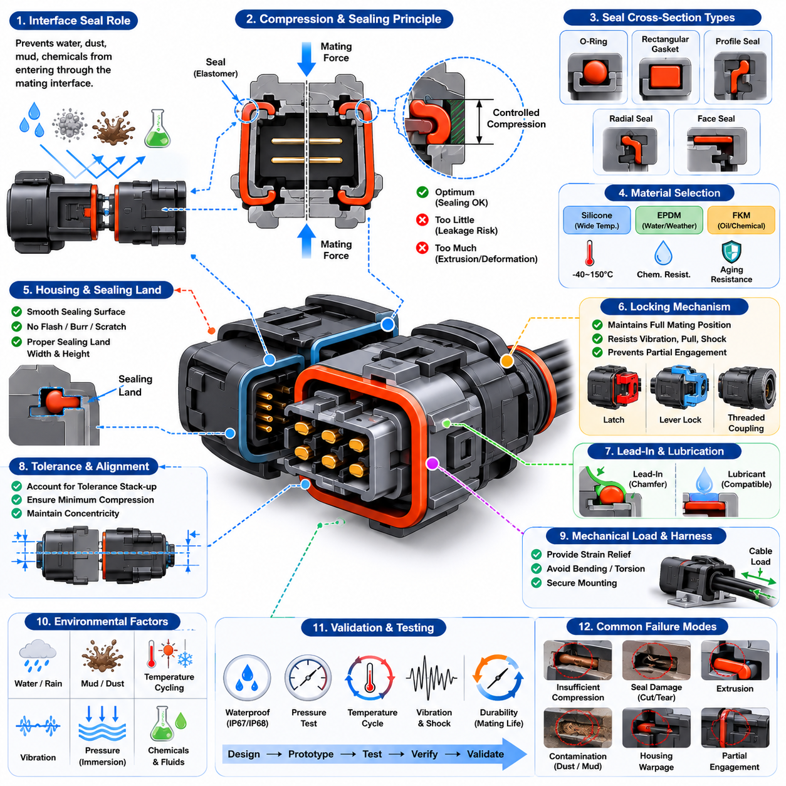
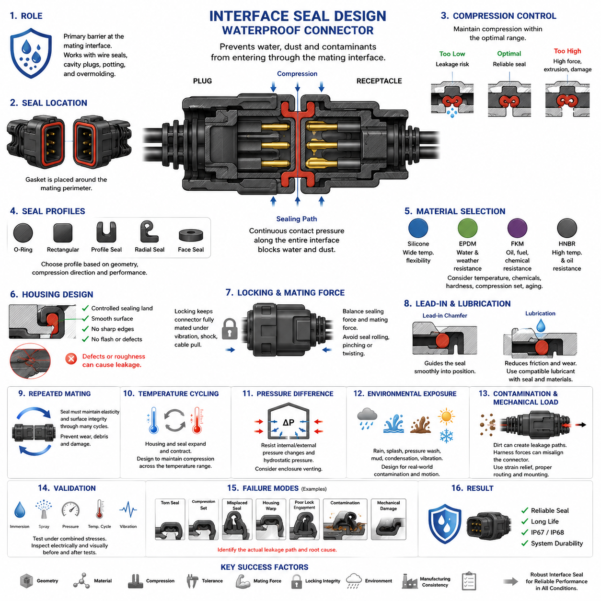
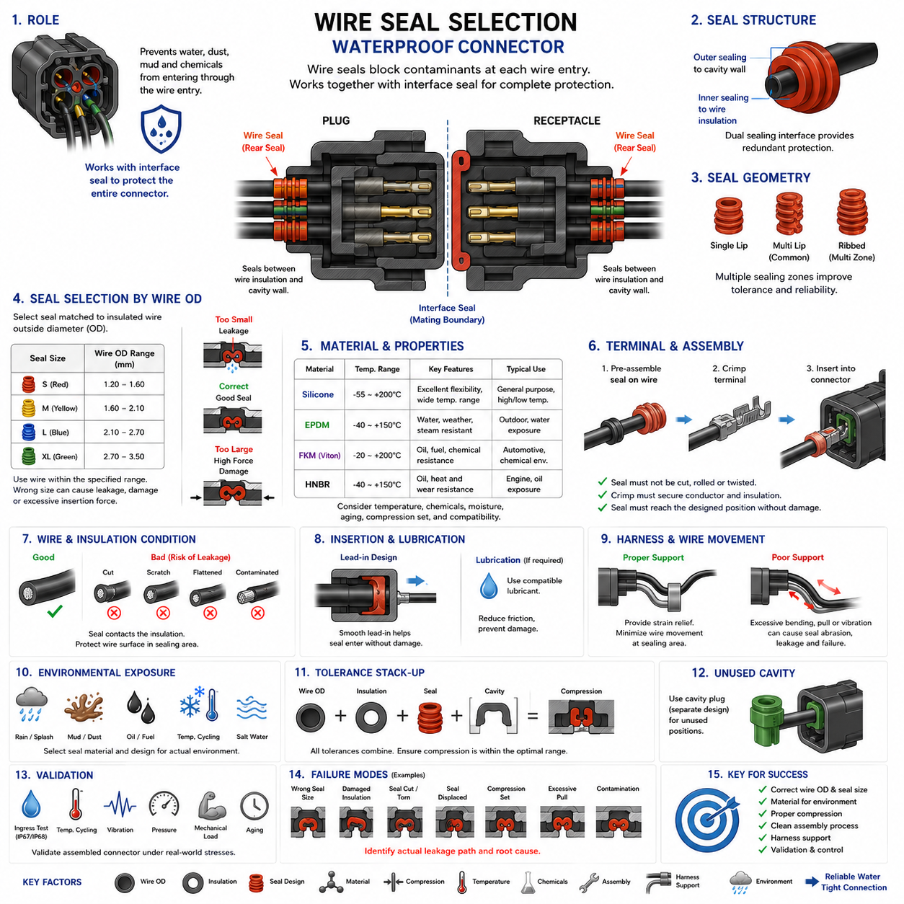
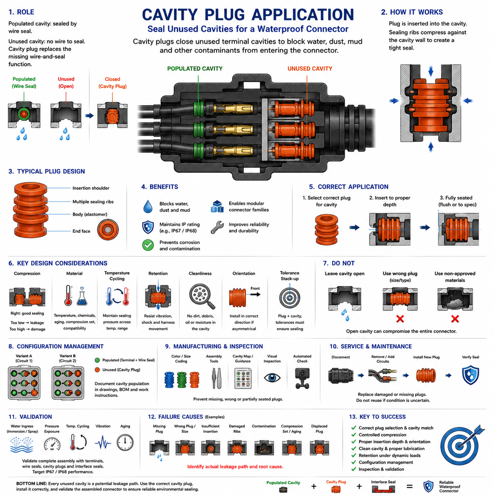
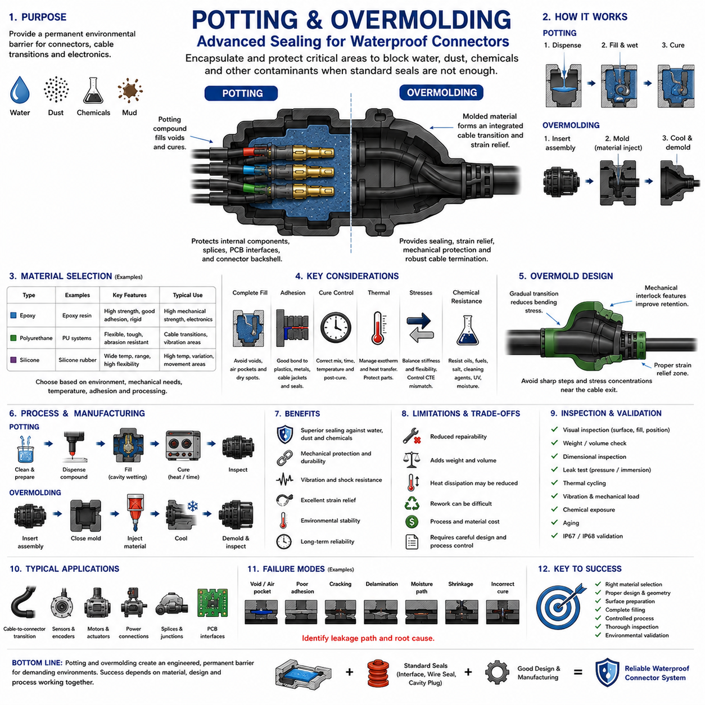
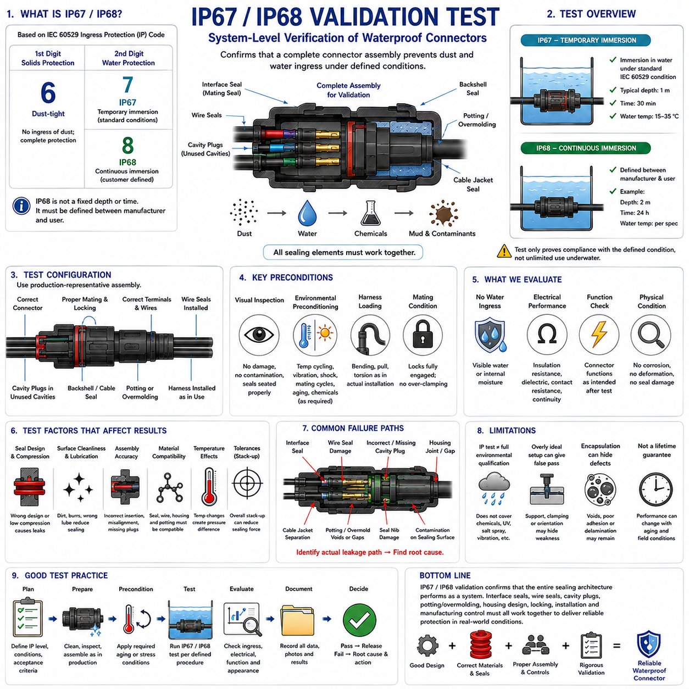

**Volume 03. Connector Engineering**


# Chapter 05. Waterproofing Design

##  

## 05.01. Interface Seal Design

{width="7.268055555555556in" height="7.268055555555556in"}

{width="7.268055555555556in" height="7.268055555555556in"}

Interface seal design is the primary barrier that prevents water, dust, mud, cleaning fluids, and other contaminants from entering a connector through the mating boundary between two housings. Within waterproof connector engineering, it complements wire seals, cavity plugs, potting, and overmolding, but specifically addresses the perimeter where connector halves meet.

A typical interface seal is formed from an elastomeric gasket positioned around the connector mating perimeter. When the plug and receptacle are fully engaged, housing geometry compresses the gasket and creates continuous contact pressure along the sealing path. Effective sealing therefore depends not simply on the presence of rubber, but on controlled deformation across the complete interface.

Seal compression must remain within a designed operating range. Insufficient compression can leave microscopic leakage paths caused by dimensional tolerance, surface irregularity, vibration, or housing distortion. Excessive compression can create high mating force, permanent set, extrusion, tearing, or accelerated material aging. The housing and seal must therefore be designed together as a mechanical sealing system.

The seal cross-section strongly influences its deformation behavior. O-rings, rectangular gaskets, molded profile seals, radial seals, and axial face seals distribute contact pressure differently. Connector geometry determines whether compression occurs mainly along the mating axis or radially against a surrounding wall. The selected profile must maintain sealing pressure while tolerating manufacturing variation and repeated mating cycles.

Elastomer selection is governed by the environmental conditions expected during the connector lifetime. Silicone rubber provides useful flexibility over broad temperature ranges, while EPDM can offer strong resistance to water and weathering. Fluoroelastomers may be selected where oils, fuels, or aggressive chemicals are important. Material selection must consider temperature, chemical exposure, hardness, compression set, and aging simultaneously.

Seal hardness affects both mechanical robustness and the force required to obtain adequate deformation. A softer material can conform effectively to housing imperfections but may be more susceptible to extrusion, damage, or excessive deformation. A harder material can provide dimensional stability but requires greater force to establish sealing contact. Appropriate hardness is therefore linked directly to connector geometry and allowable mating force.

Housing geometry must provide a controlled sealing land that supports the gasket without creating sharp edges or discontinuities. Parting lines, ejector marks, gate remnants, flash, scratches, and excessive surface roughness can become leakage paths when located within the active sealing region. Mold design and dimensional control are consequently important parts of waterproof connector performance rather than merely manufacturing concerns.

Tolerance stack-up is particularly critical because connector housings, seals, terminals, locking mechanisms, and mounting features all contribute to the final mating position. The design should preserve adequate seal compression at the worst combination of dimensional limits rather than only at nominal dimensions. Statistical tolerance analysis can additionally reveal production conditions that may produce marginal compression before leakage appears in field service.

The locking mechanism performs an important sealing function by maintaining the connector at its intended fully mated position. Latches, lever locks, threaded couplings, or secondary locking structures must resist forces that could partially separate the housings. Even a small loss of engagement can reduce gasket compression, particularly during vibration, cable loading, thermal cycling, or accidental pulling of the harness.

Connector mating force should therefore be evaluated together with sealing force. Increasing gasket compression may improve initial resistance to water intrusion, but it can also raise insertion force beyond acceptable ergonomic or mechanical limits. Lever-assisted connectors and other mechanical mating systems can provide additional force, although their geometry must still prevent seal rolling, pinching, twisting, or uneven compression during engagement.

Lead-in features help guide the interface seal into its operating position without cutting or displacing it. Chamfers and smooth transition surfaces are commonly used so that the gasket progressively deforms rather than encountering an abrupt edge. Poor lead-in geometry can cause localized stretching, seal shaving, folding, or rolling, producing defects that may remain visually hidden after the connector is fully assembled.

Lubrication may be used to reduce friction during assembly and protect the seal from abrasion, but lubricant compatibility must be established with both the elastomer and surrounding connector materials. An incompatible lubricant can cause swelling, softening, cracking, or changes in friction over time. Lubrication should consequently be treated as a controlled engineering and manufacturing parameter rather than an informal assembly aid.

Repeated mating introduces another design challenge because the interface seal experiences friction and cyclic deformation whenever the connector is disconnected and reconnected. The sealing system must retain adequate elasticity and surface integrity throughout the specified mating life. Wear debris, contamination, accidental tool contact, or improper handling can progressively damage the sealing surface even when electrical contacts remain functional.

Temperature cycling produces dimensional changes in both polymer housings and elastomer seals. Differences in thermal expansion can alter compression as the connector moves between cold and hot conditions. At low temperature the seal may become less compliant, while prolonged high-temperature exposure can increase compression set and aging. Robust designs maintain useful contact pressure throughout the specified operating temperature range.

Pressure differences can challenge an apparently well-sealed interface. Rapid temperature changes may produce pressure variation inside an enclosure or connector cavity, while immersion creates external hydrostatic pressure. The interface seal must resist these differential pressures without opening a leakage path. For demanding applications, enclosure venting and connector sealing should be considered together rather than as independent design problems.

Water intrusion is not determined solely by static immersion. Outdoor robots and vehicles may experience rain, splash, wheel spray, pressure washing, mud, condensation, and repeated wet-dry cycles. Dynamic water can attack the seal from changing directions while vibration simultaneously moves the connector. Interface seal design should therefore reflect the real contamination mechanisms of the application instead of relying only on nominal ingress ratings.

Contamination on the gasket or sealing land can defeat an otherwise correct design. Sand grains, metal particles, fibers, grease deposits, or dried mud may prevent continuous surface contact and create capillary leakage paths. Connector placement, protective covers, assembly cleanliness, maintenance procedures, and inspection requirements consequently influence the practical reliability of the interface seal throughout service life.

Mechanical loading from the harness must also be controlled. Cable bending, tension, torsion, or poorly supported harness mass can transmit forces into the connector housing and distort the mating interface. In mobile robots, repeated acceleration and vibration may amplify these loads. Proper strain relief, harness clipping, connector mounting, and routing help preserve the alignment required for uniform seal compression.

Validation should reproduce the combined stresses expected in service. Waterproof performance may be checked through immersion, spray, pressure, thermal cycling, vibration, and environmental exposure, with electrical and visual inspection performed before and after testing. The broader connector structure places interface sealing within waterproofing design and later IP67/IP68 validation, emphasizing that design and verification form a continuous engineering process.

Failure analysis should distinguish between seal-material failure and system-level sealing failure. Leakage may result from torn elastomer, compression set, incorrect seal installation, housing warpage, insufficient latch engagement, tolerance accumulation, contamination, or mechanical damage. Identifying the actual leakage path is essential because simply replacing the gasket may not correct a geometric or assembly-related root cause.

For robotic and AMR applications, interface sealing has direct implications for reliability because connectors are distributed near batteries, motors, sensors, compute modules, and communication devices throughout the machine. The broader electrical architecture includes connector engineering as a dedicated discipline and environmental testing as part of system validation, making sealing performance an important contributor to overall platform durability.

A robust interface seal is ultimately achieved by balancing geometry, material properties, compression, tolerance, mating force, locking integrity, environmental exposure, and manufacturing consistency. Waterproof performance should not be regarded as a property of the gasket alone. It emerges from the interaction of the seal, connector housing, locking mechanism, assembly process, harness installation, and validation strategy across the product lifetime.

인터페이스 실 설계(Interface Seal Design)는 두 하우징(Housing)이 결합되는 맞물림 경계(Mating Boundary)를 통해 물, 먼지, 진흙, 세척액 및 기타 오염물질이 커넥터(Connector) 내부로 침투하는 것을 방지하는 핵심 차단 구조이다. 방수 커넥터 엔지니어링(Waterproof Connector Engineering)에서는 와이어 실(Wire Seal), 캐비티 플러그(Cavity Plug), 포팅(Potting), 오버몰딩(Overmolding)과 상호 보완적으로 사용되며, 특히 커넥터 양쪽이 결합되는 외곽 경계를 밀봉하는 역할을 담당한다.

일반적인 인터페이스 실(Interface Seal)은 커넥터의 결합 외곽부(Mating Perimeter)를 따라 배치되는 탄성중합체 개스킷(Elastomeric Gasket)으로 구성된다. 플러그(Plug)와 리셉터클(Receptacle)이 완전히 체결되면 하우징 형상이 개스킷을 압축하여 전체 밀봉 경로(Sealing Path)에 연속적인 접촉 압력을 형성한다. 따라서 효과적인 밀봉은 단순히 고무가 존재하는 것이 아니라 전체 인터페이스에서 변형량을 정밀하게 제어하는 것에 달려 있다.

실 압축(Seal Compression)은 설계된 작동 범위(Operating Range) 내에서 유지되어야 한다. 압축이 부족하면 치수 공차(Dimensional Tolerance), 표면 불규칙성, 진동 또는 하우징 변형에 의해 미세한 누설 경로(Leakage Path)가 발생할 수 있다. 반대로 과도한 압축은 높은 결합력(Mating Force), 영구 변형(Permanent Set), 압출(Extrusion), 찢어짐 또는 재료의 조기 열화를 유발할 수 있으므로 하우징과 실을 하나의 기계적 밀봉 시스템(Mechanical Sealing System)으로 함께 설계해야 한다.

실 단면(Seal Cross-section)은 변형 특성에 큰 영향을 준다. O-링(O-ring), 직사각형 개스킷(Rectangular Gasket), 성형 프로파일 실(Molded Profile Seal), 방사형 실(Radial Seal), 축방향 페이스 실(Axial Face Seal)은 각각 접촉 압력을 서로 다른 방식으로 분배한다. 커넥터 형상에 따라 압축이 주로 결합축 방향으로 발생할지 주변 벽면을 향한 방사 방향으로 발생할지가 결정되며, 선택된 프로파일은 제조 편차와 반복적인 결합 사이클을 허용하면서 충분한 밀봉 압력을 유지해야 한다.

탄성중합체 선택(Elastomer Selection)은 커넥터 수명 동안 예상되는 환경 조건에 의해 결정된다. 실리콘 고무(Silicone Rubber)는 넓은 온도 범위에서 우수한 유연성을 제공하며, EPDM은 물과 기후 환경에 대한 높은 내성을 제공할 수 있다. 오일, 연료 또는 공격적인 화학물질에 대한 내성이 중요할 경우 불소탄성중합체(Fluoroelastomer)를 적용할 수 있으며, 재료 선정에서는 온도, 화학물질 노출, 경도, 압축 영구변형(Compression Set), 노화를 동시에 고려해야 한다.

실 경도(Seal Hardness)는 기계적 견고성과 적절한 변형을 얻기 위해 필요한 힘 모두에 영향을 준다. 부드러운 재료는 하우징 표면의 미세한 불규칙성에 효과적으로 순응하지만 압출, 손상 또는 과도한 변형에 취약할 수 있다. 단단한 재료는 높은 치수 안정성을 제공하지만 밀봉 접촉을 형성하기 위해 더 큰 힘이 필요하므로 적절한 경도는 커넥터 형상과 허용 가능한 결합력에 직접적으로 연계되어야 한다.

하우징 형상(Housing Geometry)은 날카로운 모서리나 불연속 구간 없이 개스킷을 지지하는 제어된 밀봉면(Sealing Land)을 제공해야 한다. 파팅 라인(Parting Line), 이젝터 자국(Ejector Mark), 게이트 잔여물(Gate Remnant), 플래시(Flash), 긁힘 및 과도한 표면 거칠기가 실제 밀봉 영역에 위치하면 누설 경로가 될 수 있다. 따라서 금형 설계(Mold Design)와 치수 관리는 단순한 제조 문제가 아니라 방수 커넥터 성능을 결정하는 중요한 설계 요소이다.

공차 누적(Tolerance Stack-up)은 커넥터 하우징, 실, 단자, 잠금 메커니즘(Locking Mechanism), 장착 구조가 모두 최종 결합 위치에 영향을 주기 때문에 특히 중요하다. 설계는 공칭 치수(Nominal Dimension)에서만 적절한 실 압축을 확보하는 것이 아니라 최악 조건의 치수 조합에서도 충분한 압축을 유지해야 한다. 통계적 공차 분석(Statistical Tolerance Analysis)을 활용하면 현장에서 실제 누설이 발생하기 전에 한계 수준의 압축을 발생시킬 수 있는 생산 조건을 확인할 수 있다.

잠금 메커니즘(Locking Mechanism)은 커넥터가 의도된 완전 결합 위치(Fully Mated Position)를 유지하도록 함으로써 중요한 밀봉 기능을 수행한다. 래치(Latch), 레버 록(Lever Lock), 나사식 커플링(Threaded Coupling), 보조 잠금 구조(Secondary Locking Structure)는 하우징을 부분적으로 분리할 수 있는 외력에 저항해야 한다. 진동, 케이블 하중, 열 사이클(Thermal Cycling), 하니스(Harness)의 우발적인 당김이 발생하면 작은 결합 위치 변화만으로도 개스킷 압축이 감소할 수 있다.

따라서 커넥터 결합력(Connector Mating Force)은 밀봉력(Sealing Force)과 함께 평가되어야 한다. 개스킷 압축을 증가시키면 초기 방수 성능이 향상될 수 있지만 삽입력이 허용 가능한 인체공학적 또는 기계적 한계를 초과할 수 있다. 레버 보조 커넥터(Lever-assisted Connector) 등의 기계적 결합 시스템은 추가적인 힘을 제공할 수 있지만, 결합 과정에서 실이 말리거나 끼이거나 비틀리거나 불균일하게 압축되지 않도록 형상을 설계해야 한다.

진입 유도 형상(Lead-in Feature)은 인터페이스 실이 절단되거나 위치에서 벗어나지 않고 정상적인 작동 위치로 이동하도록 안내한다. 챔퍼(Chamfer)와 매끄러운 전이 표면(Smooth Transition Surface)을 적용하면 개스킷이 갑작스러운 모서리에 충돌하지 않고 점진적으로 변형될 수 있다. 부적절한 진입 형상은 국부적인 늘어남, 실 절삭(Seal Shaving), 접힘 또는 말림을 발생시키며, 이러한 결함은 커넥터 조립 후 외관상 확인하기 어려울 수 있다.

윤활(Lubrication)은 조립 과정에서 마찰을 줄이고 실을 마모로부터 보호하기 위해 사용할 수 있지만 윤활제와 탄성중합체 및 주변 커넥터 재료 사이의 적합성(Material Compatibility)을 검증해야 한다. 부적합한 윤활제는 시간이 경과하면서 팽윤(Swelling), 연화, 균열 또는 마찰 특성의 변화를 일으킬 수 있다. 따라서 윤활은 단순한 조립 보조 수단이 아니라 관리되어야 하는 엔지니어링 및 제조 파라미터(Manufacturing Parameter)로 취급해야 한다.

반복 결합(Repeated Mating)은 커넥터가 분리되고 다시 연결될 때마다 인터페이스 실에 마찰과 반복 변형을 발생시키므로 또 다른 설계 과제가 된다. 밀봉 시스템은 규정된 결합 수명(Mating Life) 동안 충분한 탄성과 표면 건전성(Surface Integrity)을 유지해야 한다. 전기 접점(Electrical Contact)이 정상적으로 기능하더라도 마모 입자, 오염, 공구와의 우발적인 접촉 또는 부적절한 취급으로 인해 밀봉 표면은 점진적으로 손상될 수 있다.

온도 사이클링(Temperature Cycling)은 폴리머 하우징(Polymer Housing)과 탄성중합체 실 모두에서 치수 변화를 발생시킨다. 서로 다른 열팽창(Thermal Expansion) 특성으로 인해 커넥터가 저온과 고온 사이를 반복할 때 압축량이 달라질 수 있다. 저온에서는 실의 유연성이 감소할 수 있고 장시간의 고온 노출은 압축 영구변형과 노화를 증가시킬 수 있으므로 견고한 설계는 규정된 작동 온도 범위 전체에서 유효한 접촉 압력을 유지해야 한다.

압력 차이(Pressure Difference)는 외관상 정상적으로 밀봉된 인터페이스에도 부담을 줄 수 있다. 급격한 온도 변화는 인클로저(Enclosure) 또는 커넥터 캐비티 내부의 압력 변화를 발생시키며, 침수 상태에서는 외부 정수압(Hydrostatic Pressure)이 작용한다. 인터페이스 실은 이러한 차압(Differential Pressure)에서도 누설 경로가 열리지 않도록 설계되어야 하며, 가혹한 적용 환경에서는 인클로저 벤팅(Enclosure Venting)과 커넥터 밀봉을 독립적인 문제가 아닌 하나의 시스템으로 고려해야 한다.

수분 침투(Water Intrusion)는 정적인 침수 조건만으로 결정되지 않는다. 실외 로봇과 차량은 비, 물 튀김, 휠 스프레이(Wheel Spray), 고압 세척, 진흙, 응축(Condensation), 반복적인 습윤-건조 사이클(Wet-Dry Cycle)에 노출될 수 있다. 동적인 물은 방향을 변화시키며 실을 공격하고 동시에 진동이 커넥터를 움직일 수 있으므로 인터페이스 실 설계는 단순한 공칭 방진방수 등급(Ingress Rating)이 아니라 실제 적용 환경의 오염 메커니즘을 반영해야 한다.

개스킷 또는 밀봉면의 오염(Contamination)은 올바르게 설계된 밀봉 구조도 무력화할 수 있다. 모래 입자, 금속 입자, 섬유, 그리스 침전물 또는 건조된 진흙은 연속적인 표면 접촉을 방해하여 모세관 누설 경로(Capillary Leakage Path)를 형성할 수 있다. 따라서 커넥터 배치, 보호 커버(Protective Cover), 조립 청정도, 유지보수 절차 및 검사 요구사항은 전체 사용 수명 동안 인터페이스 실의 실제 신뢰성에 영향을 준다.

하니스로부터 전달되는 기계적 하중(Mechanical Loading) 역시 제어되어야 한다. 케이블 굽힘, 인장, 비틀림 또는 적절히 지지되지 않은 하니스 질량은 커넥터 하우징에 힘을 전달하여 결합 인터페이스를 변형시킬 수 있다. 이동 로봇(Mobile Robot)에서는 반복적인 가속과 진동이 이러한 하중을 증폭시킬 수 있으며, 적절한 스트레인 릴리프(Strain Relief), 하니스 클립, 커넥터 장착 및 라우팅을 통해 균일한 실 압축에 필요한 정렬 상태를 유지해야 한다.

검증(Validation)은 실제 운용에서 예상되는 복합적인 스트레스를 재현해야 한다. 방수 성능은 침수, 분사, 압력, 열 사이클, 진동 및 환경 노출 시험을 통해 확인할 수 있으며 시험 전후에 전기적 검사와 외관 검사를 수행한다. 전체 커넥터 구조에서는 인터페이스 밀봉을 방수 설계(Waterproofing Design)의 일부로 다루고 이후 IP67/IP68 검증(IP67/IP68 Validation)으로 연결하므로 설계와 검증은 하나의 연속적인 엔지니어링 과정으로 이해해야 한다.

고장 분석(Failure Analysis)에서는 실 재료 자체의 고장과 시스템 수준의 밀봉 고장(System-level Sealing Failure)을 구분해야 한다. 누설은 탄성중합체의 찢어짐, 압축 영구변형, 잘못된 실 조립, 하우징 뒤틀림(Warpage), 불충분한 래치 체결, 공차 누적, 오염 또는 기계적 손상으로 발생할 수 있다. 실제 누설 경로를 확인하는 것이 중요하며 단순히 개스킷만 교체해서는 형상 또는 조립과 관련된 근본 원인(Root Cause)을 해결하지 못할 수 있다.

로봇 및 자율이동로봇(AMR, Autonomous Mobile Robot) 응용에서는 인터페이스 밀봉이 신뢰성과 직접적으로 연결된다. 커넥터는 로봇 전체에서 배터리, 모터, 센서, 컴퓨팅 모듈(Compute Module), 통신 장치 주변에 분산되어 있기 때문이다. 전체 전기 아키텍처(Electrical Architecture)에서도 커넥터 엔지니어링(Connector Engineering)을 독립적인 기술 분야로 다루고 환경 시험(Environmental Test)을 시스템 검증의 일부로 포함하므로 밀봉 성능은 플랫폼 전체의 내구성에 중요한 영향을 미친다.

견고한 인터페이스 실(Robust Interface Seal)은 궁극적으로 형상, 재료 특성, 압축량, 공차, 결합력, 잠금 건전성(Locking Integrity), 환경 노출 및 제조 일관성(Manufacturing Consistency)의 균형을 통해 구현된다. 방수 성능을 개스킷만의 특성으로 간주해서는 안 되며, 실, 커넥터 하우징, 잠금 메커니즘, 조립 공정, 하니스 설치 및 검증 전략이 제품 전체 수명주기(Product Lifetime)에 걸쳐 상호작용한 결과로 이해해야 한다.

##  

## 05.02. Wire Seal Selection

{width="7.268055555555556in" height="7.268055555555556in"}

Wire seals prevent environmental contaminants from entering a connector through the individual conductor passages at the rear of the housing. While an interface seal protects the mating boundary between connector halves, wire seals close the annular space between each insulated wire and its corresponding cavity. The waterproofing structure therefore depends on both sealing locations working together as complementary barriers.

A typical wire seal is an elastomeric component installed around the insulated conductor before the terminal is inserted into the connector housing. As the wire and terminal assembly enters the cavity, the seal is positioned within a defined sealing region. Its outer surface contacts the cavity wall while its inner surface compresses around the wire insulation, producing two simultaneous sealing interfaces.

Seal selection begins with the outside diameter of the insulated wire rather than conductor cross-sectional area alone. Two wires having the same copper area can have different insulation thicknesses and therefore different overall diameters. The selected seal must provide sufficient radial interference around the actual insulation diameter while remaining compatible with the dimensions of the connector cavity.

Wire seals are commonly specified for a defined insulation diameter range. A wire near the lower limit requires the seal to deform sufficiently inward to maintain contact pressure, while a wire near the upper limit produces greater expansion and assembly force. Selecting a wire outside the specified range can cause leakage, excessive insertion force, seal damage, or permanent deformation during service.

The outer diameter and geometry of the seal must also match the connector cavity. When the terminal and wire are fully installed, the housing geometry constrains the seal and establishes radial compression against its exterior surface. Incorrect cavity compatibility can leave an external leakage path even when the inner diameter appears to fit the wire correctly, making both interfaces equally important.

Seal geometry often incorporates multiple flexible ribs or sealing lips rather than relying on one broad contact surface. These features create several localized barriers along the wire and cavity surfaces. Multiple sealing zones can improve tolerance accommodation and provide redundancy against small surface imperfections, although their dimensions must still remain within the intended compression and deformation range.

Elastomer hardness affects conformity, insertion force, mechanical stability, and long-term sealing pressure. Softer compounds can conform readily to variations in wire insulation but may be vulnerable to excessive deformation or damage. Harder compounds provide greater structural stability but can increase assembly force and may accommodate dimensional variation less effectively. Hardness must therefore be matched to seal geometry and application conditions.

Material selection must consider the complete environmental exposure of the connector. Silicone-based materials are useful where broad temperature flexibility is required, while other elastomers may provide improved resistance to water, oils, fuels, cleaning chemicals, or weathering. Chemical compatibility must include both external contaminants and substances that may already exist on the wire insulation or during manufacturing.

Compatibility between the wire seal and insulation material is especially important. PVC, XLPE, TPE, silicone, and other insulation systems have different hardness, surface friction, chemical behavior, and temperature characteristics. A sealing material that performs correctly against one insulation type may exhibit different friction, compression, adhesion, swelling, or long-term interaction when used with another.

The condition of the wire insulation directly influences sealing performance because the seal contacts the insulation rather than the conductor. Cuts, scratches, flattened regions, extrusion defects, contamination, or excessive surface irregularity can create leakage paths beneath the seal. Wire preparation and handling must therefore protect the insulation within the region that will become the active sealing surface.

Terminal crimping must be coordinated with seal placement. In sealed terminal systems, the wire seal is normally positioned before the terminal crimping process, and the terminal may include dedicated features for supporting or retaining the seal. The crimp operation must secure the conductor and insulation correctly without crushing, cutting, displacing, or excessively deforming the sealing element.

The seal must also survive terminal insertion into the connector housing. Excessive friction between the elastomer and cavity wall can cause the seal to roll, stretch, tear, or remain outside its intended position. Appropriate lead-in geometry, controlled insertion alignment, and compatible lubrication can reduce these risks while helping the seal reach its final position without mechanical damage.

Lubrication requires careful control because it affects insertion force and long-term material behavior. A suitable lubricant can reduce friction between the seal, wire insulation, and housing, but an incompatible substance may cause swelling, softening, cracking, or altered sealing pressure. Manufacturing processes should therefore define lubricant type, quantity, application location, and material compatibility where lubrication is required.

Wire movement after assembly presents another challenge. Harness vibration, bending, pulling, and torsional loads can cause the conductor to move relative to the seal. Repeated motion at the sealing interface may produce abrasion or progressively reduce sealing effectiveness. Proper strain relief and harness support are therefore necessary to prevent external cable loads from being transferred directly into the sealed cavity.

The wire should enter the connector cavity with appropriate alignment. Severe bending immediately behind the connector can push the wire against one side of the seal, creating asymmetric compression and potentially opening a leakage path on the opposite side. Harness routing should provide sufficient straight length near the connector and avoid mechanical configurations that continuously side-load the wire seal.

Temperature cycling affects both the elastomer and wire insulation. Their different coefficients of thermal expansion can change the radial interference between the two materials as temperature varies. At low temperatures the seal may become less compliant, while prolonged high-temperature exposure can increase compression set or aging. Selection must preserve sealing pressure across the specified operating temperature range.

Environmental exposure can involve considerably more than clean water. Automotive, industrial, outdoor robotic, and AMR connectors may encounter rain, splash, mud, dust, detergents, oils, coolants, salt-containing water, and repeated wet-dry cycles. The wire seal material and geometry should therefore be evaluated against the actual environmental profile rather than selected solely from a nominal waterproof classification.

Manufacturing tolerance must be considered across the wire, insulation, seal, terminal, and housing cavity. Each component may individually satisfy its drawing while their combined dimensional extremes produce insufficient or excessive compression. Worst-case tolerance analysis helps establish whether adequate sealing remains available across the complete production range rather than only in nominal prototype assemblies.

Connector families frequently use different seal sizes or identification colors to accommodate several wire diameter ranges within similar cavities. Correct part selection becomes a manufacturing-control issue because visually similar seals may not be interchangeable. Assembly documentation, part-number control, color coding, inspection, and error-proofing methods can reduce the risk of installing a seal intended for another wire size.

Unused connector cavities require different treatment because no insulated wire is present for a normal wire seal to compress against. These locations are typically addressed with dedicated cavity plugs, which are treated separately within the waterproofing design structure. Wire seal selection should therefore be coordinated with cavity population so that every rear-entry path has an appropriate sealing solution.

Validation should examine assembled connectors rather than evaluating seal material independently. Water ingress testing can be combined with temperature cycling, vibration, pressure exposure, mechanical loading, and aging to determine whether sealing remains effective after realistic stresses. Subsequent IP67/IP68 validation provides system-level evidence that the complete connector sealing architecture satisfies its intended environmental requirement.

Failure analysis should identify whether leakage occurs between the seal and wire, between the seal and cavity, or through damage to the sealing element itself. Typical causes include incorrect wire diameter, wrong seal selection, damaged insulation, torn sealing lips, incomplete terminal insertion, seal displacement, contamination, compression set, or excessive harness loading. Locating the actual leakage path is essential for determining the root cause.

For robotic electrical systems, reliable wire sealing protects distributed power, communication, sensing, and control connections from environmental degradation. Mobile platforms can expose harnesses to vibration, repeated motion, water, dust, and large temperature changes, making wire-to-connector transitions particularly vulnerable. The broader robotics electrical architecture consequently treats connector engineering as a dedicated discipline supporting overall system reliability.

Effective wire seal selection ultimately requires coordinated control of wire insulation diameter, cavity geometry, seal dimensions, elastomer properties, terminal compatibility, compression, temperature, chemical resistance, assembly processes, and harness loading. A waterproof connector is therefore not achieved merely by adding a seal; reliable performance emerges when every wire entry is engineered as a controlled mechanical and environmental interface.

와이어 실(Wire Seal)은 하우징(Housing) 후면의 개별 전선 통과부를 통해 환경 오염물질이 커넥터(Connector) 내부로 침투하는 것을 방지한다. 인터페이스 실(Interface Seal)이 두 커넥터 하우징 사이의 결합 경계(Mating Boundary)를 보호한다면, 와이어 실은 각각의 절연 전선과 해당 캐비티(Cavity) 사이의 환형 공간을 밀봉한다. 따라서 방수 구조는 두 밀봉 위치가 상호 보완적인 차단벽으로 함께 작동해야 한다.

일반적인 와이어 실(Wire Seal)은 단자(Terminal)가 커넥터 하우징에 삽입되기 전에 절연 전선(Insulated Conductor) 주위에 설치되는 탄성중합체 부품(Elastomeric Component)이다. 전선과 단자 조립체가 캐비티 내부로 삽입되면서 실은 지정된 밀봉 영역(Sealing Region)에 위치한다. 실의 외측 표면은 캐비티 벽과 접촉하고 내측 표면은 전선 절연체를 압축하여 두 개의 밀봉 인터페이스를 동시에 형성한다.

실 선정(Seal Selection)은 도체 단면적(Conductor Cross-sectional Area)만이 아니라 절연된 전선의 외경(Outside Diameter)을 기준으로 시작해야 한다. 동일한 구리 도체 단면적을 가진 두 전선도 절연체 두께가 다르면 전체 외경이 달라질 수 있다. 선정된 실은 실제 절연체 외경 주변에 충분한 방사형 간섭(Radial Interference)을 형성하면서 동시에 커넥터 캐비티 치수와 호환되어야 한다.

와이어 실은 일반적으로 규정된 절연체 외경 범위(Insulation Diameter Range)에 따라 지정된다. 하한에 가까운 전선에서는 실이 충분히 안쪽으로 변형되어 접촉 압력을 유지해야 하고, 상한에 가까운 전선에서는 더 큰 팽창과 조립력이 발생한다. 지정된 범위를 벗어난 전선을 사용하면 누설, 과도한 삽입력, 실 손상 또는 사용 중 영구 변형(Permanent Deformation)이 발생할 수 있다.

실의 외경과 형상도 커넥터 캐비티와 일치해야 한다. 단자와 전선이 완전히 설치되면 하우징 형상이 실을 구속하면서 외측 표면에 방사형 압축(Radial Compression)을 형성한다. 캐비티와의 호환성이 적절하지 않으면 실의 내경이 전선에 정확하게 맞더라도 외측에서 누설 경로가 형성될 수 있으므로 내측과 외측의 두 인터페이스 모두 동일하게 중요하다.

실 형상(Seal Geometry)은 하나의 넓은 접촉면에 의존하기보다 여러 개의 유연한 리브(Rib) 또는 밀봉 립(Sealing Lip)을 포함하는 경우가 많다. 이러한 구조는 전선과 캐비티 표면을 따라 여러 개의 국부적인 차단 영역을 형성한다. 다중 밀봉 영역(Multiple Sealing Zone)은 공차 편차를 수용하고 작은 표면 결함에 대한 중복성을 제공할 수 있지만, 각 구조의 치수는 설계된 압축 및 변형 범위 내에서 유지되어야 한다.

탄성중합체 경도(Elastomer Hardness)는 순응성, 삽입력, 기계적 안정성 및 장기적인 밀봉 압력에 영향을 준다. 부드러운 재료는 전선 절연체의 치수 변화에 쉽게 순응하지만 과도한 변형이나 손상에 취약할 수 있다. 단단한 재료는 높은 구조적 안정성을 제공하지만 조립력을 증가시키고 치수 편차를 수용하는 능력이 감소할 수 있으므로 경도는 실 형상과 적용 환경에 맞추어 선정해야 한다.

재료 선정(Material Selection)에서는 커넥터가 경험하는 전체 환경 노출 조건을 고려해야 한다. 실리콘 기반 재료(Silicone-based Material)는 넓은 온도 범위에서 유연성이 필요한 경우 유용하며, 다른 탄성중합체는 물, 오일, 연료, 세척 화학물질 또는 기후 환경에 대한 향상된 내성을 제공할 수 있다. 화학적 호환성(Chemical Compatibility)은 외부 오염물뿐 아니라 전선 절연체 또는 제조 과정에 존재할 수 있는 물질까지 포함하여 평가해야 한다.

와이어 실과 절연체 재료(Insulation Material)의 호환성은 특히 중요하다. PVC, XLPE, TPE, 실리콘(Silicone) 등의 절연 시스템은 경도, 표면 마찰, 화학적 거동 및 온도 특성이 서로 다르다. 특정 절연체에서 정상적으로 작동하는 실 재료라도 다른 절연체와 사용하면 마찰, 압축, 접착, 팽윤(Swelling) 또는 장기적인 재료 상호작용 특성이 달라질 수 있다.

전선 절연체의 상태는 실이 도체가 아니라 절연체 표면과 직접 접촉하기 때문에 밀봉 성능에 직접적인 영향을 준다. 절단, 긁힘, 눌림, 압출 결함(Extrusion Defect), 오염 또는 과도한 표면 불규칙성은 실 아래에 누설 경로를 만들 수 있다. 따라서 전선 준비와 취급 과정에서는 실제 밀봉면(Active Sealing Surface)이 되는 절연체 영역을 손상으로부터 보호해야 한다.

단자 크림핑(Terminal Crimping)은 실의 위치와 연계하여 설계되어야 한다. 밀봉형 단자 시스템(Sealed Terminal System)에서는 일반적으로 단자 크림핑 전에 와이어 실을 배치하며, 단자 자체에 실을 지지하거나 유지하기 위한 전용 구조가 포함될 수도 있다. 크림핑 작업은 도체와 절연체를 정확하게 고정하면서 밀봉 요소를 압착하거나 절단하거나 이동시키거나 과도하게 변형시키지 않아야 한다.

실은 커넥터 하우징 내부로 단자를 삽입하는 과정에서도 손상되지 않아야 한다. 탄성중합체와 캐비티 벽 사이의 과도한 마찰은 실의 말림, 늘어남, 찢어짐 또는 정상 위치 이탈을 발생시킬 수 있다. 적절한 진입 유도 형상(Lead-in Geometry), 제어된 삽입 정렬(Insertion Alignment), 호환 가능한 윤활(Lubrication)을 사용하면 이러한 위험을 줄이면서 실을 손상 없이 최종 위치에 배치할 수 있다.

윤활(Lubrication)은 삽입력과 장기적인 재료 거동에 영향을 주므로 신중하게 관리해야 한다. 적절한 윤활제는 실, 전선 절연체 및 하우징 사이의 마찰을 감소시킬 수 있지만 부적합한 물질은 팽윤, 연화, 균열 또는 밀봉 압력 변화를 발생시킬 수 있다. 따라서 윤활이 필요한 경우 제조 공정에서 윤활제 종류, 사용량, 적용 위치 및 재료 호환성을 명확하게 정의해야 한다.

조립 후 전선의 움직임(Wire Movement)은 또 다른 설계 과제가 된다. 하니스(Harness)의 진동, 굽힘, 당김 및 비틀림 하중은 전선이 실에 대해 상대적으로 움직이도록 만들 수 있다. 밀봉 인터페이스에서 반복적인 움직임이 발생하면 마모가 진행되거나 밀봉 효과가 점진적으로 감소할 수 있으므로 적절한 스트레인 릴리프(Strain Relief)와 하니스 지지를 통해 외부 케이블 하중이 밀봉 캐비티로 직접 전달되는 것을 방지해야 한다.

전선은 적절한 정렬 상태로 커넥터 캐비티에 진입해야 한다. 커넥터 바로 뒤에서 심하게 굽어진 전선은 실의 한쪽 면을 밀어 비대칭 압축(Asymmetric Compression)을 발생시키고 반대편에 누설 경로를 만들 가능성이 있다. 따라서 하니스 라우팅(Harness Routing)은 커넥터 근처에 충분한 직선 구간을 확보하고 와이어 실에 지속적인 측면 하중을 가하는 기계적 배치를 피해야 한다.

온도 사이클링(Temperature Cycling)은 탄성중합체와 전선 절연체 모두에 영향을 준다. 두 재료의 서로 다른 열팽창계수(Coefficient of Thermal Expansion)는 온도가 변화함에 따라 방사형 간섭량을 변화시킬 수 있다. 저온에서는 실의 순응성이 감소할 수 있으며 장기간 고온에 노출되면 압축 영구변형(Compression Set)이나 노화가 증가할 수 있으므로 규정된 작동 온도 범위 전체에서 밀봉 압력이 유지되도록 선정해야 한다.

환경 노출(Environmental Exposure)은 깨끗한 물에 대한 접촉보다 훨씬 복잡할 수 있다. 자동차, 산업 장비, 실외 로봇 및 자율이동로봇(AMR, Autonomous Mobile Robot)의 커넥터는 비, 물 튀김, 진흙, 먼지, 세제, 오일, 냉각수, 염분이 포함된 물 및 반복적인 습윤-건조 사이클(Wet-Dry Cycle)에 노출될 수 있다. 따라서 와이어 실의 재료와 형상은 단순한 공칭 방수 등급이 아니라 실제 환경 프로파일(Environmental Profile)을 기준으로 평가해야 한다.

제조 공차(Manufacturing Tolerance)는 전선, 절연체, 실, 단자 및 하우징 캐비티 전체에서 함께 고려해야 한다. 각각의 부품이 개별 도면 요구사항을 만족하더라도 치수 극한값이 조합되면 압축이 부족하거나 과도해질 수 있다. 최악 조건 공차 분석(Worst-case Tolerance Analysis)을 통해 공칭 시제품뿐 아니라 전체 생산 범위에서도 충분한 밀봉 성능이 확보되는지 확인할 수 있다.

커넥터 제품군(Connector Family)은 유사한 캐비티에서 여러 전선 외경 범위를 지원하기 위해 서로 다른 실 크기 또는 식별 색상(Identification Color)을 사용하는 경우가 많다. 외관상 유사한 실이라도 서로 호환되지 않을 수 있기 때문에 올바른 부품 선정은 제조 관리의 중요한 문제가 된다. 조립 문서, 부품 번호 관리, 색상 코드(Color Coding), 검사 및 오류 방지(Error-proofing)를 통해 다른 전선 크기용 실이 잘못 조립되는 위험을 줄일 수 있다.

사용하지 않는 커넥터 캐비티(Unused Connector Cavity)는 일반 와이어 실이 압축될 절연 전선이 존재하지 않으므로 다른 방식으로 처리해야 한다. 이러한 위치에는 일반적으로 전용 캐비티 플러그(Cavity Plug)를 적용하며, 이는 방수 설계 구조에서 별도의 항목으로 다루어진다. 따라서 모든 후면 진입 경로에 적절한 밀봉 구조가 존재하도록 와이어 실 선정과 캐비티 사용 상태를 함께 관리해야 한다.

검증(Validation)은 실 재료를 독립적으로 평가하는 것보다 완전히 조립된 커넥터를 대상으로 수행해야 한다. 수분 침투 시험(Water Ingress Test)을 온도 사이클, 진동, 압력 노출, 기계적 하중 및 노화 시험과 결합하여 실제 환경 스트레스 이후에도 밀봉 성능이 유지되는지 확인할 수 있다. 이후 IP67/IP68 검증(IP67/IP68 Validation)을 통해 전체 커넥터 밀봉 아키텍처가 목표 환경 요구사항을 충족하는지 시스템 수준에서 입증한다.

고장 분석(Failure Analysis)에서는 누설이 실과 전선 사이에서 발생하는지, 실과 캐비티 사이에서 발생하는지 또는 밀봉 요소 자체의 손상을 통해 발생하는지를 구분해야 한다. 대표적인 원인으로는 잘못된 전선 외경, 부적절한 실 선정, 손상된 절연체, 찢어진 밀봉 립, 불완전한 단자 삽입, 실 위치 이탈, 오염, 압축 영구변형 또는 과도한 하니스 하중 등이 있다. 근본 원인(Root Cause)을 판단하려면 실제 누설 경로를 정확히 확인하는 것이 필수적이다.

로봇 전기 시스템(Robotic Electrical System)에서 신뢰성 높은 와이어 밀봉은 분산된 전력, 통신, 센싱 및 제어 연결부를 환경적 열화(Environmental Degradation)로부터 보호한다. 이동형 플랫폼(Mobile Platform)은 하니스를 진동, 반복적인 움직임, 물, 먼지 및 큰 온도 변화에 노출시킬 수 있으므로 전선과 커넥터의 전이 구간이 특히 취약하다. 따라서 로봇 전기 아키텍처에서는 커넥터 엔지니어링(Connector Engineering)을 전체 시스템 신뢰성을 지원하는 독립적인 기술 분야로 다룬다.

효과적인 와이어 실 선정(Wire Seal Selection)을 위해서는 전선 절연체 외경, 캐비티 형상, 실 치수, 탄성중합체 특성, 단자 호환성, 압축량, 온도, 내화학성(Chemical Resistance), 조립 공정 및 하니스 하중을 통합적으로 관리해야 한다. 따라서 방수 커넥터는 단순히 실을 추가한다고 구현되는 것이 아니라 각각의 전선 진입부를 제어된 기계적·환경적 인터페이스(Mechanical and Environmental Interface)로 설계할 때 신뢰성 있는 성능을 확보할 수 있다.

##  

## 05.03. Cavity Plug Application

{width="7.268055555555556in" height="7.268055555555556in"}

Cavity plugs are sealing components used to close unused terminal cavities in environmentally sealed connectors. A populated cavity is normally protected by the wire seal surrounding its insulated conductor, but an unused cavity contains no wire to complete that sealing interface. The cavity plug replaces the missing wire-and-seal function and prevents water, dust, mud, and other contaminants from entering through the open rear passage.

The need for cavity plugs results directly from modular connector architecture. A connector housing may provide more terminal positions than a particular harness configuration requires, allowing one housing family to support multiple electrical variants. Every unpopulated position, however, represents a potential environmental leakage path unless it is intentionally sealed. Waterproofing design must therefore account for both populated and unused cavities.

A cavity plug typically consists of an elastomeric or elastomer-compatible molded component dimensioned to fit the same sealing region used by the wire-entry system. When inserted correctly, its external sealing surfaces contact the cavity wall and generate controlled radial compression. Unlike a wire seal, the plug does not require an insulated conductor through its center because the component itself forms a complete barrier across the unused passage.

Plug geometry must correspond to the specific connector cavity rather than merely approximate its diameter. Sealing ribs, insertion depth, shoulder position, retention features, and contact surfaces are designed around the housing geometry. A plug that appears physically capable of entering a cavity may still provide insufficient compression or incorrect axial positioning, so connector-manufacturer compatibility and specified part numbers should be respected.

Multiple sealing ribs are commonly useful because they create successive barriers between the environment and connector interior. Each rib deforms against the cavity wall and contributes localized contact pressure. This arrangement can tolerate small dimensional variations and surface irregularities better than a single narrow sealing line, provided that the plug is inserted to the intended depth and the ribs remain undamaged.

Compression is fundamental to cavity plug performance. Insufficient interference between the plug and cavity can leave microscopic leakage paths, especially under vibration, pressure changes, or temperature cycling. Excessive interference can increase insertion force, damage sealing ribs, deform the plug, or make correct installation difficult. Plug and cavity dimensions must therefore establish a controlled sealing range throughout production tolerances.

Material properties should be compatible with the connector\'s environmental specification. The plug may experience water, humidity, dust, oils, cleaning agents, salt-containing moisture, temperature extremes, and long-term aging. Elastomer hardness, chemical resistance, compression set, thermal behavior, and compatibility with the connector housing should therefore be considered together rather than selecting the component only by physical dimensions.

Temperature cycling can alter sealing pressure because the plug and connector housing may expand and contract differently. At low temperatures an elastomer can lose flexibility, while prolonged high-temperature exposure can increase aging and compression set. A suitable cavity plug must retain enough elastic recovery and contact pressure to preserve sealing performance across the connector\'s specified operating temperature range.

Insertion depth is particularly important. A plug installed too shallow may not position its sealing ribs within the designed cavity sealing region, while excessive insertion can move it beyond the intended contact surfaces or interfere with internal structures. Assembly specifications should therefore define the final seating position clearly enough that production personnel and inspection systems can distinguish correct installation from partial insertion.

Insertion orientation must also be controlled when the cavity plug has directional geometry. Some plug designs may include different leading and trailing profiles, shoulders, tapered surfaces, or retention features. Installing such a component backward can increase insertion force or prevent correct sealing engagement. Assembly instructions should identify orientation wherever the component is not mechanically symmetrical.

Lead-in geometry within the connector housing helps the cavity plug enter without cutting, folding, or shaving its sealing ribs. The plug should move smoothly through the entry region and reach its sealing position without excessive friction. Sharp edges, molding defects, burrs, contamination, or damaged cavity surfaces can compromise the plug even when the selected component is otherwise dimensionally correct.

Lubrication may be used when specified by the connector system to reduce insertion friction and protect elastomeric surfaces. Any lubricant must be compatible with the plug material, housing polymer, neighboring wire seals, and expected environmental conditions. Excessive or inappropriate lubricant can change material properties or complicate contamination control, so its application should be treated as a defined manufacturing process.

Cavity cleanliness is critical before plug installation. Dust, metal particles, wire fragments, grease, moisture, or molding debris trapped between the sealing ribs and cavity wall can create a leakage path. Because contamination may become hidden after insertion, prevention is more effective than later inspection. Connector storage, handling, assembly-area cleanliness, and component protection therefore contribute directly to sealing reliability.

Cavity plugs should be installed in every unused position required by the connector sealing specification. Leaving even one open cavity can compromise the environmental protection of the complete connector because water entering through that passage may reach neighboring terminals and conductive surfaces. Waterproof performance must therefore be evaluated at connector level rather than assuming that individually sealed populated wires are sufficient.

Harness configuration management becomes important when different product variants use different cavity populations. A cavity that is populated in one robot configuration may remain unused in another, requiring a plug only in the second variant. Harness drawings, connector tables, bills of materials, assembly instructions, and configuration records should identify populated and plugged positions consistently to prevent production errors.

Changes to circuit allocation can also affect sealing requirements. If a terminal is removed during a design revision, the newly unused cavity must not simply be left open. Conversely, when a previously unused position becomes populated, its cavity plug must be removed and replaced by the correct terminal and wire-sealing arrangement. Electrical change control should therefore include an explicit review of connector sealing configuration.

Manufacturing error-proofing can significantly improve cavity plug reliability. Plug color, size differentiation, insertion tools, cavity maps, visual standards, and automated inspection may help operators identify missing, incorrect, or partially seated plugs. This is particularly valuable for connectors containing many positions, where a single omitted plug may be difficult to detect after the harness has been installed in the equipment.

Retention during vibration and mechanical shock must also be considered. A plug that gradually backs out of its sealing position can lose compression even though it was installed correctly during manufacturing. Connector geometry and plug design should provide sufficient retention for expected dynamic loads, while nearby harness movement or service operations should not repeatedly disturb the plugged cavities.

Service procedures require similar control. When technicians disconnect connectors, add circuits, remove terminals, or repair harnesses, cavity plugs may be lost, damaged, contaminated, or installed incorrectly during reassembly. Service documentation should specify replacement requirements and discourage reuse when plug condition cannot be assured. Environmental sealing must be restored before the connector returns to operation.

Unused cavities should not be improvised with unrelated materials such as generic rubber pieces, adhesives, tape, or sealant unless the connector system explicitly specifies such a method. These substitutes may not provide controlled compression, material compatibility, retention, or serviceability. A dedicated cavity plug provides a predictable mechanical interface that can be validated together with the connector housing.

Validation should be performed on the complete assembled connector containing the intended combination of populated terminals, wire seals, cavity plugs, and interface seals. Water ingress, immersion, spray, pressure, temperature cycling, vibration, and aging can expose weaknesses that are not apparent during visual inspection. The chapter structure subsequently addresses IP67/IP68 validation as the system-level confirmation of waterproof connector performance.

Failure analysis should determine whether leakage resulted from a missing plug, incorrect plug type, insufficient insertion, damaged sealing ribs, contamination, dimensional mismatch, compression set, housing damage, or plug displacement. Identifying the actual leakage path prevents corrective actions from focusing only on the visible component when the underlying problem may originate from assembly control or cavity geometry.

In robotic and AMR electrical systems, cavity plugs are small components with potentially system-level consequences. Connectors located near motors, batteries, sensors, communication equipment, and compute hardware can experience vibration, water, dust, and repeated maintenance. An unsealed unused cavity can therefore undermine the environmental protection of otherwise correctly designed electrical connections throughout the platform.

Reliable cavity plug application ultimately depends on treating every unused connector position as an engineered sealing interface. Correct plug selection, cavity compatibility, controlled compression, insertion depth, material resistance, cleanliness, retention, configuration management, inspection, and environmental validation must operate together. In a waterproof connector, an unused electrical position is not an unused mechanical path; it must remain deliberately and reliably sealed.

캐비티 플러그(Cavity Plug)는 환경 밀봉형 커넥터(Environmentally Sealed Connector)에서 사용하지 않는 단자 캐비티(Unused Terminal Cavity)를 막기 위해 사용하는 밀봉 부품이다. 단자가 장착된 캐비티는 일반적으로 절연 전선을 감싸는 와이어 실(Wire Seal)에 의해 보호되지만, 사용하지 않는 캐비티에는 밀봉 인터페이스를 형성할 전선이 없다. 캐비티 플러그는 이러한 전선과 실의 기능을 대신하여 열린 후면 통로를 통한 물, 먼지, 진흙 및 기타 오염물질의 침투를 방지한다.

캐비티 플러그의 필요성은 모듈형 커넥터 아키텍처(Modular Connector Architecture)에서 직접적으로 발생한다. 하나의 커넥터 하우징(Connector Housing)은 특정 하니스 구성에 필요한 것보다 많은 단자 위치를 제공하여 동일한 하우징 제품군으로 여러 전기적 구성을 지원할 수 있다. 그러나 사용되지 않는 모든 위치는 의도적으로 밀봉하지 않으면 잠재적인 환경 누설 경로(Environmental Leakage Path)가 되므로 방수 설계에서는 사용 중인 캐비티와 미사용 캐비티를 모두 고려해야 한다.

캐비티 플러그는 일반적으로 와이어 진입 시스템(Wire-entry System)과 동일한 밀봉 영역에 맞도록 치수가 설계된 탄성중합체(Elastomer) 또는 탄성중합체 호환 성형 부품으로 구성된다. 올바르게 삽입되면 외측 밀봉 표면이 캐비티 벽과 접촉하여 제어된 방사형 압축(Radial Compression)을 형성한다. 와이어 실과 달리 중앙을 통과하는 절연 전선이 필요하지 않으며 플러그 자체가 미사용 통로 전체를 차단하는 완전한 장벽을 형성한다.

플러그 형상(Plug Geometry)은 단순히 캐비티 직경과 비슷한 것이 아니라 특정 커넥터 캐비티에 정확하게 대응해야 한다. 밀봉 리브(Sealing Rib), 삽입 깊이(Insertion Depth), 숄더 위치(Shoulder Position), 유지 구조(Retention Feature), 접촉면은 하우징 형상을 기준으로 설계된다. 물리적으로 캐비티에 삽입할 수 있는 플러그라도 압축량이나 축방향 위치가 부적절할 수 있으므로 커넥터 제조사가 지정한 호환성과 부품 번호를 준수해야 한다.

다중 밀봉 리브(Multiple Sealing Rib)는 외부 환경과 커넥터 내부 사이에 연속적인 차단벽을 형성하므로 일반적으로 유용하다. 각각의 리브는 캐비티 벽에 대해 변형되면서 국부적인 접촉 압력을 형성한다. 이러한 구조는 단일 밀봉선보다 작은 치수 변화와 표면 불규칙성을 효과적으로 수용할 수 있지만, 플러그가 의도된 깊이까지 삽입되고 리브가 손상되지 않은 상태를 유지해야 한다.

압축(Compression)은 캐비티 플러그 성능을 결정하는 핵심 요소이다. 플러그와 캐비티 사이의 간섭량이 부족하면 특히 진동, 압력 변화 또는 온도 사이클링(Temperature Cycling) 환경에서 미세한 누설 경로가 형성될 수 있다. 반대로 과도한 간섭은 삽입력을 증가시키고 밀봉 리브를 손상시키거나 플러그를 변형시킬 수 있으므로 플러그와 캐비티 치수는 생산 공차 전체에서 제어된 밀봉 범위를 형성해야 한다.

재료 특성(Material Properties)은 커넥터의 환경 사양(Environmental Specification)과 호환되어야 한다. 플러그는 물, 습기, 먼지, 오일, 세척제, 염분을 포함한 수분, 극한 온도 및 장기간의 노화에 노출될 수 있다. 따라서 탄성중합체 경도(Elastomer Hardness), 내화학성(Chemical Resistance), 압축 영구변형(Compression Set), 열적 특성 및 커넥터 하우징과의 호환성을 단순한 물리적 치수와 함께 종합적으로 고려해야 한다.

온도 사이클링(Temperature Cycling)은 플러그와 커넥터 하우징이 서로 다른 비율로 팽창하고 수축할 수 있기 때문에 밀봉 압력을 변화시킨다. 저온에서는 탄성중합체의 유연성이 감소할 수 있고 장시간 고온 노출에서는 노화와 압축 영구변형이 증가할 수 있다. 적절한 캐비티 플러그는 커넥터에 규정된 전체 작동 온도 범위에서 밀봉 성능을 유지할 수 있도록 충분한 탄성 회복력(Elastic Recovery)과 접촉 압력을 유지해야 한다.

삽입 깊이(Insertion Depth)는 특히 중요하다. 플러그가 너무 얕게 설치되면 밀봉 리브가 설계된 캐비티 밀봉 영역에 위치하지 않을 수 있으며, 지나치게 깊게 삽입하면 의도된 접촉면을 지나가거나 내부 구조물과 간섭할 수 있다. 따라서 조립 사양(Assembly Specification)은 생산 작업자와 검사 시스템이 정상 설치와 불완전 삽입(Partial Insertion)을 명확하게 구분할 수 있도록 최종 안착 위치를 정의해야 한다.

캐비티 플러그가 방향성을 가진 형상으로 설계된 경우에는 삽입 방향(Insertion Orientation)도 관리해야 한다. 일부 플러그에는 서로 다른 선단 및 후단 프로파일, 숄더, 테이퍼 표면(Tapered Surface) 또는 유지 구조가 포함될 수 있다. 이러한 부품을 반대 방향으로 삽입하면 삽입력이 증가하거나 정상적인 밀봉 결합이 이루어지지 않을 수 있으므로 기계적으로 대칭 구조가 아닌 경우 조립 지침에서 방향을 명확하게 지정해야 한다.

커넥터 하우징 내부의 진입 유도 형상(Lead-in Geometry)은 밀봉 리브를 절단하거나 접거나 깎지 않고 캐비티 플러그가 삽입될 수 있도록 한다. 플러그는 과도한 마찰 없이 진입 영역을 통과하여 정상 밀봉 위치에 도달해야 한다. 날카로운 모서리, 성형 결함(Molding Defect), 버(Burr), 오염 또는 손상된 캐비티 표면은 플러그 자체의 치수가 정확하더라도 밀봉 성능을 저하시킬 수 있다.

윤활(Lubrication)은 커넥터 시스템에서 지정한 경우 삽입 마찰을 줄이고 탄성중합체 표면을 보호하기 위해 사용할 수 있다. 사용되는 윤활제는 플러그 재료, 하우징 폴리머(Housing Polymer), 인접 와이어 실 및 예상 환경 조건과 호환되어야 한다. 과도하거나 부적절한 윤활제는 재료 특성을 변화시키거나 오염 관리를 어렵게 만들 수 있으므로 윤활 적용은 정의된 제조 공정(Manufacturing Process)으로 관리해야 한다.

플러그를 설치하기 전에 캐비티 청정도(Cavity Cleanliness)를 확보하는 것이 중요하다. 밀봉 리브와 캐비티 벽 사이에 먼지, 금속 입자, 전선 조각, 그리스, 수분 또는 성형 잔여물이 끼이면 누설 경로가 형성될 수 있다. 삽입 후에는 이러한 오염을 확인하기 어려우므로 사후 검사보다 사전 예방이 효과적이며, 커넥터 보관, 취급, 조립 영역의 청정도 및 부품 보호가 밀봉 신뢰성에 직접적인 영향을 준다.

커넥터 밀봉 사양에서 요구하는 모든 미사용 위치에는 캐비티 플러그를 설치해야 한다. 단 하나의 캐비티라도 열린 상태로 남아 있으면 해당 통로를 통해 침투한 물이 인접한 단자와 전도성 표면에 도달하여 전체 커넥터의 환경 보호 성능을 저하시킬 수 있다. 따라서 각각의 사용 중인 전선이 올바르게 밀봉되었다고 가정하는 것이 아니라 커넥터 전체 수준에서 방수 성능을 평가해야 한다.

제품 변형에 따라 서로 다른 캐비티 구성(Cavity Population)을 사용하는 경우에는 하니스 구성 관리(Harness Configuration Management)가 중요해진다. 특정 로봇 구성에서 사용되는 캐비티가 다른 구성에서는 미사용 상태가 되어 플러그가 필요할 수 있다. 하니스 도면, 커넥터 표, 자재 명세서(BOM, Bill of Materials), 조립 지침 및 구성 기록에서 단자 장착 위치와 플러그 설치 위치를 일관되게 정의하여 생산 오류를 방지해야 한다.

회로 할당(Circuit Allocation)의 변경도 밀봉 요구사항에 영향을 줄 수 있다. 설계 변경으로 단자가 제거되면 새롭게 미사용 상태가 된 캐비티를 열린 상태로 두어서는 안 된다. 반대로 기존의 미사용 위치를 회로에 사용하게 되면 캐비티 플러그를 제거하고 올바른 단자와 와이어 밀봉 구조로 교체해야 한다. 따라서 전기 설계 변경 관리(Electrical Change Control)에는 커넥터 밀봉 구성에 대한 검토가 명시적으로 포함되어야 한다.

제조 오류 방지(Manufacturing Error-proofing)는 캐비티 플러그의 신뢰성을 크게 향상시킬 수 있다. 플러그 색상, 크기 구분, 삽입 공구, 캐비티 맵(Cavity Map), 시각 표준 및 자동 검사(Automated Inspection)를 활용하면 누락되거나 잘못 선정되거나 부분적으로 삽입된 플러그를 확인하는 데 도움이 된다. 특히 많은 단자 위치를 가진 커넥터에서는 단 하나의 누락된 플러그도 하니스 장착 이후에는 발견하기 어려울 수 있으므로 이러한 관리가 중요하다.

진동과 기계적 충격(Mechanical Shock) 환경에서는 플러그의 유지력(Retention)도 고려해야 한다. 제조 과정에서 정상적으로 설치된 플러그라도 점진적으로 밀봉 위치에서 빠져나오면 압축력이 감소할 수 있다. 커넥터 형상과 플러그 설계는 예상되는 동적 하중(Dynamic Load)에 충분한 유지력을 제공해야 하며, 인접 하니스의 움직임이나 서비스 작업이 플러그가 설치된 캐비티를 반복적으로 교란하지 않도록 해야 한다.

서비스 절차(Service Procedure)에서도 동일한 관리가 필요하다. 정비 작업자가 커넥터를 분리하거나 회로를 추가하거나 단자를 제거하거나 하니스를 수리할 때 캐비티 플러그가 분실, 손상, 오염되거나 재조립 과정에서 잘못 설치될 수 있다. 서비스 문서에서는 플러그의 교체 요구사항을 명확하게 지정하고 상태를 보장할 수 없는 경우 재사용을 피하도록 하여 커넥터가 다시 운용되기 전에 환경 밀봉 성능을 복원해야 한다.

커넥터 시스템에서 명시적으로 허용하지 않는 한 미사용 캐비티를 일반 고무 조각, 접착제, 테이프 또는 실란트(Sealant) 등의 비지정 재료로 임의 밀봉해서는 안 된다. 이러한 대체재는 제어된 압축, 재료 호환성, 유지력 또는 정비성(Serviceability)을 제공하지 못할 수 있다. 전용 캐비티 플러그는 커넥터 하우징과 함께 검증할 수 있는 예측 가능한 기계적 인터페이스(Mechanical Interface)를 제공한다.

검증(Validation)은 의도된 단자, 와이어 실, 캐비티 플러그 및 인터페이스 실(Interface Seal)이 모두 포함된 완전 조립 상태의 커넥터를 대상으로 수행해야 한다. 수분 침투, 침수, 분사, 압력, 온도 사이클, 진동 및 노화 시험은 외관 검사만으로 발견하기 어려운 취약점을 확인할 수 있다. 이후 IP67/IP68 검증(IP67/IP68 Validation)을 통해 방수 커넥터의 시스템 수준 성능을 최종적으로 확인한다.

고장 분석(Failure Analysis)에서는 누설의 원인이 플러그 누락, 잘못된 플러그 종류, 불충분한 삽입, 손상된 밀봉 리브, 오염, 치수 불일치, 압축 영구변형, 하우징 손상 또는 플러그 위치 이탈 중 무엇인지 확인해야 한다. 실제 누설 경로(Leakage Path)를 식별하면 근본적인 문제가 조립 관리나 캐비티 형상에서 발생했음에도 눈에 보이는 플러그만을 대상으로 수정하는 잘못된 시정조치를 방지할 수 있다.

로봇 및 자율이동로봇(AMR, Autonomous Mobile Robot)의 전기 시스템에서 캐비티 플러그는 작은 부품이지만 시스템 수준의 영향을 미칠 수 있다. 모터, 배터리, 센서, 통신 장비 및 컴퓨팅 하드웨어(Compute Hardware) 주변에 설치되는 커넥터는 진동, 물, 먼지 및 반복적인 유지보수에 노출될 수 있다. 따라서 하나의 미사용 캐비티가 밀봉되지 않은 것만으로도 플랫폼 전체에서 정상적으로 설계된 전기 연결부의 환경 보호 성능을 약화시킬 수 있다.

신뢰성 높은 캐비티 플러그 적용(Cavity Plug Application)은 궁극적으로 모든 미사용 커넥터 위치를 하나의 설계된 밀봉 인터페이스(Engineered Sealing Interface)로 취급하는 것에서 시작한다. 올바른 플러그 선정, 캐비티 호환성, 제어된 압축, 삽입 깊이, 재료 내환경성, 청정도, 유지력, 구성 관리, 검사 및 환경 검증이 함께 이루어져야 한다. 방수 커넥터에서 사용하지 않는 전기적 위치는 사용하지 않는 기계적 통로가 아니며, 의도적이고 신뢰성 있게 밀봉되어야 한다.

##  

## 05.04. Potting and Overmolding

{width="7.268055555555556in" height="7.268055555555556in"}

Potting and overmolding are sealing techniques used when conventional interface seals, wire seals, and cavity plugs are insufficient or when a more permanent environmental barrier is required. Within waterproof connector design, these methods encapsulate conductors, terminals, cable transitions, or connector backshell regions to restrict paths through which water, dust, chemicals, and other contaminants can migrate.

Potting generally involves introducing a liquid or semi-liquid compound into a cavity surrounding electrical components and allowing it to cure into a solid or resilient mass. The cured material fills internal voids that might otherwise become leakage paths. Depending on the application, potting can protect terminal regions, cable entries, splices, printed circuit interfaces, or the rear portion of a connector assembly.

The effectiveness of potting depends strongly on complete material filling. Air pockets, incomplete wetting, narrow gaps, and trapped contamination can create discontinuities through which moisture may eventually migrate. Potting geometry should therefore allow the compound to flow around wires and components without trapping significant voids, while the manufacturing process must provide controlled dispensing, filling, and curing conditions.

Potting compounds are commonly based on epoxy, polyurethane, or silicone chemistries, each offering different mechanical and environmental characteristics. Epoxy systems can provide high strength and strong adhesion, polyurethane can provide useful flexibility and environmental resistance, and silicone systems can accommodate substantial temperature variation and movement. Selection must reflect the specific connector and operating environment.

Material stiffness is particularly important because wires, housings, terminals, and potting compounds expand, contract, and move differently. A very rigid compound can transfer mechanical or thermal stress into conductors and termination points, while an excessively soft material may provide insufficient support. The selected material should balance sealing, adhesion, mechanical reinforcement, flexibility, and thermal expansion behavior.

Adhesion between the potting compound and surrounding surfaces determines whether a continuous environmental barrier is maintained. Connector polymers, cable jackets, wire insulation, metals, and existing elastomer seals may present very different surface energies. A compound that bonds well to one material may separate from another, creating an interfacial leakage path even though the bulk potting material remains undamaged.

Surface preparation therefore has a major influence on reliability. Oil, mold release agent, dust, moisture, fingerprints, oxidation, or processing residue can reduce adhesion. Depending on the material system, cleaning, drying, surface activation, primer application, or other controlled preparation may be necessary. The production process should define these requirements rather than relying on visually clean surfaces alone.

Cure behavior must also be controlled. Potting materials may depend on time, temperature, humidity, mixing ratio, or chemical reaction to achieve their specified properties. Incorrect mixing or incomplete curing can produce soft regions, poor adhesion, internal stress, or reduced chemical resistance. Manufacturing controls should consequently address dispensing ratio, mixing quality, cure temperature, cure duration, and post-cure requirements.

Exothermic heat generated during curing can become important when relatively large volumes of reactive material are used. Excessive internal temperature may damage connector polymers, wire insulation, electronic components, or neighboring seals. Potting volume, material chemistry, cure schedule, and thermal dissipation should therefore be considered together, especially where sensitive electronics are located close to the encapsulated region.

Overmolding differs from conventional potting because a material is molded directly around a cable, connector, terminal assembly, or other component to create an integrated external structure. The process can simultaneously provide environmental sealing, strain relief, mechanical protection, and a controlled transition between cable and connector. It is frequently used where a robust and repeatable cable termination is desired.

An overmolded cable-to-connector transition can reduce the number of exposed interfaces through which contaminants can enter. Instead of relying only on separate boots, seals, or mechanical clamps, the molded material surrounds the transition region and can become part of the finished cable assembly. Successful sealing still depends on adhesion, geometric interlock, material compatibility, and controlled molding conditions.

Overmolding materials must be compatible with the cable jacket and connector housing. Thermoplastic elastomers, polyurethane-based systems, and other moldable materials can provide different combinations of flexibility, abrasion resistance, chemical resistance, and processability. Processing temperature is also important because the molding operation must not thermally damage insulation, housings, seals, terminals, or embedded electronics.

Mechanical interlocking features can improve retention when chemical adhesion alone is insufficient. Grooves, undercuts, ribs, holes, and shaped surfaces can allow the potting or overmolding material to mechanically engage the surrounding structure. These features can improve resistance to pulling and separation, but they should avoid sharp stress concentrations and should not create new voids or difficult-to-fill regions.

Strain relief is an important advantage of properly designed overmolding. Cable bending loads should transition gradually from the flexible cable into the relatively rigid connector rather than concentrating at one location. The overmold geometry can provide a controlled stiffness gradient, reducing repeated bending at the conductor termination and improving resistance to vibration, pulling, torsion, and handling loads.

However, excessive stiffness near the cable exit can move the bending concentration rather than eliminate it. If the overmold becomes abruptly rigid, cyclic cable motion may concentrate immediately beyond its edge and eventually damage the jacket or conductor. Transition length, wall thickness, material hardness, and cable flexibility should therefore be designed together to manage mechanical fatigue.

Potting and overmolding can also influence thermal behavior. Encapsulation changes the pathways through which heat leaves conductors, terminals, electronics, and connector contacts. A material that protects against water may simultaneously reduce convection or alter conduction. For current-carrying or heat-generating assemblies, thermal effects should be evaluated so that environmental protection does not unintentionally increase operating temperature.

Electrical properties can become important when potting material surrounds exposed conductive regions. Dielectric strength, volume resistivity, moisture absorption, and tracking resistance may influence insulation performance. High-voltage assemblies require particular attention to voids because trapped air or poorly bonded regions can produce locally different electric-field conditions compared with a continuous dielectric encapsulation.

Pressure and moisture migration require consideration even when the encapsulated region appears completely filled. Water can travel along interfaces between cable jackets, insulation, conductors, and encapsulant if adhesion is inadequate. Capillary migration may allow moisture to bypass a substantial length of material. Effective sealing therefore requires interruption of interfacial leakage paths rather than simply maximizing encapsulation thickness.

Environmental compatibility should reflect actual service exposure. Outdoor robots, AMRs, industrial equipment, and vehicles may encounter rain, immersion, mud, salt-containing water, oils, coolants, cleaning agents, UV exposure, vibration, and temperature cycling. A material suitable for indoor moisture protection may not remain stable under combined chemical, thermal, and mechanical stresses encountered in field operation.

Repairability represents an important tradeoff. Conventional sealed connectors can often be depinned, serviced, and resealed, whereas heavily potted or overmolded assemblies may become effectively non-serviceable. Removing cured material can damage wires, terminals, or housings and may not restore the original sealing condition. Designers should therefore decide whether environmental robustness or field repairability has higher priority for the application.

Manufacturing repeatability is critical because potting and overmolding performance depends heavily on process control. Material batch condition, mixing ratio, dispensing volume, mold temperature, injection parameters, component positioning, cure conditions, and cleanliness can all affect the finished seal. Production validation should therefore evaluate the process window and not only the performance of a small number of ideal prototypes.

Inspection methods depend on the structure being produced. External overmolding defects such as incomplete fill, flash, cracks, surface voids, or poor cable positioning may be visible, while internal potting voids and interfacial separation can remain hidden. Weight checks, dimensional inspection, process monitoring, section analysis, leak testing, or other validation methods may be required according to the reliability level of the application.

Validation should evaluate the complete assembly after environmental and mechanical stress. Water ingress or immersion testing can be combined with temperature cycling, vibration, mechanical loading, chemical exposure, and aging. The waterproofing chapter subsequently addresses IP67/IP68 validation, emphasizing that potting or overmolding is only one element of the complete connector environmental protection strategy.

Failure modes include incomplete filling, trapped air, poor adhesion, cracking, material shrinkage, delamination, incorrect curing, chemical degradation, cable separation, and fatigue near the overmold transition. Leakage analysis should determine whether moisture passed through the bulk material, an internal void, or an interface between different materials. This distinction is necessary for effective root-cause correction.

For robotic electrical architectures, potting and overmolding can provide valuable protection at exposed cable transitions, sensors, motors, power connections, and permanently assembled modules. These systems frequently experience vibration, cable movement, water, dust, and repeated temperature changes. The broader robotics electrical structure places connector engineering within the platform-level electrical architecture, making durable environmental sealing an important reliability function.

Reliable potting and overmolding ultimately require coordinated control of material chemistry, adhesion, geometry, surface preparation, filling, curing, molding parameters, mechanical flexibility, thermal behavior, environmental resistance, inspection, and validation. These techniques should not be treated simply as adding material around a connector; they are engineered encapsulation processes whose performance depends on both product design and manufacturing discipline.

포팅(Potting)과 오버몰딩(Overmolding)은 기존의 인터페이스 실(Interface Seal), 와이어 실(Wire Seal), 캐비티 플러그(Cavity Plug)만으로 충분한 밀봉 성능을 확보하기 어렵거나 보다 영구적인 환경 차단(Environmental Barrier)이 필요한 경우 사용하는 밀봉 기술이다. 방수 커넥터 설계(Waterproof Connector Design)에서는 도체, 단자, 케이블 전이부 또는 커넥터 백셸(Backshell) 영역을 캡슐화하여 물, 먼지, 화학물질 및 기타 오염물질이 이동할 수 있는 경로를 제한한다.

포팅(Potting)은 일반적으로 전기 부품 주변의 캐비티(Cavity)에 액체 또는 반액체 상태의 포팅 재료(Potting Compound)를 주입한 후 이를 경화시켜 고체 또는 탄성을 가진 덩어리로 만드는 공정이다. 경화된 재료는 내부의 빈 공간을 채워 잠재적인 누설 경로(Leakage Path)를 차단한다. 적용 목적에 따라 단자 영역, 케이블 진입부, 스플라이스(Splice), 인쇄회로 인터페이스(Printed Circuit Interface) 또는 커넥터 후면 영역을 보호할 수 있다.

포팅의 효과는 재료가 내부 공간을 얼마나 완전하게 채우는지에 크게 좌우된다. 기포(Air Pocket), 불완전한 젖음(Incomplete Wetting), 좁은 틈 및 갇힌 오염물질은 수분이 장기적으로 이동할 수 있는 불연속 영역을 형성할 수 있다. 따라서 포팅 형상은 재료가 전선과 부품 주변으로 원활하게 흐르면서 심각한 보이드(Void)가 형성되지 않도록 설계해야 하며, 제조 공정에서는 주입, 충전 및 경화 조건을 제어해야 한다.

포팅 재료(Potting Compound)는 일반적으로 에폭시(Epoxy), 폴리우레탄(Polyurethane), 실리콘(Silicone) 계열을 사용하며 각각 서로 다른 기계적·환경적 특성을 제공한다. 에폭시는 높은 강도와 우수한 접착력을 제공할 수 있고, 폴리우레탄은 유연성과 환경 저항성의 균형을 제공할 수 있으며, 실리콘은 큰 온도 변화와 움직임을 수용하는 데 유리하다. 따라서 재료는 커넥터 구조와 실제 작동 환경에 맞추어 선정해야 한다.

재료 강성(Material Stiffness)은 전선, 하우징, 단자 및 포팅 재료가 서로 다른 방식으로 팽창하고 수축하며 움직이기 때문에 특히 중요하다. 지나치게 단단한 재료는 기계적 또는 열적 응력을 도체와 단자 접속부로 전달할 수 있고, 지나치게 부드러운 재료는 충분한 기계적 지지를 제공하지 못할 수 있다. 따라서 밀봉, 접착력, 기계적 보강, 유연성 및 열팽창 특성 사이의 균형을 고려하여 재료를 선정해야 한다.

포팅 재료와 주변 표면 사이의 접착력(Adhesion)은 연속적인 환경 차단층이 유지되는지를 결정한다. 커넥터 폴리머, 케이블 재킷(Cable Jacket), 전선 절연체, 금속 및 기존 탄성중합체 실(Elastomer Seal)은 서로 매우 다른 표면 에너지(Surface Energy)를 가질 수 있다. 한 재료에 잘 접착되는 포팅 재료가 다른 재료에서는 분리되어 포팅 재료 자체가 손상되지 않았음에도 계면 누설 경로(Interfacial Leakage Path)를 형성할 수 있다.

따라서 표면 전처리(Surface Preparation)는 신뢰성에 큰 영향을 준다. 오일, 이형제(Mold Release Agent), 먼지, 수분, 지문, 산화물 또는 공정 잔류물은 접착력을 감소시킬 수 있다. 재료 시스템에 따라 세척, 건조, 표면 활성화(Surface Activation), 프라이머(Primer) 적용 또는 기타 관리된 전처리가 필요할 수 있으며, 생산 공정에서는 단순히 외관상 깨끗한 상태에 의존하지 않고 이러한 요구사항을 명확하게 정의해야 한다.

경화 거동(Cure Behavior) 역시 관리되어야 한다. 포팅 재료는 규정된 특성을 확보하기 위해 시간, 온도, 습도, 혼합비(Mixing Ratio) 또는 화학 반응 조건에 의존할 수 있다. 잘못된 혼합이나 불완전한 경화는 연한 영역, 접착 불량, 내부 응력 또는 내화학성 저하를 발생시킬 수 있다. 따라서 제조 관리에서는 주입 비율, 혼합 품질, 경화 온도, 경화 시간 및 후경화(Post-cure) 요구사항을 포함해야 한다.

상대적으로 많은 양의 반응성 재료를 사용하는 경우 경화 과정에서 발생하는 발열(Exothermic Heat)이 중요해질 수 있다. 과도한 내부 온도는 커넥터 폴리머, 전선 절연체, 전자 부품 또는 인접한 실을 손상시킬 수 있다. 따라서 특히 민감한 전자 장치가 캡슐화 영역 근처에 위치하는 경우 포팅 체적, 재료 화학 특성, 경화 일정(Cure Schedule) 및 열 방출을 함께 고려해야 한다.

오버몰딩(Overmolding)은 케이블, 커넥터, 단자 조립체 또는 기타 부품 주변에 재료를 직접 성형하여 일체형 외부 구조를 형성한다는 점에서 일반적인 포팅과 다르다. 이 공정은 환경 밀봉, 스트레인 릴리프(Strain Relief), 기계적 보호 및 케이블과 커넥터 사이의 제어된 전이 구조를 동시에 제공할 수 있다. 특히 견고하고 반복 생산 가능한 케이블 종단 구조가 필요한 경우 자주 사용된다.

오버몰딩된 케이블-커넥터 전이부(Cable-to-Connector Transition)는 오염물질이 침투할 수 있는 노출 인터페이스의 수를 감소시킬 수 있다. 별도의 부트(Boot), 실 또는 기계적 클램프에만 의존하는 대신 성형 재료가 전이 영역을 둘러싸 완성된 케이블 조립체의 일부가 된다. 그러나 성공적인 밀봉을 위해서는 여전히 접착력, 기계적 인터록(Mechanical Interlock), 재료 호환성 및 제어된 성형 조건이 필요하다.

오버몰딩 재료(Overmolding Material)는 케이블 재킷 및 커넥터 하우징과 호환되어야 한다. 열가소성 탄성중합체(Thermoplastic Elastomer), 폴리우레탄 기반 시스템 및 기타 성형 재료는 서로 다른 유연성, 내마모성, 내화학성 및 가공성을 제공한다. 또한 성형 공정의 온도가 절연체, 하우징, 실, 단자 또는 내장 전자 장치를 열적으로 손상시키지 않아야 하므로 가공 온도(Processing Temperature)도 중요하다.

화학적 접착만으로 충분한 유지력을 확보하기 어려운 경우 기계적 인터록 구조(Mechanical Interlocking Feature)를 적용할 수 있다. 홈(Groove), 언더컷(Undercut), 리브(Rib), 홀(Hole) 및 형상화된 표면을 통해 포팅 또는 오버몰딩 재료가 주변 구조와 기계적으로 결합할 수 있다. 이러한 구조는 인장과 분리에 대한 저항을 향상시키지만 날카로운 응력 집중(Stress Concentration)이나 새로운 보이드 및 충전 곤란 영역을 만들지 않도록 설계해야 한다.

적절하게 설계된 오버몰딩의 중요한 장점 중 하나는 스트레인 릴리프(Strain Relief)이다. 케이블 굽힘 하중은 한 지점에 집중되지 않고 유연한 케이블에서 상대적으로 단단한 커넥터 방향으로 점진적으로 전달되어야 한다. 오버몰드 형상은 제어된 강성 구배(Stiffness Gradient)를 형성하여 도체 종단부의 반복 굽힘을 감소시키고 진동, 당김, 비틀림 및 취급 하중에 대한 저항성을 향상시킬 수 있다.

그러나 케이블 출구 부근의 강성이 지나치게 높으면 굽힘 집중을 제거하는 것이 아니라 다른 위치로 이동시킬 수 있다. 오버몰드가 갑작스럽게 단단해지면 반복적인 케이블 움직임이 오버몰드 끝부분 직후에 집중되어 결국 케이블 재킷이나 도체를 손상시킬 수 있다. 따라서 전이 길이(Transition Length), 벽 두께, 재료 경도 및 케이블 유연성을 함께 설계하여 기계적 피로(Mechanical Fatigue)를 관리해야 한다.

포팅과 오버몰딩은 열적 거동(Thermal Behavior)에도 영향을 줄 수 있다. 캡슐화는 도체, 단자, 전자 부품 및 커넥터 접점에서 발생한 열이 외부로 방출되는 경로를 변화시킨다. 물을 차단하는 재료가 동시에 대류(Convection)를 감소시키거나 열전도 경로를 변화시킬 수 있으므로 전류가 흐르거나 열이 발생하는 조립체에서는 환경 보호가 의도하지 않은 작동 온도 상승을 유발하지 않는지 평가해야 한다.

포팅 재료가 노출된 전도성 영역을 둘러싸는 경우 전기적 특성(Electrical Properties)도 중요해진다. 절연 파괴 강도(Dielectric Strength), 체적 저항률(Volume Resistivity), 수분 흡수율 및 트래킹 저항성(Tracking Resistance)이 절연 성능에 영향을 줄 수 있다. 특히 고전압 조립체에서는 갇힌 공기나 접착 불량 영역이 연속적인 유전체 캡슐화와 다른 국부 전계(Electric Field) 조건을 형성할 수 있으므로 보이드 관리가 중요하다.

캡슐화 영역이 완전히 충전된 것처럼 보여도 압력과 수분 이동(Moisture Migration)을 고려해야 한다. 접착력이 충분하지 않으면 물이 케이블 재킷, 절연체, 도체 및 캡슐화 재료 사이의 인터페이스를 따라 이동할 수 있다. 모세관 이동(Capillary Migration)을 통해 상당한 길이의 재료를 우회하여 수분이 침투할 수 있으므로 효과적인 밀봉에서는 단순히 캡슐화 두께를 증가시키는 것보다 계면 누설 경로를 차단하는 것이 중요하다.

환경 호환성(Environmental Compatibility)은 실제 운용 환경을 반영해야 한다. 실외 로봇, 자율이동로봇(AMR, Autonomous Mobile Robot), 산업 장비 및 차량은 비, 침수, 진흙, 염수, 오일, 냉각수, 세척제, 자외선(UV) 노출, 진동 및 온도 사이클링에 노출될 수 있다. 실내 수분 보호에 적합한 재료가 실제 현장의 복합적인 화학적·열적·기계적 스트레스에서도 안정적으로 유지된다고 가정해서는 안 된다.

수리 가능성(Repairability)은 중요한 트레이드오프(Tradeoff)를 나타낸다. 기존의 밀봉형 커넥터는 단자를 제거하고 수리한 후 다시 밀봉할 수 있는 경우가 많지만, 강하게 포팅되거나 오버몰딩된 조립체는 사실상 수리가 불가능한 구조가 될 수 있다. 경화된 재료를 제거하면 전선, 단자 또는 하우징이 손상될 수 있으므로 설계자는 적용 목적에 따라 환경적 견고성과 현장 수리성(Field Repairability) 중 어느 요소를 우선할지 결정해야 한다.

제조 반복성(Manufacturing Repeatability)은 포팅과 오버몰딩 성능이 공정 관리에 크게 의존하기 때문에 매우 중요하다. 재료 배치 상태, 혼합비, 주입량, 금형 온도, 사출 조건, 부품 위치, 경화 조건 및 청정도가 모두 최종 밀봉 성능에 영향을 줄 수 있다. 따라서 생산 검증(Production Validation)은 이상적인 소수의 시제품 성능뿐 아니라 허용 가능한 공정 범위(Process Window) 전체를 평가해야 한다.

검사 방법(Inspection Method)은 제작되는 구조에 따라 달라진다. 불완전 충전, 플래시(Flash), 균열, 표면 보이드 또는 잘못된 케이블 위치와 같은 외부 오버몰딩 결함은 육안으로 확인할 수 있지만 내부 포팅 보이드나 계면 분리는 외부에서 확인하기 어려울 수 있다. 적용 시스템의 신뢰성 수준에 따라 중량 검사, 치수 검사, 공정 모니터링, 단면 분석(Section Analysis), 누설 시험 등의 검증 방법이 필요할 수 있다.

검증(Validation)은 환경적 및 기계적 스트레스를 적용한 후 완전한 조립체를 대상으로 수행해야 한다. 수분 침투 또는 침수 시험을 온도 사이클링, 진동, 기계적 하중, 화학물질 노출 및 노화 시험과 결합할 수 있다. 이후 IP67/IP68 검증(IP67/IP68 Validation)을 통해 포팅이나 오버몰딩이 전체 커넥터 환경 보호 전략의 한 요소로서 요구되는 방수 성능을 충족하는지 확인해야 한다.

대표적인 고장 모드(Failure Mode)에는 불완전 충전, 갇힌 공기, 접착 불량, 균열, 재료 수축, 박리(Delamination), 잘못된 경화, 화학적 열화, 케이블 분리 및 오버몰드 전이부의 피로가 포함된다. 누설 분석에서는 수분이 재료 자체를 통과했는지, 내부 보이드로 이동했는지 또는 서로 다른 재료 사이의 인터페이스를 따라 침투했는지를 확인해야 하며, 이러한 구분은 효과적인 근본 원인(Root Cause) 개선을 위해 필요하다.

로봇 전기 아키텍처(Robotic Electrical Architecture)에서 포팅과 오버몰딩은 외부에 노출되는 케이블 전이부, 센서, 모터, 전력 연결부 및 영구 조립형 모듈에 효과적인 보호 기능을 제공할 수 있다. 이러한 시스템은 진동, 케이블 움직임, 물, 먼지 및 반복적인 온도 변화에 자주 노출되므로 견고한 환경 밀봉(Environmental Sealing)은 플랫폼 수준의 전기적 신뢰성을 확보하는 중요한 기능이 된다.

신뢰성 높은 포팅 및 오버몰딩(Potting and Overmolding)을 구현하려면 재료 화학 특성, 접착력, 형상, 표면 전처리, 충전, 경화, 성형 파라미터(Molding Parameter), 기계적 유연성, 열적 거동, 환경 저항성, 검사 및 검증을 통합적으로 관리해야 한다. 이러한 기술은 단순히 커넥터 주변에 재료를 추가하는 작업이 아니라 제품 설계와 제조 공정 관리가 함께 이루어져야 성능을 확보할 수 있는 공학적 캡슐화 공정(Engineered Encapsulation Process)으로 이해해야 한다.

##  

## 05.05. IP67/IP68 Validation Test

{width="7.268055555555556in" height="7.268055555555556in"}

IP67 and IP68 validation testing verifies whether a completed connector assembly provides the intended level of protection against solid particles and water ingress. Within the connector engineering structure, this validation follows interface seal design, wire seal selection, cavity plug application, and potting or overmolding, making it the system-level confirmation of the waterproofing design rather than an evaluation of one sealing component alone.

The IP designation is based on the ingress protection classification defined by IEC 60529. The first characteristic numeral identifies protection against access and solid foreign objects, while the second identifies protection against water. For IP67 and IP68 connectors, the first numeral 6 represents the highest dust-protection category, requiring a dust-tight enclosure under the applicable test conditions.

The second numeral distinguishes the water protection requirement. IP67 addresses protection against temporary immersion in water under standardized conditions, whereas IP68 addresses protection during continuous or more severe immersion conditions agreed between the manufacturer and user. Consequently, IP68 should not be interpreted simply as a universally fixed deeper-water version of IP67 without reviewing the specified test conditions.

Validation must begin with a clearly defined test configuration. Connector type, mating condition, terminal population, wire sizes, wire seals, unused cavity plugs, interface seals, backshells, cable exits, potting, and overmolding should represent the intended production assembly. Testing an idealized connector configuration that differs from the released harness may fail to represent the actual environmental sealing performance.

The connector should normally be tested in the condition relevant to its intended environmental rating. A mated connector relies on the interface seal between the two housings, while rear-entry protection depends on wire seals, cavity plugs, and any additional encapsulation. If unmated protection is required, that condition requires its own sealing strategy because the normal mating-interface barrier may no longer be present.

Dust protection evaluates whether fine particles can enter the enclosure through sealing interfaces or assembly gaps. The effectiveness of the interface seal, wire entries, plugged cavities, housing joints, and other potential paths must be considered together. Dust intrusion is particularly important because deposited particles can later retain moisture, contaminate electrical contacts, interfere with locking structures, or accelerate mechanical wear.

Water immersion testing introduces hydrostatic pressure against the connector sealing system. Even relatively modest immersion depth creates a pressure difference between the surrounding water and internal cavity. Water can exploit small discontinuities that may not be apparent during visual inspection, including damaged sealing lips, insufficient compression, housing distortion, contaminated surfaces, incomplete engagement, or interfacial paths around wires.

IP67 validation commonly involves temporary immersion according to the applicable IEC 60529 conditions. The exact specimen arrangement, water level, duration, and other procedural details should follow the relevant standard and product specification rather than being improvised. Passing the test demonstrates compliance with the defined test condition; it does not imply unlimited underwater operating capability.

IP68 validation requires particularly careful specification because immersion conditions are not represented by one universal depth and duration for every product. The applicable requirement should define the intended water depth or pressure, exposure duration, temperature conditions, and acceptance criteria. Connector drawings and validation documents should therefore record the actual IP68 test severity instead of stating only the IP code.

Water temperature and specimen temperature can influence test severity. Temperature differences may produce pressure changes inside sealed cavities, and subsequent cooling can create a tendency to draw external moisture inward through marginal sealing paths. For applications exposed to rapid thermal changes, immersion testing combined with temperature conditioning can provide a more representative assessment than a simple room-temperature water test.

Preconditioning is useful because newly manufactured seals may perform differently from components that have experienced realistic aging. Temperature cycling, vibration, mechanical shock, mating cycles, cable movement, chemical exposure, or thermal aging can be applied before ingress testing when required by the product validation plan. This approach determines whether sealing remains effective after degradation mechanisms have acted on the connector.

Vibration is particularly relevant to automotive, industrial, and robotic connectors because it can alter terminal position, harness loading, latch engagement, and sealing interfaces. A connector that passes immersion when new and stationary may leak after repeated dynamic loading. Sequential environmental validation can therefore reveal interactions between mechanical durability and waterproof performance that isolated tests may overlook.

Harness loading should also be represented where appropriate. Pulling, bending, torsion, or side loading of cables can distort wire seals or connector housings and reduce local sealing compression. Test fixtures should avoid unrealistic support conditions that make the specimen artificially robust. The objective is to reproduce the mechanical boundary conditions expected when the connector is installed in the actual equipment.

Connector mating condition must be controlled before testing. Primary locks, lever locks, threaded couplings, connector position assurance features, and secondary locking devices should be fully engaged according to the product design. Partial mating can reduce interface-seal compression and create leakage paths, while excessive external clamping during testing can artificially improve performance by applying forces not present in normal service.

Inspection before testing establishes the initial condition of the specimen. Seals should be checked for cuts, rolling, displacement, contamination, or incorrect installation, while housings should be examined for cracks, flash, deformation, and sealing-surface damage. Wire insulation and cavity plugs should also be verified because defects in these areas can create rear-entry leakage independent of the mating interface.

Acceptance criteria should be established before the test begins. Depending on the connector and system requirement, evaluation may include visible water ingress, internal moisture, insulation resistance, dielectric performance, contact resistance, electrical continuity, corrosion evidence, or functional operation. A connector should not be declared successful solely because water is not immediately visible externally after removal from the test chamber.

Electrical measurements before and after environmental exposure provide evidence of whether ingress or mechanical stress has affected connector function. Contact resistance can reveal degradation at conductive interfaces, while insulation resistance or dielectric testing can detect moisture-related loss of electrical isolation. Functional circuits may additionally be monitored when the connector forms part of a larger validated assembly.

Leakage-path analysis is important when a specimen fails. Water found inside a connector does not by itself identify the defective component. The path may originate at the interface seal, a wire seal, an unused cavity, a housing joint, a cable interface, or a potted region. Controlled disassembly and inspection should therefore preserve evidence so that the actual entry route can be identified.

Failure analysis should distinguish design weakness from manufacturing variation. Incorrect seal dimensions, inadequate compression, poor housing geometry, or insufficient retention indicate potential design problems, whereas damaged seals, missing cavity plugs, incomplete terminal insertion, contamination, or incorrect assembly may indicate process-control failures. Both categories must be addressed because production connectors must tolerate realistic manufacturing variation.

Repeated failures near dimensional limits may indicate a tolerance-stack problem rather than an isolated defective component. Housing cavity dimensions, seal dimensions, wire outside diameter, plug size, mating position, and molding variation can combine to reduce sealing pressure. Validation specimens should therefore represent relevant tolerance conditions whenever the reliability target requires confidence beyond nominal assemblies.

Potting and overmolding require similar scrutiny during ingress validation. External encapsulation may appear continuous while internal voids, poor adhesion, delamination, or capillary paths remain hidden. Environmental cycling can open interfaces between encapsulant, cable jackets, wires, and housings, allowing moisture migration. Waterproof validation should consequently evaluate the complete encapsulated transition rather than only its visible surface.

IP testing should be distinguished from broader environmental qualification. An IP67 or IP68 result addresses defined ingress-protection conditions but does not by itself establish resistance to salt spray, fuels, oils, detergents, ultraviolet exposure, vibration, thermal aging, or every field environment. The connector engineering structure separately treats chemical resistance, vibration, temperature, corrosion, and waterproofing because these stresses require complementary validation.

For outdoor robots and AMRs, field exposure can combine water, dust, mud, vibration, cable movement, temperature changes, and pressure washing in ways that are more complex than a single laboratory immersion test. IP validation provides an essential standardized baseline, but product qualification should also reproduce the installation orientation, harness routing, mechanical loading, and environmental combinations expected on the robot.

Test documentation should provide traceability from the specimen to the final engineering decision. Connector part numbers, seal and plug specifications, wire sizes, assembly configuration, sample condition, preconditioning, test parameters, acceptance criteria, measured results, photographs, failure observations, and disposition should be recorded. This information allows later design or manufacturing changes to be evaluated against the validated baseline.

Design changes that affect sealing should trigger review of existing validation evidence. Changing housing material, wire diameter, seal compound, cavity plug, lubricant, terminal configuration, cable jacket, potting material, overmold geometry, or supplier can alter the sealing system even when the connector interface appears unchanged. Change control should determine whether analysis, partial revalidation, or complete ingress testing is required.

For robotic electrical architectures, waterproof connector validation protects distributed power, sensing, communication, control, and computing interfaces from environmental degradation. The broader electrical architecture places connector engineering within a system containing batteries, motors, sensors, compute hardware, and communication networks, so connector ingress failures can propagate beyond a single electrical connection into platform-level reliability problems.

Successful IP67/IP68 validation ultimately demonstrates the performance of an integrated sealing architecture. Interface seals, wire seals, cavity plugs, potting or overmolding, housing geometry, locking, harness installation, manufacturing controls, and environmental durability must function together. The objective is not merely to pass an immersion event, but to establish repeatable evidence that the production connector maintains its required environmental protection throughout its intended service conditions.

IP67 및 IP68 검증 시험(IP67/IP68 Validation Test)은 완성된 커넥터 조립체(Connector Assembly)가 고체 입자 및 수분 침투에 대해 의도된 보호 수준을 제공하는지 검증한다. 커넥터 엔지니어링(Connector Engineering) 구조에서 이 검증은 인터페이스 실 설계(Interface Seal Design), 와이어 실 선정(Wire Seal Selection), 캐비티 플러그 적용(Cavity Plug Application), 포팅(Potting) 또는 오버몰딩(Overmolding) 이후 수행되며, 개별 밀봉 부품이 아니라 전체 방수 설계(Waterproofing Design)를 시스템 수준에서 확인하는 과정이다.

IP 명칭(IP Designation)은 IEC 60529에서 정의하는 침투 보호 등급(Ingress Protection Classification)을 기반으로 한다. 첫 번째 특성 숫자는 접근 및 고체 이물질에 대한 보호 수준을 나타내고, 두 번째 특성 숫자는 물에 대한 보호 수준을 나타낸다. IP67과 IP68 커넥터에서 첫 번째 숫자 6은 해당 시험 조건에서 먼지의 침투를 방지하는 방진(Dust-tight) 성능을 요구하는 최고 수준의 먼지 보호 범주를 의미한다.

두 번째 숫자는 수분 보호 요구사항을 구분한다. IP67은 표준화된 조건에서 일시적인 침수(Temporary Immersion)에 대한 보호를 다루며, IP68은 제조업체와 사용자 사이에 합의된 연속적 또는 보다 가혹한 침수 조건에서의 보호를 다룬다. 따라서 실제 시험 조건을 확인하지 않고 IP68을 단순히 IP67보다 항상 더 깊은 수심에서 시험하는 고정된 등급으로 해석해서는 안 된다.

검증은 명확하게 정의된 시험 구성(Test Configuration)에서 시작해야 한다. 커넥터 종류, 결합 상태(Mating Condition), 단자 구성, 전선 크기, 와이어 실, 미사용 캐비티 플러그, 인터페이스 실, 백셸(Backshell), 케이블 출구, 포팅 및 오버몰딩은 실제 생산 조립체를 대표해야 한다. 양산 하니스(Production Harness)와 다른 이상적인 커넥터 구성으로 시험하면 실제 환경 밀봉 성능을 정확하게 나타내지 못할 수 있다.

커넥터는 일반적으로 목표 환경 등급과 관련된 상태에서 시험해야 한다. 결합된 커넥터(Mated Connector)는 두 하우징 사이의 인터페이스 실에 의존하며, 후면 진입부의 보호는 와이어 실, 캐비티 플러그 및 추가적인 캡슐화 구조에 의존한다. 비결합 상태(Unmated Condition)의 보호가 필요한 경우 정상적인 결합 인터페이스 차단벽이 존재하지 않을 수 있으므로 별도의 밀봉 전략이 필요하다.

먼지 보호(Dust Protection) 시험에서는 미세 입자가 밀봉 인터페이스나 조립 틈새를 통해 내부로 침투할 수 있는지를 평가한다. 인터페이스 실, 전선 진입부, 플러그가 설치된 캐비티, 하우징 접합부 및 기타 잠재적 침투 경로의 성능을 함께 고려해야 한다. 침투한 먼지는 이후 수분을 유지하거나 전기 접점을 오염시키고 잠금 구조의 작동을 방해하거나 기계적 마모를 가속할 수 있으므로 중요하다.

수중 침수 시험(Water Immersion Test)은 커넥터 밀봉 시스템에 정수압(Hydrostatic Pressure)을 가한다. 비교적 작은 침수 깊이에서도 주변 물과 내부 캐비티 사이에 압력 차이가 발생한다. 물은 육안 검사에서 발견하기 어려운 손상된 밀봉 립, 부족한 압축, 하우징 변형, 오염된 표면, 불완전한 결합 또는 전선 주변의 계면 경로와 같은 작은 불연속부를 통해 침투할 수 있다.

IP67 검증은 일반적으로 적용되는 IEC 60529 조건에 따른 일시적인 침수를 포함한다. 정확한 시험편 배치, 수위, 시험 시간 및 기타 절차 조건은 임의로 결정하는 것이 아니라 관련 표준과 제품 사양(Product Specification)을 따라야 한다. 시험 통과는 정의된 시험 조건에 대한 적합성을 입증하는 것이며, 제한 없이 장시간 수중에서 작동할 수 있음을 의미하지는 않는다.

IP68 검증에서는 모든 제품에 동일하게 적용되는 하나의 수심과 시간이 존재하는 것이 아니므로 시험 조건을 특히 명확하게 규정해야 한다. 적용 요구사항에는 목표 수심 또는 압력, 노출 시간, 온도 조건 및 합격 기준(Acceptance Criteria)이 정의되어야 한다. 따라서 커넥터 도면과 검증 문서에서는 단순히 IP68이라는 코드만 기록하는 것이 아니라 실제 적용된 IP68 시험 강도(Test Severity)를 기록해야 한다.

수온과 시험편 온도는 시험 강도에 영향을 줄 수 있다. 온도 차이는 밀봉된 캐비티 내부의 압력 변화를 발생시킬 수 있으며, 이후 냉각 과정에서 외부 수분을 한계 상태의 밀봉 경로를 통해 내부로 끌어들이는 현상이 발생할 수 있다. 급격한 열 변화에 노출되는 제품에서는 단순한 상온 침수 시험보다 온도 조건화(Temperature Conditioning)와 결합된 침수 시험이 실제 환경을 더 잘 대표할 수 있다.

사전 조건화(Preconditioning)가 유용한 이유는 새로 제조된 실의 성능이 실제 노화를 경험한 부품의 성능과 다를 수 있기 때문이다. 제품 검증 계획(Product Validation Plan)에 따라 온도 사이클링, 진동, 기계적 충격, 결합 사이클(Mating Cycle), 케이블 움직임, 화학물질 노출 또는 열 노화를 수분 침투 시험 전에 적용할 수 있다. 이를 통해 열화 메커니즘이 작용한 이후에도 밀봉 성능이 유지되는지 확인할 수 있다.

진동(Vibration)은 단자 위치, 하니스 하중, 래치 결합 및 밀봉 인터페이스를 변화시킬 수 있기 때문에 자동차, 산업 및 로봇용 커넥터에서 특히 중요하다. 새 제품 상태에서 정적으로 침수 시험을 통과한 커넥터도 반복적인 동적 하중 이후에는 누설될 수 있다. 따라서 순차 환경 검증(Sequential Environmental Validation)을 통해 개별 시험에서는 발견하기 어려운 기계적 내구성과 방수 성능 사이의 상호작용을 확인할 수 있다.

필요한 경우 하니스 하중(Harness Loading)도 시험에 반영해야 한다. 케이블의 당김, 굽힘, 비틀림 또는 측면 하중은 와이어 실이나 커넥터 하우징을 변형시켜 국부적인 밀봉 압축을 감소시킬 수 있다. 시험 지그(Test Fixture)는 시험편을 실제보다 지나치게 견고하게 만드는 비현실적인 지지 조건을 피해야 하며, 실제 장비에 설치되었을 때 예상되는 기계적 경계 조건(Mechanical Boundary Condition)을 재현해야 한다.

시험 전에 커넥터의 결합 상태를 관리해야 한다. 기본 잠금장치(Primary Lock), 레버 록(Lever Lock), 나사식 커플링(Threaded Coupling), 커넥터 위치 보증 구조(Connector Position Assurance) 및 보조 잠금장치는 제품 설계에 따라 완전히 체결되어야 한다. 부분 결합(Partial Mating)은 인터페이스 실 압축을 감소시켜 누설 경로를 만들 수 있으며, 반대로 시험 중 과도한 외부 클램핑은 실제 운용에서는 존재하지 않는 힘을 가하여 성능을 인위적으로 향상시킬 수 있다.

시험 전 검사(Pre-test Inspection)는 시험편의 초기 상태를 설정하기 위해 필요하다. 실에 절단, 말림, 위치 이탈, 오염 또는 잘못된 설치가 없는지 확인하고, 하우징의 균열, 플래시(Flash), 변형 및 밀봉 표면 손상을 검사해야 한다. 전선 절연체와 캐비티 플러그도 확인해야 하는데, 이러한 영역의 결함은 결합 인터페이스와 관계없이 후면 진입부 누설을 발생시킬 수 있기 때문이다.

합격 기준(Acceptance Criteria)은 시험을 시작하기 전에 설정해야 한다. 커넥터 및 시스템 요구사항에 따라 육안으로 확인되는 수분 침투, 내부 습기, 절연 저항(Insulation Resistance), 절연 내력(Dielectric Performance), 접촉 저항(Contact Resistance), 전기적 연속성(Electrical Continuity), 부식 흔적 또는 기능 작동 여부를 평가할 수 있다. 시험 챔버에서 꺼낸 직후 외부에서 물이 보이지 않는다는 이유만으로 시험 성공을 판단해서는 안 된다.

환경 노출 전후의 전기적 측정(Electrical Measurement)은 수분 침투나 기계적 스트레스가 커넥터 기능에 영향을 주었는지를 확인하는 근거를 제공한다. 접촉 저항은 전도성 인터페이스의 열화를 확인하는 데 사용할 수 있고, 절연 저항이나 절연 시험은 수분에 의한 전기적 절연 성능 저하를 감지할 수 있다. 커넥터가 더 큰 조립체의 일부인 경우에는 실제 기능 회로를 추가로 모니터링할 수 있다.

시험편이 실패한 경우 누설 경로 분석(Leakage-path Analysis)이 중요하다. 커넥터 내부에서 물이 발견되었다는 사실만으로 어떤 부품에 문제가 있는지는 알 수 없다. 침투 경로는 인터페이스 실, 와이어 실, 미사용 캐비티, 하우징 접합부, 케이블 인터페이스 또는 포팅 영역에서 시작될 수 있다. 따라서 실제 침투 경로를 식별할 수 있도록 증거를 보존하면서 제어된 분해 및 검사를 수행해야 한다.

고장 분석(Failure Analysis)에서는 설계 취약점과 제조 편차(Manufacturing Variation)를 구분해야 한다. 잘못된 실 치수, 부족한 압축, 부적절한 하우징 형상 또는 불충분한 유지력은 설계 문제를 나타낼 수 있고, 손상된 실, 누락된 캐비티 플러그, 불완전한 단자 삽입, 오염 또는 잘못된 조립은 공정 관리(Process Control) 문제를 나타낼 수 있다. 양산 커넥터는 실제 제조 편차를 포함하여 요구 성능을 만족해야 하므로 두 종류의 문제를 모두 해결해야 한다.

치수 한계 부근에서 반복적으로 발생하는 고장은 개별 불량 부품이 아니라 공차 누적(Tolerance Stack-up) 문제를 나타낼 수 있다. 하우징 캐비티 치수, 실 치수, 전선 외경, 플러그 크기, 결합 위치 및 성형 편차가 조합되면 밀봉 압력이 감소할 수 있다. 따라서 신뢰성 목표가 공칭 조립체 이상의 신뢰 수준을 요구한다면 검증 시험편도 관련 공차 조건을 대표할 수 있도록 구성해야 한다.

포팅(Potting)과 오버몰딩(Overmolding) 역시 침투 검증 과정에서 동일하게 면밀한 평가가 필요하다. 외부 캡슐화 표면이 연속적으로 보이더라도 내부 보이드, 접착 불량, 박리(Delamination) 또는 모세관 경로(Capillary Path)가 숨겨져 있을 수 있다. 환경 사이클링은 캡슐화 재료, 케이블 재킷, 전선 및 하우징 사이의 인터페이스를 벌어지게 하여 수분 이동을 허용할 수 있으므로 전체 캡슐화 전이부를 평가해야 한다.

IP 시험(IP Testing)은 보다 광범위한 환경 적합성 검증(Environmental Qualification)과 구분해야 한다. IP67 또는 IP68 시험 결과는 정의된 침투 보호 조건을 다루지만 그 자체로 염수 분무, 연료, 오일, 세제, 자외선 노출, 진동, 열 노화 또는 모든 현장 환경에 대한 내성을 입증하지는 않는다. 따라서 커넥터 엔지니어링에서는 내화학성, 진동, 온도, 부식 및 방수 성능을 서로 보완적인 별도의 환경 검증 항목으로 다룬다.

실외 로봇과 자율이동로봇(AMR, Autonomous Mobile Robot)의 실제 환경에서는 물, 먼지, 진흙, 진동, 케이블 움직임, 온도 변화 및 고압 세척이 단일 실험실 침수 시험보다 훨씬 복잡한 형태로 결합될 수 있다. IP 검증은 중요한 표준화 기준선(Standardized Baseline)을 제공하지만 제품 적합성 검증(Product Qualification)에서는 로봇에 실제 적용되는 설치 방향, 하니스 라우팅, 기계적 하중 및 복합 환경 조건도 함께 재현해야 한다.

시험 문서(Test Documentation)는 시험편에서 최종 엔지니어링 판단까지 추적성(Traceability)을 제공해야 한다. 커넥터 부품 번호, 실 및 플러그 사양, 전선 크기, 조립 구성, 시험편 상태, 사전 조건화, 시험 파라미터, 합격 기준, 측정 결과, 사진, 고장 관찰 결과 및 최종 판정을 기록해야 한다. 이러한 정보는 이후 설계 또는 제조 변경이 검증된 기준선(Validated Baseline)에 어떤 영향을 미치는지 평가할 수 있도록 한다.

밀봉 성능에 영향을 줄 수 있는 설계 변경(Design Change)이 발생하면 기존 검증 근거를 다시 검토해야 한다. 하우징 재료, 전선 직경, 실 재료, 캐비티 플러그, 윤활제, 단자 구성, 케이블 재킷, 포팅 재료, 오버몰드 형상 또는 공급업체 변경은 커넥터 인터페이스가 외관상 동일하더라도 밀봉 시스템의 성능을 변화시킬 수 있다. 변경 관리(Change Control)를 통해 분석, 부분 재검증 또는 전체 침투 시험 중 필요한 수준을 결정해야 한다.

로봇 전기 아키텍처(Robotic Electrical Architecture)에서 방수 커넥터 검증은 분산된 전력, 센싱, 통신, 제어 및 컴퓨팅 인터페이스를 환경적 열화(Environmental Degradation)로부터 보호한다. 전체 전기 아키텍처는 배터리, 모터, 센서, 컴퓨팅 하드웨어(Compute Hardware) 및 통신 네트워크를 포함하므로 하나의 커넥터에서 발생한 수분 침투 고장이 단일 전기 연결 문제를 넘어 플랫폼 수준의 신뢰성 문제로 확산될 수 있다.

성공적인 IP67/IP68 검증(IP67/IP68 Validation)은 궁극적으로 통합된 밀봉 아키텍처(Integrated Sealing Architecture)의 성능을 입증하는 과정이다. 인터페이스 실, 와이어 실, 캐비티 플러그, 포팅 또는 오버몰딩, 하우징 형상, 잠금 구조, 하니스 설치, 제조 관리 및 환경 내구성이 함께 정상적으로 기능해야 한다. 목표는 단순히 한 번의 침수 시험을 통과하는 것이 아니라 양산 커넥터가 의도된 사용 조건 전체에서 요구되는 환경 보호 성능을 반복적으로 유지한다는 객관적인 근거를 확보하는 것이다.
