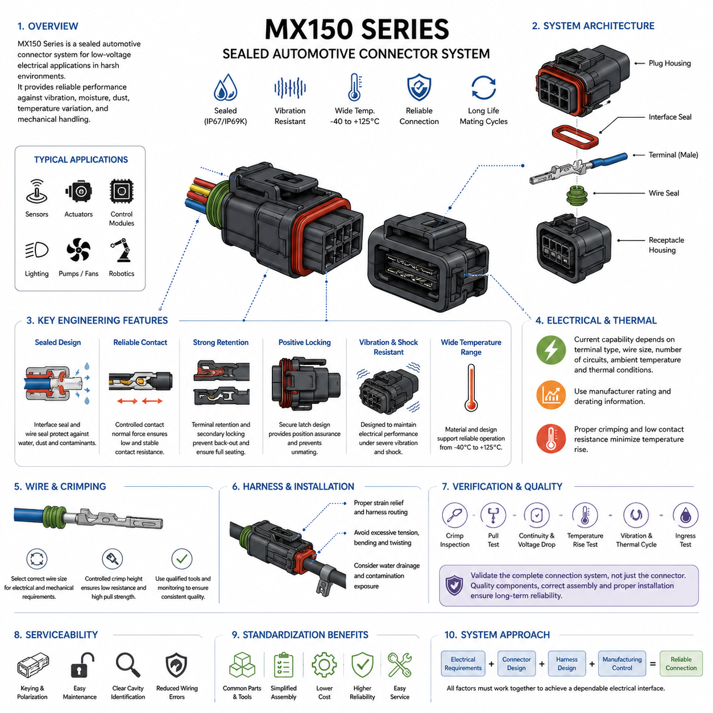
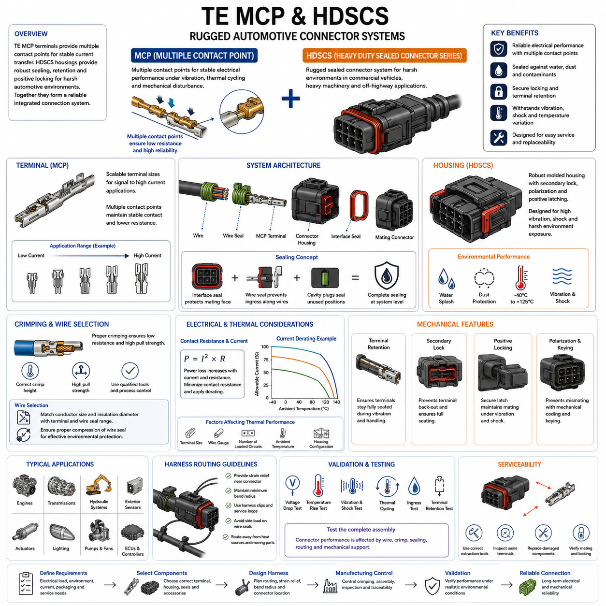
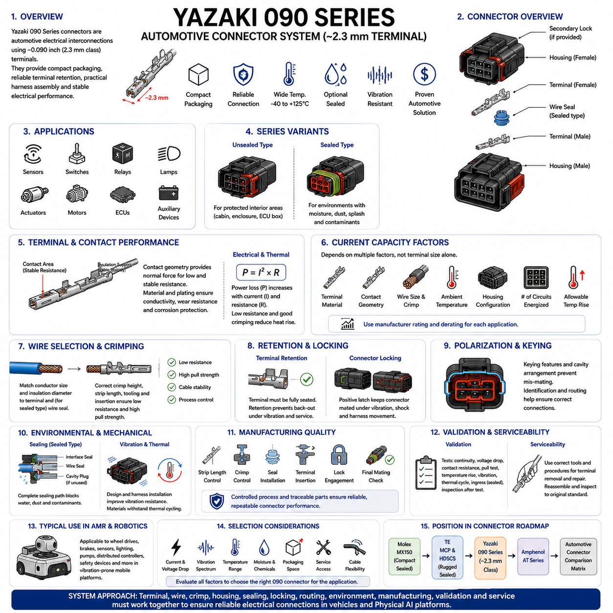
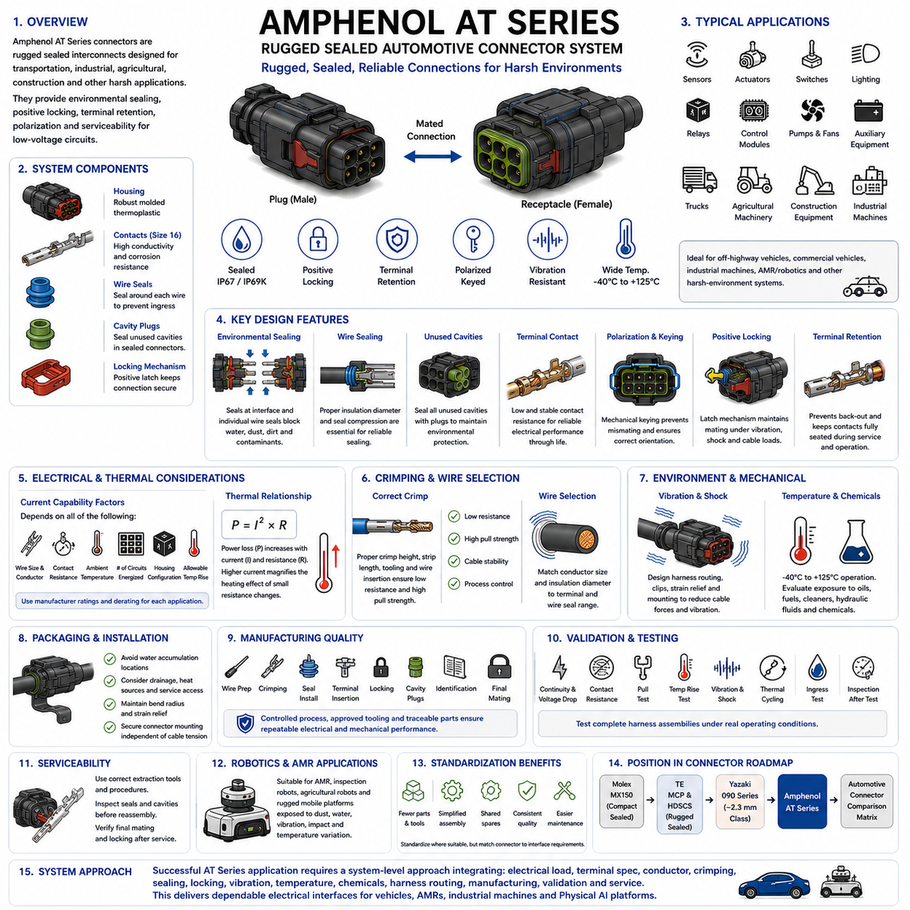
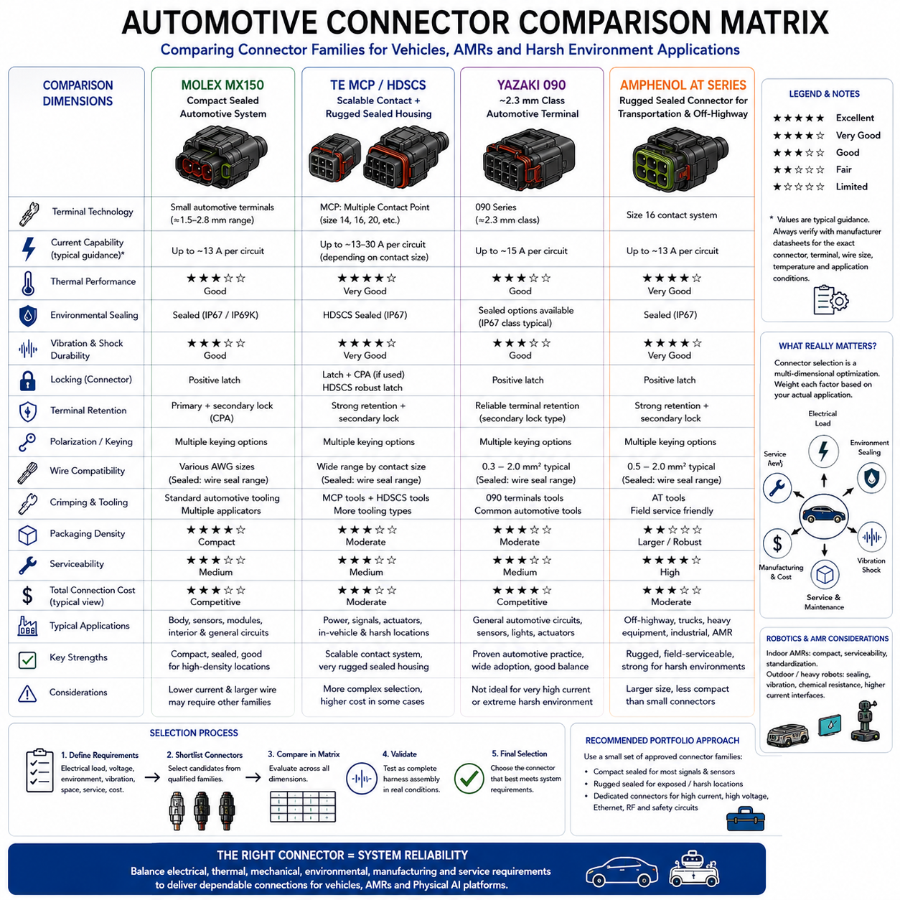

**Volume 03. Connector Engineering**

# Chapter 06. Automotive Connectors

## 06.01. Molex MX150 Series

{width="7.268055555555556in" height="7.268055555555556in"}

The Molex MX150 Series is a sealed automotive connector family designed for low-voltage electrical systems exposed to vibration, moisture, dust, temperature variation, and mechanical handling. Within connector engineering, it represents a practical example of how automotive terminals, housings, seals, and locking features are integrated into a compact connection system suitable for vehicles, mobile machinery, and rugged robotic platforms.

The MX150 architecture is based on compact 1.50 mm-class terminals packaged in molded connector housings with environmental sealing and positive mechanical retention. The system is available in multiple circuit configurations, allowing engineers to standardize one connector technology across sensors, actuators, control modules, lighting circuits, and auxiliary loads while selecting the appropriate cavity count for each interface.

A major engineering characteristic of the MX150 family is its sealed connection concept. Interface seals protect the mating region, while individual wire seals or equivalent rear sealing structures limit water and contaminant entry along conductor paths. When correctly assembled with compatible wire insulation diameters, terminals, seals, and housings, the connector can support electrical interfaces located in harsh automotive environments.

Environmental sealing should never be evaluated only by the connector family name. Actual protection depends on the complete assembled configuration, including housing variant, mating connector, wire seal size, cavity plugs, conductor insulation, terminal crimp quality, and engagement of locking features. Unused cavities must therefore be treated as potential leakage paths and sealed according to the specified connector configuration.

The terminal system is engineered around controlled contact normal force and stable electrical contact under vibration. When male and female contact surfaces mate, elastic contact features establish the mechanical pressure required to maintain a low-resistance conductive interface. Terminal geometry, material properties, plating, insertion alignment, and dimensional tolerances collectively determine the long-term stability of this electrical junction.

Current capability is not a single fixed property of an MX150 connector. Allowable current depends on terminal type, conductor size, ambient temperature, number of simultaneously loaded circuits, housing configuration, contact resistance, and thermal boundary conditions. Engineering selection must therefore use the applicable manufacturer rating and derating information rather than assigning one universal current value to every MX150 circuit.

Wire size selection is closely connected to both electrical and mechanical reliability. A conductor must satisfy voltage-drop and thermal requirements while remaining compatible with the terminal crimp range and rear sealing system. Selecting an oversized or undersized wire can produce poor conductor crimping, inadequate insulation support, seal deformation, excessive insertion force, or leakage even when the connector housing itself is correctly specified.

Crimping is consequently one of the most important manufacturing processes for an MX150 connection. The conductor crimp must provide low electrical resistance and sufficient mechanical pull strength, while the insulation support region must stabilize the cable without damaging it. Crimp height, conductor preparation, tooling condition, terminal positioning, and process monitoring should be controlled as production characteristics rather than left to visual inspection alone.

Terminal retention provides another layer of reliability. After a terminal is inserted into the housing, its retention feature must engage correctly so that normal mating, vibration, and harness loading cannot push or pull the terminal out of its intended position. Depending on the specific MX150 configuration, secondary locking or terminal-position-assurance features can provide additional confirmation that contacts are fully seated before final connector assembly.

Connector position assurance and positive latching are particularly important in mobile systems. A connector that appears physically joined but has not reached its final locked position can develop intermittent resistance, fretting, or complete electrical discontinuity during operation. Assembly procedures should therefore define an objective method for verifying full mating rather than relying solely on the operator\'s perception of insertion force.

The sealed housing also influences harness packaging. Cable exit direction, bend radius, branch location, connector orientation, and strain relief determine how external loads are transferred into the connector. A well-selected MX150 interface can still fail if the harness continuously pulls sideways on the housing or wire seals. Mechanical packaging must therefore isolate the connector from excessive tension, bending, torsion, and vibration-driven cable movement.

For automotive installations, connector orientation should be chosen with water drainage and contamination exposure in mind. Sealed does not mean that arbitrary installation is desirable. Locations directly exposed to pressure washing, standing water, mud accumulation, chemicals, or continuous thermal cycling require additional consideration of mounting position, harness routing, splash protection, and the environmental capability of the exact connector configuration.

Temperature influences both current capacity and material durability. Increasing ambient temperature reduces the available thermal margin for contact and conductor heating, while repeated hot-cold cycling can stress seals, plastics, terminal interfaces, and cable insulation. Engineers should therefore evaluate electrical load and environmental temperature together, particularly when connectors are installed near motors, power electronics, batteries, brakes, or enclosed electronic compartments.

Vibration performance depends on the connector as part of the complete harness assembly rather than on the housing alone. Relative motion between mating contacts can contribute to fretting wear and increasing contact resistance, while unsupported cable mass can repeatedly load the rear of the connector. Proper harness clipping, strain relief, connector mounting, and avoidance of resonance-sensitive routing are therefore essential companions to connector selection.

In robotic and AMR applications, MX150-type automotive connectors can be useful where conventional indoor electronic connectors provide insufficient environmental robustness. Mobile robots experience continuous vibration, floor impacts, battery-current transients, maintenance handling, dust, and occasional liquid exposure. Automotive connector technology therefore provides a useful design option for wheel modules, brakes, sensors, lamps, pumps, fans, and distributed controllers.

The MX150 family is especially appropriate when a robotics electrical architecture benefits from standardized sealed low-voltage interfaces. Standardization can reduce the number of terminal tools, spare components, service procedures, and assembly instructions required across a platform. However, connector standardization should not override electrical requirements; high-current traction, high-voltage, high-speed data, RF, or precision signal interfaces may require different connector technologies.

Serviceability is another reason for selecting a structured automotive connector family. Keying, polarization, locking mechanisms, cavity identification, and controlled terminal retention can reduce wiring errors during module replacement. In field-maintained robots, these characteristics can be more valuable than minimizing connector cost because incorrect reconnection, partially seated terminals, or damaged seals can produce failures that are difficult to reproduce during workshop diagnostics.

Design verification should evaluate the complete connector application rather than merely confirming that an MX150 part number appears on the bill of materials. Verification can include terminal crimp measurements, pull testing, continuity and voltage-drop measurements, temperature-rise testing, vibration exposure, thermal cycling, ingress testing, and post-test contact-resistance inspection. The exact validation program should reflect the robot or vehicle environment.

Manufacturing documentation should identify the complete compatible component set, including housing, mating housing, terminals, seals, cavity plugs, locking components, wire specifications, and approved tooling. Mixing visually similar components or using terminals outside their intended conductor range can defeat the original connector qualification. Traceable part-number control is therefore an important element of connector quality management.

For design engineers, the MX150 Series demonstrates that connector selection is a system-level engineering activity rather than a simple choice of pin count. Electrical load, contact physics, wire gauge, sealing, vibration, thermal derating, mating retention, harness routing, manufacturing capability, and service strategy interact at the same physical interface. The connector becomes reliable only when these requirements are satisfied simultaneously.

Within the automotive connector section of the connector engineering framework, the MX150 Series provides a useful reference point before comparing alternatives such as TE MCP/HDSCS, Yazaki 090, and Amphenol AT families. Its value is therefore not limited to one product family; it illustrates the broader engineering principles required to translate automotive connector technology into dependable electrical interfaces for AMRs and other Physical AI machines.

## 06.02. TE MCP and HDSCS

{width="7.268055555555556in" height="7.268055555555556in"}

TE Connectivity's MCP and HDSCS families represent two complementary approaches to rugged automotive electrical interconnection. MCP, or Multiple Contact Point technology, focuses primarily on the electrical and mechanical performance of the terminal interface, while HDSCS, or Heavy Duty Sealed Connector Series, provides sealed housings and connector architecture for harsh vehicle environments. Together they illustrate how terminals and housings form an integrated connection system.

MCP terminals are designed around multiple contact points between mating terminal surfaces. Instead of depending on a single localized electrical interface, the contact geometry establishes several conductive regions that help maintain stable current transfer under vibration, temperature cycling, and mechanical disturbance. This principle is particularly valuable in automotive systems where small variations in contact force or surface condition can influence long-term connection resistance.

The MCP concept is available across different terminal sizes rather than representing one universal contact dimension. Smaller contact systems can support signal and moderate-current circuits, while larger MCP terminal classes can address progressively higher electrical loads. This scalable terminal architecture allows designers to select contact technology according to conductor size, current requirement, packaging constraints, temperature conditions, and the intended vehicle function.

HDSCS is a rugged sealed connector system intended for electrical interfaces exposed to demanding environmental conditions. Its housings are commonly associated with commercial vehicles, construction and agricultural machinery, transportation equipment, and other heavy-duty applications. The architecture combines robust molded housings, environmental sealing, terminal retention, polarization, and positive mating features to create connections capable of operating outside protected electronic compartments.

An important relationship between MCP and HDSCS is that the terminal and housing should not be treated as independent components. The selected terminal must be compatible with the corresponding connector cavity, conductor range, sealing arrangement, and mating interface. Correct engineering therefore begins with the complete connection definition: electrical load, terminal size, wire specification, housing configuration, sealing components, locking features, and mating connector must all be considered together.

Environmental sealing in an HDSCS connection depends on several physical barriers. The connector interface must restrict moisture and contaminant entry at the mating face, while the cable side must prevent ingress around individual wires. Properly selected wire seals, correctly sized insulation diameters, cavity plugs for unused positions, and complete connector mating are therefore essential elements of environmental performance rather than secondary assembly details.

The rear sealing system requires especially careful coordination with wire selection. A seal designed for a particular insulation diameter range may not perform correctly when used with a substantially smaller or larger cable. Excessive compression can damage or deform the sealing element, while insufficient compression can create a leakage path. Wire gauge selection must therefore consider not only conductor area but also the actual insulation diameter and specified seal compatibility.

Terminal crimping forms the electrical and mechanical transition from the vehicle harness to the MCP contact system. The conductor crimp must create a low-resistance connection with adequate mechanical strength, while the insulation support region stabilizes the cable against vibration and handling loads. Correct crimp height, wire preparation, terminal positioning, approved tooling, and process control are fundamental to obtaining the performance expected from the connector system.

Contact resistance becomes increasingly important as circuit current increases. Electrical power dissipated at a connection is related to the square of current multiplied by resistance, so even a relatively small increase in terminal resistance can produce significant local heating in higher-current circuits. MCP terminal selection must therefore be combined with current derating, conductor sizing, ambient-temperature analysis, and evaluation of the number of simultaneously energized contacts.

The thermal capability of an HDSCS assembly cannot be represented by the theoretical current capacity of a terminal alone. Heat generated at the contact and conductor must be transferred through the terminal, wire, housing, and surrounding environment. Dense connector configurations containing several heavily loaded circuits may experience different temperatures from a connector in which only one contact carries substantial current, making application-specific thermal evaluation important.

Mechanical terminal retention is another essential feature of a reliable automotive connector. After crimped terminals are inserted into the housing, each contact must reach its intended seated position and remain there during mating, service, vibration, and harness movement. Secondary locking mechanisms can provide additional terminal-position control and reduce the possibility that an incompletely inserted terminal will move backward when the connector halves are joined.

Positive connector locking helps prevent unintended separation after mating. Heavy vehicles and mobile machinery can subject harnesses to sustained vibration, shock, cable movement, and maintenance handling. A secure latch or coupling mechanism must therefore maintain connector engagement throughout the service environment while still allowing controlled disconnection when maintenance is required. Proper mating verification should be incorporated into assembly and service procedures.

Polarization and keying help prevent incorrect connector mating. This becomes particularly valuable when several visually similar connectors are located near one another in a vehicle or robot. Mechanical coding, housing geometry, cavity arrangement, and connector identification can reduce cross-connection risk, but effective error prevention also requires harness documentation, labeling, routing discipline, and controlled configuration management during production.

HDSCS-type connectors are particularly useful when an electrical interface must operate in environments containing water splash, dust, mud, vibration, temperature variation, and repeated maintenance activity. Such conditions occur frequently around engines, transmissions, chassis systems, hydraulic equipment, exterior sensors, actuators, and distributed control units. Similar environmental demands also occur in outdoor autonomous vehicles and industrial mobile robots.

For AMR and Physical AI platforms, MCP and HDSCS technologies can provide a bridge between traditional automotive harness engineering and rugged robotics electrical architecture. They can be considered for wheel-drive assemblies, braking systems, pumps, cooling fans, lighting, auxiliary power circuits, distributed I/O, sensors, and controllers when sealed and mechanically secure connections are required. The exact application must still be validated against its electrical and environmental requirements.

Harness routing remains important even when a rugged connector is selected. Unsupported cable mass can transmit vibration directly into the connector, while tight bends near the rear seal can generate lateral forces on individual wires. Harness clips, appropriate service loops, minimum bend radius, strain relief, and controlled branch locations should be designed so that normal vehicle motion does not continuously load the connector interface.

Connector location and orientation should likewise be considered during packaging. Installing a sealed connector where water, mud, or chemicals can continuously accumulate may impose unnecessary environmental stress. Designers should consider drainage, splash direction, pressure washing, heat sources, moving components, service access, and potential mechanical impact. Environmental sealing should be treated as protection against expected exposure rather than permission for unrestricted placement.

Manufacturing quality is strongly linked to the reliability of MCP and HDSCS connections. Terminal crimp dimensions, conductor insertion, insulation position, wire-seal installation, terminal seating, secondary-lock engagement, and final connector mating should be controlled through defined assembly processes. Visual inspection can support quality control, but measurable characteristics such as crimp height, pull strength, electrical continuity, and contact resistance provide stronger process evidence.

Validation should evaluate the assembled electrical interface under conditions representative of its intended service. Depending on the application, this may include voltage-drop measurement, temperature-rise testing, vibration and mechanical shock, thermal cycling, ingress exposure, terminal retention, mating and unmating evaluation, and post-test contact-resistance measurement. Testing the complete harness assembly is particularly important because connector performance can be influenced by cable routing and mechanical support.

Service engineering should also be incorporated into connector selection. Rugged connectors may survive harsh operation but can still be damaged by incorrect terminal removal, inappropriate probing, contaminated seals, or improper reassembly. Service procedures should specify compatible extraction tools, inspection criteria, replacement components, sealing requirements, and mating verification so that a repaired connection retains the electrical and environmental performance of the original assembly.

From a system-engineering perspective, TE MCP and HDSCS demonstrate the relationship between contact technology and connector architecture. MCP addresses the controlled electrical interface at the terminal level, while HDSCS provides the mechanical, environmental, and packaging framework surrounding that interface. Reliable operation emerges from coordinating terminal size, conductor, crimp, seal, housing, retention, locking, routing, thermal loading, manufacturing, and validation rather than selecting any single component in isolation.

Within the automotive connector structure of this volume, TE MCP and HDSCS follow the Molex MX150 Series and precede the Yazaki 090 Series, Amphenol AT Series, and the final automotive connector comparison matrix. Their inclusion provides a useful heavy-duty reference for examining how scalable contact systems and sealed connector housings can be selected for automotive, commercial-vehicle, AMR, and other rugged Physical AI electrical architectures.

## 06.03. Yazaki 090 Series

{width="7.268055555555556in" height="7.268055555555556in"}

Yazaki 090 Series connectors represent a widely recognized class of automotive electrical interconnections built around approximately 0.090-inch, or 2.3 mm-class, terminal interfaces. They are commonly associated with vehicle wiring applications requiring compact packaging, dependable terminal retention, practical harness assembly, and stable electrical performance. The series provides a useful reference for understanding traditional automotive connector engineering.

The term "090 Series" primarily refers to the approximate terminal size rather than one single connector construction. Different 090-family connectors may use different housing geometries, circuit counts, sealing arrangements, terminal configurations, and locking mechanisms. Engineers must therefore identify the exact connector and terminal combination rather than assuming that all components described as 090 Series are mechanically or electrically interchangeable.

A typical Yazaki 090 connection consists of male and female terminals retained inside molded polymer housings. The housing establishes terminal alignment, electrical isolation, polarization, and mechanical protection while the terminal pair forms the conductive interface. Depending on the specific connector family and application, configurations may be available for unsealed interior environments or sealed locations exposed to moisture, dust, splash, and other contaminants.

The terminal contact interface must maintain sufficiently low and stable resistance throughout vehicle operation. Contact geometry generates the normal force required to establish conductive contact between mating surfaces, while terminal material and plating influence conductivity, wear behavior, corrosion resistance, and long-term stability. These characteristics become particularly important when vibration and repeated temperature changes produce microscopic movement at the contact interface.

Current capability depends on much more than the nominal 090 terminal dimension. Terminal material, contact geometry, conductor cross-sectional area, crimp quality, ambient temperature, housing configuration, number of simultaneously energized circuits, and allowable temperature rise all influence practical current capacity. Manufacturer specifications and application-specific derating should therefore be used instead of assigning one universal current rating to every 090 connector.

Contact resistance and thermal performance are closely related. Electrical loss at the terminal interface produces heat according to the relationship P = I²R, meaning that increasing current can magnify the thermal effect of relatively small resistance changes. Poor crimping, contamination, terminal wear, insufficient contact force, or incomplete mating can consequently produce localized heating and accelerate degradation of the connector system.

Wire selection must satisfy electrical requirements while remaining compatible with the terminal crimp range. Conductor size should support the required current and acceptable voltage drop, but insulation diameter and mechanical construction must also match the terminal and, for sealed versions, the corresponding wire seal. Selecting a wire solely from its current-carrying capacity can therefore create assembly or environmental problems at the connector interface.

Crimp quality is fundamental to reliable Yazaki 090 harness construction. The conductor crimp should compress the wire strands sufficiently to establish a stable low-resistance electrical joint without cutting or excessively damaging them. The insulation support should control cable movement without overstressing the insulation. Correct strip length, crimp height, terminal positioning, tooling condition, and conductor insertion should consequently be treated as controlled manufacturing parameters.

Terminal retention ensures that the contact remains correctly positioned after insertion into the connector housing. A terminal that is only partially seated can be pushed backward when the connector is mated, potentially creating intermittent contact or an open circuit. Primary terminal retention and, where provided by the specific connector design, secondary locking mechanisms help prevent terminal back-out during assembly, vibration, service, and normal vehicle operation.

Housing polarization and mechanical keying reduce the possibility of incorrect mating. Automotive harnesses often contain several connectors within a small installation area, making error prevention important during both production and maintenance. Connector shape, keying features, cavity arrangement, identification, and harness routing can collectively help ensure that each electrical interface is connected to the intended mating component.

Sealed 090 configurations require coordinated control of the entire sealing path. Interface seals protect the mating region, while individual wire seals or other rear sealing structures prevent contaminant entry along the wires. Any unused cavity may require an appropriate cavity plug. Incorrect seal selection, damaged sealing surfaces, improperly seated terminals, or incompatible insulation diameters can compromise environmental protection even when the housing itself is undamaged.

Unsealed versions remain useful where the connector is located inside a protected cabin, enclosure, or electronic compartment. Using a sealed connector everywhere can increase component count, assembly complexity, insertion force, packaging requirements, and cost without providing meaningful additional benefit. Connector selection should therefore reflect the actual environmental exposure rather than assuming that maximum sealing is always the optimum engineering solution.

Vibration resistance depends on both connector design and harness installation. Repeated relative motion at the terminal interface can contribute to fretting wear and increasing contact resistance, while unsupported cable mass can transfer dynamic loads into the housing and terminals. Proper clipping, strain relief, bend-radius control, and connector mounting should therefore be considered part of the connection design rather than separate harness-routing details.

Thermal cycling creates another important reliability challenge. Different materials within the connector, including copper-alloy terminals, plating layers, polymer housings, seals, and cable insulation, expand and contract differently as temperature changes. Repeated cycles can alter mechanical stresses and contact conditions over time. Qualification and application validation should therefore represent the expected operating temperature range and cycling severity.

Yazaki 090-type connectors can support numerous automotive circuits such as sensors, switches, relays, lamps, actuators, small motors, control units, and auxiliary electrical devices, depending on the exact connector and terminal specification. Their combination of moderate terminal size, established automotive construction practices, and broad configuration possibilities makes the 090 concept useful for studying practical low-voltage harness architecture.

Similar characteristics can also make 090-family connectors relevant to autonomous mobile robots and other Physical AI machines. AMRs often combine motors, brakes, sensors, safety devices, lighting, distributed controllers, and auxiliary mechanisms within a vibration-prone mobile platform. Automotive-style terminals and housings can provide more robust interfaces than lightweight indoor electronic connectors where mechanical durability and environmental resistance are important.

For robotics applications, however, automotive heritage alone does not guarantee suitability. Engineers must evaluate actual circuit current, voltage drop, mating frequency, vibration spectrum, temperature, moisture exposure, chemical exposure, packaging space, service access, and cable flexibility. Interfaces carrying high-speed Ethernet, RF signals, very high current, or high voltage normally require connector technologies specifically designed for those electrical characteristics.

Harness packaging strongly affects field reliability. Cable branches should approach the connector without excessive tension or sharp bending, and sufficient strain relief should prevent robot motion from repeatedly loading terminals or rear seals. Connector orientation should also consider water drainage, contamination accumulation, nearby heat sources, moving mechanisms, and maintenance access. Good packaging reduces environmental and mechanical stress before sealing features are required to resist it.

Manufacturing control should cover the complete connector assembly process. Terminal and wire compatibility, stripping dimensions, crimp dimensions, seal installation, terminal insertion, locking engagement, cavity plugging, connector identification, and final mating condition should be verified using defined procedures. Traceable part-number management is particularly important because visually similar automotive terminals and housings are not necessarily compatible.

Validation can include continuity testing, voltage-drop measurement, contact-resistance measurement, terminal pull testing, temperature-rise evaluation, vibration and mechanical shock testing, thermal cycling, environmental exposure, ingress testing for sealed versions, and inspection after testing. The validation level should correspond to the actual vehicle or robotic operating environment rather than relying only on the generic capability of the connector family.

Serviceability must also be considered throughout the connector life cycle. Maintenance personnel may need to disconnect housings, remove individual terminals, repair wires, or replace damaged seals. Correct extraction tools and procedures should be used because improvised probing or terminal removal can deform contact surfaces or retention features. A repaired connector should be inspected and reassembled to the same functional standard expected from the original harness.

Within automotive connector engineering, the Yazaki 090 Series provides an instructive contrast with the preceding Molex MX150 and TE MCP/HDSCS technologies. MX150 emphasizes a compact sealed automotive system, while MCP and HDSCS illustrate scalable contact technology combined with rugged sealed housings. The 090 family adds an important example of established 2.3 mm-class automotive terminal and housing practices before comparison with the Amphenol AT Series.

Ultimately, successful application of a Yazaki 090 connector depends on treating it as part of the complete electrical architecture rather than as an isolated component. Terminal size, current, conductor, crimp, plating, housing, sealing, locking, harness routing, environmental exposure, manufacturing process, validation, and service requirements must be coordinated. This system-level approach allows automotive connector technology to provide dependable interfaces for vehicles, AMRs, and rugged Physical AI platforms.

## 06.04. Amphenol AT Series

{width="7.268055555555556in" height="7.268055555555556in"}

Amphenol AT Series connectors are rugged sealed electrical interconnects developed for transportation, industrial, agricultural, construction, and other harsh-environment applications. Within automotive connector engineering, the AT family provides a useful example of a practical connector system combining environmental sealing, positive locking, terminal retention, polarization, and field-oriented serviceability for low-voltage electrical circuits.

The AT Series is commonly built around size 16 contact technology and is available in multiple circuit configurations. This architecture enables the same general connector family to support sensors, actuators, switches, lighting, control modules, auxiliary equipment, and distributed electrical devices. Designers can therefore standardize connector construction across numerous interfaces while selecting housing size and contact arrangement according to circuit requirements.

A typical AT connection consists of plug and receptacle housings, male and female contacts, environmental sealing elements, and mechanical retention features. The molded housings align the contacts and electrically isolate neighboring circuits, while the terminal pair creates the conductive interface. Mechanical polarization and keying help prevent incorrect mating, and the latch mechanism maintains engagement after the connector halves are fully joined.

Environmental protection is one of the defining characteristics of the AT Series. Sealing structures are intended to restrict water, dust, dirt, and other contaminants from reaching the electrical contact region. Reliable sealing nevertheless depends on the complete assembly, including mating condition, housing integrity, wire seals, conductor insulation diameter, unused cavity treatment, and correct terminal installation rather than on the housing alone.

Individual wire sealing requires coordination between the cable and connector system. The insulation diameter must remain within the applicable range for the sealing arrangement so that adequate compression is produced around the wire. A cable that is electrically suitable but mechanically incompatible with the seal can create leakage or assembly problems. Wire selection must consequently consider conductor area and insulation geometry together.

Unused connector cavities require particular attention in sealed applications. An open cavity can become a direct path for moisture or contamination into the connector interior, potentially defeating the protection provided by the remaining seals. Appropriate sealing plugs should therefore be installed where required by the connector configuration, and their presence should be included in manufacturing inspection and service procedures.

The electrical contact interface must provide stable, low resistance throughout the intended operating life. Contact geometry establishes the mechanical force between mating surfaces, while contact material, plating, dimensional tolerances, and surface condition influence electrical performance. Vibration, temperature cycling, contamination, and repeated mating can alter the interface over time, making contact stability an important part of connector reliability.

Current capability should not be determined solely from the connector family or nominal contact size. Practical allowable current depends on conductor size, terminal specification, contact resistance, ambient temperature, number of simultaneously loaded circuits, housing configuration, and acceptable temperature rise. Manufacturer application data and appropriate derating should therefore be applied to each electrical interface rather than assuming a universal AT Series rating.

Thermal behavior is closely related to connection resistance because power dissipated at the electrical interface follows P = I²R. As current increases, small increases in resistance can produce disproportionately greater heating. Poor crimping, incomplete terminal seating, contact damage, contamination, or degraded contact force can therefore become thermal reliability issues, particularly in circuits operating near their allowable current limits.

Crimping establishes the permanent electrical and mechanical connection between the harness conductor and terminal. A correctly formed conductor crimp provides low resistance and adequate pull strength without excessively damaging wire strands. The insulation support controls cable movement and reduces mechanical loading on the conductor crimp. Strip length, crimp dimensions, tooling, wire insertion, and terminal positioning must consequently be controlled during manufacturing.

Terminal retention prevents contacts from moving backward or leaving their intended position after insertion into the housing. Proper seating is essential because a partially inserted terminal may be displaced when the connector halves are mated. Primary retention features and associated locking components should therefore be checked during assembly. A simple electrical continuity test may not always reveal a terminal that is mechanically insecure but temporarily touching its mating contact.

Positive connector locking is especially important in mobile equipment exposed to vibration and shock. The latch must maintain the mechanical relationship between the plug and receptacle while allowing intentional disconnection during maintenance. Harness tension should not be used to maintain or oppose connector engagement. The connector should reach its designed locked condition independently of external cable forces and remain mechanically stable throughout operation.

Polarization and keying provide protection against mismating. This function becomes important when several similar connectors are installed close together around an engine, vehicle chassis, robot actuator module, or distributed controller. Mechanical coding should be supported by clear connector identification, harness routing, labeling, and configuration control so that manufacturing and service personnel can reliably restore every connection to its intended location.

Vibration durability is determined by both connector construction and harness integration. Even a rugged connector can experience excessive mechanical loading when a long unsupported cable repeatedly moves with vehicle or robot motion. Harness clips, appropriate bend radius, strain relief, connector mounting, and branch positioning should limit cable-generated forces. Mechanical design around the connector is therefore part of connector reliability engineering.

Temperature exposure affects terminals, housings, seals, cable insulation, and allowable current simultaneously. High ambient temperature reduces the thermal margin available for resistive heating, while repeated thermal cycling causes different connector materials to expand and contract at different rates. Application engineering should therefore evaluate operating temperature, current loading, nearby heat sources, enclosure conditions, and cycling severity as related design parameters.

Chemical exposure should also be considered in harsh mobile applications. Oils, fuels, cleaning agents, hydraulic fluids, road contaminants, and industrial chemicals may contact connectors depending on their installation location. The compatibility of housing polymers, seals, terminals, and cable insulation should be evaluated against the actual environment. Sealing against water alone does not automatically guarantee resistance to every chemical encountered in service.

The AT Series is particularly relevant to off-highway vehicles, agricultural machinery, construction equipment, trucks, industrial machines, and other systems where electrical interfaces operate outside highly protected enclosures. Typical circuits can include sensors, lamps, solenoids, pumps, fans, relays, controllers, and auxiliary actuators. The exact connector configuration should always be matched to the electrical load and environmental exposure of the application.

Similar characteristics make the AT family applicable to autonomous mobile robots and other Physical AI platforms operating in demanding environments. Outdoor AMRs, inspection robots, security robots, agricultural robots, and rugged mobile platforms can experience dust, water splash, vibration, impact, maintenance handling, and substantial temperature variation. Sealed automotive-style connectors can provide robust interfaces for distributed low-voltage equipment under these conditions.

Connector standardization can provide significant benefits in robotics electrical architecture. Using a controlled family for suitable low-voltage circuits can reduce the number of housings, terminals, seals, assembly tools, spare parts, and repair procedures maintained across a platform. Standardization must nevertheless remain subordinate to interface requirements; high-voltage power, high-speed communication, RF, and specialized safety circuits may require different connector technologies.

Packaging and connector orientation remain important even with environmental sealing. Engineers should avoid locations where water or mud can continuously accumulate and should consider drainage, pressure washing, heat sources, moving mechanisms, collision risk, and maintenance access. Cable exits should provide sufficient bend radius and strain relief. Good packaging reduces the environmental and mechanical loads that the connector must withstand throughout its life.

Manufacturing quality depends on controlling the complete connection process rather than merely installing the correct housing. Wire preparation, terminal selection, crimp height, conductor position, seal condition, terminal insertion, locking engagement, cavity plugs, connector identification, and final mating should be verified using defined procedures. Approved tooling and traceable component control help maintain repeatable electrical and mechanical performance.

Validation should represent the actual operating environment of the vehicle or robot. Appropriate testing can include continuity and voltage-drop measurements, contact-resistance evaluation, terminal pull testing, temperature-rise testing, vibration and mechanical shock, thermal cycling, environmental exposure, ingress testing, mating-cycle evaluation, and post-test inspection. Complete harness assemblies should be evaluated when routing and cable support can influence connector behavior.

Serviceability is an important characteristic of rugged electrical systems because connectors may be disconnected repeatedly during diagnostics, module replacement, or harness repair. Correct terminal extraction tools and replacement procedures should be specified to avoid damaging retention features or contact surfaces. Seals and cavities should be inspected for contamination or damage before reassembly, and final mating and locking should be verified after service.

Within the automotive connector chapter, the Amphenol AT Series complements the preceding Molex MX150, TE MCP/HDSCS, and Yazaki 090 examples. Together these families demonstrate different approaches to sealed housings, terminal technologies, packaging, heavy-duty construction, and serviceability. Their characteristics provide the technical foundation for the following automotive connector comparison matrix and systematic connector selection process.

Ultimately, successful AT Series application requires a system-level approach in which electrical load, terminal specification, conductor size, crimping, sealing, locking, vibration, temperature, chemical exposure, harness routing, manufacturing, validation, and service are engineered together. This coordinated approach allows rugged automotive connector technology to become a dependable electrical interface for vehicles, AMRs, industrial mobile machines, and Physical AI platforms.

## 06.05. Automotive Connector Comparison Matrix

{width="7.268055555555556in" height="7.268055555555556in"}

An automotive connector comparison matrix is a structured engineering tool used to compare connector families against the electrical, mechanical, environmental, manufacturing, and service requirements of a vehicle or mobile robotic platform. Within this chapter, the Molex MX150, TE MCP/HDSCS, Yazaki 090, and Amphenol AT families provide representative architectures for examining how different automotive connector concepts address similar system requirements.

The comparison should begin with connector architecture rather than manufacturer preference. Molex MX150 represents a compact sealed automotive connection system, TE MCP/HDSCS combines scalable contact technology with rugged sealed housings, Yazaki 090 represents established approximately 2.3 mm-class automotive terminal practices, and Amphenol AT emphasizes rugged sealed connections for transportation, industrial, agricultural, and off-highway environments.

Terminal technology provides one of the most important comparison dimensions because the terminal forms the actual electrical interface. Contact size, geometry, normal force, material, plating, conductor range, and retention mechanism influence resistance, current capability, vibration durability, and packaging density. A physically larger terminal may support demanding loads, while a smaller terminal can provide advantages where connector size and circuit density dominate.

Current rating should never be compared as a single headline value without understanding the associated test conditions. Allowable current depends on terminal specification, wire gauge, ambient temperature, number of simultaneously energized circuits, housing configuration, contact resistance, and permitted temperature rise. A meaningful matrix should therefore compare current capability together with the manufacturer's derating methodology and intended conductor range.

Thermal performance provides a second perspective on electrical capability. Since contact heating follows approximately P = I²R, increasing current magnifies the effect of connection resistance. Connector families intended for moderate or higher current circuits must therefore be evaluated for contact stability, wire size, circuit loading density, ambient temperature, and heat dissipation rather than selected solely according to nominal terminal dimensions.

Environmental sealing is another major comparison criterion. MX150, HDSCS, sealed Yazaki 090 configurations, and AT connectors can provide environmental protection when assembled using their intended sealing systems. Actual performance depends on the complete configuration, including interface seals, wire seals, cavity plugs, housing integrity, conductor insulation diameter, terminal seating, and complete mating. Sealing capability should therefore be compared at assembled-system level.

Not every application requires the highest available ingress protection. A connector installed inside a protected electronic enclosure has different requirements from one mounted beneath a vehicle, near a wheel module, or on an outdoor AMR. The comparison matrix should distinguish protected, splash-exposed, and severe outdoor environments so that environmental capability is matched to actual exposure rather than automatically maximizing sealing complexity and cost.

Vibration and mechanical shock requirements can significantly change connector selection. Mobile equipment transfers dynamic loads through housings, terminals, cable branches, and mounting structures. HDSCS and AT architectures are particularly associated with rugged applications, while MX150 and appropriate Yazaki 090 configurations can also support demanding automotive installations. Final suitability nevertheless depends on the exact product configuration and complete harness integration.

Terminal retention and secondary locking should be compared separately from external connector locking. Terminal retention prevents individual contacts from backing out of the housing, while connector locking maintains engagement between mating connector halves. Both mechanisms are essential because a connector can remain physically joined while an improperly seated terminal moves backward and creates an intermittent or open electrical circuit.

Polarization and keying become increasingly valuable as the number of similar connectors within a system grows. MX150, HDSCS, Yazaki 090, and AT architectures employ housing geometry and mechanical features to support correct mating, although implementation varies among specific configurations. A comparison should consider not only whether keying exists but also whether sufficient coding options are available for the intended harness architecture.

Wire compatibility is a critical selection dimension because connector reliability begins before the mating interface. Each terminal has an intended conductor range, while sealed connectors also impose requirements on insulation diameter. A comparison matrix should therefore include conductor size, insulation compatibility, wire-seal range, and available terminal variants. Electrical suitability alone is insufficient if the cable cannot be reliably crimped and environmentally sealed.

Crimping requirements influence manufacturing cost and quality capability. Each connector family requires compatible terminals, applicators, hand tools or production tooling, dimensional specifications, and inspection procedures. Introducing many unrelated connector systems can multiply tooling and training requirements. For high-volume production or standardized robot platforms, manufacturing commonality may therefore be as important as the purchase price of individual housings and terminals.

Packaging density provides another tradeoff. Compact connectors such as MX150 can be attractive where installation space is constrained, while larger rugged housings can offer advantages in handling, mechanical robustness, cable accommodation, and field service. Connector dimensions should therefore be evaluated together with wire exit geometry, bend radius, latch access, mating clearance, mounting space, and the physical environment surrounding the interface.

Serviceability can differentiate connector families even when their electrical performance is similar. Technicians must be able to identify connectors, release locks, inspect seals, remove terminals using appropriate extraction tools, repair wires, and verify correct reassembly. Larger rugged connectors may be easier to manipulate in field equipment, whereas compact systems can provide packaging advantages but may require greater care during terminal-level repair.

Component availability and supply-chain control should also be included in the comparison. A connector is not only a housing; production requires mating halves, male and female terminals, seals, plugs, secondary locks, tooling, and replacement components. An engineering organization should evaluate whether the complete component ecosystem can be sourced consistently and whether approved alternatives can be managed without uncontrolled mixing of nominally similar parts.

Cost comparison should consequently use total connection cost rather than housing price alone. Terminal cost, seals, cavity plugs, tooling, assembly time, inspection effort, harness packaging, inventory, service parts, and field reliability all contribute to lifecycle cost. A slightly more expensive connector may be economically preferable if it reduces assembly defects, environmental failures, service time, or the number of connector families maintained across the platform.

For conventional passenger-vehicle applications, compact packaging and high-volume manufacturing compatibility may carry substantial weight. For commercial vehicles, agricultural machinery, construction equipment, and off-highway systems, rugged mechanical construction and environmental protection can become more important. The comparison matrix should therefore change weighting according to application rather than declaring one connector family universally superior.

The same principle applies to autonomous mobile robots and Physical AI platforms. Indoor AMRs may prioritize compact packaging, serviceability, and standardized low-voltage interfaces, while outdoor inspection or security robots may place greater emphasis on water, dust, vibration, and chemical resistance. Heavy mobile robots can additionally require larger conductors and higher-current interfaces around drive, braking, battery, and auxiliary systems.

Molex MX150 can be considered when compact sealed automotive-style connections and platform standardization are important. Its architecture is well suited to examining interfaces where moderate packaging dimensions, environmental protection, positive locking, and structured terminal assembly must coexist. Selection still requires verification of the exact terminal, wire range, circuit loading, temperature, and environmental configuration rather than relying on the family designation alone.

TE MCP/HDSCS provides particular value when scalable terminal technology and rugged sealed housing architecture are desirable. MCP allows contact technology to be selected according to electrical requirements, while HDSCS provides the surrounding mechanical and environmental framework. This separation between contact capability and housing architecture makes the family useful for systems containing varied electrical loads within demanding vehicle or mobile-machine environments.

Yazaki 090 provides an established automotive reference based on approximately 2.3 mm-class terminal technology. Its relevance is strongest when proven automotive harness practices, moderate terminal size, available sealed or unsealed concepts, and conventional vehicle packaging are important. Because "090" covers a broader class of configurations, engineers must carefully confirm exact terminal, housing, sealing, and mating compatibility during selection.

Amphenol AT provides a strong reference for rugged sealed interfaces in transportation and off-highway applications. Its size 16 contact architecture, sealing approach, positive locking, terminal retention, and field-oriented construction can make it attractive for equipment exposed to dust, water splash, vibration, and repeated maintenance. Similar characteristics can be useful for outdoor AMRs and rugged industrial robotic systems.

A practical comparison matrix should therefore avoid a simplistic ranking such as first, second, third, and fourth. Connector selection is inherently multi-dimensional. One family may provide better packaging density, another may offer stronger heavy-duty characteristics, another may fit an existing automotive supply chain, and another may simplify field maintenance. The correct result depends on the weighting assigned to the requirements of the specific electrical interface.

For robotics standardization, the most effective strategy is often to define a small approved connector portfolio rather than force every circuit into one family. A compact sealed family can cover many sensor and control interfaces, a rugged family can support exposed modules, and dedicated technologies can remain available for high current, high voltage, Ethernet, RF, and safety-critical connections. This approach reduces unnecessary variety without compromising interface requirements.

The final selection process should combine electrical load, voltage drop, temperature, vibration, sealing, chemical exposure, wire range, circuit count, packaging, locking, mating cycles, manufacturing tooling, supply chain, cost, and serviceability. Candidate connectors should then be validated as complete harness assemblies under representative operating conditions. The matrix narrows the design space, but physical validation confirms whether the selected connection actually satisfies the application.

Within the connector engineering structure, this comparison matrix completes the automotive connector chapter by integrating the preceding studies of Molex MX150, TE MCP/HDSCS, Yazaki 090, and Amphenol AT. Its central engineering lesson is that connector selection is not a brand comparison but a system-level optimization problem in which electrical, thermal, mechanical, environmental, manufacturing, lifecycle, and service requirements must be balanced simultaneously.
