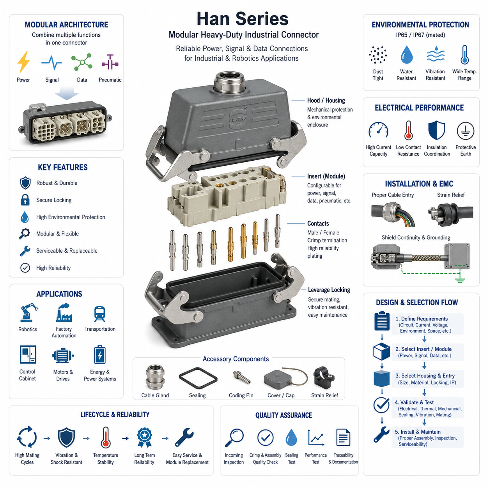
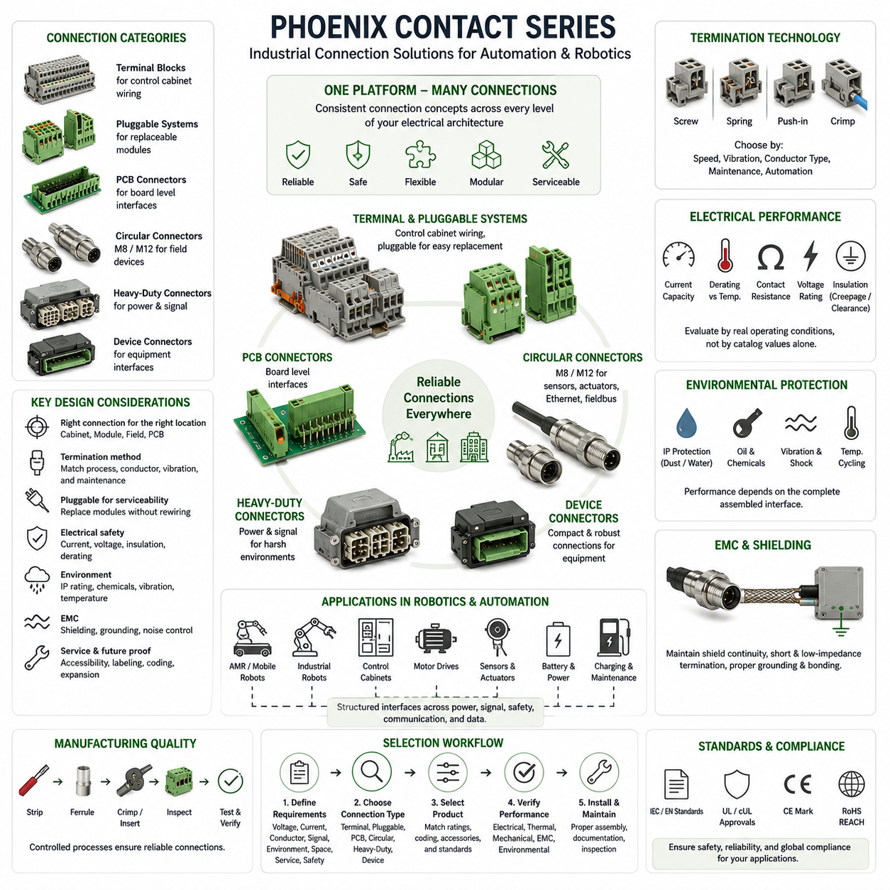
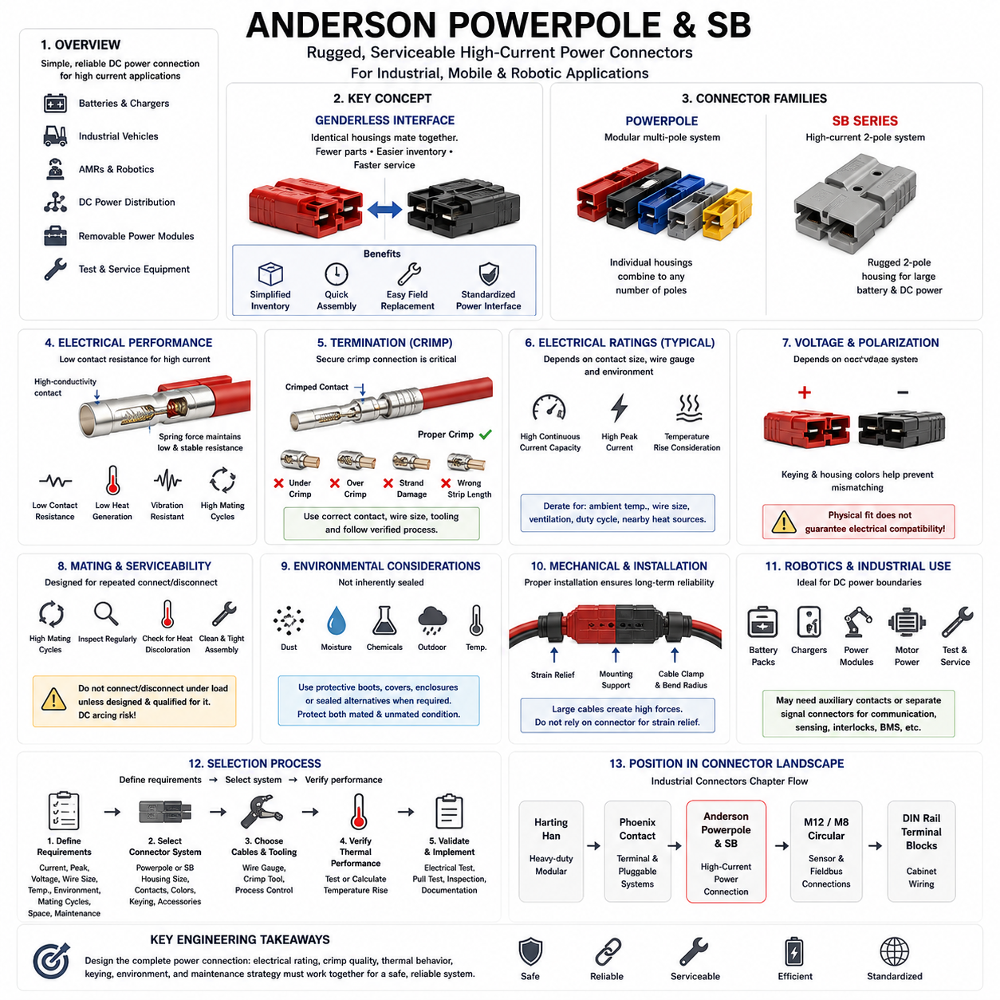
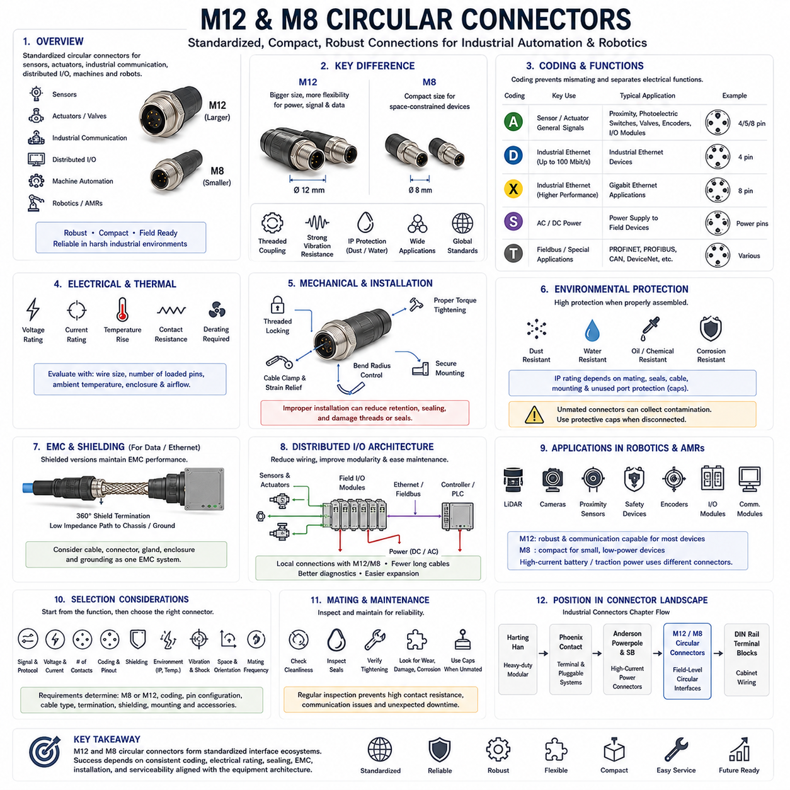
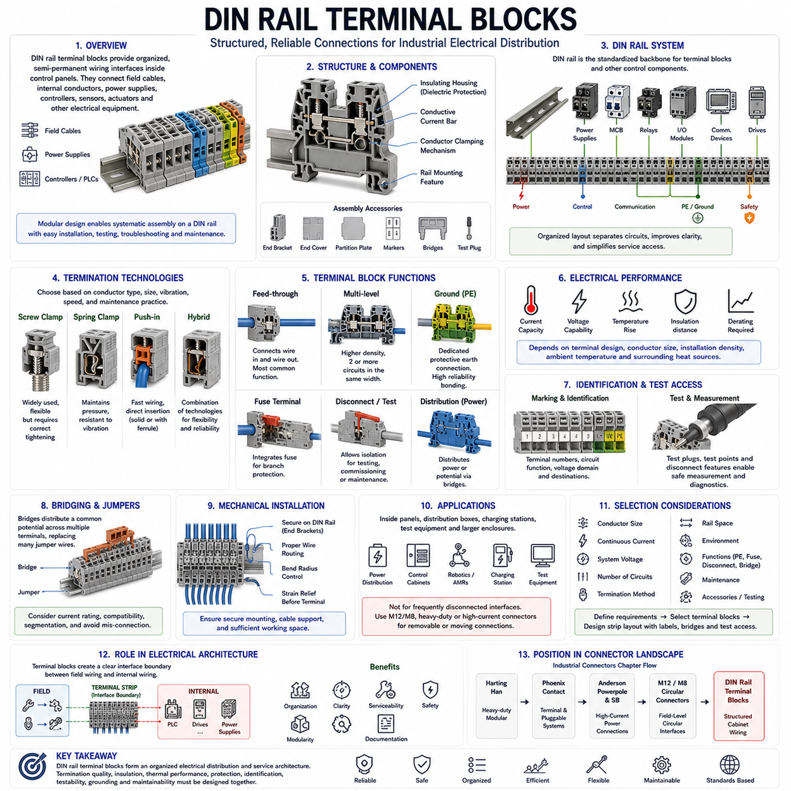

**Volume 03. Connector Engineering**

# Chapter 07. Industrial Connectors

## 07.01. Harting Han Series

{width="7.268055555555556in" height="7.268055555555556in"}

Harting Han 시리즈(Harting Han Series)는 기계류, 공장 자동화(factory automation), 운송 장비, 로보틱스(robotics), 분산형 전기 시스템(distributed electrical systems)에서 사용되는 대표적인 직사각형 산업용 커넥터(rectangular industrial connector) 제품군이다. 산업용 커넥터 아키텍처(industrial connector architecture)에서 Han 커넥터는 케이블, 장비 모듈, 제어반(control cabinet), 모터, 액추에이터(actuator), 현장 장치(field device) 사이에 기계적으로 견고하면서 정비가 용이한 인터페이스(interface)를 제공한다. 핵심적인 특징은 단일 커넥터 사양이 아니라 전력, 신호, 통신 및 환경 요구조건에 따라 전기적 인터페이스를 구성할 수 있는 모듈형 플랫폼 개념(modular platform concept)에 있다.

일반적인 Han 커넥터 어셈블리(connector assembly)는 하나의 성형 부품이 아니라 서로 연계되는 여러 구성요소로 이루어진다. 인터페이스는 일반적으로 후드 또는 하우징(hood or housing), 하나 이상의 인서트(insert), 수·암 접점(male and female contact), 케이블 인입 부품(cable-entry hardware), 밀봉 부품(sealing component), 잠금 메커니즘(locking mechanism)으로 구성된다. 이러한 분리형 구조를 통해 엔지니어는 설치 환경에 적합한 외함(enclosure)을 선택하면서 전기적 요구조건에 맞는 인서트와 접점을 별도로 선정할 수 있다. 따라서 선택된 커넥터 제품군의 범위 안에서 기계적 패키징(mechanical packaging)과 전기적 구성을 독립적으로 최적화할 수 있다.

직사각형 금속 또는 폴리머 하우징(polymer housing)은 기계적 보호 기능을 제공하고 물리적인 결합 인터페이스(mating interface)를 형성한다. 산업 환경에서는 커넥터가 진동, 충격, 먼지, 수분, 오일, 취급 하중 및 반복적인 유지보수 작업에 노출되므로 외함 설계가 특히 중요하다. 레버 방식 잠금 구조(lever-operated locking arrangement)는 제어된 기계적 체결력을 제공하면서 복잡한 공구 없이 장비를 분리할 수 있어 중부하 직사각형 커넥터(heavy-duty rectangular connector)에 널리 사용된다. 올바른 잠금은 운전 중 밀봉 압축(sealing compression)과 안정적인 접점 결합 상태를 유지하는 데에도 기여한다.

Han 인서트(Han insert)는 커넥터 내부에서 전기 회로가 어떻게 구성되는지를 결정한다. 선택된 구성에 따라 하나의 인서트는 전력 도체(power conductor), 제어 신호(control signal), 계측 회로(instrumentation circuit), 통신 인터페이스 또는 이들의 조합을 수용할 수 있다. 따라서 Han 시리즈는 단순히 핀 수(pin count)만으로 선정하는 커넥터와 근본적으로 다르다. 엔지니어는 인서트를 선정하기 전에 도체 크기, 정격 전류(rated current), 전압, 접점 배열, 절연 협조(insulation coordination), 온도, 오염 조건 및 관련 표준을 검토해야 한다. 그러므로 커넥터 용량은 단순한 카탈로그 정격값이 아니라 설계된 운전 영역(engineered operating envelope)으로 다루어야 한다.

Han 개념의 특히 중요한 특징은 모듈성(modularity)이다. 모듈형 커넥터 아키텍처(modular connector architecture)는 하나의 직사각형 외함 내부에 서로 다른 기능의 인터페이스를 결합하여 기계 경계부에 필요한 개별 커넥터 수를 줄일 수 있다. 호환되는 부품을 적절히 선정하면 전력 접점(power contact), 신호 접점(signal contact), 공압 인터페이스(pneumatic interface), 데이터 통신용 모듈(data-oriented module)을 하나의 모듈형 프레임(modular frame)에 통합할 수 있다. 로보틱스에서는 로봇 베이스, 매니퓰레이터(manipulator), 툴 모듈(tool module), 배터리 서브시스템 또는 보조 장비 사이의 여러 기능을 하나의 관리 가능한 접속 지점으로 통합할 수 있다.

접점 기술(contact technology)은 하우징과 동일한 수준의 주의를 기울여 선정해야 한다. 접촉 저항(contact resistance), 접촉 수직력(normal force), 도체 단말 처리(conductor termination), 도금(plating), 결합 수명(mating cycle), 오염 및 진동은 장기적인 전기 신뢰성에 영향을 미친다. 크림프 단말(crimp termination)은 생산 일관성과 내진동성이 중요한 경우 특히 유용하며, 설치 중심의 응용에서는 다른 단말 기술도 적용할 수 있다. 초기 상태에서 전류 요구조건을 만족하는 커넥터라도 단말 품질이 저하되거나 접점 표면이 오염되고 기계적 하중으로 접점 건전성이 감소하면 열적 위험(thermal risk)이 발생할 수 있다.

전류 정격(current rating)은 열적 조건(thermal condition)과 분리하여 해석해서는 안 된다. 접점 및 단말 저항을 통해 전류가 흐르면 열이 발생하며, 커넥터 하우징과 주변 환경은 이 열이 얼마나 효과적으로 방출되는지를 결정한다. 높은 주변 온도(ambient temperature), 고밀도 인서트, 동시에 부하가 걸리는 많은 접점, 밀폐된 설치 공간 및 인접 열원은 실제 사용 가능한 전류 용량을 감소시킬 수 있다. 따라서 Han 커넥터가 지속적으로 작동하는 산업 장비나 로봇 장비에서 높은 전력을 전달한다면 온도 상승 검증(temperature-rise verification)과 적절한 디레이팅(derating)이 필수적이다.

환경 보호(environmental protection) 성능은 완전히 조립된 전체 인터페이스에 의해 결정된다. 특정 방진·방수 등급(ingress-protection capability)의 하우징을 선택했다고 해서 실제 설치된 커넥터가 자동으로 동일한 성능을 확보하는 것은 아니다. 정확한 결합, 잠금, 케이블 글랜드(cable gland) 선정, 씰(seal) 상태, 케이블 직경, 미사용 인입구 처리, 장착 형상 및 설치 작업 품질이 최종 성능에 모두 영향을 미친다. 이러한 원리는 산업용 커넥터 선정이 앞에서 다룬 환경 등급(environmental rating) 및 방수 설계(waterproofing engineering)와 직접적으로 연계되어 있음을 보여준다.

기계적 설치(mechanical installation) 역시 중요하다. 스트레인 릴리프(strain relief)가 충분하지 않으면 케이블에 작용하는 힘이 직접 단말부로 전달될 수 있기 때문이다. 케이블 글랜드와 관련 인입 부품은 케이블 재킷(cable jacket)을 과도하게 압축하지 않으면서 적절한 고정력, 밀봉 및 굽힘 관리 기능을 제공해야 한다. 하네스 라우팅(harness routing)은 커넥터 출구에서 지속적인 횡방향 하중이 발생하지 않도록 설계하고 유지보수를 위한 충분한 여유 길이를 확보해야 한다. 이동형 로봇 장비에서는 충돌, 반복적인 굽힘, 제어되지 않는 케이블 움직임 및 작업자가 케이블을 손잡이처럼 사용하는 위치를 피하도록 커넥터를 배치해야 한다.

산업용 커넥터는 전자기 적합성(electromagnetic compatibility, EMC) 전략에도 참여한다. 전도성 하우징(conductive housing)은 커넥터, 케이블 실드(cable shield), 글랜드, 외함 및 접지 개념을 하나의 시스템으로 설계할 경우 실드 연속성(shield continuity)을 확보하는 데 기여할 수 있다. 그러나 단순히 금속 커넥터 하우징을 사용한다고 해서 효과적인 EMC 성능이 보장되는 것은 아니다. 부적절한 실드 단말, 긴 접지 경로, 불충분한 외함 본딩(enclosure bonding), 부적합한 케이블 인입 부품으로 발생한 불연속부를 통해 고주파 간섭(high-frequency interference)이 유입될 수 있다. 따라서 모터 드라이브, 인버터, 스위칭 전원 공급 장치, 이더넷(Ethernet), 엔코더(encoder) 및 민감한 센서 신호에는 커넥터와 실드의 통합 설계가 필요하다.

로보틱스 응용에서 Han 제품군은 극단적인 소형화보다 신뢰성, 모듈 교체성(modular replacement), 정비성(serviceability)이 중요한 서브시스템 경계(subsystem boundary)에 특히 적합하다. 자율이동로봇(Autonomous Mobile Robot, AMR)이나 산업용 로봇에서는 전력 분배 어셈블리(power distribution assembly), 모터 드라이브 구획, 배터리 관련 모듈, 외부 충전 장비, 매니퓰레이터 또는 탈착식 보조 시스템 사이에 중부하 직사각형 커넥터를 사용할 수 있다. 이러한 인터페이스를 적용하면 대형 어셈블리를 개별적으로 제작하고 시험한 후 최종 시스템에 통합할 수 있으며, 현장에서는 다수의 내부 배선을 개별적으로 분리하지 않고 모듈을 교체할 수 있다.

주요 트레이드오프(tradeoff)는 패키징(packaging)이다. 중부하 산업용 직사각형 커넥터는 강력한 기계적 보호 성능과 높은 구성 유연성을 제공하지만, 소형 자동차용 커넥터 또는 기판용 커넥터(board-oriented connector)에 비해 상당히 큰 공간과 질량을 요구할 수 있다. 따라서 소형 관절, 경량 엔드 이펙터(end effector), 소형 센서 헤드(sensor head), 고밀도 전자장치에는 적합하지 않을 수 있다. 커넥터 선정은 물리적 위치와 기능적 경계에 따라 이루어져야 하며, 주요 장비 경계에는 중부하 모듈형 인터페이스가 유리하고 소형 로봇 어셈블리 내부에서는 보다 작은 커넥터 기술이 적합하다.

정비성(serviceability)은 이러한 커넥터 등급을 채택하는 가장 중요한 아키텍처적 이유 중 하나이다. 잘 설계된 인터페이스는 교체 가능한 모듈 사이에 명확한 전기적 경계(electrical boundary)를 형성하고, 정비 담당자가 여러 단자를 개별적으로 해체하거나 관련 없는 배선을 건드리지 않고 서브시스템을 분리할 수 있도록 한다. 잘못된 재연결을 방지하기 위해 키잉(keying), 코딩(coding), 라벨링(labeling), 접점 위치 관리 및 문서화된 핀 할당(pin assignment)을 사용해야 한다. 특히 보호 접지(protective earth)와 안전 관련 회로(safety-related circuit)는 커넥터 교체 과정에서 본딩(bonding), 절연 또는 설계된 안전 아키텍처가 손상되지 않도록 특별히 관리해야 한다.

따라서 커넥터 선정은 선호하는 Han 하우징 크기에서 시작하는 것이 아니라 시스템 요구조건(system requirement)에서 시작해야 한다. 엔지니어는 먼저 인터페이스를 통과하는 모든 회로에 대해 전압, 최대 및 연속 전류, 도체 크기, 신호 종류, 통신 요구조건, 보호 접지, 실드, 환경 노출, 결합 빈도, 사용 가능한 설치 공간 및 정비 요구조건을 정의해야 한다. 이러한 요구사항을 바탕으로 고정형 인서트(fixed insert)와 모듈형 아키텍처 중 적절한 방식을 결정하고 접점, 단말 방식, 외함 재질, 케이블 인입 구조, 잠금 구성 및 환경 보호 방식을 선정할 수 있다.

검증(validation)은 실제 장비에서 예상되는 조건을 재현해야 한다. 응용 환경의 심각도에 따라 전기적 연속성(electrical continuity), 절연 성능, 보호 접지 건전성, 온도 상승, 접촉 저항, 기계적 유지력, 진동 거동, 밀봉 및 반복 결합 성능 등을 검증해야 한다. 특히 하나의 외함 내부에 여러 고전류 회로가 집중되거나 커넥터가 모터, 인버터, 배터리 또는 기타 열원 가까이에 설치되는 경우 시험의 중요성이 더욱 커진다. 생산 검사에서는 크림프 품질, 접점 삽입 상태, 밀봉 부품, 코딩 및 잠금 동작도 추가적으로 확인해야 한다.

전체 커넥터 엔지니어링(connector engineering) 구조에서 Harting Han 시리즈는 앞 장에서 다룬 자동차용 커넥터(automotive connector) 제품군에 대응하는 산업용 커넥터의 대표 사례이며, 이후 다루는 Phoenix Contact 시리즈, Anderson Powerpole/SB, M12/M8 원형 커넥터(circular connector), DIN 레일 단자대(DIN-rail terminal block)와 비교하기 위한 기반을 제공한다. 핵심적인 엔지니어링 관점은 Han 인터페이스를 단순한 케이블 부속품이 아니라 전기적, 기계적, 환경적, EMC, 제조 및 정비 특성을 함께 설계해야 하는 구성 가능한 전기기계 서브시스템(configurable electromechanical subsystem)으로 취급해야 한다는 것이다.

## 07.02. Phoenix Contact Series

{width="7.268055555555556in" height="7.268055555555556in"}

Phoenix Contact 커넥터 기술(Phoenix Contact connector technologies)은 제어반(control cabinet), 기계 설비, 공장 자동화(factory automation), 로보틱스(robotics), 에너지 시스템(energy system), 분산형 입출력 아키텍처(distributed I/O architecture) 전반에서 사용되는 광범위한 산업용 인터커넥션 플랫폼(industrial interconnection platform)을 구성한다. 산업용 커넥터 엔지니어링(industrial connector engineering) 관점에서 Phoenix Contact는 현장 배선(field wiring), 장치 연결(device connection), PCB 인터페이스(PCB interface), 플러그형 단자 시스템(pluggable terminal system), 산업용 원형 커넥터(industrial circular connector)까지 포괄한다. 이러한 폭넓은 제품 구조를 통해 각각의 인터페이스를 별개의 커넥터 문제로 처리하기보다 전기 아키텍처의 여러 계층에서 일관된 연결 개념을 유지할 수 있다.

단일 하우징 형상으로 정의되는 하나의 커넥터 제품군과 달리 Phoenix Contact 솔루션은 서로 다른 설치 경계(installation boundary)에 최적화된 여러 인터커넥션 범주(interconnection category)를 포함한다. 여기에는 단자형 커넥터(terminal-oriented connector), 플러그형 연결 시스템(pluggable connection system), PCB 단자대(PCB terminal block), 산업용 원형 커넥터, 중부하 인터페이스(heavy-duty interface), 장치 연결 기술(device connection technology) 등이 포함된다. 따라서 엔지니어링 관점의 핵심은 제어반 내부, 장비 모듈 사이, 센서 또는 액추에이터(actuator), PCB, 정비 가능한 현장 연결부 등 인터페이스가 존재하는 위치에 따라 적절한 연결 원리(connection principle)를 선정하는 것이다.

기본적인 설계 고려사항 중 하나는 도체를 접점 시스템(contact system)에 연결하는 단말 기술(termination technology)이다. 나사 체결(screw), 스프링(spring), 푸시인(push-in), 크림프(crimp) 및 관련 연결 방식은 설치 속도, 내진동성, 도체 준비, 정비성(serviceability), 제조 자동화(manufacturing automation) 사이에서 서로 다른 특성을 제공한다. 특히 푸시인 기술(push-in technology)은 적절히 준비된 도체를 나사를 반복적으로 조이지 않고 직접 삽입할 수 있어 산업 배선에서 유용하다. 그러나 도체 종류, 페룰(ferrule) 사용 여부, 도체 단면적 범위, 피복 제거 길이(stripping length), 설치 절차는 선택된 단자의 사양과 일치해야 한다.

스프링 기반 연결 원리(spring-based connection principle)는 수동으로 가해지는 나사 토크에 전적으로 의존하지 않고 탄성 메커니즘(elastic mechanism)을 통해 접촉력을 유지한다. 따라서 진동이나 온도 사이클링(temperature cycling)이 존재하는 환경에서는 작은 치수 변화를 수용하면서 도체 압력을 유지할 수 있다는 장점이 있다. 반면 나사 연결(screw connection)은 기존 현장 작업 방식, 작업자의 높은 숙련도 또는 특정 도체 구성이 중요한 경우 여전히 유용하다. 어느 한 방식이 모든 상황에서 절대적으로 우수한 것은 아니며, 단말 기술은 제조 공정, 유지보수 전략, 진동 노출, 도체 특성 및 필요한 검사 절차를 고려하여 선정해야 한다.

플러그형 단자 시스템(pluggable terminal system)은 영구 배선(permanent wiring)과 교체 가능한 전자 모듈(replaceable electronic module) 사이에 중요한 연결 구조를 제공한다. 컨트롤러(controller), 전원 공급 장치(power supply), I/O 모듈 또는 서브시스템을 교체할 때 개별 도체를 하나씩 분리하는 대신 플러그를 통해 배선 하네스(wiring harness)를 장비에서 분리할 수 있다. 이러한 아키텍처는 장치 교체 과정에서 현장 배선을 유지하면서 유지보수 시간을 크게 줄이고 배선 오류를 감소시킬 수 있다. 유사한 커넥터가 서로 가까이 배치될 경우 작업자가 전기적으로 호환되지 않는 인터페이스에 잘못 연결하지 않도록 코딩(coding)과 극성화(polarization)를 적용해야 한다.

PCB 연결 기술(PCB connection technology)은 동일한 아키텍처 원리를 전자 어셈블리(electronic assembly)까지 확장한다. 기판 장착형 헤더(board-mounted header)와 단자 인터페이스를 통해 외부 배선을 컨트롤러, 전력전자 장치(power electronics), 통신 장치, 센서 인터페이스 및 분산형 제어 모듈(distributed control module)에 직접 연결할 수 있다. 선정 과정에서는 PCB 전류 경로(current path), 핀 간격(pin spacing), 연면거리(creepage distance), 공간거리(clearance distance), 도체 크기, 기계적 하중 및 삽입력을 고려해야 한다. 고전류 커넥터를 사용하더라도 PCB의 구리 전류 경로가 충분하지 않다면 이를 보완할 수 없으므로 상당한 전력이 기판 경계를 통과하는 경우 커넥터 정격과 회로기판 열 설계(thermal design)는 분리할 수 없다.

산업용 원형 커넥터(industrial circular connector)는 특히 센서, 액추에이터, 이더넷(Ethernet), 필드버스(fieldbus), 분산형 I/O에서 사용되는 또 하나의 주요 인터페이스 범주이다. M8 및 M12 형식은 표준화된 기계적 인터페이스를 통해 장비 교체와 시스템 통합을 단순화할 수 있기 때문에 소형 기계 수준 연결(machine-level connectivity)에 널리 사용된다. 서로 다른 코딩 방식(coding arrangement)은 전력과 통신 기능을 구분하고 호환되지 않는 연결을 방지한다. 로봇 장비에서는 센서 클러스터(sensor cluster), 모터 피드백 시스템(motor feedback system), 분산형 I/O 장치, 안전 부품 및 주변 장치에서 소형화와 견고한 현장 연결이 요구될 때 특히 유용하다.

전기적 성능(electrical performance)은 카탈로그 정격만으로 판단하지 않고 실제 운전 조건을 기준으로 평가해야 한다. 연속 전류, 도체 단면적, 동시에 부하가 인가되는 접점 수, 접촉 저항(contact resistance), 주변 온도(ambient temperature), 외함 조건 및 인접 열원이 실제 열적 성능을 결정한다. 고밀도 제어반은 개방된 실험실 시험 환경과 상당히 다른 조건을 형성할 수 있다. 따라서 특히 전력 분배 커넥터(power distribution connector), 모터 회로, DC 전력 인터페이스 및 최대 정격 전류 부근에서 지속적으로 운전되는 소형 다극 커넥터에는 적절한 디레이팅(derating)이 필요하다.

전압 선정에도 동일한 수준의 주의가 필요하다. 정격 전압(rated voltage)은 단순히 절연 재료에 의해서만 결정되는 것이 아니라 접점 간격, 연면거리, 공간거리, 오염도(pollution degree), 설치 환경 및 적용 표준과 관련된다. 산업 장비에서는 오염, 응축(condensation), 전도성 먼지 또는 과도 과전압(transient overvoltage)이 발생하여 실질적인 절연 요구조건을 변화시킬 수 있다. 따라서 엔지니어는 커넥터를 선정하기 전에 전기적 환경을 정의해야 하며, 물리적으로 유사한 커넥터가 도체 용량이나 외형 치수가 비슷하다는 이유만으로 동일한 절연 성능을 제공한다고 가정해서는 안 된다.

Phoenix Contact 인터페이스가 보호된 제어반 외부에서 기계 또는 로봇 환경으로 이동할수록 환경 보호(environmental protection)의 중요성이 증가한다. 먼지, 물, 오일, 냉각수(coolant), 세척 화학물질, 진동, 기계적 충격 및 온도 사이클링은 전기적·기계적 신뢰성에 영향을 미칠 수 있다. 인터페이스의 방진·방수 보호(ingress protection)는 결합 부품, 씰(seal), 케이블 글랜드(cable gland), 케이블 직경, 장착면 및 미사용 포트를 포함하는 완전히 조립된 시스템에 의해 결정된다. 명목상 밀폐형 커넥터라도 설치 세부사항이 설계된 밀봉 형상(sealing geometry)을 유지하지 못하면 본래의 보호 성능을 잃을 수 있다.

기계적 신뢰성(mechanical reliability)은 케이블 관리(cable management)에도 크게 의존한다. 커넥터 접점이 스트레인 릴리프(strain relief)의 역할을 대신해서는 안 되며, 외부 케이블 하중은 힘이 단말 영역에 도달하기 전에 제어되어야 한다. 적절한 라우팅(routing), 클램핑(clamping), 굽힘 반경(bend radius), 서비스 루프(service loop), 케이블 인입 부품을 적용하면 진동이나 유지보수 작업으로 인해 도체 단말에 반복적인 하중이 발생하는 것을 방지할 수 있다. 이는 가속, 섀시 진동, 관절 운동 및 반복 정비로 인해 고정식 산업 설비보다 복잡한 하중 조건이 발생할 수 있는 이동형 로봇과 매니퓰레이터에서 특히 중요하다.

커넥터가 고속 통신 신호를 전달하거나 모터, 인버터(inverter), DC/DC 컨버터(DC/DC converter), 스위칭 전원 공급 장치 및 기타 노이즈 발생원 주변에서 사용될 경우 전자기 적합성(electromagnetic compatibility, EMC)을 고려해야 한다. 실드형 커넥터 시스템(shielded connector system)은 장비 경계를 가로질러 케이블 실드 연속성(shield continuity)을 유지할 수 있지만 실제 성능은 전체 접지 및 본딩 아키텍처(grounding and bonding architecture)에 의해 결정된다. 고주파에서는 일반적으로 긴 피그테일(pigtail) 방식보다 짧고 낮은 임피던스의 실드 단말이 유리하다. 따라서 커넥터 선정은 케이블 구조, 외함 본딩, 보호 접지(protective earth), 신호 접지 및 EMC 구역화(EMC zoning)와 함께 검토해야 한다.

로봇 시스템에서 Phoenix Contact 기술은 서로 다른 여러 아키텍처 계층을 지원할 수 있다. 제어반 단자 시스템은 내부 전력 및 I/O 분배를 구성하고, 플러그형 인터페이스는 교체 가능한 컨트롤러 또는 전력 모듈을 구성하며, 원형 커넥터는 현장에 장착된 센서와 액추에이터를 연결할 수 있다. 이러한 구분을 통해 커넥터 기술이 로봇의 물리적 계층 구조(physical hierarchy)를 따르도록 설계할 수 있다. 예를 들어 자율이동로봇(Autonomous Mobile Robot, AMR)은 배터리, 전력 분배 장치(Power Distribution Unit, PDU), 모터 드라이브, 엣지 컴퓨터(edge computer), 안전 장치, 인지 센서(perception sensor), 외부 충전 또는 유지보수 장비 사이에 정비 가능한 인터페이스를 필요로 할 수 있다.

정비성(serviceability)은 전기 아키텍처가 완성된 이후 추가하는 것이 아니라 초기 인터페이스 설계에 포함되어야 한다. 유지보수를 위한 커넥터는 접근하기 쉬워야 하고 명확하게 라벨링되어야 하며, 필요한 경우 기계적으로 구별되고 안정적인 핀 할당(pin assignment)이 문서화되어야 한다. 코딩을 적용하면 잘못된 상호 결합(cross-mating)을 방지할 수 있으며, 모듈형 플러그를 사용하면 영구 배선을 변경하지 않고 어셈블리를 교체할 수 있다. 예비 접점과 향후 확장성도 신중히 고려해야 하는데, 불필요한 대형화는 패키징 요구조건을 증가시키는 반면 용량 부족은 센서나 기능이 추가될 때 비용이 큰 커넥터 재설계를 유발할 수 있다.

신뢰성 높은 커넥터 하드웨어라도 불량한 조립 공정을 보완할 수 없기 때문에 제조 품질(manufacturing quality) 역시 중요하다. 도체 피복 제거, 페룰 설치, 크림핑(crimping), 삽입 깊이, 필요한 경우 나사 토크, 배선 식별 및 인장력 검증(pull-force verification)은 정의된 생산 절차를 통해 관리되어야 한다. 생산량이 충분한 경우 자동 또는 반자동 배선(automated or semi-automated wiring)을 통해 일관성을 향상시킬 수 있다. 검사 기준은 외관뿐 아니라 전기적 연속성, 유지력, 절연, 극성, 코딩 및 중요 조립 공정의 추적성(traceability)까지 포함해야 한다.

따라서 선정 과정은 먼저 인터페이스 경계(interface boundary)와 기능 요구조건(functional requirement)을 식별하는 것에서 시작해야 한다. 엔지니어는 회로 전압, 연속 및 피크 전류, 도체 범위, 신호 또는 통신 유형, 실드, 환경 노출, 진동, 결합 빈도, 사용 가능한 공간, 조립 방식, 정비 요구조건 및 관련 안전 제약조건을 정의해야 한다. 이러한 조건을 충분히 이해한 후에 단자대(terminal block), 플러그형 커넥터(pluggable connector), PCB 인터페이스, 원형 커넥터 또는 기타 Phoenix Contact 솔루션을 선정해야 한다. 이를 통해 익숙한 제품이라는 이유나 외형만을 기준으로 커넥터가 선정되는 것을 방지할 수 있다.

전체 커넥터 엔지니어링(Connector Engineering) 볼륨의 산업용 커넥터(industrial connector) 장에서 Phoenix Contact는 Harting Han 시리즈(Harting Han Series) 다음에 위치하며, 이후 Anderson Powerpole/SB, M12/M8 원형 커넥터, DIN 레일 단자대(DIN-rail terminal block)가 이어진다. 이러한 구조는 Phoenix Contact를 하나의 상호 교환 가능한 단일 제품군으로 설명하기보다 다양한 산업용 연결 철학(industrial connection philosophy)을 비교하기 위한 대상으로 배치한다. 핵심적인 엔지니어링 관점은 Phoenix Contact 기술을 단순한 배선 부품이 아니라 단말 방식, 전류 용량, 절연, 환경 조건, EMC 특성, 제조 공정 및 정비 전략을 시스템 수준에서 통합적으로 설계하기 위한 전기 인터페이스 구성요소(building block)로 이해하는 것이다.

## 07.03. Anderson Powerpole / SB

{width="7.268055555555556in" height="7.268055555555556in"}

Anderson Powerpole 및 SB 커넥터(Anderson Powerpole and SB connectors)는 비교적 높은 전류를 단순하고 견고하며 정비가 용이한 인터페이스(interface)를 통해 안정적으로 전달해야 하는 응용 분야에서 널리 사용되는 산업용 전력 연결 시스템(industrial power interconnection system)이다. 산업용 커넥터 엔지니어링(industrial connector engineering)에서 이러한 커넥터는 특히 배터리, 충전기, DC 전력 분배(DC power distribution), 물류 장비(material-handling equipment), 이동형 로봇, 산업용 차량 및 탈착식 전기 모듈에 적합하다. 이들의 아키텍처는 고밀도 신호 통합보다 낮은 저항의 전력 접점과 실용적인 현장 연결에 중점을 둔다.

많은 Anderson 커넥터 설계의 특징은 무성별 또는 자웅동체형 결합 인터페이스(genderless or hermaphroditic mating interface)를 사용한다는 점이다. 기존 방식처럼 별도의 수·암 커넥터 하우징을 사용하는 대신, 기계적 구성과 전기적 정격이 일치하면 호환되는 동일한 하우징끼리 서로 결합할 수 있다. 따라서 관리해야 하는 커넥터 종류가 줄어들어 재고 관리, 케이블 조립, 유지보수 및 현장 교체를 단순화할 수 있다. 이러한 개념은 충전기, 배터리 팩 및 차량 사이에 표준화되고 상호 교환 가능한 전력 인터페이스가 필요한 배터리 구동 장비에서 특히 유용하다.

Powerpole 커넥터(Powerpole connector)는 개별 모듈형 하우징(modular housing)을 기계적으로 결합하여 다극 배열(multi-pole arrangement)을 구성할 수 있다. 이를 통해 설계자는 비교적 단순한 커넥터 아키텍처를 유지하면서 회로 요구조건에 맞는 전력 인터페이스를 구성할 수 있다. 하우징 구성과 색상은 회로 식별 및 극성화(polarization)를 보조할 수 있지만 색상만으로 문서화된 배선 정의를 대체해서는 안 된다. 부적절한 하우징 방향이나 호환되지 않는 부품을 사용하면 의도된 키잉(keying) 전략이 무력화되고 현장에서 잘못 연결될 가능성이 증가할 수 있으므로 정확한 기계적 조립이 중요하다.

SB 제품군(SB family)은 다른 패키징 개념(packaging concept)을 사용하며 일반적으로 비교적 큰 2극 배터리 및 DC 전력 연결에 사용된다. 성형 하우징(molded housing)은 주요 전력 접점을 하나의 기계적으로 견고한 인터페이스에 통합하여 반복적인 연결과 분리에 적합하도록 구성된다. 서로 다른 하우징 크기와 구성은 다양한 전류 및 도체 요구조건을 지원하므로 SB라는 명칭을 하나의 보편적인 전기 정격으로 해석해서는 안 된다. 엔지니어는 실제 응용조건에 따라 구체적인 커넥터 크기, 접점, 도체 범위 및 액세서리 구성을 선정해야 한다.

Powerpole 및 SB 시스템의 전기적 성능(electrical performance)은 접점 인터페이스(contact interface)에 크게 좌우된다. 고전류 커넥터는 전류가 증가함에 따라 작은 저항도 상당한 열을 발생시키므로 낮고 안정적인 접촉 저항(contact resistance)이 필요하다. 접점 형상, 스프링력(spring force), 도전성 재료, 도금(plating), 표면 상태 및 결합 품질이 실제 전기적 인터페이스를 결정한다. 적절히 설계된 접점 시스템은 운전 중 충분한 접촉 수직력(normal force)을 유지하면서 진동, 반복 결합, 오염 또는 기계적 마모로 인한 저항 증가를 제한해야 한다.

크림프 단말(crimp termination)은 고전류 접점과 도체를 연결하는 데 일반적으로 사용된다. 신뢰성 높은 크림핑(crimping)을 위해서는 접점, 도체 단면적, 절연 피복 준비 및 공구를 하나의 검증된 시스템으로 취급해야 한다. 커넥터 자체의 정격이 적절하더라도 잘못된 크림프는 과도한 저항을 발생시킬 수 있다. 불완전한 도체 삽입, 부적절한 공구, 부족하거나 과도한 압착, 손상된 소선(strand), 잘못된 피복 제거는 기계적 유지력을 감소시키고 국부 발열(localized heating)을 증가시킬 수 있다. 따라서 생산 공정에서는 관리된 공구와 적절한 검사 또는 인장력 검증(pull-force verification)을 적용해야 한다.

전류 정격(current rating)은 도체 크기 및 열적 환경(thermal environment)과 함께 해석해야 한다. 커넥터 카탈로그 정격값은 일반적으로 정의된 시험 조건에 기반하며 모든 실제 설치 구성을 자동으로 대표하지 않는다. 주변 온도, 케이블 게이지(cable gauge), 접촉 저항, 외함 환기, 듀티 사이클(duty cycle), 인접 열원 및 연속 부하와 간헐 부하의 차이가 실제 온도 상승에 영향을 준다. 배터리 구동 로봇과 산업용 차량에서는 장시간 지속 전류뿐 아니라 가속 과정에서 단시간의 피크 전류가 발생할 수 있으므로 정상상태(steady-state)와 과도상태(transient)의 전기 부하를 모두 고려해야 한다.

주요 응용 분야가 고전류 DC 전력 분배라고 하더라도 전압 용량(voltage capability)은 중요한 엔지니어링 제약조건이다. 접점 간격, 절연 형상, 오염, 설치 환경 및 관련 안전 요구조건에 따라 특정 전압 시스템에 대한 커넥터의 적합성이 결정된다. 설계자는 초저전압 로봇 전력 네트워크(extra-low-voltage robotic power network)와 더 높은 전압의 배터리 아키텍처를 명확히 구분해야 한다. 특히 유사한 커넥터 형식으로 서로 다른 전압의 장비가 연결될 가능성이 있는 경우 물리적 호환성을 전기적 호환성으로 해석해서는 안 된다.

동일한 시설에서 여러 배터리 또는 전력 회로를 사용할 경우 커넥터 극성화(connector polarization)와 키잉이 필수적이다. 기계적 구성은 서로 호환되지 않는 전압, 배터리 화학계(battery chemistry), 충전 회로 또는 기능 버스(functional bus)가 실수로 상호 연결되는 것을 방지해야 한다. 하우징 색상은 유용한 시각적 식별 수단이지만 기계적 비호환성(mechanical incompatibility)과 문서화된 인터페이스 관리(interface control)가 더욱 강력한 보호 수단을 제공한다. 특히 로봇 플릿(robotics fleet)에서는 장비 수명 동안 다양한 작업자가 배터리, 충전기, 서비스 장비 및 교체 모듈을 취급할 수 있으므로 표준화된 커넥터 정의가 중요하다.

배터리를 수동으로 교환하거나 충전 장비를 자주 연결하는 응용에서는 반복 결합(repeated mating)이 중요한 고려사항이다. 모든 결합 사이클(mating cycle)은 접점 표면과 하우징 인터페이스에 일정한 기계적 마모를 발생시킨다. 접점 마모, 오염, 스프링력 감소, 하우징 손상 또는 이물질은 시간이 지나면서 접촉 저항을 증가시킬 수 있다. 따라서 유지보수 프로그램에서는 이러한 상태가 실제 운전 고장으로 발전하기 전에 변색, 변형, 느슨함, 피팅(pitting), 과열 흔적 및 비정상적인 삽입·분리 특성이 있는지 고빈도 전력 커넥터를 점검해야 한다.

전체 인터페이스가 해당 운전 조건을 위해 특별히 설계되고 검증되지 않았다면 상당한 전류가 흐르는 상태에서 전력 커넥터를 임의로 분리해서는 안 된다. DC 전류를 차단하면 전기 아크(electrical arc)가 발생할 수 있으며, DC는 매 주기마다 자연적인 전류 영점 교차(current zero crossing)가 없기 때문에 동일한 조건의 AC 아크보다 소호가 어려울 수 있다. 따라서 통전 상태에서 연결 또는 분리될 가능성이 있다면 시스템 아키텍처에서 커넥터와 접촉기(contactor), 프리차지 회로(precharge circuit), 충전 제어, 인터록(interlock) 또는 운용 절차를 함께 설계해야 한다.

환경 노출(environmental exposure)은 전류 용량과 별도로 검토해야 한다. 견고한 고전류 커넥터라고 해서 자동으로 밀폐형 커넥터(sealed connector)가 되는 것은 아니다. 먼지, 수분, 전도성 오염물질, 부식, 산업용 화학물질 및 옥외 환경은 접점 표면과 절연 성능에 영향을 줄 수 있다. 로봇이나 차량이 가혹한 환경에서 운용되는 경우 보호 부츠(protective boot), 커버, 외함, 적절한 장착 방향 또는 다른 밀폐형 커넥터 기술이 필요할 수 있다. 환경 보호 성능은 결합된 운전 상태뿐 아니라 분리된 정비 상태에서도 평가해야 한다.

기계적 장착과 케이블 라우팅(cable routing)은 장기적인 신뢰성에 큰 영향을 미친다. 대전류용 대구경 케이블은 높은 강성과 질량으로 인해 특히 이동형 장비에서 상당한 힘을 발생시킬 수 있다. 이러한 힘이 커넥터 접점이나 하우징으로 지속적으로 전달되어서는 안 된다. 적절한 스트레인 릴리프(strain relief), 케이블 클램프, 굽힘 반경 관리(bend-radius control), 서비스 루프(service loop), 장착 지지를 통해 기계적 응력을 줄여야 한다. AMR, 지게차, 이동형 플랫폼 및 배터리 카트에서는 섀시 진동, 반복적인 배터리 이동, 충격 및 작업자의 취급 조건도 추가적으로 고려해야 한다.

많은 SB 응용의 단순한 2도체 아키텍처(two-conductor architecture)는 이러한 커넥터를 배터리 인터페이스에 특히 적합하게 한다. 탈착식 로봇 배터리는 배터리 팩과 차량 전력 분배 시스템 사이에 표준화된 고전류 커넥터를 사용할 수 있으며, 호환되는 인프라를 통해 충전 또는 정비 작업을 지원할 수 있다. 그러나 현대의 배터리 시스템에서는 통신, 온도 감지, 식별, 인터록 또는 배터리 관리 시스템(Battery Management System, BMS) 신호가 추가로 필요한 경우가 많다. 선택된 시스템 아키텍처에 따라 이러한 기능에는 보조 접점(auxiliary contact)이나 별도의 신호 커넥터가 필요할 수 있다.

따라서 로보틱스에서 Anderson 계열 전력 커넥터(Anderson-style power connector)는 전기적 경계가 고밀도 센싱이나 통신보다 DC 에너지 전달에 집중되는 위치에서 가장 유용하다. 배터리 팩, 충전 스테이션, 탈착식 전력 모듈, 모터 전력 분배, 시험 장비 및 임시 서비스 연결에 적용할 수 있다. 반면 이더넷(Ethernet), CAN, 안전 신호, 실드 및 다수의 저전류 회로가 필요한 센서 집약형 모듈의 전체 인터페이스로는 일반적으로 적합하지 않다. 이러한 경계에는 하이브리드 아키텍처(hybrid architecture) 또는 별도의 전용 신호 커넥터가 필요할 수 있다.

선정 과정에서는 먼저 연속 전류, 피크 전류, 시스템 전압, 도체 단면적, 예상 온도, 결합 빈도, 환경 노출, 사용 가능한 패키징 공간 및 유지보수 방식을 정의해야 한다. 이후 호환되는 하우징, 접점, 케이블 크기, 액세서리 및 공구를 하나의 통합된 연결 시스템(integrated connection system)으로 선정해야 한다. 실제 운전 조건이 커넥터의 실질적인 전류 한계에 가까운 경우에는 열적 검증(thermal verification)이 권장되며, 특히 주변 온도가 높고 공기 흐름이 제한되는 밀폐형 배터리 구획이나 높은 듀티 사이클의 이동형 로봇에서는 더욱 중요하다.

산업용 커넥터(Industrial Connectors) 장에서 Anderson Powerpole 및 SB는 Harting Han과 Phoenix Contact에 이어 배치되며, 이후 M12/M8 원형 커넥터(circular connector)와 DIN 레일 단자대(DIN-rail terminal block)가 이어진다. 이러한 구성은 서로 다른 산업용 연결 철학(industrial connection philosophy)을 보여준다. Powerpole 및 SB 시스템은 복합 기능의 모듈성이나 제어반 배선 유연성을 극대화하기보다 견고하고 낮은 저항을 가지며 정비가 용이한 전력 전달에 중점을 둔다. 이들의 엔지니어링 가치는 전기 정격, 크림프 품질, 열적 거동, 키잉, 환경 보호 및 유지보수 전략을 전체 전력 아키텍처(power architecture)의 일부로 통합하여 설계할 때 가장 효과적으로 확보된다.

## 07.04. M12/M8 Circular Connectors

{width="7.268055555555556in" height="7.268055555555556in"}

M12 및 M8 원형 커넥터(M12 and M8 circular connectors)는 센서, 액추에이터(actuator), 산업용 통신(industrial communication), 분산형 입출력(distributed I/O), 기계 자동화(machine automation), 로보틱스(robotics)에서 널리 사용되는 표준화된 산업용 연결 시스템(standardized industrial connection system)이다. 소형 원형 구조, 규정된 결합 형상(mating geometry), 견고한 기계적 구조를 갖추고 있어 기존 제어반용 커넥터가 지나치게 크거나 충분한 보호 성능을 제공하기 어려운 현장 수준 전기 인터페이스(field-level electrical interface)에 적합하다. 산업용 커넥터 엔지니어링에서 제어 장비와 기계 또는 이동형 로봇 플랫폼에 직접 설치되는 분산형 장치를 연결하는 중요한 역할을 수행한다.

M12와 M8 커넥터의 기본적인 차이는 물리적 크기와 그 크기를 통해 구현할 수 있는 응용 범위에 있다. M12 커넥터는 더 큰 나사식 인터페이스(threaded interface)를 사용하며 일반적으로 전력, 신호 및 산업용 통신 연결에서 높은 구성 유연성을 제공한다. M8 커넥터는 더 작으며 소형 센서, 미니어처 액추에이터(miniature actuator), 공간 제약이 있는 장비에 주로 사용된다. 그러나 커넥터 직경만으로 전기적 성능이 결정되는 것은 아니며 접점 배열, 코딩(coding), 도체 크기, 전압, 전류 및 환경 등급(environmental rating)을 함께 평가해야 한다.

이러한 커넥터 제품군의 주요 장점 중 하나는 표준화(standardization)이다. 표준화된 기계적 인터페이스를 사용하면 서로 다른 장비 생태계의 호환 장치, 케이블, 센서 및 I/O 모듈을 각각의 기계마다 고유한 커넥터 아키텍처를 개발하지 않고 통합할 수 있다. 이는 모듈형 장비 설계(modular equipment design)를 지원하고 산업 환경에서 부품 교체를 단순화한다. 그러나 동일한 M12 또는 M8 형식을 사용한다고 해서 반드시 호환되는 것은 아니며 핀 수, 코딩, 전기적 기능, 통신 프로토콜(communication protocol), 실드(shielding), 커넥터 성별(gender)이 구현 방식에 따라 크게 달라질 수 있다.

코딩(coding)은 M12 커넥터 엔지니어링에서 가장 중요한 개념 중 하나이다. 서로 다른 기계적 코딩 구조(mechanical coding arrangement)를 사용하여 전기적 기능을 구분하고 잘못된 결합 가능성을 줄인다. 커넥터 시스템에 따라 코딩은 일반적인 센서 및 액추에이터 배선을 이더넷(Ethernet), 필드버스(fieldbus), 전력 응용과 구별하는 역할을 한다. 따라서 코딩 시스템은 기계적 호환성 메커니즘(mechanical compatibility mechanism)이면서 동시에 아키텍처적 분류 방법(architectural classification method)의 역할을 수행한다. 엔지니어는 외부의 원형 형상만으로 커넥터를 식별하지 말고 핀 할당(pin assignment)과 코딩을 함께 확인해야 한다.

A-코드 M12 커넥터(A-coded M12 connector)는 일반적인 센서 및 액추에이터 인터페이스와 범용 산업 신호에 널리 사용된다. 근접 센서(proximity sensor), 광전 센서(photoelectric sensor), 스위치, 밸브, 엔코더(encoder), 분산형 I/O 장치를 제어 시스템에 연결해야 하는 자동화 장비에서 흔히 볼 수 있다. 그러나 익숙한 커넥터를 사용한다고 해서 동일한 회로 정의를 보장하는 것은 아니므로 각 응용에 대한 핀 할당을 반드시 확인해야 한다. 대형 기계나 로봇 플릿(robot fleet)에 수백 개의 현장 장치가 존재하는 경우 표준화된 배선 방식의 가치가 더욱 커진다.

산업용 이더넷(Industrial Ethernet)의 도입으로 데이터 통신에 최적화된 추가적인 M12 코딩 방식이 등장하였다. D-코드 커넥터(D-coded connector)는 전통적으로 산업용 이더넷 구현과 연관되어 있으며, X-코드 M12 커넥터(X-coded M12 connector)는 보다 높은 성능의 이더넷 연결에 적합하도록 분리된 접점 그룹(contact group)을 제공한다. 다른 코딩 시스템도 다양한 산업용 통신 아키텍처를 지원한다. 이러한 응용에서는 기본적인 전기적 연속성과 환경 보호뿐 아니라 임피던스 특성, 페어 배열(pair arrangement), 실드, 케이블 카테고리(cable category), 대역폭 및 전자기 적합성(electromagnetic compatibility, EMC)을 함께 고려해야 한다.

전력용 M12 변형(power-oriented M12 variant)은 원형 커넥터 개념을 저전류 센싱 및 통신 영역에서 전력 전달 영역까지 확장한다. 전력 코딩 구조(power coding arrangement)는 규정된 전기적 범위 내에서 DC 또는 AC 전력 분배를 위해 기계적으로 구별된 인터페이스를 제공한다. 이를 통해 분산형 I/O 모듈, 소형 드라이브, 액추에이터, 컨트롤러 및 기계 서브시스템에 소형 표준 커넥터를 통해 전력을 공급할 수 있다. 서로 다른 전력 코딩 변형은 상호 교환할 수 없으므로 설계자는 구체적인 코딩, 접점 정격, 도체 크기, 전압 및 관련 표준을 반드시 확인해야 한다.

M8 커넥터는 패키징 밀도(packaging density)가 중요한 제약조건인 환경에서 특히 중요한 역할을 한다. 소형 센서와 액추에이터를 더 큰 산업용 커넥터보다 훨씬 적은 설치 공간으로 연결할 수 있다. 이러한 특성은 로봇 엔드 이펙터(robot end effector), 소형 매니퓰레이터(compact manipulator), 센서 배열(sensor array), 컨베이어 장비, 공작기계 및 분산형 자동화 시스템에 유용하다. 크기가 작기 때문에 특히 작업자가 제한된 공간에서 작업해야 하는 경우 케이블 라우팅(cable routing), 커넥터 접근성, 체결 및 기계적 보호를 신중하게 고려해야 한다.

기계적 잠금(mechanical locking)에는 일반적으로 나사식 결합(threaded coupling)이 사용되지만 특정 제품군에서는 다른 형태의 퀵 잠금 메커니즘(quick-locking mechanism)을 제공할 수 있다. 올바른 체결은 진동을 견디기 위한 기계적 유지력을 확보하고 설계된 환경 밀봉(environmental seal)을 형성하는 데 기여한다. 체결력이 부족하면 유지력이나 밀봉 성능이 저하될 수 있으며, 부적절한 설치는 나사산, 씰 또는 커넥터 본체를 손상시킬 수 있다. 체결 토크가 규정된 경우 특히 반복 가능한 품질이 요구되는 생산 환경에서는 작업자의 감각에만 의존하지 않고 적절한 조립 공정을 통해 관리해야 한다.

방진·방수 보호(ingress protection)는 M12 및 M8 커넥터가 제어반 외부에 널리 사용되는 주요 이유 중 하나이다. 적절하게 선정되고 조립된 커넥터 시스템은 먼지와 물에 대해 높은 보호 성능을 제공하여 현장 장치를 기계 또는 공정 장비 가까이에 설치할 수 있도록 한다. 명시된 IP 성능은 정의된 조립 조건을 기준으로 하며 일반적으로 정확한 결합, 정상적인 씰, 적절한 케이블 구조, 올바른 장착 및 미사용 포트의 적절한 보호에 의존한다. 따라서 환경 등급은 커넥터 명칭만으로 자동 결정되는 특성이 아니라 시스템 수준에서 평가해야 한다.

분리된 커넥터(unmated connector)는 결합 상태와 비교하여 환경 보호 성능이 크게 달라질 수 있으므로 특별한 주의가 필요하다. 장비 조립, 유지보수, 운송 또는 모듈 교체 과정에서 개방된 커넥터 인터페이스에는 먼지, 수분, 오일, 금속 입자 또는 기타 오염물질이 유입될 수 있다. 커넥터가 일정 기간 분리된 상태로 유지될 가능성이 있다면 보호 캡(protective cap)을 고려해야 한다. 이는 바닥에 가까운 이동형 로봇, 옥외 장비, 제조 공정 또는 유지보수 구역처럼 노출된 접점이 재연결 전에 오염될 가능성이 높은 환경에서 특히 중요하다.

진동과 기계적 충격(mechanical shock)은 커넥터 유지력과 접점 신뢰성(contact reliability)에 모두 영향을 준다. 원형 나사식 커넥터는 다양한 산업 환경에 적합하지만 전체 설치 구조에서는 과도한 케이블 움직임이 커넥터 인터페이스에 하중을 가하지 않도록 해야 한다. 케이블 클램프, 적절한 굽힘 반경(bend radius), 스트레인 릴리프(strain relief), 제어된 라우팅을 하네스 설계에 포함해야 한다. 로봇의 동적 움직임은 고정식 기계에서는 발생하지 않는 반복적인 케이블 힘을 생성할 수 있으므로 견고한 커넥터를 사용한다고 해서 적절한 이동 케이블 설계(moving-cable engineering)가 불필요해지는 것은 아니다.

전류 용량(current capability)은 온도 상승과 도체 크기를 함께 고려하여 평가해야 한다. 소형 커넥터에서는 특히 높은 주변 온도 또는 밀폐된 공간에서 여러 접점이 상당한 전류를 전달할 경우 높은 발열이 발생할 수 있다. 접촉 저항(contact resistance), 와이어 게이지(wire gauge), 부하가 걸리는 접점 수, 커넥터 재료 및 공기 흐름이 최종 온도에 영향을 준다. 설계자는 최대 카탈로그 전류가 연속 운전에 적합하다고 단순히 가정하지 말고 정격 한계 부근에서 운전하는 경우 제조사의 디레이팅(derating) 정보를 적용하고 열적 거동을 검증해야 한다.

M12 커넥터가 이더넷, 고속 데이터, 엔코더 신호 또는 민감한 측정 신호를 모터 및 전력전자 장치 근처에서 전달하는 경우 EMC와 실드(shielding)가 매우 중요해진다. 실드형 커넥터(shielded connector)는 케이블 실드와 장비 외함 사이에 제어된 전이 경로를 제공할 수 있지만 실제 효과는 실드 단말과 본딩 형상(bonding geometry)에 따라 달라진다. 고주파 간섭 제어에는 연속적이고 낮은 임피던스의 실드 경로가 유리하다. 따라서 커넥터, 케이블, 글랜드(gland), 외함 및 접지 전략을 하나의 EMC 인터페이스로 통합하여 설계해야 한다.

분산형 I/O 아키텍처(distributed I/O architecture)는 M12 및 M8 연결 시스템의 시스템 수준 가치를 잘 보여준다. 모든 센서 케이블을 중앙 제어반까지 직접 배선하는 대신 현장 I/O 모듈(field I/O module)을 센서 및 액추에이터 가까이에 설치하고 표준화된 원형 커넥터를 이용하여 장치를 연결할 수 있다. 이후 통신과 전력을 보다 적은 수의 트렁크 연결(trunk connection)로 통합하여 컨트롤러 방향으로 전달할 수 있다. 이를 통해 긴 점대점 하네스(point-to-point harness)를 줄이고 모듈성을 향상시키며 기계 설치를 단순화하고 커넥터 및 채널 식별이 일관되게 문서화된 경우 고장 위치를 더욱 쉽게 파악할 수 있다.

자율이동로봇(Autonomous Mobile Robot, AMR) 및 기타 이동형 로봇에서 M12와 M8 커넥터는 각 장치의 전기적 요구조건에 따라 라이다(LiDAR), 카메라, 근접 센서, 안전 장치, 엔코더, 분산형 I/O, 통신 모듈 및 보조 장비 연결에 사용할 수 있다. M12는 기계적 견고성과 통신 성능이 중요한 위치에 특히 적합하며, M8은 설치 공간이 제한된 소형 저전력 장치에 적용할 수 있다. 반면 고전류 배터리 및 구동 전력(traction power) 경계에는 일반적으로 훨씬 큰 전력 전달을 위해 특별히 설계된 커넥터 기술이 필요하다.

선정 과정은 커넥터 직경이 아니라 인터페이스의 기능에서 시작해야 한다. 엔지니어는 신호 유형, 통신 프로토콜, 전압, 연속 전류, 도체 크기, 접점 수, 실드, 환경 노출, 진동, 사용 가능한 공간, 결합 빈도, 케이블 방향 및 유지보수 요구조건을 정의해야 한다. 이러한 요구조건을 바탕으로 M8 또는 M12 중 적절한 형식을 결정하고 전체 연결 시스템에 필요한 코딩, 핀 구성, 단말 방식, 케이블 유형, 실드 구조 및 장착 방식을 선정해야 한다.

산업용 커넥터(Industrial Connectors) 장에서 M12 및 M8 원형 커넥터는 Harting Han, Phoenix Contact, Anderson Powerpole/SB에 이어 배치되며 이후 DIN 레일 단자대(DIN-rail terminal block)가 이어진다. 이러한 구성은 중부하 모듈형 인터페이스(heavy-duty modular interface), 광범위한 산업 연결 플랫폼, 고전류 DC 전력 커넥터, 소형 현장 수준 원형 인터페이스, 제어반 배선 기술이라는 서로 다른 산업용 연결 방식을 구분한다. 핵심적인 엔지니어링 관점은 M12와 M8을 단순한 원형 커넥터가 아니라 코딩, 전기 정격, 통신 기능, 밀봉, EMC, 설치 및 정비성이 장비 아키텍처와 일관성을 유지해야 하는 표준화된 인터페이스 생태계(standardized interface ecosystem)로 이해하는 것이다.

## 07.05. DIN Rail Terminal Blocks

{width="7.268055555555556in" height="7.268055555555556in"}

DIN 레일 단자대(DIN rail terminal blocks)는 산업용 전력 분배 및 제어반 배선(industrial electrical distribution and control-panel wiring)의 기본 구성요소로서 현장 케이블, 내부 배선, 전원 공급 장치, 컨트롤러, 센서, 액추에이터(actuator) 및 기타 전기 장비 사이에 체계적인 연결 지점을 제공한다. 탈착식 케이블 커넥터와 달리 단자대는 일반적으로 보호된 외함 내부에서 정리된 반영구적 배선 인터페이스(semi-permanent wiring interface)를 구성한다. 모듈형 구조를 통해 표준 DIN 레일을 따라 전기 회로를 체계적으로 구성하면서 설치, 시험, 문제 해결, 변경 및 유지보수를 위한 접근성을 확보할 수 있다.

일반적인 DIN 레일 단자대는 절연 하우징(insulating housing), 도전성 전류 바(conductive current bar), 도체 클램핑 메커니즘(conductor clamping mechanism), 레일에 단자대를 고정하는 기계적 구조로 구성된다. 개별 단자대를 나란히 설치하여 필요한 수의 회로를 포함하는 단자 어셈블리(terminal assembly)를 구성한다. 엔드 브래킷(end bracket), 엔드 커버(end cover), 분리판(partition plate), 마커(marker), 브리지(bridge), 시험용 액세서리가 전체 어셈블리를 완성한다. 이러한 모듈형 방식은 모든 제어반 구성마다 전용 다극 커넥터를 사용할 필요 없이 실제 전기 아키텍처에 맞추어 단자 스트립(terminal strip)을 구성할 수 있게 한다.

DIN 레일(DIN rail)은 단자대와 다양한 산업용 제어 부품을 장착하기 위한 표준화된 기계적 백본(standardized mechanical backbone)을 제공한다. 전원 공급 장치, 회로 차단기(circuit breaker), 릴레이(relay), 접촉기(contactor), 인터페이스 모듈, 통신 장치 및 분산형 I/O 장비도 동일한 제어반 장착 개념을 사용할 수 있다. 따라서 단자대는 단순한 개별 배선 접속점이 아니라 제어 시스템의 물리적 구성 일부가 된다. 레일 레이아웃을 적절하게 설계하면 전력, 제어, 통신, 보호 접지(protective earth), 안전 회로를 분리하면서 배선의 명확성과 정비 접근성을 향상시킬 수 있다.

도체 단말에는 나사 클램프(screw-clamp), 스프링 클램프(spring-clamp), 푸시인(push-in) 및 관련 연결 메커니즘을 포함한 여러 단말 기술(termination technology)을 사용할 수 있다. 나사 단자는 다양한 산업 배선 방식에서 널리 사용되지만 설치 품질은 정확한 도체 준비와 체결에 의존한다. 스프링 및 푸시인 기술은 탄성 메커니즘을 이용하여 도체 압력을 유지하면서 조립 시간을 줄일 수 있다. 선정 시에는 도체 종류, 단면적, 페룰(ferrule) 요구조건, 진동, 설치 속도, 유지보수 방식, 공구 및 생산 환경을 함께 고려해야 한다.

푸시인 단자 기술(push-in terminal technology)은 적절히 준비된 단선 도체 또는 적합한 페룰이 장착된 도체를 단자에 직접 삽입할 수 있기 때문에 대량 제어반 조립에 특히 유용하다. 반복적인 나사 체결 작업을 줄이고 일관된 배선 공정을 구현하는 데 도움이 된다. 그러나 빠른 설치가 엔지니어링 관리의 필요성을 제거하는 것은 아니다. 피복 제거 길이(stripping length), 도체 크기, 페룰 형상, 삽입 깊이 및 해제 절차는 장비의 전체 수명 동안 전기적 연속성과 기계적 유지력을 확보할 수 있도록 선택된 단자 사양을 준수해야 한다.

전기적 전류 용량(current capability)은 단자를 통과하는 도전 경로, 접촉 저항(contact resistance), 도체 크기, 주변 온도, 설치 밀도 및 인접 열원에 따라 달라진다. 단자대를 밀집하여 설치하면 특히 많은 회로가 동시에 상당한 전류를 전달하는 경우 서로 열적으로 영향을 줄 수 있다. 따라서 전력 분배용 단자는 단순히 수용 가능한 도체 크기만을 기준으로 선정하지 말고 연속 부하를 신중하게 검토해야 한다. 전력전자 장치, 모터 드라이브, 컨버터 및 고전류 DC 분배 장치가 포함된 소형 제어반에서는 온도 상승 평가와 적절한 디레이팅(derating)이 더욱 중요해진다.

전압 용량(voltage capability)은 도체 사이의 거리뿐 아니라 절연 협조(insulation coordination)에 의해 결정된다. 연면거리(creepage distance), 공간거리(clearance distance), 절연 재료, 오염도(pollution degree), 과전압 조건 및 적용 표준이 안전한 운전 영역을 결정한다. 서로 다른 전압 영역(voltage domain)의 회로가 인접한 단자 위치에 배치되는 경우 추가적인 간격, 분리판 또는 물리적 분리가 필요할 수 있다. 도체 크기가 호환된다는 이유만으로 동일한 레일에 장착된 모든 단자가 어떠한 회로 조합에서도 안전하다고 가정해서는 안 된다.

관통형 단자대(feed-through terminal block)는 한쪽으로 들어오는 도체와 반대쪽으로 나가는 도체를 전기적으로 연결하는 가장 단순하고 일반적인 기능을 제공한다. 현장 배선과 제어반 내부 배선 사이에 체계적인 전환 지점을 형성하여 회로를 쉽게 식별하고 문제를 진단할 수 있게 한다. 하네스 내부에서 배선을 직접 접속하는 대신 단자 스트립을 사용하면 문서화된 인터페이스 경계(documented interface boundary)를 설정할 수 있다. 이는 모듈 단위로 조립되는 기계나 내부 장비 배선을 변경하지 않고 현장 케이블을 분리해야 하는 시스템에서 특히 유용하다.

다단 단자대(multi-level terminal block)는 거의 동일한 레일 폭에서 두 개 이상의 전기적으로 독립된 연결 레벨을 제공하여 배선 밀도를 증가시킨다. 많은 센서, 액추에이터 및 I/O 회로를 연결해야 하는 소형 제어반에서 유용하다. 그러나 배선 밀도가 증가하면 레이아웃을 적절히 설계하지 않은 경우 시각적 접근성이 감소하고 측정이나 유지보수가 어려워질 수 있다. 따라서 단자 아키텍처가 수직적으로 복잡해질수록 단자 번호, 마커 가시성, 배선 경로 및 시험 접근성이 더욱 중요해진다.

보호 접지 단자대(protective-earth terminal block)는 장비의 보호 도체와 접지 시스템 사이에 전용 연결을 제공한다. 보호 본딩(protective bonding)은 고장 조건에서도 신뢰성을 유지해야 하므로 DIN 레일과의 기계적·전기적 관계가 일반 관통형 단자와 다를 수 있다. 접지 단자는 명확하게 식별되어야 하며 설계된 보호 접지 아키텍처에 따라 적용해야 한다. 보호 접지는 일반적인 신호 리턴(signal return)으로 취급해서는 안 되며 전류 전달 및 본딩 요구조건 역시 기능 접지(functional grounding)나 전자 회로 기준 접지와 구분되어야 한다.

퓨즈 단자대(fuse terminal block)는 회로 보호 기능과 배선 인터페이스를 통합하여 제어반의 다른 위치에 별도의 퓨즈 홀더를 설치하지 않고 개별 분기 회로를 보호할 수 있게 한다. 분리형 단자(disconnect terminal)와 나이프 분리형 단자(knife-disconnect terminal)는 시험, 시운전, 절연 또는 유지보수를 위해 회로를 의도적으로 개방할 수 있게 한다. 이러한 기능은 단자 스트립이 단순한 수동 배선 경계를 넘어설 수 있음을 보여준다. 적절한 부품을 사용하면 구조화된 물리적 배선 아키텍처를 유지하면서 분배, 절연, 보호, 측정 및 진단 기능을 지원할 수 있다.

브리지 및 점퍼 시스템(bridging and jumper system)을 사용하면 하나의 전위를 여러 단자 위치로 효율적으로 분배할 수 있다. 이는 공통 DC 전원 레일, 제어 전압, 센서 전원 또는 리턴 회로에 유용하다. 적절히 설계된 브리지는 다수의 개별 점퍼 배선을 대체하여 제어반 구성을 단순화할 수 있다. 그러나 브리지의 전류 용량, 단자 호환성, 구간 분리(segmentation), 의도하지 않은 교차 연결 가능성을 신중히 검토해야 한다. 물리적 브리지로 인해 유지보수 과정에서 회로 관계를 이해하기 어려워지지 않도록 분배 토폴로지(distribution topology)를 전기 문서에 명확하게 표시해야 한다.

마킹 및 식별(marking and identification)은 단자대 엔지니어링의 핵심 요소이다. 모든 단자 위치는 전기 도면, 하네스 문서, I/O 정의 및 정비 정보와 일관되게 대응되어야 한다. 인쇄 또는 기계 생성 방식의 마커를 이용하여 단자 번호, 회로 기능, 전압 영역 및 연결 목적지를 표시할 수 있다. 명확한 식별 체계는 시운전 오류를 줄이고 문제 해결 시간을 단축한다. 복잡한 로봇 시스템에서는 단자 문서를 통해 로봇 하네스, 제어반, 외부 인프라, 충전 시스템 및 정비 장비 사이의 물리적 경계를 정의할 수도 있다.

시험 접근성(testing access)은 체계적으로 구성된 단자 시스템의 또 다른 중요한 장점이다. 시험 지점(test point), 분리 기능 및 측정용 액세서리를 이용하면 배선의 상당 부분을 해체하지 않고도 전압, 연속성, 전류 경로 및 현장 장치의 동작을 확인할 수 있다. 이는 시운전(commissioning)과 고장 진단 과정에서 특히 유용하다. 그러나 위험 전압이나 고에너지 DC 회로가 포함된 제어반에서는 노출된 측정 지점이 위험을 발생시킬 수 있으므로 시험 절차에서 전기 안전을 고려해야 한다. 따라서 접근성과 적절한 보호 사이의 균형이 필요하다.

기계적 설치(mechanical installation)에서는 레일 고정, 엔드 브래킷, 도체 라우팅, 굽힘 반경 및 배선 스트레인(wire strain)을 고려해야 한다. 도체를 삽입하거나 제거하고 정비하는 동안에도 단자대가 안정된 위치를 유지해야 한다. 대형 도체는 상당한 기계적 힘을 발생시킬 수 있으므로 단자 스트립에 도달하기 전에 추가적인 케이블 지지가 필요할 수 있다. 배선 덕트(wiring duct)와 라우팅 채널은 과도한 굽힘을 만들거나 단자 식별을 방해하지 않으면서 도체를 안내해야 한다. 또한 공구, 측정 프로브 및 향후 유지보수를 위한 충분한 작업 공간을 확보해야 한다.

로보틱스 및 자율이동로봇(Autonomous Mobile Robot, AMR) 시스템에서 DIN 레일 단자대는 전력 분배 박스(power-distribution box), 제어반, 충전 스테이션, 시험 장비 및 비교적 큰 전기 외함 내부에서 가장 유용하다. 배터리, 전원 공급 장치, 접촉기, 모터 드라이브, 안전 컨트롤러(safety controller), PLC, 분산형 I/O, 충전기 및 외부 인프라 사이의 연결을 체계적으로 구성할 수 있다. 반면 반복적으로 분리되는 이동형 인터페이스에는 일반적으로 적합하지 않으며, 장비 모듈을 자주 연결하고 분리해야 하는 위치에는 M12/M8, 중부하 직사각형 커넥터(heavy-duty rectangular connector) 또는 전용 고전류 커넥터가 더 적합하다.

단자 선정은 도체 크기, 연속 전류, 시스템 전압, 회로 수, 사용 가능한 레일 공간, 단말 방식, 환경 조건, 유지보수 요구조건 및 접지, 퓨즈, 분리 또는 전력 분배와 같은 필요한 기능을 정의하는 것에서 시작해야 한다. 이후 단자 그룹화, 간격, 마커, 브리지, 액세서리 및 시험 접근성을 하나의 완전한 단자 스트립 아키텍처(terminal-strip architecture)로 설계해야 한다. 개별 단자대를 각각 독립적으로 설계하면 전기적으로는 작동하는 회로를 만들 수 있지만 비효율적이거나 유지보수가 어려운 제어반이 될 수 있다.

산업용 커넥터(Industrial Connectors) 장에서 DIN 레일 단자대는 Harting Han, Phoenix Contact, Anderson Powerpole/SB 및 M12/M8 원형 커넥터(circular connector)에 이어 배치된다. 이러한 순서는 탈착 가능한 중부하 인터페이스와 고전류 전력 연결에서 시작하여 소형 현장 커넥터를 거쳐 구조화된 제어반 배선으로 이동하면서 산업용 커넥터 장을 완성한다. 핵심적인 엔지니어링 관점은 DIN 레일 단자를 단순한 배선 접속 부품이 아니라 단말 품질, 절연, 열적 성능, 보호, 식별, 시험성(testability), 접지 및 유지보수성을 통합적으로 설계해야 하는 체계적인 전기 분배 및 정비 아키텍처(organized electrical distribution and service architecture)로 이해하는 것이다.
