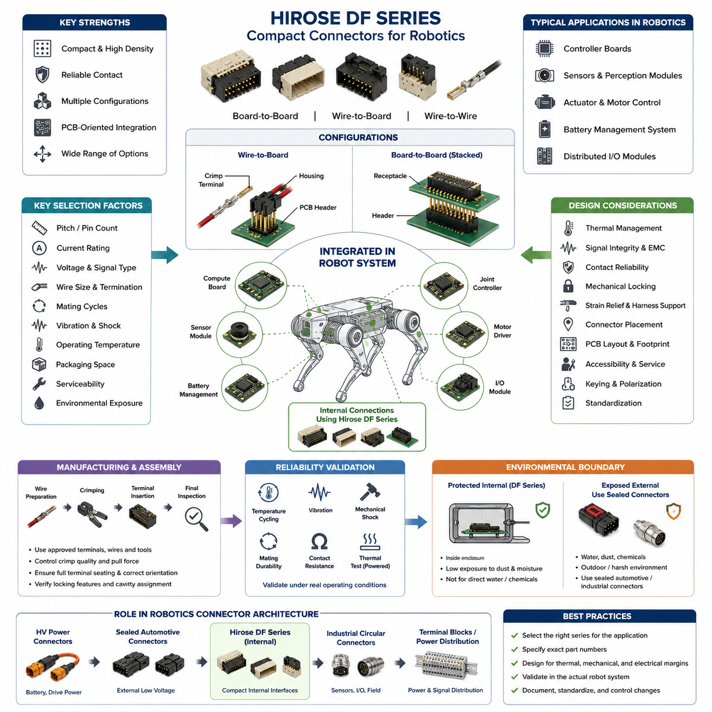
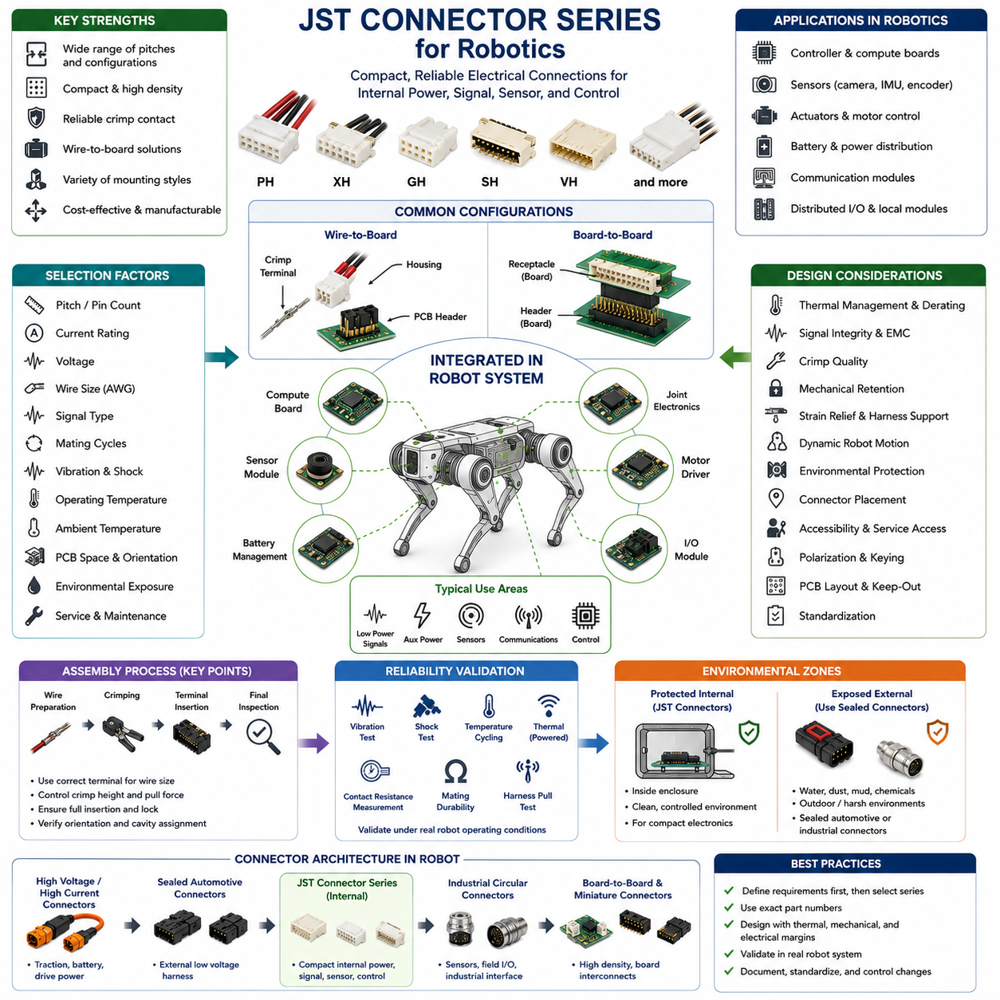
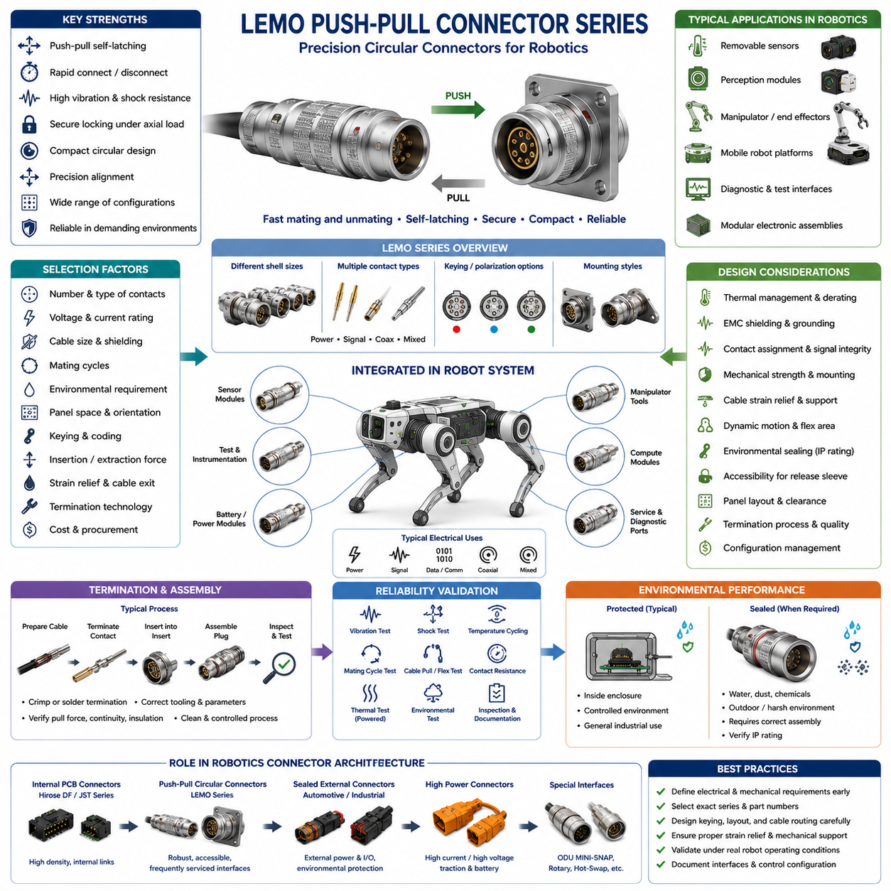
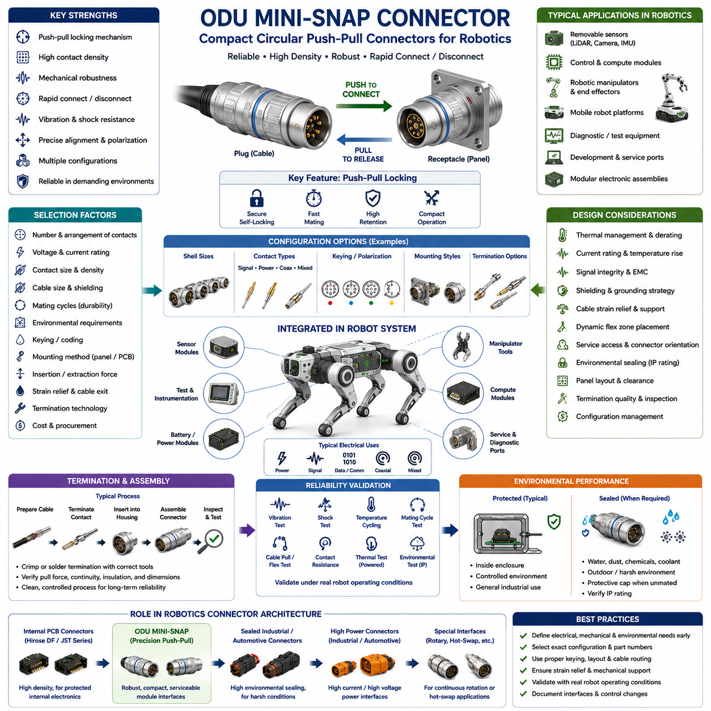
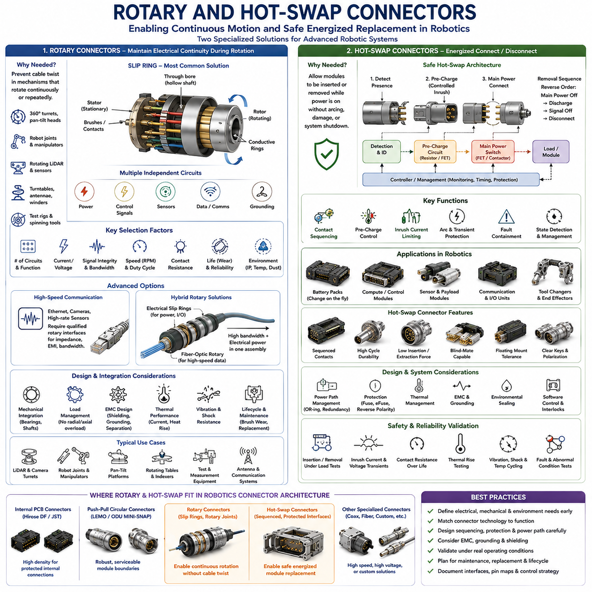

**Volume 03. Connector Engineering**

# Chapter 08. Robotics Connectors

## 08.01. Hirose DF Series

{width="7.268055555555556in" height="7.268055555555556in"}

The Hirose DF Series represents a broad family of compact board-to-board, wire-to-board, and wire-to-wire connectors that are well suited to robotics systems where electrical interfaces must fit inside tightly constrained mechanical assemblies. Within a robotics connector architecture, the DF family is particularly useful for internal electronics such as controller boards, sensor modules, actuator interfaces, battery-management electronics, and distributed I/O.

Unlike heavy industrial connectors designed primarily for exposed machinery interfaces, Hirose DF connectors generally emphasize compact packaging, controlled mating geometry, high contact density, and PCB-oriented integration. These characteristics make them appropriate for connections located inside protected robot enclosures. Their role is therefore complementary to larger sealed automotive or industrial connectors rather than a direct replacement for connectors intended for severe external environments.

The designation "DF Series" should not be interpreted as one connector having a single pitch, current rating, or mechanical structure. It encompasses multiple connector families optimized for different packaging and electrical requirements. Depending on the specific DF family and part number, engineers can encounter different contact pitches, numbers of positions, mounting orientations, termination methods, locking arrangements, current capabilities, and mating configurations.

This diversity is valuable in robotics because electrical packaging requirements vary significantly between subsystems. A compact perception module may require many low-current signal contacts, while an actuator controller may need fewer connections carrying comparatively higher current. Rather than forcing both interfaces into one connector architecture, designers can select an appropriate DF-family configuration while maintaining similar engineering practices for crimping, PCB integration, harness manufacturing, and service documentation.

Wire-to-board configurations are especially useful for connecting internal harness branches to control PCBs. A typical interface consists of a PCB-mounted header and a mating housing containing crimped contacts. This architecture separates PCB manufacturing from harness manufacturing and allows modules to be assembled, tested, replaced, or serviced independently. Correct header orientation and harness exit direction are important because robot packaging frequently provides little clearance around electronic assemblies.

Board-to-board members of the broader DF family can support compact stacked or adjacent PCB architectures. Such arrangements are useful in embedded controllers containing separate processing, communication, motor-control, sensor-conditioning, or power-management boards. Connector selection must consider not only electrical requirements but also board spacing, tolerance accumulation, mating alignment, assembly sequence, vibration, and the mechanical loads transferred between interconnected printed circuit boards.

Contact pitch strongly influences connector density, creepage spacing, manufacturability, and allowable conductor size. Fine-pitch interfaces can reduce PCB area and overall module volume, but smaller contacts and terminals generally require tighter manufacturing control. Larger-pitch variants provide more space for conductors and contacts and may support greater electrical loading. Consequently, pitch should be selected from system requirements rather than simply choosing the smallest available connector.

Current capability must always be evaluated at the exact part-number and application level. Published connector ratings are reference conditions rather than permission to operate every populated contact continuously at the headline current. Wire gauge, number of energized circuits, ambient temperature, PCB copper geometry, terminal resistance, enclosure ventilation, contact aging, and neighboring heat-producing components can substantially change the resulting contact temperature and available current margin.

For robotics applications, temperature-rise verification becomes particularly important near motor drivers, DC-DC converters, battery-management circuits, embedded computers, and actuator electronics. A connector that operates satisfactorily on an open laboratory bench may experience substantially higher temperatures inside a compact robot enclosure. Engineering validation should therefore reproduce realistic conductor sizes, contact population, continuous current, ambient temperature, enclosure conditions, and representative operating duty cycles.

Crimp termination provides an efficient production method for many wire-to-board DF configurations, but reliable performance depends heavily on process quality. Terminal selection must match the specified conductor size and insulation diameter, and the approved crimp tooling and dimensional criteria should be followed. Conductor crimp height, insulation support, wire insertion depth, strand damage, terminal deformation, and pull-force performance should be controlled as manufacturing characteristics rather than treated as visual workmanship alone.

Terminal insertion into the housing is another important assembly step. A partially seated contact can appear acceptable during harness production yet move backward when the connector is mated, creating intermittent or open circuits. Production procedures should therefore verify correct terminal orientation, full engagement of the retention feature, cavity assignment, and wire routing. Where the selected connector provides additional retention or locking features, they should be incorporated into the defined assembly process.

Mechanical locking is particularly valuable in mobile robots because connectors experience vibration generated by motors, gearboxes, wheels, cooling fans, impacts, and repeated acceleration. However, a latch does not eliminate the need for proper harness support. Excessive wire mass or an unsupported harness can continuously load the connector and PCB header. Strain relief, controlled bend radius, suitable harness anchoring, and adequate service loops should therefore be designed around the connector interface.

Robot designers should also distinguish connector retention from contact reliability. Even when the housing remains mechanically mated, microscopic relative movement at the contact interface can contribute to fretting, wear, or resistance instability over long operating periods. Contact performance therefore depends on the combined behavior of terminal normal force, plating system, vibration environment, mating-cycle history, contamination, temperature, and harness-induced mechanical loading.

Compact DF connectors are generally most attractive inside relatively protected electronic compartments. If an interface is directly exposed to water, dust, cleaning chemicals, outdoor condensation, mud, salt spray, or pressure washing, environmental sealing requirements may dominate the selection process. In such locations, a sealed automotive or industrial connector may be more appropriate. The system boundary should therefore distinguish protected internal interfaces from environmentally exposed interfaces before connector families are assigned.

Signal integrity must also be considered independently from mechanical compatibility. Low-speed discrete signals, encoder interfaces, serial communication, power distribution, and high-speed differential links can impose very different requirements. Pin assignment should control return-current paths, noisy power circuits should be separated appropriately from sensitive signals, and high-speed interfaces should use connector configurations whose electrical characteristics are suitable for the intended protocol rather than relying solely on physical pin count.

For motor-control assemblies, connector placement should reflect the separation between noisy switching power paths and sensitive sensing or communication circuits. High-current motor phases and rapidly switching nodes can produce electromagnetic interference that couples into nearby low-level signals. Connector location, PCB routing, grounding, shielding strategy, cable twisting, and pin allocation therefore form one integrated EMC design problem. Selecting a compact connector alone cannot compensate for poor electrical architecture.

Mating-cycle requirements should be established from the actual service model. Internal connectors that are assembled once during manufacturing may experience very few mating cycles, whereas replaceable sensors, batteries, controllers, or field-service modules can be disconnected repeatedly. A connector intended for permanent internal assembly should not automatically be assumed suitable as a frequently operated service interface. The specified mating durability of the exact selected connector must be compared with expected lifecycle usage.

Robotic joints introduce additional mechanical concerns because harnesses can repeatedly bend, twist, and accelerate near connector termination points. A DF connector installed near an articulated joint should normally be positioned so that dynamic cable motion is absorbed by a controlled flex region rather than transferred directly into the terminal or header. Harness clamps, routing guides, bend-radius control, and sufficient distance between the connector and moving cable section can significantly improve long-term reliability.

Manufacturing scalability is one of the major reasons to standardize compact connector families. Once approved terminals, wire ranges, applicators, hand tools, inspection criteria, cavity conventions, and repair procedures are established, the same manufacturing infrastructure can support multiple robot modules. Standardization also reduces terminal inventory and tooling complexity. Nevertheless, visually similar DF-family components should never be considered interchangeable unless their exact mating, terminal, electrical, and mechanical compatibility has been verified.

A practical robotics connector specification should therefore identify the complete manufacturer part numbers rather than simply stating "Hirose DF." Documentation should define the PCB header, mating housing, applicable terminals, wire range, tooling, keying or orientation, cavity map, electrical function, current requirement, and assembly requirements. This prevents procurement or manufacturing teams from substituting components that belong to a similar family but differ in pitch, polarization, contact system, mounting style, or intended application.

PCB design must likewise follow the footprint and mounting recommendations associated with the exact component. Through-hole and surface-mount configurations impose different manufacturing constraints, while right-angle and vertical headers produce different harness routing geometries. Mechanical CAD and electrical CAD should therefore be coordinated early. Connector keep-out areas, mating access, latch accessibility, cable bend space, nearby component height, and service-tool clearance are all part of the connector integration problem.

For modular AMRs, manipulators, quadrupeds, and humanoid robots, the DF family can support hierarchical internal interconnection between compute boards, sensor interfaces, joint electronics, local controllers, and low-voltage distribution modules. This aligns naturally with a robotics electrical architecture in which connector engineering is treated as a dedicated discipline alongside harness, power, communication, sensing, and computing architecture.

Reliability qualification should reproduce the stresses associated with the intended robot rather than depending solely on component catalog specifications. Representative assemblies can be evaluated through temperature cycling, vibration, mechanical shock, repeated mating where relevant, harness pull testing, contact-resistance measurement, and powered thermal testing. Any observed increase in resistance should be investigated because even small resistance changes can create additional localized heating in compact connector systems.

Serviceability introduces another tradeoff. Very compact connectors help reduce module volume, but small latches and dense wire arrangements can be difficult to manipulate inside crowded robot assemblies. Engineers should consider whether technicians can identify, release, reconnect, and verify the interface without damaging wires or adjacent components. Polarization, labeling, connector accessibility, wire identification, and prevention of cross-mating become increasingly important as the number of internal modules grows.

The most effective use of Hirose DF connectors is therefore based on application matching rather than brand-level selection. Engineers should first define circuit type, voltage, continuous and transient current, wire size, pin count, PCB orientation, environmental exposure, vibration, mating frequency, packaging envelope, manufacturing method, and service strategy. The specific DF family and part number can then be selected against these requirements and validated within the actual robotic subsystem.

Within a complete connector strategy, Hirose DF products can occupy the compact internal-interface layer while sealed automotive connectors serve exposed low-voltage harnesses, industrial circular connectors support rugged sensor and automation interfaces, and specialized high-voltage connectors handle traction or battery power. Such functional segmentation avoids attempting to use one connector technology everywhere and creates a clearer relationship between electrical requirements, environmental severity, packaging density, and lifecycle cost.

Ultimately, the engineering value of the Hirose DF Series in robotics comes from combining compact interconnection with modular electronic design. Successful implementation requires more than choosing the correct number of pins: contact loading, thermal margin, crimp quality, PCB layout, vibration management, harness strain relief, service access, and environmental boundaries must be considered together. Applied in this manner, DF-family connectors can form a practical internal interconnection platform for increasingly dense robotic electrical architectures.

## 08.02. JST Series for Robotics

{width="7.268055555555556in" height="7.268055555555556in"}

JST connector series are widely used in robotics as compact electrical interfaces for internal power, signal, sensor, actuator, and control connections. Their broad range of pitches, terminal sizes, housing configurations, and mounting styles allows engineers to select different connector families for densely packaged electronic assemblies. In robotic systems, JST connectors are particularly common between printed circuit boards, internal harnesses, sensors, batteries, and distributed electronic modules.

The term "JST connector" does not describe one standardized connector design. JST manufactures numerous families with substantially different pitches, current capabilities, wire ranges, locking mechanisms, and intended applications. Robotics engineers should therefore identify connectors by their exact series and part numbers rather than by the generic JST name. Similar-looking housings can have different electrical and mechanical characteristics and should never be assumed to be interchangeable.

Among compact robotics interfaces, families such as PH, XH, GH, SH, VH, and related series illustrate the range of packaging options available. Fine-pitch families can support compact sensor and communication modules, while larger configurations can accommodate larger conductors and higher electrical loads. The appropriate family depends on the circuit rather than simply on available pin count, because pitch, terminal geometry, conductor size, current, voltage, and mechanical retention are interdependent.

Wire-to-board connections represent one of the most important JST applications in robots. A PCB-mounted header can connect a removable harness containing crimp terminals installed in a molded housing. This arrangement enables electronic modules and harness assemblies to be manufactured and tested separately. During final robot assembly, standardized interfaces can simplify installation while allowing controllers, sensors, communication boards, and other modules to be replaced without modifying the PCB.

Compact pitch is especially valuable in perception and embedded-control electronics. Cameras, proximity sensors, encoders, IMUs, small communication modules, and local controller boards frequently require several power and signal conductors within limited packaging space. Fine-pitch JST families can provide these connections without consuming excessive PCB area, but decreasing connector size also increases the importance of assembly accuracy, conductor selection, strain relief, and controlled handling during service.

Larger-pitch JST families can be useful where greater conductor cross-section or higher current capability is required. Internal power distribution, cooling fans, small actuators, battery-related circuits, and auxiliary power interfaces may require more electrical capacity than fine-pitch signal connectors can provide. However, current capability must always be verified using the exact connector, terminal, wire size, number of loaded contacts, ambient temperature, and applicable manufacturer conditions.

Published current ratings should not be interpreted as unconditional continuous-current limits for a complete robot assembly. Contact resistance generates heat according to the electrical loading, while neighboring energized contacts, small enclosure volume, PCB copper geometry, and elevated ambient temperature can increase connector temperature further. For continuously powered circuits, designers should evaluate temperature rise and apply appropriate engineering margin rather than operating automatically at the maximum catalog rating.

This consideration becomes particularly important in compact AMRs, quadrupeds, humanoids, and manipulators, where electronic modules may be surrounded by motor drivers, processors, DC-DC converters, and batteries. Internal enclosure temperature can be considerably higher than laboratory ambient temperature. Connector derating should therefore be coordinated with the thermal architecture of the robot, including expected duty cycle, ventilation, heat conduction, and worst-case simultaneous electrical loading.

Crimp quality is fundamental to JST connector reliability. The selected terminal must correspond to the specified wire conductor size and insulation diameter, while the crimping process must produce controlled conductor and insulation crimps. Excessive crimping can damage strands or deform the terminal, whereas insufficient crimping can increase resistance or reduce mechanical strength. Approved tooling and dimensional inspection should therefore be incorporated into the harness manufacturing process.

Terminal insertion must also be carefully controlled. After crimping, the contact is inserted into the correct housing cavity until its retention feature engages. Incorrect orientation, incomplete insertion, or damaged retention features can allow the terminal to move backward during mating. Such failures can be difficult to identify because the housing may appear fully connected while an individual electrical contact remains partially engaged or intermittently disconnected.

Mechanical retention requirements vary considerably among JST families. Some compact connectors rely primarily on friction and housing geometry, while others provide more positive locking arrangements. In stationary consumer electronics, relatively light retention may be sufficient, but mobile robots experience continuous vibration, acceleration, impacts, and harness movement. Connector retention should therefore be evaluated against the actual dynamic environment rather than inferred simply from successful manual mating.

Harness design can significantly improve the reliability of a small connector. Wires should not transfer continuous tensile or bending loads directly into the housing or crimp terminals. Appropriate clamps, cable guides, service loops, and strain-relief features should support the harness before it reaches the connector. This becomes particularly important when a relatively heavy cable bundle terminates in a small PCB connector whose mechanical structure was not designed to support the harness mass.

Dynamic robot mechanisms require additional attention. Harnesses routed through arms, legs, steering assemblies, gimbals, or manipulators experience repeated bending and torsion. The connector should normally remain in a mechanically stable region while cable flexing occurs in a deliberately designed dynamic section. Locating the connector directly at a high-motion bend point can transfer cyclic loads into the terminal system and eventually cause conductor fatigue, contact movement, or housing damage.

Environmental protection is another important boundary condition. Many compact JST connectors are primarily intended for protected equipment interiors rather than direct exposure to rain, mud, conductive dust, condensation, salt spray, or high-pressure cleaning. If a robot operates outdoors or in harsh industrial environments, the enclosure should provide the necessary environmental protection, or a suitably sealed connector family should be selected for interfaces that cross the protected enclosure boundary.

For this reason, connector architecture in a robot can be divided according to environmental zones. JST connectors can serve compact internal electronics, while sealed automotive connectors can be used for external low-voltage harnesses and rugged circular connectors can support exposed industrial sensors and field interfaces. High-voltage or high-current traction circuits require another class of connector entirely. This layered approach allows each connector technology to operate within an appropriate design envelope.

Signal interfaces require consideration beyond pin count and voltage rating. Encoder signals, serial buses, discrete I/O, analog sensors, and communication links can have different electromagnetic compatibility and signal-integrity requirements. Power and ground assignments should provide suitable return paths, while sensitive signals should be separated from noisy switching circuits when necessary. High-speed interfaces should only use connector configurations whose electrical characteristics are appropriate for the target communication technology.

Motor-control electronics provide a representative example. A controller may contain low-level encoder signals, communication buses, logic power, auxiliary power, and high-current motor connections within a small physical area. Using compact JST connectors for suitable low-power interfaces can simplify packaging, but connector placement and pin assignment must be coordinated with PCB grounding, filtering, shielding, cable twisting, and separation from rapidly switching power circuitry.

Mating durability should reflect how the robot will actually be assembled and serviced. A connector used between permanently installed internal modules may experience only a few mating cycles throughout the robot lifecycle. Conversely, a connector attached to a frequently replaced sensor or controller may be disconnected many times. The specified mating-cycle capability and handling characteristics of the selected JST series should therefore be compared with the intended maintenance strategy.

Service access becomes increasingly important as connector size decreases. Small housings can be difficult to disconnect safely when surrounded by densely packed electronics, and technicians may pull on wires when the housing cannot be reached easily. Mechanical packaging should provide sufficient finger or tool access to release the connector correctly. Connector orientation should also allow technicians to identify the mating direction without applying excessive force to the housing or PCB header.

Polarization and keying help prevent assembly errors, but system-level identification remains necessary when several similar connectors are positioned close together. Harness labels, wire colors, cavity maps, PCB reference designators, and assembly drawings can reduce the possibility of cross-connection. Where identical connector families carry different functions, mechanical layout or connector coding should be considered so that incorrect mating cannot create damaging voltage or signal combinations.

PCB integration requires coordination between electrical and mechanical design. Vertical and right-angle headers create different cable exit paths, while through-hole and surface-mount configurations have different assembly and mechanical characteristics. Designers should follow the manufacturer-recommended PCB footprint and consider connector keep-out zones, mating clearance, latch accessibility, harness bend radius, neighboring component heights, and forces applied to the PCB during connector insertion and removal.

The exact terminal is as important as the housing and header. A connector specification should identify the complete mating system, including PCB header, wire housing, crimp terminal, compatible wire range, applicable tooling, and any required accessories. Specifying only the series name creates ambiguity during purchasing and manufacturing. Approved part numbers should therefore be controlled through the bill of materials, harness drawings, and connector engineering documentation.

JST connectors can support modular robotics architectures by providing repeatable interfaces between functional electronic units. Sensor modules can connect to local processing boards, joint electronics can connect to central controllers, and low-power auxiliary devices can connect to distributed I/O modules. Such modularity improves manufacturing, testing, replacement, and configuration management because each subsystem can be developed as a defined electrical module rather than as permanently attached wiring.

Standardization across a robot platform can also reduce manufacturing complexity. A controlled set of JST series, terminals, wire sizes, and approved tooling can reduce inventory while simplifying technician training and inspection procedures. Standardization should nevertheless be based on electrical and mechanical requirements. Using one small connector family everywhere merely to reduce part count can create thermal, vibration, serviceability, or manufacturing problems in circuits outside its intended operating range.

Reliability validation should reproduce realistic robot conditions. Representative connector and harness assemblies can be subjected to vibration, mechanical shock, temperature cycling, powered temperature-rise testing, contact-resistance measurements, harness pull tests, and mating durability tests where applicable. Testing the complete assembly is particularly important because failures often result from interactions among connector selection, crimp quality, wire routing, PCB mounting, and mechanical packaging rather than from the connector component alone.

Robotics connector selection should therefore begin with system requirements: circuit function, operating voltage, continuous and peak current, conductor size, number of positions, available PCB area, environmental exposure, vibration level, mating frequency, assembly process, and service strategy. Once these conditions are defined, the appropriate JST family and exact components can be selected instead of choosing a familiar connector first and attempting to adapt the system around it.

Within the broader connector-engineering structure, JST products occupy an important position between miniature electronic interconnects and more rugged automotive or industrial connection systems. The robotics connector chapter places JST alongside Hirose DF, Lemo push-pull, ODU MINI-SNAP, and specialized rotary or hot-swap interfaces, reflecting the need to select connector technologies according to packaging, environmental, electrical, mechanical, and service requirements rather than relying on a single universal solution.

Ultimately, JST series are valuable in robotics because they provide a flexible family of compact and manufacturable interconnections for protected internal electronics. Their successful use depends on selecting the correct series, terminal, wire, and PCB configuration while controlling thermal loading, crimp quality, vibration, strain relief, environmental exposure, mating life, and service access. When these factors are engineered together, JST connectors can provide reliable interfaces across a wide range of robotic electronic subsystems.

## 08.03. Lemo Push Pull Series

{width="7.268055555555556in" height="7.268055555555556in"}

LEMO Push-Pull connectors are precision circular connectors designed for applications that require reliable electrical connections, rapid mating and unmating, compact packaging, and strong mechanical retention. In robotics, they are particularly valuable at interfaces that must be disconnected frequently, including removable sensors, perception modules, diagnostic equipment, test interfaces, manipulators, mobile platforms, and modular electronic assemblies.

The defining characteristic of many LEMO connector families is the push-pull self-latching mechanism. When the plug is inserted into the receptacle, an internal locking system engages automatically and prevents accidental separation under normal axial loading. Disconnecting the connector requires pulling the appropriate outer release sleeve, allowing technicians to remove the connector quickly without rotating threaded coupling rings or operating separate locking hardware.

This mechanism provides an important advantage in robots where installation space is limited. Threaded circular connectors require sufficient clearance for fingers or tools to rotate the coupling mechanism, whereas a push-pull connector can often be operated primarily along its mating axis. This makes the architecture attractive for densely packaged sensor clusters, removable compute modules, robotic end effectors, test panels, and service interfaces where lateral access is restricted.

LEMO products encompass multiple connector series rather than one universal interface. Different families provide different shell sizes, contact configurations, electrical ratings, environmental characteristics, keying arrangements, mounting styles, and termination technologies. Consequently, specifying only "LEMO connector" is insufficient for engineering documentation. The complete series, shell configuration, contact arrangement, receptacle type, termination method, and exact manufacturer part number should be controlled.

Circular connector construction provides a mechanically robust interface between plug and receptacle. The shell surrounds and protects the internal contact system while providing alignment during mating. Depending on the selected family, configurations can support electrical power, analog signals, digital signals, communication interfaces, coaxial connections, or combinations of different contact technologies. The specific connector must therefore be matched to the electrical architecture rather than selected only from mechanical appearance.

Keying and polarization are important characteristics when several similar circular connectors are installed on the same robot. Mechanical keying can prevent incorrect rotational orientation and, with appropriate coding strategies, reduce the possibility of connecting a cable to an incompatible receptacle. This is especially important when adjacent interfaces carry different voltages, sensor signals, communication channels, or equipment functions that could be damaged by incorrect connection.

Contact density must be balanced against conductor size, current requirement, voltage, signal integrity, and serviceability. A higher contact count can consolidate multiple electrical functions into one connector and reduce the number of external interfaces, but dense contact arrangements generally leave less physical space for individual contacts and conductors. Robotics engineers should therefore determine whether combining power and signals provides a genuine packaging advantage or unnecessarily increases interface complexity.

Current rating requires the same thermal engineering discipline applied to other connector technologies. Manufacturer ratings depend on defined contact, conductor, ambient, and test conditions. When multiple contacts are energized simultaneously inside a compact circular connector, combined heat generation can increase operating temperature. Continuous current should therefore be evaluated with realistic wire sizes, contact population, enclosure temperature, duty cycle, and allowable temperature rise.

Low-level sensor and communication circuits introduce different requirements. Encoder signals, force-torque sensors, cameras, instrumentation, synchronization lines, and communication channels can be sensitive to electromagnetic interference and return-path discontinuities. Connector contact assignment should therefore be coordinated with cable construction, shielding, grounding, twisted pairs, differential signaling, and PCB interface design so that the complete connection maintains the required signal quality.

Shielding can be particularly important where connectors are located near motors, inverters, switching power supplies, or high-current actuator wiring. A mechanically excellent connector cannot independently solve an electromagnetic compatibility problem if cable shields are terminated poorly or return-current paths are uncontrolled. Connector shell design, cable shield termination, chassis bonding, cable routing, and electronics grounding should therefore be treated as one integrated EMC architecture.

The mechanical strength of the push-pull locking mechanism does not eliminate the need for cable strain relief. Heavy or unsupported cables can impose bending moments and repeated loads on the plug, receptacle, or panel mounting structure. Cable routing should include suitable clamps, bend-radius control, service loops, and mechanical support so that dynamic cable forces are not continuously transferred into the connector interface.

This issue becomes especially important in manipulators, quadrupeds, humanoids, pan-tilt mechanisms, and mobile robots carrying articulated sensor assemblies. If the cable moves repeatedly while the connector remains fixed, the dynamic flex region should be positioned away from the connector termination. Continuous bending immediately behind the connector can fatigue conductors, shield structures, or termination points even when the mating interface itself remains securely locked.

Mating-cycle capability is a major consideration for connectors selected specifically because they are easy to disconnect. A permanently installed interface may experience only a few mating operations, whereas diagnostic ports, interchangeable sensors, end effectors, test equipment, or experimental robotics modules may be connected hundreds or thousands of times. The mating durability of the exact selected series should therefore be compared with the expected service lifecycle.

The push-pull mechanism also supports rapid maintenance workflows. A technician can disconnect a module without spending time unscrewing coupling hardware, which can be advantageous during field diagnostics or modular replacement. However, connector accessibility remains essential. The release sleeve must be reachable, and nearby structures should not encourage technicians to pull directly on the cable instead of operating the intended release mechanism.

Environmental requirements vary significantly among LEMO families and configurations. Some products are intended primarily for protected equipment, while other connector families or variants provide enhanced sealing and ruggedization. Engineers must therefore verify the environmental specification of the exact selected connector rather than assuming that a metallic circular housing automatically provides waterproof protection. Water ingress, dust, condensation, chemicals, and outdoor exposure require explicit evaluation.

Where environmental sealing is required, the complete interface must be considered rather than the connector shell alone. Panel mounting, receptacle sealing, cable entry, backshell configuration, cable jacket, and unmated conditions can all influence environmental performance. A connector may provide an appropriate ingress-protection capability only when correctly assembled and fully mated, so system requirements should define both operating and maintenance exposure conditions.

Panel-mounted receptacles are useful for establishing clear modular boundaries within a robot. A sensor pod, compute enclosure, battery-related auxiliary module, or control cabinet can expose defined connector interfaces while keeping internal wiring protected. This allows external cable assemblies and internal electronics to be manufactured independently and supports modular replacement without opening the enclosure or disturbing internal harness connections.

PCB-mounted configurations can further simplify module integration where mechanically appropriate. Nevertheless, insertion and extraction forces must be considered because repeated connector operation can transfer loads into the printed circuit board. Panel support, mechanical fastening, PCB thickness, solder-joint loading, and receptacle mounting architecture should be evaluated so that service forces are carried by the mechanical structure rather than vulnerable PCB connections.

Termination technology is another important selection factor. Depending on the specific connector family and configuration, contacts may use solder, crimp, printed-circuit, or other termination arrangements. The selected method affects manufacturing equipment, repairability, inspection procedures, conductor compatibility, and production repeatability. High-volume robotic platforms generally benefit from controlled and documented termination processes rather than technician-dependent manual workmanship.

Crimped configurations require correct terminal-to-wire matching, approved tooling, controlled crimp dimensions, and verification of conductor retention. Soldered configurations require appropriate stripping, soldering, insulation control, cleanliness, and strain management. In both cases, workmanship directly influences contact resistance and mechanical reliability. Connector performance therefore depends not only on the purchased component but also on the quality of the completed cable assembly.

Robotic systems often contain many visually similar interfaces, making configuration management important. Cable assemblies should identify connector type, destination, signal function, and orientation where necessary. Mechanical keying should be supplemented with labeling, harness drawings, interface-control documentation, and electrical pin maps. This becomes especially important in prototypes and research robots where modules may be frequently reconfigured during development.

For perception systems, push-pull connectors can provide convenient detachable interfaces for LiDARs, cameras, IMUs, force-torque sensors, and specialized instrumentation when the selected electrical configuration supports the required signals. Their mechanical robustness and rapid serviceability are attractive for sensor modules that must be removed for calibration, replacement, transportation, or experimental configuration changes.

Manipulators and end effectors provide another important robotics application. Interchangeable tools may require power, sensor signals, communication, and control connections while also demanding rapid replacement. A push-pull connector can simplify manual tool servicing when automatic robotic tool changing is not required. The electrical interface should nevertheless be positioned so that mechanical loads from the tool or cable are not transferred directly through the connector.

Mobile robot development platforms can also benefit from dedicated LEMO service and instrumentation ports. Temporary connections for debugging, data acquisition, calibration, external sensors, or laboratory equipment can be attached and removed repeatedly without exposing internal PCB connectors. This creates a useful separation between permanent internal harness connections and higher-cycle engineering interfaces intended for frequent human access.

Connector selection should begin with the required number and type of contacts, operating voltage, continuous and peak current, cable diameter, shielding requirements, mating frequency, environmental exposure, available panel space, mounting method, and allowable insertion and extraction forces. Keying, cable exit direction, strain relief, service accessibility, and procurement constraints should then be evaluated before an exact series and part number are approved.

Qualification should reproduce the mechanical and environmental conditions of the target robot. Representative cable assemblies can be subjected to vibration, shock, temperature cycling, repeated mating, cable pull and flex testing, contact-resistance measurement, and powered thermal evaluation. Environmental testing should be added when sealing is required. Testing the assembled interface is preferable because cable construction and termination workmanship can strongly influence reliability.

Within a robotics connector architecture, LEMO Push-Pull connectors occupy a different role from compact internal PCB connectors such as Hirose DF or JST families. Hirose and JST products can efficiently support protected internal board and harness interfaces, while LEMO connectors are particularly attractive at robust, accessible, frequently serviced module boundaries. Sealed automotive or industrial connectors may remain preferable where cost, high current, or severe environmental exposure dominates.

This functional segmentation prevents overengineering every connection. Using precision push-pull connectors for permanently buried low-cost internal wiring may add unnecessary cost and packaging complexity, while using fragile miniature PCB connectors for frequently serviced external modules can reduce reliability. Connector technology should therefore be assigned according to the mechanical, electrical, environmental, manufacturing, and lifecycle requirements of each interface.

The broader connector-engineering structure places LEMO Push-Pull alongside Hirose DF, JST robotics connectors, ODU MINI-SNAP, and rotary or hot-swap connector technologies within the robotics connector chapter. This organization reflects the fact that robotic platforms require several connector classes rather than a single universal solution, with each technology addressing a different combination of density, ruggedness, serviceability, motion, and environmental requirements.

Ultimately, the engineering value of LEMO Push-Pull connectors in robotics comes from combining precise mating, secure self-latching, compact circular construction, and rapid serviceability. Reliable implementation still requires correct electrical sizing, keying, termination, shielding, strain relief, environmental qualification, mechanical support, and lifecycle validation. When these factors are engineered together, push-pull connectors can provide robust modular interfaces for sophisticated robotic systems.

## 08.04. ODU MINI-SNAP

{width="7.268055555555556in" height="7.268055555555556in"}

ODU MINI-SNAP connectors are compact circular push-pull connectors designed for applications requiring reliable mating, high contact density, mechanical robustness, and rapid connection or disconnection. In robotics, they are particularly useful at modular boundaries such as removable sensors, control modules, diagnostic interfaces, manipulators, test equipment, and compact mobile platforms where conventional large industrial connectors would consume excessive space.

A central characteristic of the ODU MINI-SNAP concept is its push-pull locking architecture. The connector can be inserted axially into the mating receptacle, where the locking mechanism engages and secures the connection. Release is accomplished through the intended outer operating mechanism rather than by unscrewing a threaded coupling. This allows rapid service while maintaining substantially stronger retention than simple friction-fit electronic connectors.

Push-pull operation is especially advantageous where robot packaging restricts radial access around a connector. Threaded circular connectors require space for rotating a coupling nut, whereas a push-pull interface can primarily be operated along the connector axis. This enables engineers to place serviceable interfaces on compact sensor pods, controller enclosures, robotic arms, test panels, and other assemblies where technicians have limited space for their hands or tools.

ODU MINI-SNAP should be treated as a connector system rather than as one universal component. Available configurations can differ in shell size, contact arrangement, termination technology, mounting method, keying, cable construction, and electrical capability. Consequently, engineering drawings and bills of materials should identify the exact connector configuration and manufacturer part number instead of using the generic MINI-SNAP designation as a complete specification.

The circular shell provides mechanical protection and precise guidance during mating. Correct alignment is particularly important for connectors containing multiple small contacts because contact damage can occur if mating forces are applied with incorrect orientation. The mechanical interface therefore performs several functions simultaneously: alignment, polarization, retention, contact protection, and transmission of service loads into the connector structure.

Contact configurations should be selected according to the electrical function of the robotic subsystem. A sensor interface may require multiple low-current signal contacts, while a controller module may require communication, logic power, discrete I/O, and auxiliary supply connections. Combining several functions into one compact circular interface can simplify module replacement, but contact density must remain compatible with conductor size, voltage, current, and signal-integrity requirements.

Electrical current capability must be evaluated using the exact contact configuration rather than the external size of the connector. Smaller circular connectors can appear mechanically substantial while containing relatively small electrical contacts. Continuous current generates heat at each contact resistance, and simultaneous loading of multiple contacts can increase internal temperature. Current rating should therefore be evaluated with realistic conductor sizes, contact population, ambient temperature, and duty cycle.

Thermal derating becomes important in robots containing densely packaged electronics. Motor controllers, embedded computers, DC-DC converters, batteries, and power electronics can raise enclosure temperatures significantly above room conditions. A connector that satisfies its electrical requirement during a short laboratory test may operate differently during continuous robot operation. Powered temperature-rise testing under representative system conditions provides valuable verification of the available thermal margin.

Signal circuits require a different type of analysis. Encoders, force-torque sensors, analog measurement channels, communication buses, synchronization lines, and other low-level interfaces can be affected by electromagnetic interference. Contact assignment should therefore be coordinated with cable topology, grounding, shielding, twisted-pair requirements, differential signaling, and the PCB interface rather than treating every contact as electrically equivalent.

EMC performance depends on the complete connection path. A metallic circular connector can contribute to a robust shielding architecture, but effective performance also requires appropriate cable shield termination and chassis bonding. Poor shield continuity at the connector can create an impedance discontinuity that reduces shielding effectiveness. Connector shell, backshell, cable braid, enclosure, and grounding strategy should therefore be considered as parts of one electromagnetic interface.

Mechanical keying and polarization help prevent incorrect mating. This becomes increasingly important when several MINI-SNAP interfaces are installed close together on a robot. Different connectors may carry power, communications, sensors, or diagnostic signals, and accidental cross-connection could damage equipment. Mechanical coding, connector location, labels, cable identification, and interface documentation should be combined to reduce assembly and maintenance errors.

The locking mechanism should not be used as a substitute for proper cable support. Even a securely latched connector can be damaged by a heavy cable repeatedly applying bending moments to the plug or receptacle. Harness clamps, strain relief, suitable cable exit geometry, controlled bend radius, and service loops should be used so that connector retention primarily maintains electrical mating rather than supporting the mass and motion of the cable.

Dynamic cable behavior is particularly important on robotic arms, quadruped legs, humanoid joints, pan-tilt assemblies, and movable sensor structures. The connector should preferably remain in a relatively stable mechanical region while repeated cable bending occurs within a defined flex zone. Placing the termination directly at a dynamic bending point can produce conductor fatigue, shield degradation, terminal movement, or backshell damage over repeated operating cycles.

Mating durability should be matched to the intended lifecycle of the interface. An internal connector installed during manufacturing may experience very few mating cycles, while removable sensors, interchangeable modules, diagnostic equipment, and development interfaces can be operated repeatedly. Push-pull connectors are particularly attractive for these higher-cycle applications, but the specified durability of the exact configuration must still be verified against expected service use.

Serviceability is one of the strongest reasons to use this type of connector in robotics. Modules can be disconnected without opening internal electronic assemblies or manipulating small PCB connectors. A well-designed robot can expose robust module-level interfaces while protecting delicate internal connections. This allows sensors, controllers, communication modules, or experimental hardware to be replaced more quickly during maintenance and development.

Service access must nevertheless be deliberately designed. Technicians require sufficient clearance to grasp and operate the intended release mechanism. If the connector is recessed too deeply or surrounded by nearby components, users may attempt to disconnect it by pulling the cable. Connector orientation, panel spacing, neighboring hardware, cable routing, and tool access should therefore be reviewed in mechanical CAD before the interface is released for production.

Environmental performance must be determined from the exact ODU MINI-SNAP configuration. A circular metallic shell should not automatically be interpreted as providing a specific ingress-protection rating. Depending on the selected version and complete assembly, environmental capability may differ. Interfaces exposed to rain, dust, condensation, chemicals, coolant, mud, or cleaning processes require explicit verification of the relevant sealing and environmental specifications.

When sealing is required, the complete interface boundary must be evaluated. Receptacle-to-panel sealing, plug-to-receptacle sealing, cable entry, backshell construction, and the condition of an unmated receptacle can all affect system protection. A robot operating outdoors may therefore require protective caps or additional enclosure measures when connectors are disconnected, even when the mated interface provides adequate environmental resistance.

Panel-mounted receptacles create useful modular boundaries. A sealed or protected electronics enclosure can contain sensitive PCBs and expose only defined MINI-SNAP interfaces to the outside. External cable assemblies can then be manufactured and serviced independently. This architecture can improve maintainability because replacing an external sensor or cable does not require disturbing internal board-level wiring or opening the complete electronic enclosure.

PCB-mounted versions, where appropriate, require careful mechanical integration. Repeated insertion and extraction forces should not be transferred directly into vulnerable solder joints or unsupported PCB areas. Mechanical panel support, fastening, receptacle mounting, PCB stiffness, and assembly tolerances should be coordinated so that the robot structure carries service loads while the PCB primarily performs the electrical interconnection function.

Termination method affects manufacturing strategy and long-term reliability. Depending on the selected configuration, connector systems may use crimp, solder, PCB, or other termination approaches. Each requires appropriate tooling and process controls. Crimping provides repeatable production when correct terminals and tooling are used, while solder termination can provide flexibility for lower-volume assemblies but requires carefully controlled workmanship and strain management.

For crimped interfaces, conductor size, insulation diameter, contact selection, stripping length, crimp dimensions, and pull strength should be controlled. For soldered interfaces, conductor preparation, solder quantity, insulation clearance, cleanliness, and heat exposure require similar discipline. Electrical continuity alone is not sufficient acceptance criteria because a poorly terminated conductor may initially function while possessing inadequate mechanical or thermal reliability.

Cable construction should be selected together with the connector rather than afterward. Cable diameter must be compatible with the connector termination and strain-relief system, while conductor gauge must support electrical loading. Flexibility, shielding, jacket material, bend radius, temperature capability, chemical resistance, and dynamic-cycle requirements can all affect the suitability of the finished assembly for a particular robotic application.

Perception modules provide a representative use case. LiDARs, cameras, IMUs, specialized measurement devices, and calibration equipment often benefit from robust detachable connections. A MINI-SNAP interface can establish a clear module boundary that allows a sensor assembly to be removed for calibration, replacement, transportation, or configuration changes without exposing delicate internal electronics or requiring repeated manipulation of miniature PCB connectors.

Manipulators and robotic end effectors can similarly benefit from compact circular interfaces. Tooling may require control power, communication, sensor feedback, and auxiliary signals while remaining replaceable during maintenance or reconfiguration. Where fully automatic tool-changing interfaces are unnecessary, a manually operated push-pull connector can provide a practical compromise between permanent wiring and more complex automated docking connector systems.

Development and diagnostic ports are another useful application. Robotics laboratories frequently attach temporary instrumentation, calibration equipment, data acquisition systems, or experimental sensors. A robust external service connector protects internal electronics from repeated access and creates a defined engineering interface. This separation is valuable because prototype robots often undergo considerably more connector mating cycles than production robots.

Qualification testing should represent the real application rather than evaluating only loose connector components. Representative cable assemblies can undergo vibration, mechanical shock, mating-cycle testing, cable pull and flex testing, temperature cycling, contact-resistance measurement, and powered thermal testing. Where environmental sealing is required, appropriate ingress, contamination, or climatic tests should be incorporated into the validation plan.

Configuration management is essential because mechanically similar connectors may have different contact arrangements or electrical assignments. The approved connector pair, cable assembly, pin map, keying, termination, and module destination should be documented through drawings, bills of materials, interface-control documents, and harness specifications. This prevents purchasing or assembly substitutions that appear mechanically acceptable but are electrically incompatible.

Within a robotics connector architecture, ODU MINI-SNAP occupies a role similar to other precision push-pull circular systems but distinct from miniature internal PCB connectors. Hirose DF and JST families are well suited to protected internal electronics, while MINI-SNAP can serve accessible modular interfaces requiring greater mechanical robustness and frequent servicing. Rugged sealed industrial or automotive connectors may remain preferable for particularly harsh or high-current locations.

This segmentation allows connector cost and performance to be matched to actual requirements. Installing precision push-pull connectors on every internal circuit would unnecessarily increase cost, mass, and packaging complexity. Conversely, using inexpensive miniature board connectors for exposed interfaces that technicians repeatedly disconnect could reduce reliability. Connector selection should therefore follow the mechanical, electrical, environmental, manufacturing, and lifecycle requirements of each interface.

The robotics connector structure places ODU MINI-SNAP alongside Hirose DF, JST Series, LEMO Push-Pull, and rotary or hot-swap connector technologies. Each family addresses a different combination of packaging density, service frequency, environmental exposure, electrical performance, and mechanical robustness. Together they illustrate why advanced robots normally require a hierarchy of connector technologies rather than one connector family for every electrical interface.

Ultimately, ODU MINI-SNAP provides robotics engineers with a compact and serviceable circular interconnection option for modular equipment boundaries. Its engineering value comes from combining precise mating, push-pull operation, secure retention, flexible contact configurations, and robust mechanical construction. Correct electrical sizing, termination quality, cable support, EMC design, environmental verification, accessibility, and lifecycle validation remain essential to achieving reliable system-level performance.

## 08.05. Rotary and Hotswap Connectors

{width="7.268055555555556in" height="7.268055555555556in"}

Rotary and hot-swap connectors address two specialized interconnection problems that appear frequently in advanced robotics: maintaining electrical continuity across continuously or repeatedly rotating mechanisms, and safely connecting or disconnecting electrical modules while a system remains energized. These functions become important in rotating LiDAR assemblies, robotic joints, turrets, manipulators, battery systems, modular controllers, autonomous mobile robots, and serviceable electronic subsystems.

A conventional cable connection has a limited ability to tolerate rotation because repeated twisting accumulates mechanical strain in conductors, insulation, shielding, and termination points. When a robotic mechanism must rotate through many revolutions or continuously through 360 degrees, ordinary flexible wiring eventually reaches its torsional limit. Rotary connector technologies eliminate or manage this restriction by transferring electrical power or signals across a rotating mechanical interface.

The most established electrical solution for continuous rotation is the slip ring. A slip ring typically contains stationary brushes or contact elements that maintain electrical contact with rotating conductive rings. As the rotor turns relative to the stator, electrical continuity is preserved without twisting the external wiring. Multiple rings can provide independent circuits for power, control signals, sensor interfaces, communication channels, or grounding within one rotating assembly.

Slip-ring selection begins with the number of required circuits and the electrical characteristics of each circuit. High-current power conductors may require larger contact structures than low-level sensor signals, while communication channels may impose impedance, bandwidth, noise, or shielding requirements. Engineers should therefore classify circuits before selecting a rotary interface rather than assuming that every available channel can carry any electrical function with equivalent performance.

Contact resistance is particularly important in rotary systems because the electrical interface is physically moving during operation. Resistance variation can introduce voltage fluctuations, signal noise, and localized heating. For low-level analog measurements or sensitive sensor circuits, even relatively small variations can affect measurement quality. Rotary interfaces should therefore be evaluated for both average contact resistance and dynamic resistance variation during actual rotation.

Wear is an inherent consideration in electromechanical slip rings. Brushes and conductive surfaces experience repeated sliding contact, producing gradual material wear and potentially generating debris. Contact materials, surface finish, rotational speed, current loading, vibration, and environmental contamination all influence service life. A rotary connector should consequently be treated as a lifecycle component whose maintenance or replacement interval may differ from that of stationary wiring.

Rotational speed also affects connector selection. A slip ring suitable for a slowly rotating manipulator joint may not be appropriate for a continuously spinning perception sensor. Higher speed increases mechanical wear, frictional heating, vibration sensitivity, and demands on bearing alignment. Maximum rotational speed should therefore be considered together with expected duty cycle, accumulated revolutions, operating temperature, and required service life.

Robotic joints can use rotary interfaces where unrestricted rotation provides functional advantages. A turret, pan mechanism, rotating sensor head, or specialized manipulator axis can avoid cable winding by transferring power and signals through the joint center. However, the rotary connector must be mechanically integrated with bearings, shafts, actuators, encoders, and structural components so that excessive radial or axial loads are not transferred into the electrical contact assembly.

Hollow-shaft rotary connectors and through-bore slip rings are useful when the center of a rotating axis must remain available for mechanical shafts, pneumatic lines, optical paths, or additional cables. This architecture can be valuable in robot joints and sensor turrets because electrical channels can be arranged around the mechanical centerline. Packaging must nevertheless consider outer diameter, bore diameter, axial length, mounting tolerance, and rotational alignment.

Modern robotic systems increasingly require high-speed communication across rotating interfaces. Ethernet, cameras, high-rate sensors, and other digital systems cannot always be transferred reliably through conventional low-frequency slip-ring contacts. Signal integrity, characteristic impedance, crosstalk, insertion loss, and electromagnetic interference become critical. Rotary interfaces intended for high-speed communication should therefore be explicitly qualified for the required protocol and data rate.

Where extremely high bandwidth or electrical isolation is required, fiber-optic rotary joints can complement electrical slip rings. Optical channels can transfer high-rate data across a rotating interface without conductive electrical contacts. Hybrid rotary assemblies may combine electrical slip rings for power with optical rotary channels for communication. Such architectures are attractive for sophisticated perception systems, rotating scanners, and high-bandwidth robotic sensor platforms.

EMC design remains important in mixed rotary interfaces. High-current motor or power channels positioned near low-level signals can generate interference, while continuously changing contact geometry can complicate grounding and shielding. Circuit allocation, shield continuity, grounding strategy, cable construction, and physical separation should be designed as an integrated system. Sensitive communication circuits may require dedicated channels or specialized rotary transmission technology.

Hot-swap connectors solve a different problem: allowing modules to be inserted or removed while electrical power remains present. Simply disconnecting a conventional power connector under load can create arcing, contact erosion, voltage transients, and uncontrolled interruption of electronic systems. A properly engineered hot-swap interface coordinates connector contact sequencing, electrical protection, power switching, and system control to make energized replacement predictable and safe.

Contact sequencing is one of the fundamental principles of hot-swap design. Different contact lengths or mechanical arrangements can cause selected circuits to connect before others during insertion and disconnect after others during removal. Ground or protective contacts may engage first, followed by detection or control contacts, with main power contacts activated only after appropriate conditions are established. The exact sequence depends on the electrical architecture and safety requirements.

Pre-charge is frequently required when connecting modules containing significant input capacitance. Directly connecting a discharged capacitor bank to a powered DC bus can create a large inrush current limited mainly by wiring, connector, and source impedance. This current can damage contacts, trip protection devices, or disturb other electronics. A pre-charge path introduces controlled impedance so that voltage rises gradually before the main power connection is fully established.

Inrush-current control can also be implemented electronically using hot-swap controllers, MOSFETs, contactors, or other controlled switching devices. The connector itself is therefore only one part of the hot-swap architecture. Reliable operation requires coordination between contact sequencing, detection circuitry, power electronics, current limiting, fault protection, and software state management. Mechanical compatibility alone does not make an interface safe for energized mating.

Arcing is a major concern when power contacts separate under load. As the contacts begin to open, current may continue through an electrical arc across the shrinking gap. This can erode plating, increase contact resistance, generate heat, and shorten connector life. DC systems are particularly challenging because current does not naturally cross zero every cycle as it does in AC systems. Load interruption should therefore be transferred to appropriate switching devices whenever practical.

Hot-swap capability is useful in modular robot architectures where batteries, compute units, sensor modules, storage devices, communication units, or distributed controllers may need replacement without shutting down the complete system. Whether true uninterrupted operation is required depends on the application. Some robots may only require electrically safe replacement, while others may need redundant power and communication paths to maintain continuous mission operation.

Battery interfaces represent an important hot-swap application in mobile robotics. Replacing a battery while maintaining robot operation can increase availability, but the architecture requires more than a rugged connector. Battery identification, voltage compatibility, pre-charge, current limiting, reverse-polarity protection, state-of-charge management, isolation, BMS communication, and safe transfer between energy sources must be coordinated at system level.

Redundant battery architectures can permit one energy source to support the robot while another is removed or inserted. In such systems, ideal-diode controllers, contactors, MOSFET switching, or power-path management circuits may prevent reverse current and control source transitions. Connector contact sequencing should work together with these circuits so that an incoming battery is validated before being allowed to supply significant current to the shared DC bus.

Compute and control modules can also use hot-swap principles. A removable computing unit may require power contacts, communication interfaces, presence detection, and management signals. The system can detect insertion, establish low-level communication, verify module identity or status, and then enable main power. During removal, software can first stop affected functions or migrate tasks before power is disconnected, reducing the risk of corrupted data or uncontrolled robot behavior.

Blind-mate connectors are often associated with hot-swappable modules because the operator may insert a module into a rack, docking bay, or guided enclosure without directly handling the connector. Mechanical guides align the module while connector features accommodate limited positional tolerance. This architecture is useful for battery cartridges, replaceable compute modules, payloads, and service units, but mechanical tolerance analysis is essential to prevent contact damage.

Floating connector mounts can compensate for small alignment errors in blind-mate systems. Instead of rigidly fixing both mating halves, one side is allowed limited movement so that the connector can self-align as mechanical guides bring the module into position. This reduces contact stress and allows enclosure tolerances to be separated from the much tighter alignment requirements of electrical contacts.

Robotic hot-swap interfaces should include clear state detection. Presence switches, short detection contacts, identification resistors, digital communication, or dedicated management signals can inform the controller that a module is being inserted or removed. The system can then execute a controlled state transition rather than reacting only after power disappears. This is particularly important when the module performs safety-related, navigation, perception, or actuator-control functions.

Fault containment must be considered because connecting a defective module to a live robot can propagate failures into the main power or communication architecture. Fuses, electronic circuit breakers, current limiting, reverse-polarity protection, isolation devices, and communication segmentation can prevent one replaceable module from disabling the complete platform. Hot-swap design should therefore be integrated with the robot's broader protection and fault-management strategy.

Connector durability is critical because hot-swappable interfaces may experience substantially more mating cycles than permanent internal connections. Contact plating, normal force, insertion and extraction forces, alignment features, wiping action, and contamination resistance influence lifecycle performance. Qualification should reproduce the expected number of replacement cycles rather than relying solely on initial contact resistance measurements.

Environmental conditions can complicate both rotary and hot-swap designs. Dust or moisture entering a slip ring can accelerate wear or alter electrical behavior, while exposed energized hot-swap contacts can create safety and reliability risks. Outdoor robots may require sealed rotary assemblies, protected docking interfaces, shutters, covers, drainage, or enclosure-level environmental control to keep critical contact surfaces within their intended operating conditions.

Thermal performance must also be evaluated under realistic loading. Rotary contacts and high-cycle hot-swap contacts can develop resistance changes over time, and high-current circuits generate localized heat. Temperature-rise testing should consider maximum continuous current, simultaneous channel loading, enclosure temperature, rotational operation where applicable, contact aging, and cooling conditions. Derating provides useful margin against manufacturing and lifecycle variation.

Mechanical integration is equally important. Rotary connectors should not carry unintended shaft loads, while hot-swap connectors should not be used as the primary structural guide for heavy modules unless specifically designed for that purpose. Bearings, rails, alignment pins, docking structures, and latches should manage mechanical loads so that electrical connectors primarily perform alignment within their specified tolerance and maintain electrical contact.

Validation of rotary connectors can include rotational lifecycle testing, dynamic contact-resistance measurement, vibration, shock, temperature cycling, signal-integrity testing, current temperature-rise measurement, and environmental exposure. Testing should be performed while the interface is rotating whenever the electrical requirement depends on motion, because stationary measurements cannot reveal intermittent noise or resistance variation produced by sliding contacts.

Hot-swap validation should reproduce insertion and removal under realistic energized conditions. Engineers should measure inrush current, bus-voltage disturbance, contact sequencing, pre-charge timing, switching behavior, transient voltage, thermal performance, and fault response. Repeated mating tests can reveal contact erosion or mechanical wear, while abnormal-condition testing can verify that incorrect modules or failed power electronics do not create uncontrolled system behavior.

Within robotics connector engineering, rotary and hot-swap technologies complement Hirose DF, JST, LEMO Push-Pull, and ODU MINI-SNAP interfaces. Compact PCB connectors address protected internal connections, push-pull circular connectors support robust serviceable module boundaries, while rotary and hot-swap systems address continuous motion and energized modular replacement. Each technology therefore occupies a distinct functional layer within the connector architecture.

Ultimately, rotary and hot-swap connectors enable robotic architectures that cannot be implemented reliably with ordinary static connectors alone. Rotary interfaces remove cable-twist limitations from continuously moving mechanisms, while hot-swap interfaces support controlled replacement of energized modules. Their successful application requires coordinated electrical, mechanical, thermal, EMC, protection, control, and lifecycle engineering rather than treating the connector as an isolated component.
