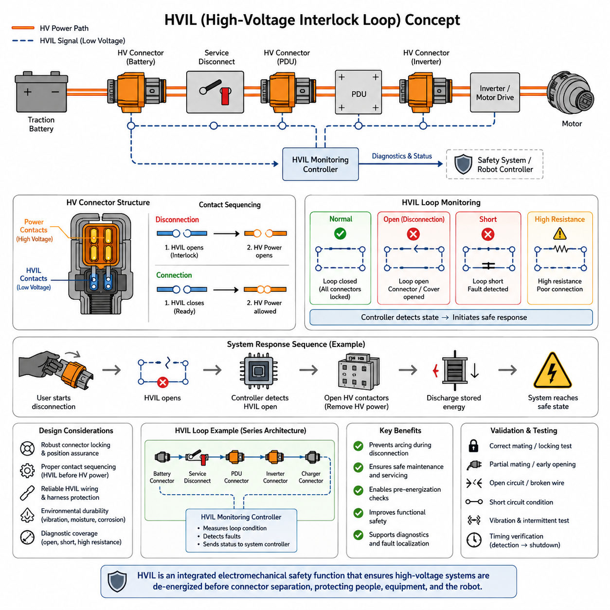
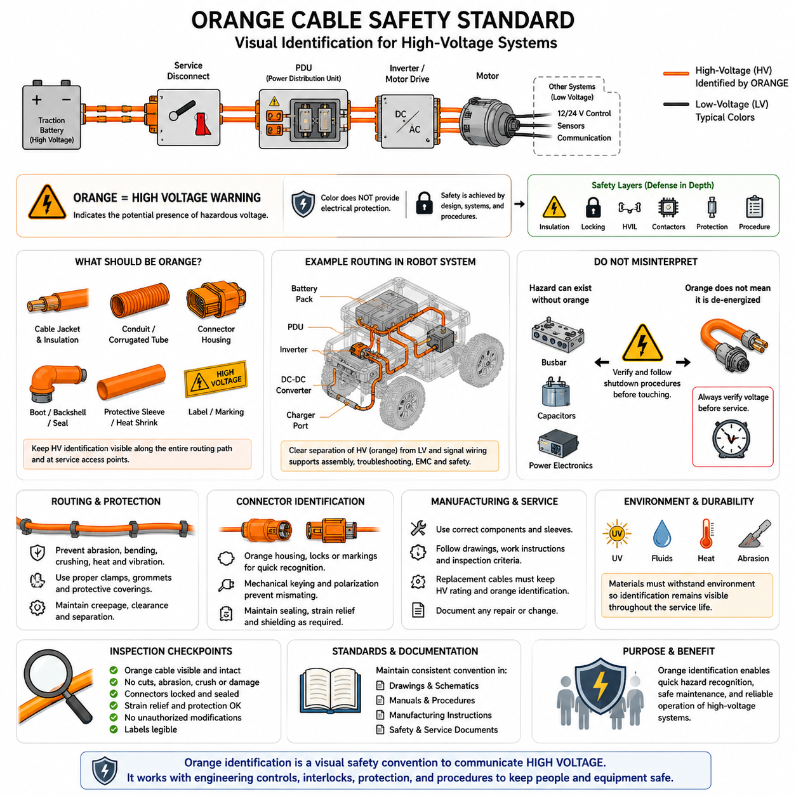
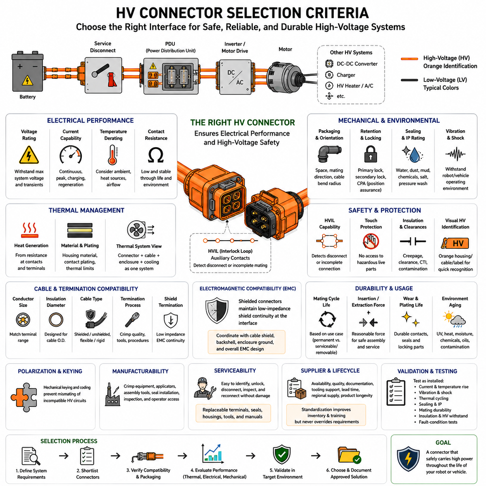
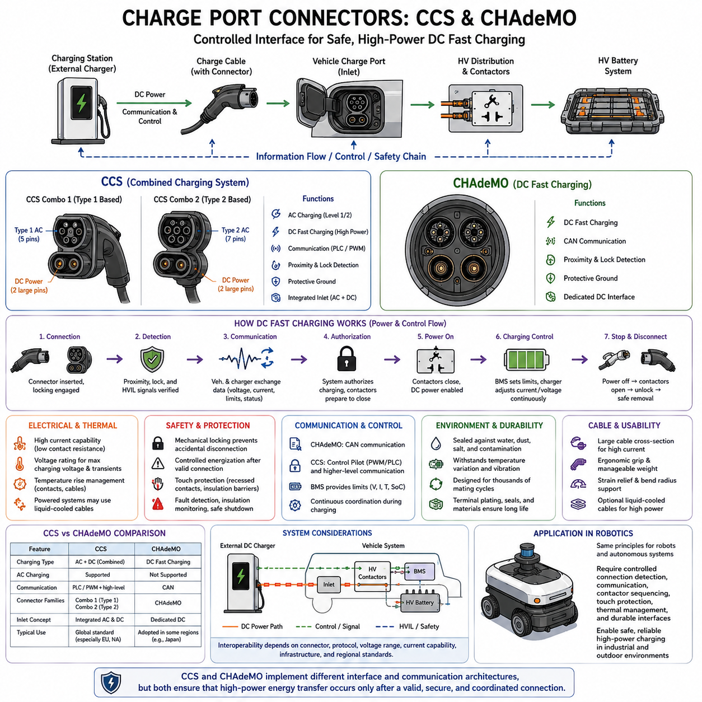
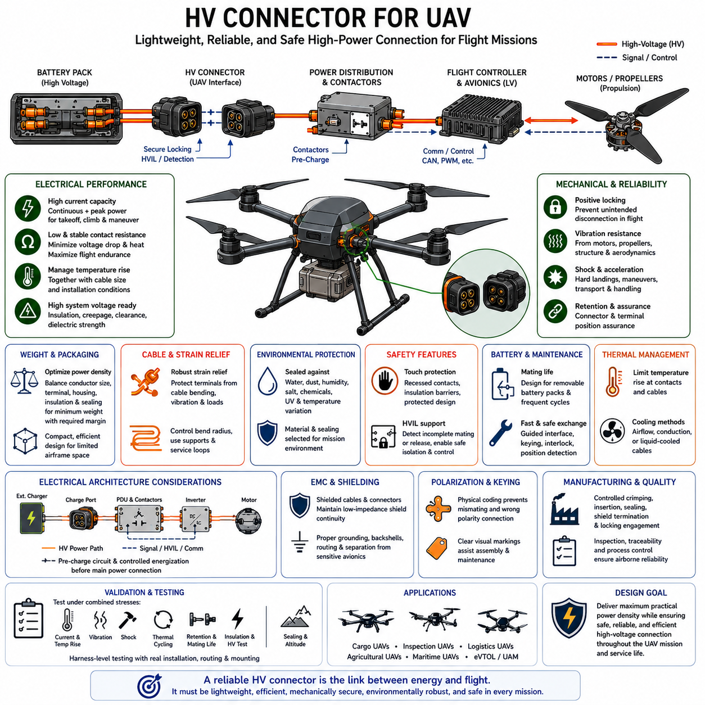

**Volume 03. Connector Engineering**

# Chapter 09. High Voltage Connectors

## 09.01. HV Interlock (HVIL) Design

{width="7.268055555555556in" height="7.268055555555556in"}

고전압 인터록 루프(High-Voltage Interlock Loop), 일반적으로 고전압 인터록(HVIL)이라고 불리는 시스템은 고전압 커넥터 시스템에 통합되는 저전압 감시 회로(Low-Voltage Monitoring Circuit)이다. 이는 커넥터, 서비스 분리 장치(Service Disconnect), 커버 또는 기타 보호 인터페이스가 올바르게 조립되어 있는지를 감지한다. 커넥터 아키텍처에서 HVIL은 구동 전력을 직접 전달하는 것이 아니라 기계적 연결 건전성(Mechanical Connection Integrity)을 전기적으로 나타내는 역할을 한다.

기본 원리는 고전압 연결 경로(High-Voltage Connection Path)를 따라 전용 저에너지 회로(Low-Energy Circuit)를 구성하는 것이다. 감시 대상인 모든 커넥터가 완전히 체결되고 잠겨 있으면 HVIL 회로는 정상적인 전기적 루프를 형성한다. 커넥터가 부분적으로 분리되거나 서비스 커버가 열리거나 감시 대상 부품이 제거되면 루프 상태가 변하고, 감시 제어기(Supervisory Controller)는 이를 감지하여 적절한 고전압 차단 절차를 시작한다.

HVIL이 특히 중요한 이유는 고전압 커넥터의 기계적 분리가 파워 접점(Power Contact)에 상당한 전류가 흐르는 상태에서 발생해서는 안 되기 때문이다. 통전 상태의 접점이 분리되면 전기 아크(Electrical Arc)가 발생하고 접촉면이 손상되며 국부적인 온도 상승과 위험 전압 노출이 발생할 수 있다. 따라서 인터록(Interlock)은 커넥터가 완전히 분리되기 전에 시스템이 통전 상태에서 제어된 전기적 안전 상태로 전환되도록 지원한다.

일반적인 고전압 커넥터(HV Connector)는 결과적으로 두 가지 서로 다른 전기적 기능을 포함한다. 대형 파워 단자(Power Terminal)는 고전압 양극과 음극 도체를 연결하고, 소형 보조 단자(Auxiliary Terminal)는 HVIL 연결을 담당한다. 이러한 보조 접점은 커넥터 체결 메커니즘과 의도적으로 연계되어 접점의 전기적 상태가 커넥터의 체결 상태를 나타내도록 한다. 따라서 접점 구조, 접촉 순서, 단자 유지력 및 기계적 공차가 전체 안전 개념의 기능적 요소가 된다.

접점 순서(Contact Sequencing)는 HVIL 커넥터 설계에서 가장 중요한 요소 중 하나이다. 분리 과정에서는 주 고전압 접점(Main HV Contact)이 통전 상태에서 위험하게 분리되기 전에 인터록 접점의 상태가 먼저 변경되어야 한다. 반대로 연결 과정에서는 시스템이 고전압을 인가하기 전에 파워 인터페이스(Power Interface)가 기계적으로 안정되게 체결되어야 한다. 이러한 동작은 단계별 접점 길이, 커넥터 위치 보증(Connector Position Assurance), 또는 이차 잠금 구조(Secondary Locking Structure)를 통해 구현할 수 있다.

이에 따른 동작은 제어된 일련의 사건으로 이해할 수 있다. 사용자가 커넥터 잠금을 해제하기 시작하면 HVIL 회로가 개방되고, 제어기가 회로 단절을 감지하며, 고전압 제어 시스템은 컨택터(Contactor) 또는 이에 상응하는 스위칭 장치를 동작시켜 하위 회로의 전원을 제거하도록 명령한다. 이후에야 파워 단자가 완전히 분리될 수 있어야 하며, 필요한 시간 설계에는 감지 시간, 제어기 응답, 스위칭 지연 및 잔류 에너지 방전 시간이 고려되어야 한다.

HVIL 시스템은 단순한 연속성 배선(Continuity Wire)으로 취급해서는 안 된다. 견고한 구현에서는 루프의 전기적 특성을 감시하여 정상 연결, 개방 회로(Open Circuit), 단락 회로(Short Circuit), 그리고 일부 배선 고장을 서로 구별할 수 있도록 한다. 시스템 아키텍처에 따라 제어기는 저항, 전압, 전류 또는 부호화된 전기 상태(Encoded Electrical State)를 평가할 수 있다. 특히 인터록이 단락되면 모든 커넥터가 정상 연결된 것처럼 잘못 판단될 수 있으므로 진단 범위(Diagnostic Coverage)가 중요하다.

직렬 연결 HVIL 아키텍처(Series-Connected HVIL Architecture)는 하나의 연속적인 루프를 통해 여러 고전압 인터페이스를 감시할 수 있기 때문에 일반적으로 사용된다. 회로는 배터리 인클로저(Battery Enclosure), 전력 분배 장치(Power Distribution Unit), 인버터(Inverter), 충전기(Charger), DC-DC 컨버터(DC-DC Converter), 서비스 분리 장치 및 기타 HV 커넥터를 통과한 후 감시 제어기로 돌아올 수 있다. 어느 한 인터페이스가 개방되면 전체 체인이 끊어지지만, 정확한 고장 위치를 식별하려면 추가 진단이나 분할 감시(Segmented Monitoring)가 필요할 수 있다.

따라서 커넥터 잠금 아키텍처(Connector Locking Architecture)와 HVIL 동작은 함께 설계되어야 한다. 일차 래치(Primary Latch)가 기본적인 기계적 고정을 담당하는 동안 이차 잠금 장치(Secondary Lock) 또는 커넥터 위치 보증 기능은 커넥터가 목표 체결 위치에 도달했는지를 확인한다. 높은 무결성이 요구되는 설계에서는 하우징이 단순히 접촉했다는 이유만으로 HVIL 단자가 정상 연결을 표시해서는 안 되며, 파워 접점 형상, 밀봉, 유지력 및 전기적 성능이 확보되는 충분한 체결 상태와 연동되어야 한다.

HVIL 고장이 발생한 이후 고전압 시스템의 대응은 시스템 아키텍처에 따라 결정된다. 일반적으로 고장이 감지되면 감시 제어기가 고전압 활성화를 금지하거나 주 고전압 컨택터(Main HV Contactor)를 개방하도록 요청한다. 그러나 배터리 컨택터를 개방한다고 해서 모든 위치의 전압이 즉시 제거되는 것은 아니므로 DC 링크 커패시터(DC-Link Capacitor)와 기타 하위 구성요소에 저장된 에너지도 고려해야 한다. 따라서 방전 회로(Discharge Circuit)와 전압 감시(Voltage Monitoring)는 HVIL을 대체하는 것이 아니라 상호 보완한다.

HVIL 배선 자체도 다른 안전 관련 신호 회로(Safety-Related Signal Circuit)와 동일한 수준의 엔지니어링 관리가 필요하다. 배선 경로, 단자 유지력, 크림프 품질(Crimp Quality), 진동 저항성, 마모 방지, 커넥터 밀봉 및 저항 안정성이 진단 신뢰성에 영향을 줄 수 있다. 인터록 배선이 손상되면 불필요한 고전압 차단이 발생할 수 있고, 의도하지 않은 우회 연결(Bypass)은 보호 기능 자체를 무력화할 수 있으므로 하네스 설계에서는 안전한 고장 감지와 오작동 방지를 함께 고려해야 한다.

환경 영향(Environmental Effects)은 이동형 로봇(Mobile Robot)에서 특히 중요하다. 진동, 기계적 충격, 습기, 오염, 열 사이클(Thermal Cycling), 케이블 움직임 및 반복적인 유지보수는 보조 접점의 동작을 점진적으로 변화시킬 수 있다. 프레팅(Fretting), 단자 이완, 부식 또는 불완전한 잠금은 파워 단자가 연결된 상태에서도 간헐적인 HVIL 신호를 발생시킬 수 있다. 따라서 전기적 임계값, 진단 필터링, 고장 지속 조건 및 유지보수 절차를 정의할 때 이러한 과도 현상을 고려해야 한다.

필터링(Filtering)은 세심한 균형이 필요하다. 지나치게 민감한 제어기는 진동이나 스위칭 노이즈로 발생한 짧은 신호 변화를 실제 커넥터 분리로 판단하여 로봇의 고전압 시스템을 반복적으로 차단할 수 있다. 반대로 과도한 필터링은 실제 분리 사건의 인식을 지연시킬 수 있다. 따라서 HVIL 감지 전략은 실제 커넥터 개방 순서, 예상되는 전기적 노이즈 환경, 제어기 샘플링 특성, 컨택터 응답 및 허용 가능한 최대 통전 분리 시간을 기준으로 설계해야 한다.

HVIL은 시스템 시동 과정에서도 중요한 정보를 제공한다. 주 컨택터를 닫기 전에 시스템은 감시 대상 루프가 예상된 정상 상태인지 확인할 수 있다. 서비스 분리 장치가 제거되어 있거나 배터리 커넥터가 완전히 체결되지 않았거나 인클로저 인터록(Enclosure Interlock)이 개방되어 있다면 고전압 활성화를 차단할 수 있다. 이를 통해 인터록은 단순히 고장 발생 후 대응하는 차단 기능을 넘어 시스템의 사전 활성화 허가 로직(Pre-Energization Permissive Logic)과 진단 아키텍처의 일부가 된다.

정비성(Serviceability)은 실제 HVIL 설계에 큰 영향을 준다. 정비 작업자는 배터리 구획을 의도적으로 열거나 추진 시스템 구성품을 분리하거나 고전압 모듈을 교체할 수 있다. 인터록 아키텍처는 이러한 작업이 작업자의 절차 준수에만 의존하지 않고 시스템을 자연스럽게 비통전 상태(De-Energized State)로 전환시키도록 설계되어야 한다. 그러나 HVIL 상태만으로 무전압(Zero Voltage)을 보장할 수는 없으므로 적절한 전압 확인과 고전압 정비 절차가 반드시 병행되어야 한다.

자율이동로봇(AMR)과 기타 배터리 구동 로봇에서는 추진 전압과 저장 에너지가 증가할수록 HVIL의 중요성이 더욱 커진다. 로봇의 제한된 섀시 내부에는 구동 배터리(Traction Battery), 고출력 모터 드라이브, 충전 인터페이스, DC-DC 변환 장치 및 전력 분배 하드웨어가 분산 배치될 수 있다. 이러한 연결 지점에 인터록 감시를 통합하면 전기 아키텍처가 의도하지 않은 접근이나 분리를 감지하고 배터리 관리 시스템 및 전력 제어 시스템과 연계하여 대응할 수 있다.

커넥터 엔지니어링 구조에서 HVIL은 고전압 커넥터 엔지니어링(High-Voltage Connector Engineering)의 시작 부분에 위치하며, 이후 고전압 케이블 식별, 커넥터 선정, 충전 인터페이스 및 무인항공기(UAV) 응용으로 이어진다. 이는 고전압 커넥터 선정이 단순히 정격 전류, 정격 전압, 밀봉 및 패키징의 문제가 아니라는 중요한 원칙을 반영한다. 연결 시스템은 제어된 전원 인가, 안전한 분리, 고장 감지 및 유지보수가 가능한 시스템 통합까지 지원해야 한다.

완전한 HVIL 설계는 최종적으로 커넥터, 하네스, 제어기 및 시스템 수준에서 검증되어야 한다. 시험에는 정상 체결, 부분 체결, 의도적인 분리, 인터록 배선 단선, 관련 단락 조건, 진동에 의한 간헐적 접촉, 접촉 저항 변화 및 차단 타이밍이 포함되어야 한다. 검증의 목적은 단순히 고장이 감지되는지를 확인하는 것이 아니라 고전압 스위칭 및 방전 아키텍처가 의도한 안전 상태를 형성할 수 있을 만큼 충분히 빠르게 고장이 감지되는지를 확인하는 것이다.

따라서 가장 효과적인 설계 철학은 HVIL을 통합된 전기기계적 안전 기능(Integrated Electromechanical Safety Function)으로 이해하는 것이다. 커넥터 형상은 인터록 상태가 변경되는 시점을 결정하고, 하네스는 해당 정보를 전달하며, 진단 전자회로는 신호의 신뢰성을 판단하고, 전력 제어 아키텍처는 필요한 대응을 수행한다. 신뢰할 수 있는 고전압 분리는 이러한 기계적, 전기적, 진단적 및 제어 기능이 하나의 통합 시스템으로 설계되고 검증될 때 비로소 달성된다.

## 09.02. Orange Cable Safety Standard

{width="7.268055555555556in" height="7.268055555555556in"}

주황색 절연 및 외피 식별(Orange Insulation and Jacket Identification)은 고전압 전기 시스템(High-Voltage Electrical System)을 위한 기본적인 시각적 안전 규칙이다. 자동차, 이동형 로봇(Mobile Robotics), 산업용 차량 및 기타 전동화 플랫폼에서 주황색 케이블, 전선관, 커넥터 구성품 및 보호 커버는 해당 회로에 위험한 고전압이 존재할 가능성이 있음을 즉시 알려준다. 이러한 시각적 구분은 고전압 회로(HV Circuit)를 일반 저전압 배선과 명확하게 구별하도록 한다.

하나의 장비 내부에 여러 전압 영역(Voltage Domain)이 함께 존재하는 전기 아키텍처에서는 주황색 식별 규칙의 중요성이 더욱 커진다. 로봇에는 12 V 또는 24 V 제어 전자장치, 48 V 보조 장치, 통신 네트워크와 함께 훨씬 높은 전압의 추진 또는 충전 회로가 존재할 수 있다. 명확한 시각적 구분이 없다면 정비 작업자가 점검, 고장 진단, 조립 또는 수리 과정에서 고에너지 도체를 일반적인 저전압 하네스로 잘못 판단할 수 있다.

따라서 주황색 표시는 전기적 보호 장치(Electrical Protection Device)가 아니라 위험 식별 수단(Hazard-Identification Mechanism)으로 이해해야 한다. 색상 자체가 절연 기능을 제공하거나 감전을 방지하거나 고장 전류를 차단하거나 회로가 비통전 상태임을 보장하지는 않는다. 목적은 고전압 전기 영역의 존재를 빠르고 일관되게 전달하는 것이며, 실제 보호는 절연 시스템, 인클로저, 인터록(Interlock), 회로 보호, 접지 개념 및 통제된 정비 절차를 통해 제공되어야 한다.

필요한 경우 이러한 식별 원칙은 케이블 도체의 절연체뿐만 아니라 주변 구성품까지 확장되어야 한다. 고전압 하네스 어셈블리(HV Harness Assembly)는 주황색 외부 재킷, 주름관(Corrugated Tube), 열수축 소재(Heat-Shrink Material), 커넥터 하우징, 부트(Boot), 보호 슬리브 또는 라벨을 사용하여 설치 후에도 고전압 회로임을 쉽게 인식할 수 있도록 할 수 있다. 구체적인 구현 방법은 하네스 아키텍처, 환경 보호 전략, 커넥터 시스템, 기계적 패키징 및 적용되는 산업 요구사항에 따라 결정된다.

시각적 식별의 효과는 예측 가능한 해석에 의존하기 때문에 일관성(Consistency)이 매우 중요하다. 주황색이 관련 없는 저전압 회로, 공압 라인, 장식 부품 또는 일반 신호 하네스에도 사용되면 안전 표시로서의 의미가 약화된다. 따라서 전기 아키텍처 규칙에서는 가능한 범위에서 선택된 고전압 식별 체계를 HV 관련 구성품에만 사용하고, 해당 규칙을 하네스 도면, 전기 회로도, 정비 매뉴얼, 제조 작업 지침 및 시스템 안전 문서에 명확하게 정의해야 한다.

고전압 케이블 식별(High-Voltage Cable Identification)은 가능한 범위에서 설치된 배선 경로 전체에 걸쳐 시각적으로 확인할 수 있어야 한다. 배터리 구획, 전력 분배 영역, 모터 드라이브 어셈블리, 충전 시스템 또는 정비 접근 구역을 통과하는 하네스 구간은 대규모 분해 작업 없이도 고전압 배선임을 인식할 수 있어야 한다. 케이블이 추가적인 기계적 보호재 내부에 설치되는 경우 외부 보호재에서도 의도된 HV 식별 특성이 유지되어야 한다.

케이블 라우팅(Cable Routing)과 주황색 식별은 함께 적용되지만 서로 다른 목적을 가진다. 라우팅 엔지니어링은 과도한 굽힘, 마모, 압착, 열 노출, 진동 손상 및 움직이는 기구와의 간섭을 방지하고, 주황색 식별은 전기적 위험을 전달한다. 올바른 색상의 케이블도 잘못 배치되면 절연 손상이 발생할 수 있으며, 기계적으로 보호된 HV 케이블도 식별이 불충분하면 정비 위험을 초래할 수 있다. 따라서 두 요구사항을 동시에 고려해야 한다.

고전압 커넥터(High-Voltage Connector) 역시 저전압 인터페이스와 신속하게 구별될 수 있어야 한다. 특히 좁은 인클로저 내부에 여러 종류의 커넥터가 설치되는 경우 주황색 하우징, 이차 잠금 장치(Secondary Lock), 백셸(Backshell), 케이블 실(Cable Seal) 또는 주변 표시를 통해 HV 식별을 강화할 수 있다. 색상만으로 잘못된 체결을 방지할 수 없으므로 기계적 키잉(Mechanical Keying)과 극성화(Polarization)는 여전히 필수적이지만, 일관된 시각적 코딩은 조립 과정의 인식성을 높이고 부적절한 정비 작업 가능성을 줄여준다.

이러한 식별 체계는 비상 대응과 유지보수 과정에서 특히 유용하다. 인클로저가 개방되거나 손상된 장비를 검사할 때 주황색 구성품은 추가적인 전기 안전 조치가 필요할 수 있음을 즉시 알려주는 시각적 신호가 된다. 작업자는 관련 구성품을 만지거나 제거하기 전에 분리 절차, 개인 보호 장비(Personal Protective Equipment), 절연 상태 확인 또는 전문적인 정비 지침이 필요한지를 판단할 수 있다.

그러나 눈에 보이는 주황색 배선만을 위험 전압이 존재할 수 있는 유일한 위치로 해석해서는 안 된다. 도전성 버스바(Busbar), 배터리 내부 연결부, 인버터 DC 링크(Inverter DC Link), 커패시터, 단자 및 밀폐된 전력 전자장치에도 주황색 케이블이 보이지 않는 상태에서 위험한 전기 에너지가 남아 있을 수 있다. 마찬가지로 주황색 케이블은 적절한 시스템 차단 및 검증 절차를 통해 전기적 상태가 확인될 때까지 잠재적으로 위험한 것으로 취급해야 한다.

서비스 분리 장치(Service Disconnect)와 고전압 인터록 루프(HVIL)는 주황색 식별 체계를 보완한다. 주황색은 작업자에게 HV 회로에 접근하고 있음을 경고하고, 서비스 분리 장치는 에너지 경로를 의도적으로 차단하는 수단을 제공한다. HVIL은 감시 대상 인터페이스의 개방 또는 불완전한 연결을 감지하여 시스템 차단을 요청할 수 있다. 이러한 장치들은 서로 다른 보호 계층을 형성하므로 서로 대체 가능한 안전 기능으로 취급해서는 안 된다.

케이블 구조 자체는 색상과 관계없이 적용 시스템의 전기적 및 환경적 요구조건을 충족해야 한다. 도체 단면적(Conductor Cross-Sectional Area)은 운전 전류를 충분히 전달할 수 있어야 하고, 절연체는 시스템 최대 전압을 견뎌야 하며, 재료는 예상되는 온도, 진동, 유체, 습기, 마모 및 기계적 응력을 견딜 수 있어야 한다. 인버터와 모터 사이에서 빠르게 스위칭되는 전류가 상당한 전자기 간섭(EMI)을 발생시키는 경우에는 차폐(Shielding)도 필요할 수 있다.

차폐 고전압 케이블(Shielded HV Cable)은 중앙 도체, 일차 절연체, 차폐층 및 외부 보호 재킷을 포함할 수 있으므로 추가적인 식별 고려가 필요하다. 일반적으로 가장 바깥쪽의 가시적인 층이 실질적인 시각적 식별 기능을 제공하고, 차폐 종단(Shield Termination)은 적절한 커넥터 및 접지 아키텍처를 통해 처리된다. 따라서 주황색 재킷은 차폐 연속성, 밀봉, 스트레인 릴리프(Strain Relief) 또는 커넥터 종단 품질을 저해하지 않으면서 전자파 적합성(EMC) 요구사항과 함께 구현되어야 한다.

제조 공정은 케이블 준비 단계부터 최종 차량 또는 로봇 조립 단계까지 이러한 식별 규칙을 유지해야 한다. 잘못된 슬리브, 대체 케이블, 현지에서 조달한 부품 또는 문서화되지 않은 수리로 인해 일부 구간이 의도된 시각적 체계를 따르지 않을 수 있다. 따라서 하네스 자재명세서(BOM), 도면, 작업 지침, 검사 기준 및 승인 부품 목록(Approved Component List)에는 형상 관리(Configuration Control)의 일부로 요구되는 HV 케이블 외관을 명확히 정의해야 한다.

유지보수와 현장 수리(Field Repair)에서도 동일한 규율이 필요하다. 전기적으로 동일한 성능을 갖더라도 주황색 표시가 없는 케이블로 기존 HV 케이블을 교체하면 도체 및 절연 정격이 기술적으로 적합하더라도 시스템 수준의 안전성이 저하될 수 있다. 교체 부품은 전기 정격, 환경 성능, 커넥터 호환성, 차폐 요구사항, 기계적 보호 및 고전압 식별을 모두 유지하여 수리된 시스템에서도 기존의 안전 정보 전달 전략이 유지되도록 해야 한다.

환경 노화(Environmental Aging)도 고려해야 한다. 색상 식별은 충분히 인식 가능한 상태로 유지되는 동안에만 의미가 있기 때문이다. 열, 자외선(UV), 화학물질, 오일, 세척제, 마모 및 오염은 케이블 표면을 변색시키거나 식별을 어렵게 만들 수 있다. 실외 자율이동로봇(AMR), 검사 로봇, 광산 차량, 농업 장비 및 무인항공기(UAV) 전력 시스템은 특히 가혹한 환경에 노출될 수 있으므로 재료 선정과 검증 과정에서 목표 사용 수명 동안 식별성이 충분히 유지되는지를 확인해야 한다.

검사 프로그램(Inspection Program)은 주황색 HV 식별을 정기적인 육안 검사 과정의 일부로 활용할 수 있다. 기술자는 HV 배선 경로를 따라가면서 마모, 절단, 압착된 전선관, 느슨한 커넥터, 오염, 손상된 스트레인 릴리프, 누락된 보호 커버 또는 승인되지 않은 변경 사항을 확인할 수 있다. 따라서 이러한 시각적 규칙은 즉각적인 위험 인식뿐만 아니라 효율적인 유지보수와 고전압 하네스 건전성(HV Harness Integrity)의 체계적인 검증에도 기여한다.

로봇 플랫폼에서는 높은 패키징 밀도(Packaging Density) 때문에 체계적인 식별이 특히 중요하다. 배터리, 모터 제어기, DC-DC 컨버터, 충전기, 컴퓨터, 센서 및 통신 장비가 동일한 섀시 공간에 배치될 수 있다. HV 전력, 저전압 전력 및 신호 네트워크를 명확하게 구분하면 조립과 고장 진단이 단순해지며, 제한된 기계적 공간에서도 연면거리(Creepage), 공간거리(Clearance), 배선 분리, EMC 제어 및 정비 접근성을 적절하게 유지하는 데 도움이 된다.

검증(Validation)은 개별 주황색 케이블만이 아니라 설치가 완료된 전체 HV 하네스를 대상으로 수행해야 한다. HV 회로가 일관되게 식별되는지, 중요한 정비 위치에서 식별 요소가 가려지지 않는지, 보호 커버가 동일한 식별 체계를 유지하는지, 교체 부품이 같은 규칙을 따르는지, 그리고 라벨의 가독성이 유지되는지를 확인해야 한다. 고전압 안전은 여러 요소의 결합된 효과에 의존하므로 전기적, 기계적, 환경적, 제조 및 정비 요구사항을 함께 평가해야 한다.

커넥터 엔지니어링(Connector Engineering)의 전체 구조에서 주황색 케이블 식별은 고전압 인터록 설계(HV Interlock Design) 다음에 배치되며, 이후 세부적인 고전압 커넥터 선정, 충전 인터페이스 및 UAV용 고전압 커넥터로 이어진다. 이러한 순서는 고전압 커넥터 엔지니어링이 개별 부품 선정에 앞서 위험 인식(Hazard Recognition)과 통제된 접근(Controlled Access)에서 시작한다는 점을 강조한다. 또한 전체 전기 아키텍처에서는 커넥터 엔지니어링을 하네스, 전력, 접지, 안전 및 검증 엔지니어링과 함께 독립적인 핵심 기술 영역으로 다룬다.

궁극적으로 주황색 케이블 식별은 심층 방어형 고전압 안전 아키텍처(Defense-in-Depth High-Voltage Safety Architecture)를 구성하는 하나의 보호 계층으로 이해해야 한다. 시각적 식별은 사람에게 위험을 경고하고, 절연은 의도하지 않은 전기 접촉을 방지하며, 커넥터 잠금은 기계적 분리를 제어한다. HVIL은 인터페이스 상태를 감지하고, 컨택터는 에너지를 격리하며, 회로 보호 장치는 전기적 고장에 대응하고, 정비 절차는 사람과 고전압 시스템 사이의 상호작용을 통제한다. 효과적인 고전압 엔지니어링은 하나의 안전 기능에 의존하는 것이 아니라 이러한 모든 보호 메커니즘을 통합적으로 조정함으로써 달성된다.

## 09.03. HV Connector Selection Criteria

{width="7.268055555555556in" height="7.268055555555556in"}

고전압 커넥터 선정(High-Voltage Connector Selection)은 커넥터의 크기나 외관이 아니라 시스템의 전기 아키텍처(Electrical Architecture)에서 시작해야 한다. 선정된 인터페이스는 해당 회로의 최대 동작 전압, 연속 전류, 과도 전류, 절연 요구사항, 환경 조건 및 예상 수명을 만족해야 한다. 로봇에서는 추진, 충전, 배터리 및 보조 고전압 회로가 서로 매우 다른 운전 특성을 가질 수 있으므로 이러한 요구사항을 통합적으로 평가해야 한다.

전압 정격(Voltage Rating)은 첫 번째 기본적인 선정 기준을 결정한다. 커넥터는 정상 운전, 충전, 회생(Regeneration), 고장 조건 및 관련 전기적 과도 현상에서 발생할 수 있는 최고 전압에 대해 충분한 절연 성능을 제공해야 한다. 따라서 배터리의 공칭 전압만으로는 충분하지 않다. 커넥터의 절연 구조, 유전체 재료(Dielectric Material), 연면거리(Creepage Distance), 공간거리(Clearance Distance), 오염 수준 및 환경 노출 조건이 실제 시스템 최대 전압과 적합해야 한다.

전류 용량(Current Capability)은 카탈로그의 정격값만으로 판단하지 않고 실제 운전 조건을 기준으로 평가해야 한다. 고전압 커넥터에서는 주로 도체 저항과 접촉 저항(Contact Resistance)에 의해 열이 발생하며, 전류와 저항이 증가하면 온도 상승도 커진다. 연속적인 추진 부하, 가속 피크, 충전 전류, 회생 제동(Regenerative Braking) 및 보조 전력 수요는 서로 다른 열적 특성을 만들 수 있으므로 정상상태 전류와 대표적인 과도 듀티 사이클(Transient Duty Cycle)을 모두 고려해야 한다.

온도 디레이팅(Temperature Derating)은 주변 온도가 증가하면 일반적으로 커넥터의 허용 전류가 감소하기 때문에 특히 중요하다. 인버터, 모터, 배터리 또는 밀폐된 전력 분배 장치(Power Distribution Unit) 주변에 설치된 커넥터는 시험실 기준 조건보다 훨씬 높은 온도에서 동작할 수 있다. 따라서 케이블 크기, 단자 저항, 접점 도금(Contact Plating), 하우징 재료, 공기 흐름, 주변 열원 및 인클로저 온도를 하나의 열 시스템(Thermal System)으로 평가해야 한다.

접촉 저항(Contact Resistance)은 또 다른 핵심 선정 기준이다. 작은 저항 증가라도 높은 전류가 커넥터를 통과하면 상당한 국부 발열을 발생시킬 수 있다. 단자 형상, 접점 수직력(Contact Normal Force), 도금 재료, 크림프 품질(Crimp Quality), 체결 상태, 오염 및 노화가 저항 안정성에 영향을 준다. 따라서 단순히 초기 접촉 저항이 낮은 커넥터가 아니라 요구되는 환경 조건과 체결 수명 동안 충분히 안정적인 전기 접촉을 유지할 수 있는 커넥터를 선정해야 한다.

케이블 호환성(Cable Compatibility)은 커넥터 선정과 동시에 검증해야 한다. HV 단자는 일반적으로 특정 도체 단면적, 절연체 직경, 케이블 구조 및 종단 공정(Termination Process)에 맞도록 설계된다. 사용하려는 케이블과의 호환성을 확인하지 않고 커넥터를 선정하면 부적절한 크림핑, 밀봉, 스트레인 릴리프(Strain Relief) 또는 전류 용량 문제가 발생할 수 있다. 차폐 모터 케이블(Shielded Motor Cable)은 차폐 종단, 백셸(Backshell) 구조 및 전자파 적합성(EMC)에 대한 추가 요구사항을 가질 수 있다.

기계적 패키징(Mechanical Packaging)은 로봇과 자율주행 차량에서 실제 커넥터 선정에 큰 영향을 미친다. 사용 가능한 공간, 커넥터 방향, 체결 방향, 케이블 굽힘 반경, 정비 접근성, 주변 구조물 및 하네스 라우팅이 이론적으로 적합한 커넥터를 실제로 통합할 수 있는지를 결정한다. 직선형과 직각형 구성은 패키징 결과가 크게 달라질 수 있으며, 고전류 케이블은 과도한 굽힘과 기계적 하중을 방지할 수 있도록 커넥터 후방에 충분한 공간이 필요하다.

커넥터 유지 구조(Connector Retention)는 전체 운전 기간 동안 기계적 환경을 견딜 수 있어야 한다. 이동형 로봇은 HV 인터페이스를 지속적인 진동, 반복적인 충격, 섀시 변형, 케이블 움직임 및 우발적인 충돌에 노출시킬 수 있다. 일차 잠금 장치(Primary Locking Mechanism)는 안정적인 체결을 유지해야 하며, 이차 잠금 장치(Secondary Lock) 또는 커넥터 위치 보증(Connector Position Assurance)은 불완전한 체결 가능성을 줄일 수 있다. 개별 접점이 하우징 내부에서 올바르게 유지되도록 단자 위치 보증(Terminal Position Assurance)이 필요할 수도 있다.

환경 밀봉 요구사항(Environmental Sealing Requirement)은 설치 위치에 따라 결정된다. 보호된 전기 인클로저 내부에 위치한 커넥터는 비교적 제한된 오염에 노출되지만 외부에 설치된 커넥터는 물, 먼지, 진흙, 오일, 세척제, 염분 및 고압 세척에 노출될 수 있다. 따라서 실제 설치 환경에 따라 적절한 방진·방수 보호(Ingress Protection), 인터페이스 실(Interface Seal), 와이어 실(Wire Seal), 캐비티 보호(Cavity Protection) 및 하우징 재료를 선정해야 하며, 시스템상의 근거 없이 단순히 가장 높은 IP 등급만을 적용해서는 안 된다.

고전압 인터록 루프 기능(HVIL Functionality)은 위험한 에너지가 존재할 가능성이 있는 상태에서 정비, 분리 또는 접근할 수 있는 커넥터를 선정할 때 고려해야 한다. HVIL 호환 커넥터는 시스템이 커넥터 해제 또는 불완전한 체결 상태를 감지할 수 있도록 보조 접점(Auxiliary Contact)을 제공한다. 적절한 접점 순서(Contact Sequencing)를 적용하면 통전된 파워 접점이 위험하게 분리되기 전에 인터록 상태가 먼저 변경되어 제어기가 컨택터 개방을 명령하고 전기 시스템을 안전 상태로 전환할 시간을 확보할 수 있다.

접촉 방지(Touch Protection) 역시 정비 가능한 HV 인터페이스의 중요한 고려사항이다. 커넥터 구조는 정상적인 취급, 체결 또는 분리 과정에서 작업자가 위험한 도전성 부품과 접촉할 가능성을 최소화해야 한다. 매입형 접점(Recessed Contact), 보호 하우징 구조, 단자 배리어(Terminal Barrier), 잠금 구조 및 제어된 체결 순서가 이러한 목적에 기여한다. 필요한 보호 수준은 커넥터가 완전히 체결된 상태뿐 아니라 의도적으로 분리된 상태에서도 평가해야 한다.

시각적인 고전압 식별(Visual High-Voltage Identification)은 전기적 및 기계적 선정 기준을 보완한다. 주황색 하우징, 케이블 재킷, 백셸 또는 표시는 HV 회로를 저전압 전력 및 신호 연결과 구별하는 데 사용할 수 있다. 그러나 주황색 식별은 시각적 안전 규칙에 불과하며 전기적 보호 기능을 대체할 수 없다. 커넥터 자체는 독립적으로 내전압, 절연, 접촉 방지, 잠금, 밀봉, 인터록 및 환경 요구사항을 만족해야 한다.

전자파 적합성(Electromagnetic Compatibility)은 배터리, 인버터, 모터 드라이브, DC-DC 컨버터 및 전기 모터 사이에 커넥터를 사용할 때 중요한 요소가 된다. 빠른 스위칭 동작은 상당한 전도성 및 방사성 전자기 노이즈를 발생시킬 수 있다. 따라서 차폐 케이블 시스템(Shielded Cable System)에는 인터페이스 전체에서 낮은 임피던스의 종단을 통해 적절한 차폐 연속성(Shield Continuity)을 유지할 수 있는 커넥터가 필요하다. 차폐 아키텍처는 케이블 구조, 커넥터 백셸, 인클로저 접지 및 전체 EMC 전략과 함께 설계해야 한다.

체결 사이클(Mating Cycle) 요구사항은 실제 사용 목적을 반영해야 한다. 영구적으로 설치되는 배터리-인버터 커넥터는 의도적인 체결과 분리가 거의 발생하지 않을 수 있지만, 탈착식 배터리, 충전 인터페이스, 교환식 모듈 및 서비스 커넥터는 반복적으로 사용될 수 있다. 접점 마모, 도금 내구성, 밀봉면, 잠금 구성품 및 삽입·인출력(Insertion and Extraction Force)은 새 제품 상태뿐 아니라 지정된 체결 사이클 수명 전체에서 허용 가능한 수준을 유지해야 한다.

삽입력과 인출력(Insertion and Extraction Force)은 조립성과 정비성에도 영향을 준다. 대형 다접점 또는 고전류 커넥터는 특히 강력한 밀봉 구조가 적용되면 상당한 체결력이 필요할 수 있다. 과도한 힘은 불완전한 체결, 하우징 손상, 케이블 하중 또는 잘못된 정비 작업의 가능성을 증가시킨다. 레버 메커니즘(Lever Mechanism), 슬라이딩 잠금 장치, 가이드 인터페이스 및 명확한 위치 표시 기능은 사용성을 향상시키면서 전기 접점의 기계적 체결을 안정적으로 제어할 수 있다.

커넥터 극성화(Connector Polarization)와 기계적 키잉(Mechanical Keying)은 동일한 시스템에 유사한 HV 인터페이스가 여러 개 존재할 때 필수적이다. 기계적 코딩(Mechanical Coding)은 하우징의 크기와 형상이 유사하더라도 서로 호환되지 않는 회로가 실수로 연결되는 것을 방지해야 한다. 색상 코딩과 라벨은 작업자를 보조할 수 있지만 물리적인 비호환 구조가 오체결(Mismating)에 대해 더 강력한 보호를 제공한다. 이는 배터리, 충전기, 컨버터, 인버터 및 여러 구동 장치가 포함된 고밀도 로봇 전력 아키텍처에서 특히 중요하다.

제조성(Manufacturability)은 커넥터 성능이 종단 품질에 크게 의존하기 때문에 선정 과정에 포함되어야 한다. 필요한 크림핑 장비, 어플리케이터(Applicator), 조립 공구, 실 설치 공정, 단자 삽입 절차, 검사 방법 및 작업자 접근성을 양산 승인 전에 충분히 파악해야 한다. 기술적으로 우수한 커넥터라도 신뢰성 있는 제조를 위해 필요한 공구, 공정 관리 또는 공급업체 지원을 현실적으로 유지할 수 없다면 적합한 선택이 아닐 수 있다.

정비성(Serviceability)과 교체 전략도 부품 선정에 영향을 주어야 한다. 기술자는 단자, 실, 케이블 또는 잠금 장치를 손상시키지 않고 통제된 절차에 따라 HV 인터페이스를 식별하고, 잠금을 해제하고, 분리하고, 검사하고, 다시 연결할 수 있어야 한다. 교체용 단자, 실, 하우징, 단자 제거 공구(Extraction Tool), 수리 지침 및 승인된 케이블 어셈블리의 확보 가능성은 로봇이나 차량의 전체 운용 수명 동안 해당 커넥터의 유지보수 가능 여부를 결정할 수 있다.

공급업체 역량(Supplier Capability)과 제품 수명주기 공급 가능성(Lifecycle Availability)은 양산 플랫폼에서 더욱 중요해진다. 커넥터 제품군은 부품 공급 가능성, 품질 일관성, 기술 문서, 공구 지원, 지역별 공급망, 리드 타임 및 예상 제품 공급 수명을 기준으로 평가해야 한다. 여러 HV 서브시스템에 표준화된 커넥터 제품군을 사용하면 재고와 교육의 복잡성을 줄일 수 있지만, 표준화가 전기적, 열적, 환경적, 기계적 또는 안전 요구사항보다 우선해서는 안 된다.

검증(Validation)은 최종 설치 상태에서 예상되는 복합적인 스트레스를 재현해야 한다. 전기적 전류 및 온도 상승 시험과 함께 진동, 기계적 충격, 열 사이클(Thermal Cycling), 밀봉, 체결 내구성, 유지력, 절연 및 관련 고장 조건을 평가해야 한다. 특히 하네스 수준 시험(Harness-Level Testing)은 케이블 라우팅, 크림핑, 스트레인 릴리프, 차폐 및 커넥터 장착으로 인해 개별 커넥터 시험에서는 발견하기 어려운 고장 메커니즘이 발생할 수 있기 때문에 중요하다.

제공된 커넥터 엔지니어링(Connector Engineering) 구조에서 HV 커넥터 선정은 고전압 인터록 설계(HVIL Design)와 주황색 케이블 안전 식별(Orange-Cable Safety Identification) 다음에 위치하고, 이후 충전 포트와 UAV 전용 커넥터 응용으로 이어진다. 이러한 구성은 안전한 분리와 위험 식별에서 시작하여 부품 선정 및 응용별 시스템 통합으로 발전하는 흐름을 형성한다. 동시에 전체 로봇 전기 구조에서는 커넥터 엔지니어링을 전기, 하네스, 전력, 안전 및 검증 아키텍처가 통합된 시스템의 일부로 다룬다.

따라서 최종 선정 결정(Final Selection Decision)은 하나의 카탈로그 사양이 아니라 균형 잡힌 엔지니어링 평가를 기반으로 이루어져야 한다. 전압 마진, 전류 및 열 성능, 접촉 저항, 케이블 호환성, 밀봉, 진동 저항성, HVIL, 접촉 방지, EMC, 잠금, 패키징, 정비성, 제조 역량, 공급업체 지원 및 검증 근거가 하나의 솔루션으로 통합되어야 한다. 적합한 HV 커넥터란 궁극적으로 제품의 전체 수명주기(Product Lifecycle)에 걸쳐 전기적 성능과 고전압 안전을 유지하는 공학적으로 설계된 시스템 인터페이스(Engineered System Interface)이다.

## 09.04. Charge Port Connector (CCS, CHAdeMO)

{width="7.268055555555556in" height="7.268055555555556in"}

## 09.05. HV Connector for UAV

{width="7.268055555555556in" height="7.268055555555556in"}

무인항공기(UAV)용 고전압 커넥터(High-Voltage Connector)는 많은 고정형 응용 분야보다 더욱 까다로운 전기적 성능, 중량 효율성, 기계적 신뢰성 및 환경 내구성의 조합을 만족해야 한다. UAV 전력 아키텍처에서는 모든 중량이 탑재량과 비행 지속시간에 영향을 미치며, 커넥터 고장은 즉각적으로 추진 시스템이나 비행 안전에 영향을 줄 수 있다. 따라서 커넥터는 안정적인 전기적·기계적 성능을 유지하면서 높은 전력 밀도(Power Density)를 제공해야 한다.

UAV에서 고전압(High Voltage)의 정의는 단순히 배터리 공칭 전압만이 아니라 전체 추진 아키텍처(Propulsion Architecture)를 기준으로 고려해야 한다. 대형 화물 UAV와 전기 추진 항공기는 필요한 전력에서 전류를 감소시키기 위해 배터리 모듈을 직렬로 연결할 수 있다. 그러나 시스템 전압이 증가하면 커넥터 절연, 연면거리(Creepage Distance), 공간거리(Clearance Distance), 절연 내력(Dielectric Strength), 접촉 방지(Touch Protection) 및 제어된 분리(Controlled Disconnection)의 중요성도 증가한다.

전류 용량(Current Capability) 역시 매우 중요하다. 추진 모터는 상당한 연속 전력을 요구할 수 있으며 이륙, 상승, 기동 또는 외란 복구 과정에서는 훨씬 높은 과도 전력(Transient Power)을 요구할 수 있기 때문이다. 따라서 커넥터 선정에서는 연속 전류, 피크 전류 크기, 피크 지속시간 및 듀티 사이클(Duty Cycle)을 고려해야 한다. 순항 중에는 충분한 커넥터라도 반복적인 고출력 비행 단계에서는 과열되거나 과도한 전압 강하가 발생할 수 있다.

전기적 손실(Electrical Loss)은 UAV 효율에 직접적인 영향을 준다. 접촉 저항(Contact Resistance)은 전압 강하를 발생시키고 전기 에너지를 유용한 추진력이 아닌 열로 변환한다. 배터리 에너지가 제한되어 있기 때문에 불필요한 커넥터 손실은 사용 가능한 비행 지속시간을 감소시키면서 열적 스트레스를 증가시킨다. 따라서 커넥터 수명 전체에 걸쳐 낮고 안정적인 접촉 저항을 유지하는 것은 전기 효율뿐 아니라 신뢰성 측면에서도 중요한 요구사항이다.

온도 상승(Temperature Rise)은 도체 크기 및 설치 조건과 함께 평가해야 한다. 경량 UAV에서는 자연스럽게 더 작은 케이블과 커넥터를 사용하려는 경향이 있지만 과도한 소형화는 전류 밀도와 열 부하를 증가시킨다. 커넥터 단자, 케이블 도체, 크림프(Crimp), 하우징 및 주변 구조물은 서로 연계된 열 시스템(Thermal System)을 구성한다. 선정된 인터페이스는 대표적인 지상 운전, 이륙, 상승, 순항, 착륙 및 충전 조건에서 허용 온도 범위를 유지해야 한다.

중량 최적화(Mass Optimization)는 단순히 가장 작은 커넥터를 선택하는 것이 아니라 시스템 수준의 절충(System-Level Tradeoff)을 통해 이루어져야 한다. 지나치게 작은 인터페이스는 저항, 온도, 기계적 스트레스 및 고장 가능성을 증가시키고, 지나치게 큰 커넥터는 불필요한 중량과 패키징 부피를 증가시킨다. 적합한 설계는 도체 단면적, 단자 크기, 하우징 구조, 잠금 메커니즘, 절연거리, 환경 밀봉 및 필요한 안전 마진을 균형 있게 조정하여 적절한 전력 밀도를 달성해야 한다.

진동 저항성(Vibration Resistance)은 UAV 커넥터가 모터, 프로펠러, 로터, 기어박스, 공기역학적 하중 및 구조 고유진동으로부터 지속적인 가진(Excitation)을 받을 수 있기 때문에 특히 중요하다. 반복적인 진동은 단자 프레팅(Fretting), 접촉 저항 변화, 래치 마모, 배선 피로 및 커넥터 움직임을 발생시킬 수 있다. 따라서 확실한 유지 구조, 적절한 접촉 수직력(Contact Normal Force), 스트레인 릴리프(Strain Relief), 케이블 지지 및 적절한 장착 방식이 커넥터 신뢰성의 핵심 요소가 된다.

기계적 충격(Mechanical Shock)과 가속 하중도 고려해야 한다. 강한 착륙, 비상 기동, 화물 취급, 운송 및 국부적인 구조 충격은 정상적인 진동과 상당히 다른 하중을 발생시킬 수 있다. 커넥터 하우징, 단자 유지 시스템, 잠금 구조 및 하네스 고정부는 순간적인 분리 또는 단자 이동을 방지해야 한다. 추진 전력 경로에서는 매우 짧은 순간의 전원 단절조차 비행 필수 시스템(Flight-Critical System)에서 허용할 수 없는 결과를 초래할 수 있다.

따라서 확실한 잠금(Positive Locking)은 추진 및 배터리 인터페이스의 기본적인 요구사항이다. 의도하지 않은 분리로 비행 전력이 차단될 수 있는 위치에서는 마찰력만으로 충분한 유지력을 제공한다고 가정해서는 안 된다. 아키텍처에 따라 일차 잠금 장치(Primary Lock), 이차 잠금 장치(Secondary Lock), 커넥터 위치 보증(Connector Position Assurance), 단자 위치 보증(Terminal Position Assurance) 또는 공구 제어식 해제 장치를 사용할 수 있다. 잠금 구조는 제조 및 유지보수를 지원하면서도 비행 중에는 안정적으로 유지되어야 한다.

고출력 UAV 케이블은 경량 기체 구조에 비해 상대적으로 강성이 높을 수 있기 때문에 케이블 스트레인 릴리프(Cable Strain Relief)에 특별한 주의가 필요하다. 적절한 지지가 없으면 케이블 굽힘이나 진동으로 발생하는 힘이 커넥터 단자로 직접 전달될 수 있다. 적절한 백셸(Backshell) 구조, 클램프, 서비스 루프(Service Loop), 굽힘 반경 제어 및 하네스 고정점을 통해 기계적 하중이 전기 접점으로 전달되는 것을 줄이고 종단부 근처의 도체 피로를 방지해야 한다.

환경 요구사항(Environmental Requirements)은 UAV 응용 분야에 따라 크게 달라진다. 소형 실내 비행체는 비교적 통제된 환경에서 운용될 수 있지만 실외 검사, 물류, 농업, 해양 또는 화물 UAV는 비, 먼지, 습도, 염분, 화학물질, 자외선 및 큰 온도 변화에 노출될 수 있다. 따라서 커넥터 밀봉과 재료 선정은 모든 UAV에 동일한 환경 사양을 적용하는 것이 아니라 실제 임무 프로파일(Mission Profile)을 반영해야 한다.

고도(Altitude)는 전기 절연 설계에 추가적인 고려사항을 제공한다. 낮아진 공기 밀도는 노출된 전기적 간극의 절연 특성에 영향을 줄 수 있으므로 운용 고도와 시스템 전압이 증가할수록 적절한 공간거리 설계가 중요해진다. 따라서 커넥터 선정에서는 목표 고도 범위를 전압, 오염, 인클로저 설계, 절연 재료 및 도전성 부품이 밀봉된 커넥터 구조 내부에서 보호되는 수준과 함께 고려해야 한다.

고전압 식별(High-Voltage Identification)은 배터리, 추진 인버터, 충전기, 저전압 전자장치, 항공전자장비(Avionics), 센서 및 통신 네트워크가 좁은 기체 내부에 함께 배치될 수 있는 대형 UAV 전기 시스템에서 유용하다. 주황색 케이블 재킷, 커넥터 구성품 또는 적절한 표시는 HV 전력 회로를 저전압 배선과 구별할 수 있도록 한다. 시각적 식별은 조립과 유지보수를 지원하지만 절연, 잠금, 보호 또는 전기적 검증을 대체하지 않는다.

고전압 인터록 루프 기능(HVIL Functionality)은 정비 가능한 배터리 팩, 탈착식 전력 모듈, 전력 분배 장치(Power Distribution Unit) 또는 위험 전압이 존재하는 동안 분리될 가능성이 있는 기타 인터페이스에 적용할 수 있다. HVIL 회로는 불완전한 체결이나 커넥터 해제를 감지하고 전력 제어 시스템이 전원 인가를 차단하거나 절연을 명령하도록 할 수 있다. UAV의 전압, 저장 에너지 및 유지보수 복잡성이 증가할수록 이러한 기능의 효과도 커진다.

배터리 교체 아키텍처(Battery Replacement Architecture)는 커넥터 요구사항에 큰 영향을 준다. 탈착식 배터리 팩을 사용하는 UAV는 영구적으로 설치된 배터리를 사용하는 플랫폼보다 훨씬 많은 체결 사이클(Mating Cycle)을 경험할 수 있다. 반복적인 삽입과 인출은 접점, 도금, 실 및 잠금 구성품의 마모를 발생시킨다. 따라서 커넥터의 체결 수명은 고정형 추진 배선의 낮은 체결 횟수를 가정하는 대신 예상되는 배터리 교체 및 유지보수 빈도를 기준으로 결정해야 한다.

신속 배터리 교환(Fast Battery Exchange)은 운용 속도와 전기 안전 사이에 상충 관계를 만들 수 있다. 작업자는 방전된 배터리를 제거하고 충전된 팩을 빠르게 설치하려 하지만 고출력 커넥터에는 제어된 정렬, 완전한 체결, 확실한 잠금 및 전력 인가 전 검증이 필요하다. 가이드 인터페이스(Guided Interface), 키 구조 하우징(Keyed Housing), 프리차지(Pre-Charge), 인터록 및 위치 감지를 통해 반복적인 배터리 교환 과정에서 아크, 불완전한 연결 또는 잘못된 조립 가능성을 줄일 수 있다.

배터리 커넥터가 상당한 DC 링크 커패시턴스(DC-Link Capacitance)를 가진 장비에 전원을 공급하는 경우 프리차지 동작(Pre-Charge Behavior)이 중요할 수 있다. 직접 연결하면 커패시터가 충전되면서 큰 돌입 전류(Inrush Current)가 발생하여 접점을 손상시키거나 아크를 발생시킬 수 있다. 따라서 전기 아키텍처는 주 전력 경로가 연결되기 전에 프리차지 회로나 제어된 연결 순서를 사용할 수 있으며, 커넥터 선정 역시 이러한 시스템 수준의 전원 인가 전략과 호환되어야 한다.

전자파 적합성(EMC)도 중요한 고려사항이다. UAV 추진 인버터와 모터는 민감한 항공전자장비, 위성항법시스템(GNSS) 수신기, 통신 시스템, 비행 제어기 및 센서 가까이에서 빠르게 스위칭되는 전류를 발생시킨다. 차폐 HV 케이블(Shielded HV Cable)이 필요한 경우 커넥터는 효과적인 차폐 종단(Shield Termination)과 낮은 임피던스의 연속성을 지원해야 한다. 차폐, 접지, 커넥터 백셸, 케이블 라우팅 및 민감한 배선과의 분리를 하나의 EMC 아키텍처로 설계해야 한다.

커넥터 극성화(Connector Polarization)와 키잉(Keying)은 여러 배터리, 모터 드라이브, 충전 포트 또는 모듈형 탑재장비 전력 인터페이스를 포함하는 UAV에서 잘못된 조립 위험을 줄여준다. 서로 다른 전압이나 극성을 전달하는 유사한 외관의 커넥터는 잘못 연결될 경우 위험한 상태를 만들 수 있으므로 기계적으로 서로 호환되지 않도록 설계해야 한다. 물리적 코딩(Physical Coding)은 라벨보다 강력한 보호를 제공하며, 명확한 시각적 표시는 제조 검사와 현장 유지보수를 보조한다.

제조 품질(Manufacturing Quality)은 항공용 커넥터 신뢰성에 직접적인 영향을 준다. 크림프 높이(Crimp Height), 도체 준비, 단자 삽입, 실 설치, 차폐 종단, 스트레인 릴리프 및 잠금 체결 상태를 관리하고 검사할 수 있어야 한다. 경량 구성품은 재료 여유가 적어 잘못된 조립으로 인한 손상에 더욱 민감할 수 있다. 따라서 생산 공정에는 적절한 공구, 작업 지침, 검사 기준 및 추적성(Traceability)이 포함되어야 한다.

검증(Validation)은 UAV 운용 중 예상되는 전기적, 기계적, 열적 및 환경적 스트레스의 조합을 재현해야 한다. 전류 및 온도 상승 시험은 진동, 충격, 열 사이클(Thermal Cycling), 유지력, 체결 내구성, 절연, 밀봉 및 관련 고도 조건 시험과 함께 수행되어야 한다. 특히 하네스 수준 시험(Harness-Level Testing)은 케이블 중량, 라우팅, 장착 지점, 구조 진동 및 커넥터 방향이 개별 부품 시험과 다른 하중을 발생시킬 수 있기 때문에 중요하다.

제공된 커넥터 엔지니어링(Connector Engineering) 구조에서는 UAV용 고전압 커넥터가 HVIL 설계, 주황색 케이블 안전 식별, 일반적인 HV 커넥터 선정 및 CCS/CHAdeMO 충전 인터페이스 다음에 위치한다. 이는 UAV 주제를 고전압 커넥터 장(High-Voltage Connector Chapter)의 응용 중심 결론으로 구성한다. 동시에 전체 로봇 전기 아키텍처에서는 항공전자장비, 비행 제어, 화물 시스템, 하이브리드 전력 및 대형 UAV 등급을 다루는 별도의 화물 UAV 아키텍처(Cargo UAV Architecture)를 구성하고 있다.

따라서 적합한 UAV용 HV 커넥터는 단순히 공칭 전압 및 전류 정격을 만족하는 가장 가벼운 부품이 아니다. 전기 효율, 열적 마진, 절연, 고도 대응 능력, 진동 및 충격 저항성, 잠금, 케이블 스트레인 릴리프, 환경 보호, 체결 수명, HVIL 호환성, EMC, 제조 품질 및 유지보수성을 균형 있게 만족해야 한다. 최종 목표는 항공기의 전체 임무 및 서비스 수명주기 동안 신뢰할 수 있는 전력 전달을 유지하면서 실질적으로 가능한 최대의 전력 밀도(Maximum Practical Power Density)를 달성하는 것이다.
