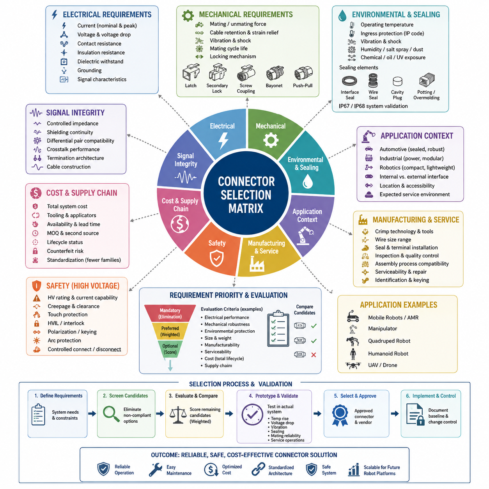
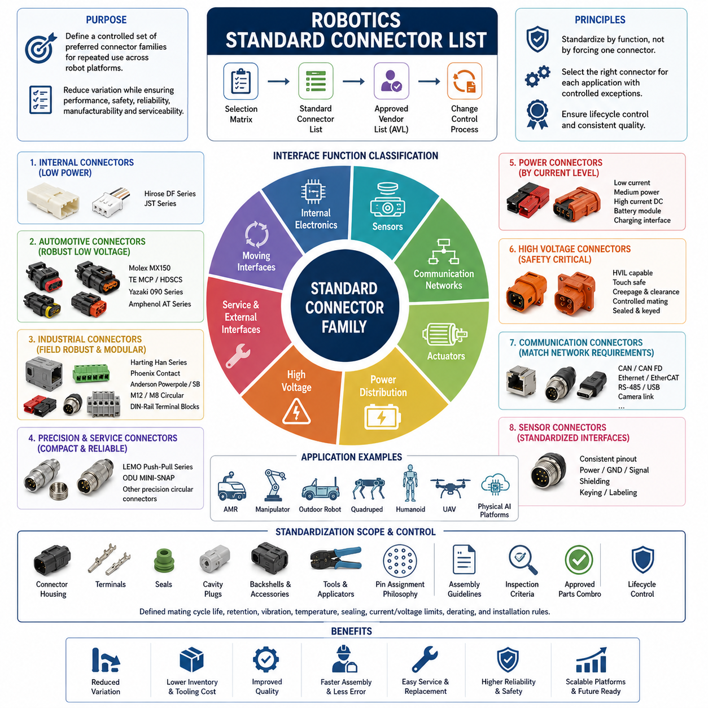
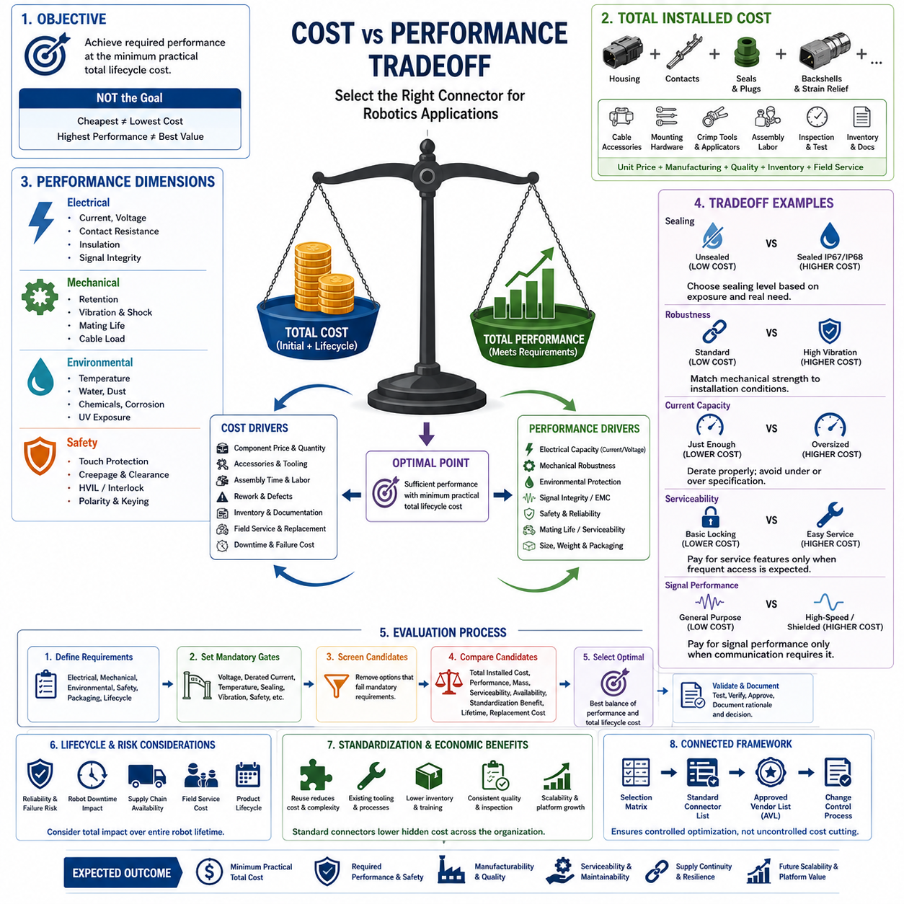
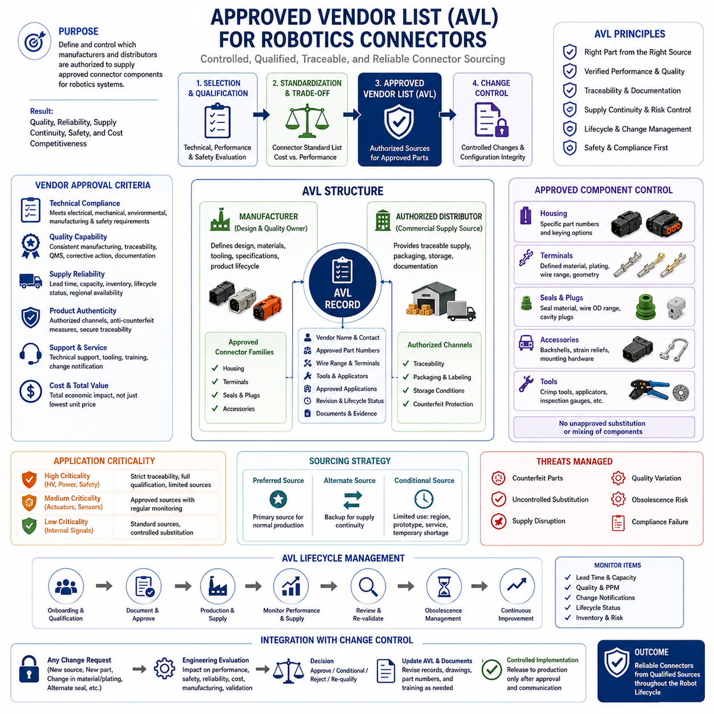
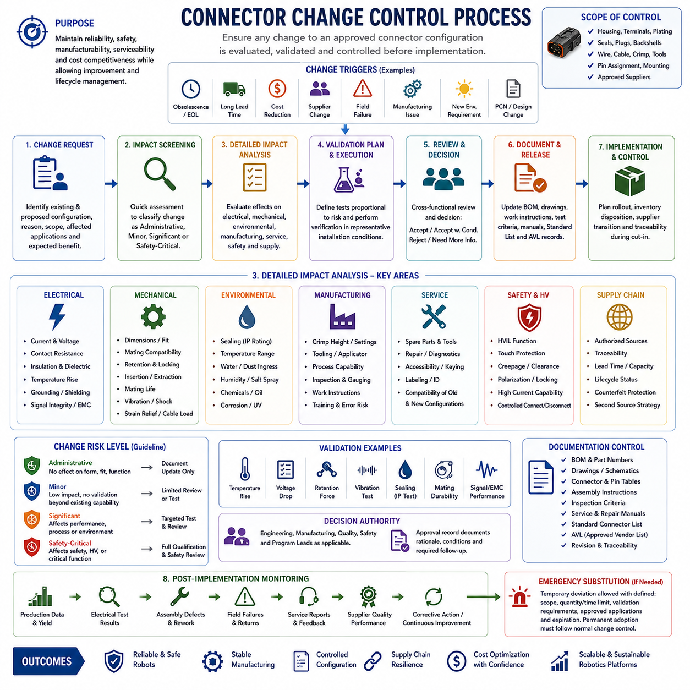

**Volume 03. Connector Engineering**

# Chapter 10. Selection Guidelines

## 10.01. Connector Selection Matrix

{width="7.268055555555556in" height="7.268055555555556in"}

커넥터 선정(Connector Selection)은 단순히 핀 수(Pin Count)나 정격 전류(Current Rating)를 기준으로 부품을 고르는 작업이 아니라 시스템 수준 엔지니어링(System-Level Engineering)의 의사결정 과정이다. 실용적인 선정 매트릭스(Selection Matrix)는 전기적, 기계적, 환경적, 제조, 안전, 정비 및 비용 요구사항을 서로 비교할 수 있는 평가 기준으로 변환한다. 커넥터 엔지니어링(Connector Engineering) 체계에서 이 매트릭스는 접촉 물리(Contact Physics), 디레이팅(Derating), 환경 보호(Environmental Protection), 방수 설계(Waterproofing Design), 자동차용(Automotive), 산업용(Industrial), 로보틱스용(Robotics), 고전압(High-Voltage) 커넥터 영역에서 정립된 원칙을 종합한다.

매트릭스의 첫 번째 평가 차원은 전기적 요구사항(Electrical Requirements)을 정의해야 한다. 엔지니어는 접점당 정격 및 피크 전류(Nominal and Peak Current), 동작 전압(Operating Voltage), 허용 전압 강하(Allowable Voltage Drop), 접촉 저항(Contact Resistance), 절연 저항(Insulation Resistance), 절연 내전압(Dielectric Withstand Capability), 접지 요구사항(Grounding Requirements), 신호 특성(Signal Characteristics)을 규정한다. 전력, 저레벨 아날로그 신호(Low-Level Analog Signal), 디지털 통신(Digital Communication), 고속 이더넷(High-Speed Ethernet), 안전 회로(Safety Circuit)는 서로 다른 접점과 차폐 요구조건을 가지므로 핀 수가 동일하다고 해서 커넥터를 상호 교체할 수 있는 것은 아니다.

전류 용량(Current Capability)은 카탈로그에 표시된 정격 전류만으로 판단하지 않고 실제 운전 조건에서 평가해야 한다. 주변 온도(Ambient Temperature), 전선 굵기(Wire Gauge), 동시에 부하가 인가되는 접점 수, 인클로저 온도(Enclosure Temperature), 공기 흐름(Airflow), 단자 저항(Terminal Resistance), 인접 열원(Heat Source)은 커넥터의 온도 상승에 영향을 준다. 따라서 선정 매트릭스는 공칭 카탈로그 정격(Nominal Catalog Rating)과 애플리케이션별 디레이팅 전류(Application-Specific Derated Current)를 구분하고 비정상 부하, 노화, 오염 및 생산 편차에 대한 충분한 마진을 확보해야 한다.

기계적 요구사항(Mechanical Requirements)은 또 다른 주요 선정 축을 구성한다. 커넥터는 체결 및 분리력(Mating and Unmating Force), 케이블 하중(Cable Load), 진동(Vibration), 충격(Shock), 반복 운동(Repeated Motion), 요구 체결 수명(Mating-Cycle Life)을 견딜 수 있어야 한다. 잠금 메커니즘(Locking Mechanism)은 의도하지 않은 분리로 발생할 수 있는 결과에 따라 선정해야 한다. 인터페이스가 내부형인지, 정비 가능한 구조인지, 이동형인지 또는 심한 동적 하중에 노출되는지에 따라 포지티브 래치(Positive Latch), 이중 잠금(Secondary Lock), 나사 결합(Screw Coupling), 베요넷 결합(Bayonet Coupling), 푸시풀(Push-Pull) 또는 특수 유지 구조(Specialized Retention System)를 적용할 수 있다.

환경 기준(Environmental Criteria)은 전기적으로 적합한 커넥터가 실제 운용 장소에서도 생존할 수 있는지를 결정한다. 매트릭스에는 동작 온도(Operating Temperature), 방진·방수 등급(Ingress Protection), 진동 및 충격 저항(Vibration and Shock Resistance), 습도(Humidity), 염수 분무(Salt Spray), 화학물질 노출(Chemical Exposure), 먼지(Dust), 오일(Oil), 세척제(Cleaning Agent), 필요한 경우 자외선 노출(Ultraviolet Exposure)을 포함해야 한다. 환경 등급(Environmental Rating)과 방수 설계(Waterproofing Design)를 독립적으로 검토하는 것은 밀봉 성능(Sealing Performance)을 단순한 카탈로그 속성이 아니라 설계된 인터페이스(Engineered Interface)로 평가해야 함을 의미한다.

밀봉 인터페이스(Sealed Interface)의 경우 매트릭스는 커넥터 인터페이스 실(Interface Seal), 개별 와이어 실(Wire Seal), 미사용 캐비티 플러그(Unused-Cavity Plug), 케이블 인입부 형상(Cable Entry Geometry), 그리고 필요한 포팅(Potting)이나 오버몰딩(Overmolding)을 검토해야 한다. IP67 또는 IP68 등급만으로 시스템 수준의 방수 성능(System-Level Waterproofing)이 보장되는 것은 아니다. 잘못된 전선 직경, 손상된 실, 누락된 캐비티 플러그, 부적절한 하네스 라우팅(Harness Routing), 불완전한 체결 상태가 누수 경로(Leakage Path)를 형성할 수 있기 때문이다. 따라서 커넥터 사양뿐만 아니라 실제 설치가 완료된 전체 구성까지 고려하여 선정해야 한다.

적용 환경(Application Environment)은 적절한 커넥터 제품군(Connector Family)의 선택에 큰 영향을 미친다. 자동차용 커넥터(Automotive Connector)는 확실한 잠금 구조, 진동 저항, 밀봉 구성, 검증된 크림프 기술(Crimp Technology), 대량 공급성을 결합하기 때문에 많은 이동 로봇(Mobile Robot) 인터페이스에 적합하다. 산업용 커넥터(Industrial Connector)는 더 높은 전력 용량, 모듈성(Modularity), 현장 배선 편의성(Field Wiring Convenience), 표준화된 기계 인터페이스를 제공할 수 있다. 소형 로보틱스 커넥터(Compact Robotics Connector)는 패키징 밀도(Packaging Density), 낮은 질량, 빈번한 정비 또는 소형 전자 모듈이 중요한 경우 유리하다.

매트릭스에서는 내부 인터페이스(Internal Interface)와 외부 인터페이스(External Interface)도 구분해야 한다. 내부 PCB-와이어(PCB-to-Wire) 연결은 소형화, 낮은 질량, 조립 효율 및 적절한 유지력을 우선할 수 있지만, 로봇 외부 연결부는 일반적으로 더 강한 하우징, 향상된 스트레인 릴리프(Strain Relief), 환경 밀봉(Environmental Sealing), 키드 체결(Keyed Mating), 작업자의 오사용 방지 기능을 요구한다. 휠, 서스펜션, 매니퓰레이터(Manipulator) 또는 외부에 노출된 센서 어셈블리(Sensor Assembly) 주변의 커넥터는 전자장치 인클로저 내부에서 보호되는 커넥터보다 훨씬 높은 기계적 강건성(Mechanical Robustness)이 필요할 수 있다.

신호 무결성(Signal Integrity)은 카메라, 라이다(LiDAR), 고속 컴퓨팅 모듈(High-Speed Computing Module), 이더넷 네트워크(Ethernet Network) 및 기타 인지 인터페이스(Perception Interface)에서 점점 중요해진다. 따라서 선정 기준에는 제어 임피던스(Controlled Impedance), 차폐 연속성(Shielding Continuity), 차동쌍 호환성(Differential-Pair Compatibility), 누화 성능(Crosstalk Performance), 종단 구조(Termination Architecture), 케이블 구조(Cable Construction)가 포함될 수 있다. 충분한 접점이 있다는 이유만으로 기계적으로 강한 전력용 커넥터를 고속 데이터 통신에 사용해서는 안 되며, 전기적 인터페이스 특성이 해당 통신 기술과 호환되어야 한다.

커넥터가 표준 설계(Standard Design)에 포함되기 전에 제조 요구사항(Manufacturing Considerations)을 검토해야 한다. 단자 크림프 기술(Terminal Crimp Technology), 어플리케이터(Applicator) 확보 가능성, 수동 공구(Hand Tool) 요구사항, 자동화 공정 호환성, 전선 굵기 범위, 실 장착, 단자 삽입 절차, 이중 잠금(Secondary Locking), 검사 접근성(Inspection Accessibility), 수리 방법은 생산 품질에 영향을 준다. 기술적으로 뛰어난 커넥터라도 특수 공구, 어려운 조립 공정 또는 관리하기 어려운 단자 장착 과정으로 인해 제조 위험(Manufacturing Risk)이 지나치게 증가한다면 적합하지 않을 수 있다.

정비성(Serviceability)도 중요한 평가 차원이다. 로봇은 전체 운용 수명 동안 지속적으로 유지보수되기 때문에 현장에서 교체해야 하는 커넥터는 접근하기 쉽고, 식별이 용이하며, 오체결하기 어렵고, 예상되는 정비 횟수를 견딜 수 있어야 한다. 극성 구조(Polarization), 키잉(Keying), 코딩(Coding), 라벨링(Labeling), 커넥터 위치, 손가락 작업 공간(Finger Clearance), 하네스 여유 길이(Harness Slack)는 정비 품질에 영향을 미친다. 따라서 선정 매트릭스는 최초 조립뿐만 아니라 진단 접근성(Diagnostic Access), 교체 시간, 정비 작업자의 오류 가능성, 현장 손상 이후 복구성까지 평가해야 한다.

고전압 연결(High-Voltage Connection)은 일반 전력 인터페이스보다 추가적인 안전 기준(Safety Criteria)이 필요하다. 고전압 인터록(HV Interlock, HVIL), 오렌지색 케이블 안전 규칙(Orange Cable Safety Convention), 전용 고전압 선정 기준(HV Selection Criteria), 충전 인터페이스(Charging Interface), UAV 고전압 애플리케이션을 고려해야 한다. 따라서 이러한 시스템의 선정 매트릭스에는 접촉 보호(Touch Protection), 연면거리와 공간거리(Creepage and Clearance), 정격 전압, 전류 용량, 인터록 전략(Interlocking Strategy), 극성 구조, 아크 관련 위험(Arc-Related Risk), 제어된 연결 및 분리 동작을 포함해야 한다.

커넥터 크기와 질량(Size and Mass)은 강건성(Robustness)과 균형을 이루어야 한다. 소형 커넥터는 패키징 효율을 향상시키지만 접점 크기, 기계적 강도, 밀봉 공간, 정비 접근성을 감소시킬 수 있다. 대형 산업용 커넥터는 뛰어난 내구성을 제공하지만 소형 로봇, 매니퓰레이터, 사족보행 로봇(Quadruped), 휴머노이드(Humanoid), UAV 시스템에는 허용하기 어려운 질량과 부피를 추가할 수 있다. 따라서 최적의 해결책은 적절한 엔지니어링 마진을 유지하면서 전기, 환경, 기계, 안전, 제조 및 수명주기 요구조건을 충족하는 가장 작은 커넥터이다.

비용 평가(Cost Evaluation)는 커넥터 자체의 구매 가격을 넘어 전체 시스템 비용(System Cost)을 고려해야 한다. 실제 비용에는 단자, 실, 백셸(Backshell), 캐비티 플러그, 스트레인 릴리프, 크림프 공구, 어플리케이터, 조립 인건비, 검사, 재고, 조달 업무, 현장 교체 및 고장으로 인한 비용이 포함된다. 선정 매트릭스(Selection Matrix) 이후에 표준 커넥터 목록(Standard Connector List), 비용 대비 성능 트레이드오프(Cost-vs-Performance Tradeoff), 승인 공급업체 목록(Approved Vendor List, AVL), 커넥터 변경 관리(Connector Change Control)를 적용함으로써 상업적 최적화와 표준화 이전에 기술적 기준선(Technical Baseline)을 먼저 확립할 수 있다.

공급망 기준(Supply-Chain Criteria)에는 제조업체 안정성, 유통업체 공급성, 리드 타임(Lead Time), 최소 주문 수량(Minimum Order Quantity), 세컨드 소스(Second Source) 가능성, 제품 수명주기 상태(Lifecycle Status), 지역별 공급 가능성, 위조품 위험(Counterfeit Risk)을 포함해야 한다. 지나치게 많은 커넥터 제품군을 사용하면 단자 재고, 공구 요구사항, 기술자 교육, 문서 복잡성 및 조달 부담이 증가한다. 따라서 요구조건이 중복되는 영역에서는 관리된 소수의 커넥터 제품군으로 표준화하고, 환경적·전기적·안전적 또는 패키징 제약이 명확하게 정당화되는 경우에만 특수 커넥터를 허용하는 것이 바람직하다.

효과적인 매트릭스는 모든 파라미터를 동일한 중요도로 평가하기보다 요구조건을 필수(Mandatory), 선호(Preferred), 선택(Optional)으로 분류할 수 있다. 필수 기준은 제거 게이트(Elimination Gate)로 작동하며, 부족한 정격 전압, 불충분한 디레이팅 전류, 부적절한 환경 보호, 필수 안전 기능 부재 또는 호환되지 않는 신호 특성이 발견되면 해당 후보를 즉시 제외한다. 이후 남은 후보를 크기, 질량, 정비성, 제조 복잡성, 공급성, 표준화 가치 및 총수명주기비용(Total Lifecycle Cost)과 같은 가중 기준(Weighted Criteria)으로 비교할 수 있다.

최종 선정은 실제 설치된 시스템 수준(Installed-System Level)에서 검증해야 한다. 데이터시트 적합성(Datasheet Compliance)은 출발점에 불과하며, 필요한 경우 대표 하네스를 이용하여 온도 상승, 전압 강하, 유지력, 진동 거동, 밀봉, 체결 신뢰성, 라우팅 하중, 조립 반복성 및 정비 작업을 평가해야 한다. 이러한 접근법은 커넥터 선정을 하네스(Harness), 보호(Protection), 접지(Grounding), 통신(Communication), 안전(Safety), 자율이동로봇(AMR), 매니퓰레이터, 사족보행 로봇, 휴머노이드 및 시험·검증(Testing and Validation)을 포함하는 광범위한 로보틱스 전기 아키텍처(Robotics Electrical Architecture)와 직접 연결한다.

따라서 최종 매트릭스(Final Matrix)는 단순한 카탈로그 비교표가 아니라 추적 가능한 엔지니어링 의사결정 메커니즘(Traceable Engineering Decision Mechanism)으로 기능해야 한다. 선정된 각 커넥터는 정의된 애플리케이션 요구사항, 탈락 기준(Rejection Criteria), 검증 근거(Validation Evidence), 승인된 공급원(Approved Sourcing), 관리된 대체 규칙(Controlled Replacement Rules)과 연결되어야 한다. 이를 일관되게 적용하면 불필요한 커넥터 다양성을 줄이면서 부적절한 표준화를 방지할 수 있으며, 신뢰성 높은 설계, 제조, 유지보수 및 향후 로보틱스 플랫폼 개발을 지원하는 재사용 가능한 인터페이스 아키텍처(Reusable Interface Architecture)를 구축할 수 있다.

## 10.02. Hills Robotics Standard Connector List

{width="7.268055555555556in" height="7.268055555555556in"}

로보틱스 표준 커넥터 목록(Robotics Standard Connector List)은 여러 로봇 플랫폼에서 반복적으로 사용할 수 있는 선호 커넥터 제품군(Preferred Connector Family)을 통제된 형태로 정의한다. 그 목적은 모든 전기 인터페이스를 하나의 커넥터 유형으로 강제하는 것이 아니라 전력, 통신, 센서, 액추에이터, 서비스 인터페이스 및 고전압 시스템에 적합한 솔루션을 유지하면서 불필요한 종류의 증가를 줄이는 것이다. 커넥터 엔지니어링(Connector Engineering) 체계에서 표준 목록은 커넥터 선정 매트릭스(Connector Selection Matrix) 이후에 위치하며 비용, 공급업체 승인 및 변경 관리 활동의 기준이 된다.

표준화(Standardization)는 인터페이스를 엔지니어링 기능(Engineering Function)에 따라 분류하는 것에서 시작한다. 저전력 내부 전자장치, 센서 신호, 통신 네트워크, 액추에이터 전력, 배터리 전력 분배, 외부 서비스 연결, 환경 노출 인터페이스 및 고전압 회로는 근본적으로 서로 다른 요구조건을 가진다. 따라서 커넥터는 적용 영역(Application Domain), 전기적 한계, 환경 성능, 기계적 특성, 조립 방법 및 서비스 조건이 명확하게 정의된 이후에만 표준 목록에 포함되어야 한다.

내부 PCB-와이어 연결(PCB-to-Wire Connection)은 일반적으로 소형 크기, 낮은 질량, 높은 패키징 밀도(Packaging Density), 신뢰성 있는 극성 구조(Polarization), 효율적인 제조를 요구한다. Hirose DF 및 적절한 JST 제품군은 전류와 환경 노출 조건이 인증된 범위 안에 있는 다양한 내부 로보틱스 애플리케이션에 적용할 수 있다. 이러한 커넥터는 특히 로봇 인클로저 내부에서 보호되는 컨트롤러 보드, 임베디드 컴퓨터(Embedded Computer), 내부 센서, 저전력 모듈 및 짧은 하네스 인터페이스에 유용하다.

그러나 내부 커넥터 선정에서도 진동(Vibration)과 케이블 하중(Cable Loading)을 고려해야 한다. 정적인 전자장치에 적합한 소형 커넥터라도 모터, 기어박스, 이동 조인트(Moving Joint) 또는 반복적으로 움직이는 하네스 주변에 설치되면 신뢰성이 저하될 수 있다. 확실한 유지 구조(Positive Retention), 적절한 스트레인 릴리프(Strain Relief), 적합한 전선 굵기, 통제된 하네스 라우팅(Harness Routing), 충분한 체결 수명(Mating-Cycle Capability)이 필요하다. 따라서 표준화에서는 커넥터 제품군뿐만 아니라 허용되는 적용 환경과 설치 제약조건도 함께 규정해야 한다.

이동 플랫폼의 진동에 노출되는 견고한 저전압 인터페이스(Robust Low-Voltage Interface)에서는 자동차용 커넥터(Automotive Connector)가 중요한 표준 범주를 구성한다. Molex MX150, TE MCP 또는 HDSCS, Yazaki 090, Amphenol AT 계열 솔루션은 커넥터 엔지니어링 체계에서 다루는 대표적인 자동차용 커넥터 기술이다. 이들의 밀봉 하우징(Sealed Housing), 잠금 메커니즘(Locking Mechanism), 크림프 단자(Crimp Terminal), 내진동 구조는 자율이동로봇(AMR), 야외 로봇, 차량형 플랫폼 및 외부 노출 전기 모듈에 유용하다.

산업용 로보틱스(Industrial Robotics)는 별도의 표준화 범주를 필요로 한다. 기계 인터페이스에서는 현장 정비성(Field Serviceability), 모듈형 설치, 견고한 하우징 및 산업 자동화 인프라와의 호환성이 중요하기 때문이다. Harting Han, Phoenix Contact 솔루션, Anderson Powerpole 또는 SB 제품군, M12/M8 원형 커넥터(Circular Connector), DIN 레일 단자대(DIN-Rail Terminal Block)는 각각 서로 다른 산업용 인터페이스 방식을 대표한다. 이들을 동등한 제품으로 취급해서는 안 되며 전력, 신호, 설치 및 환경 요구조건에 따라 구체적인 역할을 할당해야 한다.

M12 및 M8 원형 인터페이스(Circular Interface)는 정립된 핀 배열과 견고한 현장 설치가 요구되는 외부 센서 및 산업 통신 연결의 표준화에 특히 유용하다. 특정 코딩(Coding)과 구현 방식에 따라 센서, 액추에이터, 산업용 이더넷(Industrial Ethernet) 및 기타 통신 연결을 지원할 수 있다. 표준 커넥터 목록에서는 코딩, 핀 할당(Pin Assignment), 암수 방향(Male-Female Orientation), 차폐 방식(Shielding Practice), 케이블 구조 및 장치 측 인터페이스 규칙을 관리하여 물리적으로 유사한 인터페이스가 잘못 연결되는 것을 방지해야 한다.

LEMO 푸시풀(Push-Pull) 및 ODU MINI-SNAP과 같은 고품질 원형 커넥터는 로보틱스 표준화에서 다른 역할을 담당할 수 있다. 이러한 제품은 소형 원형 구조, 신뢰성 높은 체결, 반복 연결, 정밀한 기계 인터페이스 또는 우수한 서비스 접근성이 중요한 곳에 적합하다. 계측 장비(Instrumentation), 탈착형 센서 어셈블리, 연구용 로봇, 이동형 매니퓰레이터(Mobile Manipulator) 및 특수 모듈에 유용하지만, 높은 비용과 공급 특성은 저비용 대안과 비교하여 정당화되어야 한다.

전력 분배(Power Distribution)는 하나의 범용 전력 커넥터가 아니라 전류 수준(Current Level)에 따라 커넥터 범주를 구분해야 한다. 저전류 전자장치, 중전력 액추에이터, 고전류 직류 전력 분배(High-Current DC Distribution), 탈착식 배터리 모듈, 충전 인터페이스 및 고전압 추진 시스템은 명확하게 분리된 표준을 가져야 한다. 이를 통해 특정 전력 등급에 인증된 커넥터가 다른 전력 수준에 잘못 재사용되는 것을 방지하고 전선 굵기, 단자 크기, 온도 상승 한계, 디레이팅(Derating) 요구조건 및 보호 협조(Protection Coordination)를 체계적으로 관리할 수 있다.

Anderson Powerpole 및 SB 계열 커넥터는 견고한 직류 전력 연결, 모듈성(Modularity) 또는 비교적 높은 전류 처리가 요구되는 곳에서 유용할 수 있다. 그러나 표준 목록에서는 제품군 이름에만 의존하지 않고 선정된 각 구성에 대해 허용 가능한 전압 및 전류 범위를 정의해야 한다. 실제 성능은 접점 크기, 전선 굵기, 하우징 구성, 주변 온도, 듀티 사이클(Duty Cycle), 설치 조건에 따라 달라지므로 표준화된 부품에서도 애플리케이션별 디레이팅(Application-Specific Derating)은 필수적이다.

고전압 커넥터(High-Voltage Connector)는 독립적으로 관리되는 범주가 필요하다. 이러한 인터페이스에는 고전압 인터록 루프(High-Voltage Interlock Loop, HVIL), 접촉 안전 구조(Touch-Safe Construction), 충분한 연면거리와 공간거리(Creepage and Clearance), 확실한 극성 구조, 통제된 체결 동작 및 환경 밀봉이 필요할 수 있다. 고전압 표준화는 일반 저전압 커넥터 선정 이상의 추가적인 안전 관리(Safety Governance)를 필요로 하며, 오렌지색 케이블 안전 규칙, 충전 인터페이스 및 UAV 고전압 인터페이스 등과 연계되어야 한다.

통신 커넥터(Communication Connector)는 전기 네트워크 아키텍처(Electrical Network Architecture)와 함께 표준화해야 한다. CAN, CAN FD, Ethernet, EtherCAT, RS-485, USB, 카메라 링크(Camera Link) 및 기타 통신 기술은 차폐, 임피던스(Impedance), 차동쌍 라우팅(Differential-Pair Routing), 종단(Termination), 접지에 서로 다른 요구조건을 부과할 수 있다. 기계적으로 호환되는 커넥터라도 특정 네트워크에는 전기적으로 부적절할 수 있으므로 표준 목록은 단순한 범용 신호 커넥터가 아니라 정의된 통신 인터페이스와 승인된 커넥터 구성을 연결해야 한다.

센서 인터페이스(Sensor Interface)는 로봇에 다수의 카메라, 라이다(LiDAR), 근접 센서(Proximity Sensor), 엔코더(Encoder), 관성측정장치(IMU), 안전 장치 및 환경 센서가 사용되기 때문에 표준화의 효과가 매우 크다. 반복되는 커넥터 규칙은 하네스 설계 작업을 줄이고 모듈 교체를 단순화한다. 가능한 경우 센서 종류별로 일관된 전원 핀, 접지 전략, 통신 핀, 차폐 규칙, 키잉(Keying), 라벨링을 적용하되 전기적으로 호환되지 않는 장치가 잘못 연결되지 않도록 충분한 차별성을 유지해야 한다.

액추에이터 인터페이스(Actuator Interface)는 모터, 브레이크, 엔코더, 온도 센서 및 통신 채널이 하나의 조인트 또는 구동 모듈 안에 공존할 수 있으므로 특별한 주의가 필요하다. 소형 매니퓰레이터는 소형 다핀 커넥터(Multi-Pin Connector)를 사용할 수 있지만, 고출력 모바일 베이스 또는 휴머노이드 조인트는 전력과 신호 인터페이스를 분리해야 할 수 있다. 표준화에서는 통합형 또는 분리형 아키텍처의 허용 여부를 정의하고 각 방식에 대해 전류, 차폐, 접지, 유지력, 진동 및 정비 요구조건을 설정해야 한다.

가동 인터페이스(Moving Interface)는 특수한 관리가 필요하다. 회전 조인트(Rotary Joint), 툴 체인저(Tool Changer), 핫스왑 모듈(Hot-Swap Module), 탈착식 배터리 및 빈번하게 교체되는 엔드 이펙터(End Effector)는 일반적인 정적 커넥터가 견디기 어려운 기계적 조건에 노출된다. 따라서 이러한 애플리케이션에는 체결 수명, 접속 순서 동작(Sequencing Behavior), 유지력, 마모 한계(Wear Limit), 검사 또는 교체 기준이 정의된 명시적으로 승인된 인터페이스를 사용해야 한다.

실용적인 표준 커넥터 목록은 부품을 선호(Preferred), 조건부(Conditional), 특수 용도(Special-Use)로 구분해야 한다. 선호 커넥터는 반복되는 인터페이스의 기본 선택이 되며 검증된 공구, 문서화된 조립 공정, 안정적인 공급망 및 확인된 현장 성능을 갖추어야 한다. 조건부 커넥터는 환경, 패키징, 전기 또는 고객 요구사항으로 사용이 정당화될 때 적용할 수 있다. 특수 용도 커넥터는 재고, 공구, 문서화, 검증 및 수명주기 관리 복잡성을 증가시키므로 엔지니어링 검토(Engineering Review)를 거쳐야 한다.

표준화는 단자(Terminal), 실(Seal), 캐비티 플러그(Cavity Plug), 백셸(Backshell), 액세서리 및 공구까지 확장되어야 한다. 하우징 제품군만 승인하는 것으로는 충분하지 않다. 잘못된 단자 도금(Terminal Plating), 전선 굵기 조합, 실 적용 범위, 크림프 공구 또는 캐비티 액세서리는 전체 인터페이스 성능을 손상시킬 수 있기 때문이다. 따라서 승인된 각 구성은 호환 가능한 부품 조합과 제조 요구조건을 정의하여 생산 엔지니어링과 품질 관리가 검증된 커넥터 어셈블리를 일관되게 재현할 수 있도록 해야 한다.

표준 목록은 가능한 범위에서 공통 핀 할당 원칙(Common Pin-Assignment Philosophy)도 확립해야 한다. 전원, 접지, 통신, 차폐, 웨이크업(Wake-Up), 인터록(Interlock), 예약 핀(Reserved Pin)은 정의된 인터페이스 클래스 안에서 통제된 규칙을 따라야 한다. 이러한 일관성은 배선 오류를 줄이고 회로도, 하네스 문서, 진단, 제조 검사 및 서비스 교육을 단순화한다. 그러나 위험한 오연결을 방지하는 확실한 키잉 또는 코딩이 없다면 서로 다른 전압 등급에 동일한 물리적 커넥터를 재사용해서는 안 된다.

커넥터는 전체 수명주기(Complete Lifecycle)가 관리될 때 비로소 진정한 표준 부품이 된다. 엔지니어링 선정, 검증 근거(Qualification Evidence), 제조업체 정보, 승인 유통업체, 공구, 조립 지침, 검사 기준, 교체 부품 및 단종 상태(Obsolescence Status)가 추적 가능해야 한다. 따라서 승인 공급업체 목록(Approved Vendor List, AVL)과 커넥터 변경 관리 프로세스(Connector Change-Control Process)는 승인된 부품의 공급 출처와 대체품 또는 설계 변경의 도입 방식을 관리함으로써 표준 커넥터 목록을 보완한다.

최종적인 로보틱스 커넥터 표준(Robotics Connector Standard)은 자율이동로봇(AMR), 매니퓰레이터, 야외 차량(Outdoor Vehicle), 사족보행 로봇(Quadruped), 휴머노이드(Humanoid), 무인항공기(UAV) 및 향후 피지컬 AI 플랫폼(Physical AI Platform) 전반에서 재사용 가능한 인터페이스 아키텍처(Reusable Interface Architecture)로 기능해야 한다. 표준 제품군은 설계 반복, 재고 다양성, 공구 비용, 조립 오류 및 정비 복잡성을 줄이고, 통제된 예외는 필요한 엔지니어링 유연성을 유지한다. 목표는 어떤 대가를 치르더라도 커넥터 종류를 최소화하는 것이 아니라 전기적 성능, 환경 강건성, 안전성, 제조성, 정비성 및 플랫폼 확장성을 지원할 수 있는 가장 작고 실용적인 검증된 인터페이스 집합을 구축하는 것이다.

## 10.03. Cost vs Performance Tradeoff

{width="7.268055555555556in" height="7.268055555555556in"}

비용 대비 성능 트레이드오프(Cost-versus-Performance Tradeoff) 분석은 로보틱스 시스템(Robotics System)의 실제 요구사항을 충족하기 위해 어느 수준까지 커넥터 성능에 비용을 투자하는 것이 타당한지를 결정하는 과정이다. 가장 저렴한 커넥터가 반드시 가장 낮은 엔지니어링 비용을 의미하지 않으며, 최고 성능의 커넥터 역시 실제 애플리케이션에서 사용하지 않는 기능을 제공할 수 있다. 따라서 목표는 인터페이스의 중요도와 고장 결과에 적합한 총비용으로 충분한 전기적, 기계적, 환경적, 안전 및 수명주기 성능을 확보하는 것이다.

커넥터 비용(Connector Cost)은 하우징의 구매 가격만이 아니라 총 설치 비용(Total Installed Cost)을 기준으로 평가해야 한다. 완전한 인터페이스에는 접점(Contact), 실(Seal), 캐비티 플러그(Cavity Plug), 백셸(Backshell), 스트레인 릴리프(Strain Relief), 케이블 액세서리, 장착 하드웨어, 크림프 공구(Crimp Tool), 어플리케이터(Applicator), 조립 인건비, 검사, 검증, 재고 및 문서화 비용이 포함될 수 있다. 따라서 단가가 낮은 커넥터라도 조립이 어렵거나 특수 공구, 빈번한 재작업 또는 현장 교체가 필요하면 결과적으로 높은 비용을 발생시킬 수 있다.

성능(Performance) 역시 다차원적인 엔지니어링 수치로 정의해야 한다. 전기적 성능에는 전류, 전압, 접촉 저항(Contact Resistance), 절연 및 신호 특성이 포함되며, 기계적 성능에는 유지력(Retention), 내진동성, 체결 수명(Mating Life), 케이블 하중 허용 능력이 포함된다. 환경 성능(Environmental Performance)에는 온도, 물, 먼지, 화학물질, 부식 및 자외선 노출이 추가된다. 이러한 요구사항은 접촉 물리(Contact Physics), 디레이팅(Derating), 환경 등급(Environmental Rating), 방수 설계(Waterproofing Design)에서 정의되는 커넥터 성능 요소와 직접 연결된다.

가장 중요한 트레이드오프는 요구 성능(Required Performance)과 불필요한 마진(Unnecessary Margin) 사이에서 발생한다. 카탈로그 정격이 실제 로봇의 설치 조건을 정확하게 나타내는 것은 아니므로 엔지니어링 마진(Engineering Margin)은 필요하지만, 지나친 오버스펙(Over-Specification)은 크기, 질량, 가격 및 공급 복잡성을 증가시킨다. 극한 온도, 심한 진동, 수천 회의 체결 수명 및 완전한 환경 밀봉을 위해 설계된 커넥터를 보호된 전자장치 인클로저 내부에 영구적으로 설치한다면 추가 성능이 실질적인 가치를 제공하지 못할 수 있다.

반대로 사양 부족(Under-Specification)은 다른 문제를 발생시킨다. 저렴한 커넥터가 초기에는 공칭 전압과 전류 요구사항을 만족하더라도 온도 상승, 진동, 프레팅(Fretting), 부족한 유지력, 오염 또는 반복적인 유지보수로 인해 고장날 수 있다. 이로 인한 비용에는 문제 진단, 하네스 교체, 로봇 가동 중단(Robot Downtime), 전자장치 손상, 현장 서비스 인건비 및 고객 불만이 포함될 수 있다. 따라서 커넥터의 경제성은 초기 부품 비용뿐만 아니라 예상 고장 비용(Expected Cost of Failure)까지 고려해야 한다.

환경 보호(Environmental Protection)는 이러한 트레이드오프를 명확하게 보여준다. 밀봉 커넥터(Sealed Connector)는 추가적인 하우징 구조, 실, 플러그, 조립 관리 및 일반적으로 더 큰 패키징 공간을 요구한다. 이러한 비용은 야외 로봇, 외부에 노출된 휠 모듈, 습윤 환경, 이동 장비 또는 먼지와 세척 공정에 노출되는 인터페이스에서는 정당화된다. 그러나 통제된 인클로저 내부에서는 비밀봉 커넥터(Unsealed Connector)가 훨씬 낮은 비용과 복잡성으로 동등한 시스템 신뢰성을 제공할 수 있다.

기계적 강건성(Mechanical Robustness) 역시 설치 조건에 맞추어야 한다. 자동차용 커넥터(Automotive Connector)는 확실한 잠금, 진동 저항, 밀봉 및 검증된 크림프 시스템을 제공할 수 있고, 산업용 커넥터(Industrial Connector)는 견고한 하우징, 모듈성(Modularity), 편리한 현장 설치를 제공할 수 있다. 소형 로보틱스 커넥터(Compact Robotics Connector)는 패키징 밀도와 질량을 우선하며, 정밀 푸시풀 시스템(Precision Push-Pull System)은 반복 체결과 정비성을 강조할 수 있다. 각각의 커넥터 유형은 서로 다른 애플리케이션 조건에 대응하는 고유한 성능 대비 비용 특성을 가진다.

전류 용량(Current Capability)은 직접 비용과 간접 비용 모두에 영향을 준다. 더 큰 접점과 하우징은 일반적으로 부품 크기와 가격을 증가시키지만, 접점을 열적 한계에 지나치게 가깝게 운용하면 신뢰성이 저하될 수 있다. 따라서 정격 전류는 전선 굵기(Wire Gauge), 주변 온도, 부하가 걸리는 접점 수, 접촉 저항, 듀티 사이클(Duty Cycle), 열적 환경과 함께 평가해야 한다. 적절한 디레이팅은 가능한 가장 작은 커넥터를 선정하거나 인터페이스를 지나치게 대형화하는 것보다 더 나은 수명주기 경제성을 제공하는 경우가 많다.

신호 커넥터(Signal Connector)는 다른 방식의 성능 계산이 필요하다. 저속 디스크리트 신호(Low-Speed Discrete Signal)는 신뢰성 있는 접촉과 유지력만으로 충분할 수 있지만, 이더넷(Ethernet), 카메라 링크(Camera Link), 차동 통신(Differential Communication) 또는 기타 고속 인터페이스에는 제어 임피던스(Controlled Impedance), 차폐 연속성(Shielding Continuity), 적절한 페어 형상(Pair Geometry), 전자파 적합성(EMC) 성능이 필요할 수 있다. 필요하지 않은 곳에 고속 성능을 적용하면 비용 낭비가 되지만, 신호 무결성이 중요한 곳에 범용 저가 커넥터를 사용하면 진단하기 어렵고 비용이 큰 간헐적 고장이 발생할 수 있다.

질량과 패키징(Weight and Packaging)은 이동 로보틱스(Mobile Robotics)에서 경제적 변수로 작용한다. 대형의 견고한 커넥터는 신뢰성 설계를 단순화할 수 있지만 인클로저 공간을 차지하고 하네스 질량을 증가시킨다. 특히 매니퓰레이터(Manipulator), 사족보행 로봇(Quadruped), 휴머노이드(Humanoid), 무인항공기(UAV)에서는 추가 질량이 조인트 하중, 에너지 소비, 탑재중량(Payload), 운용 시간에 영향을 줄 수 있다. 따라서 커넥터 비용 최적화에서는 부품 가격만 비교하지 않고 크기와 질량 감소가 제공하는 시스템 수준의 가치까지 고려해야 한다.

정비성(Serviceability)은 인터페이스에 자주 접근해야 하는 경우 더 비싼 커넥터를 정당화할 수 있다. 확실한 잠금, 명확한 키잉(Keying), 편리한 취급, 높은 체결 수명 및 교체 가능한 접점은 기술자의 작업 시간을 줄이고 잘못된 연결을 방지할 수 있다. 반대로 한 번 조립된 이후 제품 수명 동안 접근하지 않는 연결부에 복잡한 정비 기능을 적용하는 것은 경제적 가치가 낮을 수 있다. 따라서 예상 유지보수 빈도(Expected Maintenance Frequency)를 트레이드오프 평가에 포함해야 한다.

생산량(Manufacturing Volume)은 커넥터 선정의 경제성을 크게 변화시킨다. 소량 프로토타입 단계에서는 저렴한 수동 공구와 쉽게 확보할 수 있는 커넥터가 중요한 선정 요소가 될 수 있다. 생산량이 증가하면 커넥터 가격, 단자 비용, 자동 크림프 호환성, 조립 시간, 불량률 및 어플리케이터 투자 비용의 중요성이 커진다. 대량 생산에서는 작은 단가 절감도 큰 비용 절감으로 이어질 수 있지만, 저비용 솔루션이 충분한 공정 능력(Process Capability)과 현장 신뢰성을 유지할 때만 의미가 있다.

표준화(Standardization)는 이미 로봇의 다른 영역에서 사용되는 커넥터에 숨겨진 경제적 이점을 제공함으로써 트레이드오프를 변화시킨다. 기존 공구, 교육된 작업자, 재고로 보유한 단자, 검증된 조립 절차, 공급업체 관계, 검사 방법 및 서비스 부품은 재사용의 실질적인 비용을 감소시킨다. 따라서 작은 성능 향상을 위해 기술적으로 우수한 새로운 커넥터 제품군을 도입하면 추가적인 재고, 공구, 문서화 및 검증 요구사항으로 인해 조직 전체의 총비용이 오히려 증가할 수 있다.

공급망 회복탄력성(Supply-Chain Resilience)은 단순한 조달 비용이 아니라 성능의 일부로 평가해야 한다. 매우 저렴한 커넥터라도 공급 안정성이 낮고 리드 타임(Lead Time)이 길며 단일 공급원(Single-Source)에 의존하거나 제품 수명주기 상태가 불확실하다면 부품 절감액보다 훨씬 큰 생산 중단 비용을 발생시킬 수 있다. 반대로 안정적인 공급과 승인된 대체품을 제공하는 널리 사용되는 커넥터 제품군에 적정한 프리미엄을 지불하면 제품 수명주기 전체의 운영 및 사업 위험을 감소시킬 수 있다.

고전압(High Voltage) 및 안전 관련 인터페이스(Safety-Related Interface)는 고장 결과가 심각할 수 있기 때문에 다른 경제적 판단 기준을 적용해야 한다. 고전압 커넥터에는 접촉 보호(Touch Protection), 연면거리와 공간거리(Creepage and Clearance), 확실한 극성 구조, 환경 밀봉 및 고전압 인터록 루프(High-Voltage Interlock Loop, HVIL) 기능이 필요할 수 있다. 비용 절감은 정의된 전기 및 안전 아키텍처를 유지하는 데 필요한 기능을 제거하는 방식으로 이루어져서는 안 된다.

실용적인 평가에서는 먼저 필수 성능 게이트(Mandatory Performance Gate)를 설정하고 이를 통과한 후보들 사이에서 비용을 최적화할 수 있다. 전압, 디레이팅된 전류, 온도, 밀봉, 진동, 신호 무결성, 안전 및 패키징 한계를 기준으로 부적합한 후보를 가격 비교 이전에 제거해야 한다. 이후 남은 커넥터를 총 설치 비용, 질량, 정비성, 제조 난이도, 공급성, 표준화 이점, 예상 수명 및 교체 비용을 이용하여 비교할 수 있다.

따라서 경제적 최적점(Economic Optimum)은 반드시 조건을 만족하는 후보 가운데 가장 저렴한 제품을 의미하지 않는다. 어떤 커넥터는 단가가 더 높더라도 조립 시간을 단축하고 액세서리를 제거하며 기존 공구를 사용할 수 있고 현장 교체성을 향상시키거나 예상 고장률을 감소시킬 수 있다. 반대로 다른 커넥터는 뛰어난 기술적 성능을 제공하더라도 고가의 전용 공구와 긴 조달 리드 타임을 요구할 수 있다. 트레이드오프 분석은 이러한 영향을 단순한 부품 가격이 아닌 시스템 의사결정(System Decision)으로 전환한다.

수명주기 비용(Lifecycle Cost)은 상용 로봇 플릿(Commercial Robot Fleet)에서 특히 중요하다. 커넥터 고장은 하나의 인터페이스 문제로 끝나지 않고 전체 로봇의 운용을 중단시킬 수 있기 때문이다. 로봇 활용률, 현장 서비스 이동 비용, 고객의 로봇 의존도 및 고장 인터페이스의 접근 난이도가 증가할수록 신뢰성의 경제적 가치는 커진다. 커넥터 비용을 소폭 증가시키더라도 가동 중단 가능성을 의미 있게 낮출 수 있다면 경제적으로 타당하지만, 신속하게 교체할 수 있는 비핵심 내부 인터페이스에는 동일한 프리미엄이 필요하지 않을 수 있다.

비용 대비 성능 결정(Cost-versus-Performance Decision)은 최종적으로 커넥터 선정 매트릭스(Connector Selection Matrix), 로보틱스 표준 커넥터 목록(Robotics Standard Connector List), 승인 공급업체 목록(Approved Vendor List, AVL), 커넥터 변경 관리 프로세스(Connector Change-Control Process)와 추적 가능하게 연결되어야 한다. 이러한 메커니즘은 최적화가 통제되지 않은 단순 원가 절감으로 변질되는 것을 방지한다. 최종 목표는 제조성, 정비성, 공급 연속성 및 향후 플랫폼 확장성을 유지하면서 요구되는 성능과 안전을 최소한의 실용적인 총수명주기비용(Total Lifecycle Cost)으로 달성하는 표준화된 커넥터 아키텍처(Standardized Connector Architecture)를 구축하는 것이다.

## 10.04. Approved Vendor List (AVL)

{width="7.268055555555556in" height="7.268055555555556in"}

승인 공급업체 목록(Approved Vendor List, AVL)은 로보틱스 전기 아키텍처(Robotics Electrical Architecture)에서 사용하도록 승인된 제조업체, 유통업체 및 특정 커넥터 공급처를 정의한다. 이는 커넥터 선정을 개별 구매 의사결정에서 통제된 엔지니어링 및 공급망 프로세스(Controlled Engineering and Supply-Chain Process)로 전환한다. 선정 가이드라인(Selection Guideline) 구조에서 AVL은 기술적 선정, 커넥터 표준화 및 비용 대비 성능 평가 이후에 위치하며 공식적인 커넥터 변경 관리(Connector Change Control)에 앞서 공급 기준선(Sourcing Baseline)을 제공한다.

AVL 승인은 커넥터 제조업체(Connector Manufacturer)와 구매 공급처(Purchasing Source)를 구분해야 한다. 제조업체는 원래 부품의 설계, 재료, 공구, 사양 및 제품 수명주기를 관리하며, 공식 유통업체(Authorized Distributor)는 추적 가능한 상업적 공급을 제공한다. 따라서 특정 커넥터 제품군이 기술적으로 승인되더라도 구매는 적절한 추적성, 포장, 보관 조건, 문서화 및 위조품 방지(Counterfeit Protection)를 제공하는 특정 공급 경로로 제한될 수 있다.

공급업체는 단순히 가장 낮은 견적을 제시했다는 이유만으로 AVL에 등록되어서는 안 된다. 승인은 제안된 부품이 커넥터 선정 과정에서 확립된 전기적, 기계적, 환경적, 제조 및 안전 요구사항을 충족하는지 확인하는 것에서 시작한다. 전류 및 전압 용량, 온도 범위, 내진동성, 밀봉, 체결 수명(Mating Life), 단자 기술(Terminal Technology), 신호 특성 및 해당되는 고전압 요구사항은 검증된 애플리케이션과 일관성을 유지해야 한다.

AVL은 의도하지 않은 대체(Substitution)를 방지할 수 있을 정도로 충분히 상세한 수준에서 부품을 식별해야 한다. 제조업체명, 커넥터 제품군, 하우징 부품번호(Housing Part Number), 단자 부품번호(Terminal Part Number), 실(Seal) 및 캐비티 플러그(Cavity Plug) 참조번호, 백셸(Backshell) 또는 액세서리 정보, 승인된 전선 범위 및 적용 가능한 공구까지 정의할 필요가 있다. 단순히 일반적인 제품군 이름만 기록하면 외관은 유사하지만 기술적으로 다른 접점, 도금 옵션, 실 또는 하우징 변형품이 엔지니어링 평가 없이 생산에 투입될 수 있다.

커넥터 성능은 접점 시스템(Contact System)에 크게 의존하기 때문에 단자 관리(Terminal Control)는 특히 중요하다. 서로 다른 단자 재료, 도금 마감(Plating Finish), 전선 적용 범위 및 접점 형상은 저항, 온도 상승, 부식 특성, 체결 내구성 및 크림프 품질(Crimp Quality)을 변화시킬 수 있다. 따라서 승인된 하우징이 모든 호환 단자의 자동 승인을 의미해서는 안 된다. AVL은 하우징, 접점, 전선, 실 및 조립 공정 사이에서 검증된 관계를 유지해야 한다.

공급업체 품질 역량(Supplier Quality Capability)은 부품 성능과 함께 고려해야 한다. 관련 요소에는 제조 일관성, 로트 추적성(Lot Traceability), 품질경영 프로세스, 시정조치 대응 능력(Corrective-Action Responsiveness), 변경 통보 관행 및 기술 문서 제공 능력이 포함된다. 중요 로보틱스 인터페이스에서는 안정적인 생산 품질이 작은 단가 차이보다 더 높은 가치를 가질 수 있다. 커넥터 결함이 하네스 고장, 간헐적 오류, 현장 가동 중단 및 진단하기 어려운 문제로 확대될 수 있기 때문이다.

공급 연속성(Supply Continuity)은 AVL의 또 다른 핵심 기준이다. 리드 타임(Lead Time), 최소 주문 수량(Minimum Order Quantity), 지역별 공급 가능성, 생산 능력, 유통업체 재고, 제품 수명주기 상태 및 예상 제품 공급 기간은 기술적으로 적합한 커넥터가 상용 로봇 생산을 지속적으로 지원할 수 있는지를 결정한다. 프로토타입 개발에서는 우수한 성능을 제공한 부품이라도 공급이 불안정하거나 향후 공급이 하나의 취약한 공급원에 의존한다면 양산 플랫폼에는 적합하지 않을 수 있다.

세컨드 소스 전략(Second-Source Strategy)은 커넥터의 상호 교환성이 외관상 보이는 것보다 불완전한 경우가 많으므로 신중하게 관리해야 한다. 두 커넥터가 유사한 크기나 전기 정격을 가지더라도 단자 형상, 밀봉, 잠금 동작, 재료, 도금, 공구 또는 검증 이력이 서로 다를 수 있다. 따라서 세컨드 소스는 단순히 호환(Compatible) 또는 동등(Equivalent)하다고 설명된다는 이유만으로 자동 승인하지 않고 독립적으로 평가된 구성(Independently Evaluated Configuration)으로 취급해야 한다.

위조품(Counterfeit Component)과 비공식 부품(Unauthorized Component)은 커넥터 시스템에 상당한 위험을 발생시킨다. 수지 조성, 단자 도금 두께, 스프링 특성, 치수 공차 또는 밀봉 재료의 차이는 외관으로 쉽게 식별되지 않을 수 있지만 신뢰성을 크게 저하시킬 수 있다. 따라서 제조업체가 승인한 추적 가능한 공급 경로를 통한 구매는 특히 안전 관련, 고전류, 환경 노출 또는 고전압 인터페이스에서 AVL 전략의 중요한 요소가 될 수 있다.

AVL은 애플리케이션 중요도(Application Criticality)에 따라 승인 수준을 구분해야 한다. 비핵심 내부 신호 커넥터에 적합한 공급업체라고 해서 배터리 전력, 비상 정지 회로(Emergency-Stop Circuit), 추진 인터페이스, 안전 센서 또는 고전압 연결에도 자동으로 적합한 것은 아니다. 고장 결과가 심각한 인터페이스는 일반 내부 전자장치보다 강화된 추적성, 엄격한 구성 관리(Configuration Control), 추가적인 검증 근거 및 제한적인 공급 규칙을 요구할 수 있다.

비용은 여전히 중요한 요소이지만 AVL 의사결정에서는 부품 가격만이 아니라 총경제적 영향(Total Economic Impact)을 평가해야 한다. 다소 높은 가격을 제시하는 공급업체라도 짧은 리드 타임, 우수한 기술 지원, 안정적인 재고, 승인된 공구, 향상된 추적성 또는 신속한 시정조치를 제공할 수 있다. 이러한 능력은 재고 버퍼, 엔지니어링 작업, 생산 중단, 품질 유출(Quality Escape) 및 현장 서비스 비용을 감소시켜 더 높은 구매 가격에도 불구하고 총수명주기비용(Total Lifecycle Cost)을 낮출 수 있다.

생산 계획(Production Planning)을 위해 AVL에서는 공급처를 역할에 따라 분류할 수 있다. 선호 공급처(Preferred Source)는 정상적인 생산을 지원하고, 대체 승인 공급처(Alternate Approved Source)는 주 공급 경로가 제한될 때 공급망 회복탄력성(Supply-Chain Resilience)을 제공한다. 조건부 공급처(Conditional Source)는 특정 지역, 프로토타입, 서비스 부품 또는 일시적인 공급 부족 상황에서만 허용할 수 있다. 이러한 분류는 긴급 조달이 적절한 기술 검토 없이 영구적인 엔지니어링 대체로 전환되는 것을 방지한다.

승인은 로봇의 전체 수명주기에 걸쳐 추적 가능해야 하므로 문서화(Documentation)가 필수적이다. AVL은 승인된 공급처를 기술 도면, 데이터시트, 검증 근거(Qualification Evidence), 적용 가능한 커넥터 표준, 내부 부품번호, 승인된 애플리케이션 및 개정 상태(Revision Status)와 연결해야 한다. 이를 통해 구매 및 제조 조직은 무엇을 구매할 수 있는지 명확하게 정의받고, 엔지니어링 조직은 해당 부품과 공급처가 승인된 이유를 설명하는 근거를 유지할 수 있다.

커넥터 조립이 특수 공정에 의존하는 경우 공급업체 승인은 제조 지원(Manufacturing Support)까지 포함해야 한다. 검증된 크림프 공구, 어플리케이터, 단자 추출 공구(Extraction Tool), 검사 게이지(Inspection Gauge), 조립 지침 및 교육의 가용성은 생산 품질에 큰 영향을 미칠 수 있다. 필요한 종단 공정(Termination Process)을 지원할 수 없는 커넥터 공급처는 커넥터 자체가 모든 전기적 및 환경적 요구사항을 충족하더라도 제조 위험을 발생시킬 수 있다.

고전압 커넥터(High-Voltage Connector)의 공급은 특히 엄격하게 관리해야 한다. 고전압 인터록 루프(High-Voltage Interlock Loop, HVIL) 기능, 접촉 보호(Touch Protection), 연면거리와 공간거리(Creepage and Clearance), 극성 구조(Polarization), 밀봉, 접점 재료 및 고전류 성능은 모두 안전에 중요한 요소가 될 수 있다. 승인되지 않은 단자, 하우징, 실 또는 액세서리로의 대체는 검증된 구성을 무효화할 수 있다. 따라서 고전압 AVL 항목은 완전한 부품 조합을 유지하고 엔지니어링 승인 없이 허용되지 않는 대체 항목을 명확하게 정의해야 한다.

초기 승인 이후에도 공급업체 조건은 변할 수 있으므로 정기적인 AVL 검토(Periodic AVL Review)가 필요하다. 제조업체는 재료를 변경하거나 생산지를 이전하고, 공구를 수정하거나 도금 공정을 변경하며, 제품을 단종하거나 제품 변경 통보(Product Change Notification)를 발행할 수 있다. 유통업체의 공식 승인 상태나 지역 지원 역시 변경될 수 있다. 따라서 AVL은 프로그램 초기에 한 번 작성하고 끝나는 정적인 구매용 스프레드시트가 아니라 지속적으로 유지되는 엔지니어링 기록(Maintained Engineering Record)으로 관리해야 한다.

제품 변경 통보(Product Change Notification)는 기술적 중요도에 비례하는 평가를 유발해야 한다. 접점 재료, 도금, 하우징 수지, 밀봉 화합물, 단자 형상, 제조 위치 또는 중요 치수에 영향을 미치는 변경은 엔지니어링 검토나 재검증(Requalification)이 필요할 수 있다. 반면 형상(Form), 장착성(Fit), 기능(Function), 제조 또는 신뢰성에 영향을 주지 않는 행정적 변경은 문서 업데이트만으로 처리할 수 있다. 이를 통해 구성 무결성(Configuration Integrity)을 유지하면서 불필요한 시험을 방지할 수 있다.

단종 관리(Obsolescence Management)는 부품을 실제로 구할 수 없게 되기 전에 AVL 관리 체계에 포함되어야 한다. 수명주기 모니터링(Lifecycle Monitoring)을 통해 엔지니어링 조직은 단종 통보(End-of-Life Notice), 최종 구매(Last-Time Buy) 기회, 유통업체 재고 감소 및 리드 타임 증가 문제를 조기에 파악하여 대체품을 검증할 충분한 시간을 확보할 수 있다. 이는 초기 설계 출시 이후에도 수년 동안 생산되거나 현장에서 운용될 것으로 예상되는 로봇 플랫폼에서 특히 중요하다.

AVL은 독립적인 조달 카탈로그가 아니라 로보틱스 표준 커넥터 목록(Robotics Standard Connector List)과 연결되어야 한다. 표준 커넥터 목록은 반복적으로 사용되는 인터페이스에 어떤 커넥터 아키텍처가 선호되는지를 정의하고, AVL은 해당 아키텍처에 대해 어떤 제조업체, 부품 구성 및 구매 공급처가 승인되는지를 정의한다. 이러한 역할 분리는 엔지니어링 표준화와 상업적 공급 관리를 서로 혼동하지 않으면서 상호 보완적으로 작동하도록 한다.

최종 관리 연결점은 AVL 다음에 위치하는 커넥터 변경 관리 프로세스(Connector Change-Control Process)이다. 새로운 공급업체, 대체 단자, 변경된 도금, 교체용 실, 수정된 하우징 또는 동등품이라고 주장되는 커넥터가 구매 가능하다는 이유만으로 생산에 투입되어서는 안 된다. 승인된 구성에서 벗어나는 모든 변경은 전기적 성능, 환경 보호, 제조성, 정비성, 안전, 비용 및 기존 검증 근거에 미치는 영향을 평가해야 한다.

잘 관리된 AVL은 단순한 구매 편의 수단이 아니라 로봇의 기술적 구성(Technical Configuration)의 일부가 된다. 이는 엔지니어링 요구사항에서 표준화된 커넥터 선정, 검증된 부품 및 통제된 공급처까지 이어지는 추적성(Traceability)을 제공한다. 수명주기 모니터링 및 변경 관리와 결합하면 위조품 위험, 통제되지 않은 대체, 생산 중단, 품질 편차 및 현장 고장을 줄이면서 확장 가능한 로보틱스 플랫폼(Scalable Robotics Platform) 전반에서 비용 경쟁력과 공급망 회복탄력성을 유지할 수 있다.

## 10.05. Connector Change Control Process

{width="7.268055555555556in" height="7.268055555555556in"}

커넥터 변경 관리(Connector Change Control)는 승인된 커넥터 구성(Approved Connector Configuration)에 대한 모든 변경사항이 생산 또는 현장 서비스에 적용되기 전에 평가되도록 보장하는 공식적인 프로세스이다. 부품 수준에서는 사소해 보이는 변경이라도 전기적 성능, 밀봉, 내진동성, 제조성, 안전성 또는 정비성에 영향을 줄 수 있다. 선정 가이드라인(Selection Guideline) 구조에서 변경 관리는 커넥터 선정, 표준화, 비용 대비 성능 평가 및 승인된 공급망을 통해 확립된 일련의 절차를 완성한다.

통제된 구성(Controlled Configuration)은 단순히 커넥터 하우징만을 의미하지 않는다. 여기에는 단자(Terminal), 접점 도금(Contact Plating), 실(Seal), 캐비티 플러그(Cavity Plug), 백셸(Backshell), 스트레인 릴리프(Strain Relief), 전선 굵기, 케이블 구조, 크림프 파라미터(Crimp Parameter), 공구, 핀 할당(Pin Assignment), 장착 구조 및 승인 공급업체가 포함될 수 있다. 이러한 요소 중 하나만 변경되어도 조립된 인터페이스의 동작이 달라질 수 있으므로 변경 프로세스는 외관상 보이는 커넥터 부품번호뿐만 아니라 검증된 전체 연결 구성을 관리해야 한다.

변경 요청(Change Request)은 엔지니어링, 제조, 품질, 구매, 서비스, 공급업체 또는 제품 수명주기 관리(Product Lifecycle Management) 조직에서 시작될 수 있다. 일반적인 발생 요인에는 부품 단종, 긴 리드 타임(Lead Time), 원가 절감, 공급업체 변경, 현장 고장, 제조상의 어려움, 새로운 환경 요구사항, 패키징 변경 및 제품 변경 통보(Product Change Notification)가 포함된다. 요청 출처와 관계없이 기존 구성, 제안 구성, 변경 이유, 영향을 받는 애플리케이션 및 예상되는 이점을 명확하게 정의해야 한다.

첫 번째 엔지니어링 활동은 영향 선별(Impact Screening)이다. 제안된 변경사항이 형상(Form), 장착성(Fit), 기능(Function), 신뢰성, 제조, 서비스 및 안전에 미칠 수 있는 영향을 검토해야 한다. 기계적으로 상호 교환 가능해 보이는 대체품이라도 서로 다른 접점 재료, 단자 형상, 도금 두께, 하우징 수지, 실 화합물 또는 잠금 특성을 사용할 수 있다. 영향 선별의 목적은 변경을 행정적(Administrative), 경미(Minor), 중대(Significant) 또는 안전 중요(Safety-Critical) 변경으로 구분하는 것이다.

전기적 영향 평가(Electrical Impact Assessment)에서는 전류 용량, 정격 전압, 접촉 저항(Contact Resistance), 절연 저항(Insulation Resistance), 절연 내전압(Dielectric Performance), 온도 상승, 접지, 차폐 및 신호 무결성(Signal Integrity)을 고려해야 한다. 커넥터 하우징이 동일하게 유지되더라도 단자, 도금, 전선 굵기 또는 크림프 형상이 변경되면 저항과 열적 거동이 달라질 수 있다. 통신 인터페이스에서는 추가적으로 임피던스, 차동쌍 형상(Differential-Pair Geometry), 차폐 연속성(Shielding Continuity), 누화(Crosstalk), 전자파 적합성(EMC) 관련 특성을 검증해야 할 수 있다.

기계적 평가(Mechanical Assessment)에서는 치수, 체결 호환성(Mating Compatibility), 유지력(Retention Force), 잠금 메커니즘(Locking Mechanism), 삽입 및 분리력, 체결 수명(Mating-Cycle Capability), 스트레인 릴리프, 진동, 충격 및 케이블 하중을 검토한다. 작은 치수 차이도 패키징에 영향을 주거나 완전한 체결을 방해할 수 있으며, 래치 형상이나 접점 수직력(Contact Normal Force)의 변화는 장기 신뢰성에 영향을 줄 수 있다. 가동 조인트, 매니퓰레이터(Manipulator), 이동 플랫폼 및 외부 노출 모듈은 동적 하중이 커넥터 열화를 가속하므로 더욱 엄격한 검토가 필요하다.

하우징, 실, 전선, 백셸, 케이블 인입부 또는 재료가 변경되는 경우 환경적 영향(Environmental Impact)을 평가해야 한다. 기존에 IP67 또는 IP68 조건으로 검증된 인터페이스라도 외관상 사소한 부품 대체 이후에는 해당 성능을 유지하지 못할 수 있다. 온도 범위, 습도, 수분 침투(Water Ingress), 먼지, 염수 분무(Salt Spray), 화학물질, 오일, 세척제, 부식 및 자외선 노출을 실제 설치 환경과 제안된 변경사항의 기술적 중요도에 따라 다시 평가해야 한다.

제조 영향 분석(Manufacturing Impact Analysis)은 기존 생산 공정이 변경 이후에도 유효한지를 판단한다. 새로운 단자는 다른 크림프 높이(Crimp Height), 어플리케이터 설정(Applicator Setting), 삽입 절차, 추출 공구(Extraction Tool), 검사 기준 또는 작업자 교육을 요구할 수 있다. 공급업체가 대체품을 호환 가능하다고 설명하더라도 기존 공구가 자동으로 적합하다고 가정해서는 안 된다. 따라서 공정 능력(Process Capability), 조립 오류 위험, 검사 접근성, 작업 지침 및 필요한 생산 문서를 검토해야 한다.

현장 기술자는 안정적인 인터페이스 규칙에 의존하기 때문에 서비스 영향(Service Impact) 역시 중요하다. 커넥터 변경은 예비 부품, 수리 공구, 진단 절차, 체결 접근성, 라벨링, 키잉(Keying), 교체 지침에 영향을 줄 수 있다. 기존 로봇과 새롭게 생산된 서비스 부품 사이의 호환성을 명확하게 판단해야 한다. 구형 구성과 신형 구성을 안전하게 혼용할 수 없다면 구성 식별(Configuration Identification)과 서비스 문서에서 적용되는 버전을 명확하게 구분해야 한다.

안전 관련 및 고전압 변경(Safety-Related and High-Voltage Change)은 가장 높은 수준의 관리가 필요하다. 고전압 인터록 루프(High-Voltage Interlock Loop, HVIL) 기능, 접촉 보호(Touch Protection), 연면거리와 공간거리(Creepage and Clearance), 극성 구조(Polarization), 잠금, 밀봉, 고전류 성능 및 통제된 연결·분리 동작은 모두 안전에 중요한 요소가 될 수 있다. 더 저렴하거나 쉽게 공급되는 부품이라도 검증된 안전 아키텍처를 약화시킨다면 승인해서는 안 된다. 비상 정지(Emergency Stop), 추진, 배터리, 충전 또는 기타 중요 인터페이스에 영향을 주는 변경 역시 강화된 검토가 필요할 수 있다.

새로운 제조업체나 유통업체가 변경에 포함되는 경우 공급망 평가(Supply-Chain Evaluation)를 기술적 평가와 함께 수행해야 한다. 공식 승인 상태, 추적성, 제조 위치, 품질 역량, 리드 타임, 생산 능력, 수명주기 상태, 위조품 방지 및 세컨드 소스 전략(Second-Source Strategy)이 의사결정에 영향을 줄 수 있다. 승인 공급업체 목록(Approved Vendor List, AVL)이 변경 관리 이전에 확립되므로 공급처 변경은 비공식적인 구매 대체를 통해 우회하는 것이 아니라 통제된 AVL을 업데이트하는 방식으로 처리해야 한다.

원가 절감 제안(Cost-Reduction Proposal)도 성능 향상을 목적으로 하는 변경과 동일한 원칙으로 평가해야 한다. 새로운 대체품으로 단가를 절감하더라도 신규 공구, 추가 검사, 검증 시험, 이중 재고, 작업자 교육, 문서 업데이트 또는 현장 고장 증가가 필요하다면 절감 효과가 사라질 수 있다. 따라서 관련 비교 기준은 기존 구성과 신규 구성의 총수명주기 영향(Total Lifecycle Impact)이며, 이는 앞선 비용 대비 성능(Cost-versus-Performance) 평가 단계와 일관성을 유지해야 한다.

검증 수준(Validation Depth)은 변경 위험도에 비례해야 한다. 행정적 수정이나 공급처 문서 업데이트는 문서 검토만으로 충분할 수 있지만, 재료, 접점, 실, 공구, 전기 부하 또는 환경 성능에 영향을 주는 변경에는 목표 지향적인 시험(Targeted Testing)이 필요할 수 있다. 주요 구성 변경은 온도 상승, 전압 강하, 유지력, 진동, 밀봉, 체결 내구성, 신호 성능 또는 기타 애플리케이션별 검증을 포함하는 보다 광범위한 적격성 평가(Qualification)를 요구할 수 있다.

검증(Validation)은 가능한 경우 실제 설치 조건을 대표할 수 있어야 한다. 단독 커넥터만 시험하면 실제 전선 굵기, 하네스 라우팅(Harness Routing), 인클로저 온도, 케이블 하중, 장착 형상, 오염 또는 반복적인 서비스 작업으로 발생하는 문제를 발견하지 못할 수 있다. 목적은 단순히 대체 부품이 작동한다는 사실을 증명하는 것이 아니라 변경된 인터페이스가 기존 로봇 시스템에 할당된 요구사항을 계속 충족한다는 것을 입증하는 것이다.

의사결정 권한(Decision Authority)은 변경의 중요도에 대응해야 한다. 위험도가 낮은 문서 변경은 간소화된 승인 절차로 처리할 수 있지만 기능 변경에는 필요에 따라 담당 전기, 기계, 제조, 품질 또는 시스템 엔지니어가 참여해야 한다. 안전 중요 변경에는 추가적인 안전 책임자(Safety Authority)의 검토가 필요할 수 있다. 승인 기록에는 제안이 승인(Accepted), 조건부 승인(Conditionally Accepted), 거부(Rejected)되었는지 또는 구현 전에 추가적인 근거가 필요한지를 명시해야 한다.

승인된 변경사항은 출시 전에 관련 문서를 통합적으로 업데이트해야 한다. 회로도(Schematic), 하네스 도면(Harness Drawing), 자재 명세서(Bill of Materials, BOM), 내부 부품번호, 커넥터 표, 핀 할당, 조립 지침, 검사 기준, 서비스 매뉴얼, 표준 커넥터 목록(Standard Connector List), AVL 기록 등이 영향을 받을 수 있다. 개정 관리(Revision Control)를 통해 어떤 제품 구성에서 새로운 인터페이스가 적용되는지를 정확하게 정의하고 제조 과정에서 폐기된 정보와 개정된 정보가 혼용되는 것을 방지해야 한다.

구현 시점(Implementation Timing) 역시 통제해야 한다. 기존 재고는 호환성과 위험도에 따라 소진, 재작업, 반품, 격리 또는 폐기할 수 있다. 생산 전환 시점(Production Cut-In Date), 일련번호 경계(Serial-Number Boundary), 소프트웨어 또는 진단에 미치는 영향, 서비스 재고 및 공급업체 납품 일정을 조정해야 할 수 있다. 구형 구성과 신형 구성이 일시적으로 공존하는 경우 추적성을 통해 영향을 받는 각 로봇에 어떤 커넥터 구성이 설치되어 있는지 확인할 수 있어야 한다.

생산이 부품 부족으로 위협받는 상황에서도 긴급 대체(Emergency Substitution)는 관리 원칙을 유지해야 한다. 승인된 부품을 확보할 수 없을 때 임시 일탈(Temporary Deviation)을 활용할 수 있지만 긴급성을 이유로 기술적 평가를 생략해서는 안 된다. 임시 구성에서는 적용 범위, 수량 또는 기간 제한, 검증 요구사항, 승인된 애플리케이션 및 종료 조건을 정의해야 한다. 영구 적용하려면 문서화되지 않은 예외 상태로 계속 사용하는 것이 아니라 이후 정상적인 변경 관리 프로세스를 거쳐야 한다.

구현 후 모니터링(Post-Implementation Monitoring)은 엔지니어링 폐루프(Engineering Loop)를 완성한다. 초기 생산 데이터, 조립 불량, 전기 시험 결과, 현장 고장, 서비스 보고서, 공급업체 품질 정보 및 커넥터 관련 진단 이벤트를 통해 검증 시험에서 발견되지 않았던 문제를 확인할 수 있다. 예상하지 못한 중대한 문제가 발생하면 시정조치(Corrective Action)를 시작하고 필요한 경우 이전 구성으로 롤백(Rollback)하거나 새로운 통제된 엔지니어링 변경을 시작해야 한다.

변경 관리는 최초 요구사항에서 커넥터 선정(Connector Selection), 로보틱스 표준 커넥터 목록(Robotics Standard Connector List), 비용 대비 성능 평가(Cost-Performance Assessment), AVL 승인, 검증 근거(Validation Evidence), 최종 출시 구성(Released Configuration)까지 이어지는 추적성(Traceability)을 유지해야 한다. 이러한 요소는 독립적인 행정 문서가 아니라 Chapter 10 내부에서 서로 연결되는 관리 절차를 구성한다. 따라서 승인된 각 변경은 무엇이 변경되었는지만 기록하는 것이 아니라 새로운 구성이 왜 여전히 적합한지를 설명해야 한다.

성숙한 커넥터 변경 관리 프로세스(Connector Change-Control Process)는 통제되지 않은 대체를 방지하면서 엔지니어링 개선, 비용 최적화, 공급망 적응 및 수명주기 관리(Lifecycle Management)를 가능하게 한다. 목적은 커넥터 변경 자체를 어렵게 만드는 것이 아니라 구현 이전에 변경으로 발생할 수 있는 결과를 충분히 이해하는 것이다. 위험 기반 평가(Risk-Based Assessment), 변경 수준에 적합한 검증, 구성 관리(Configuration Management), 문서화 및 출시 후 모니터링을 결합함으로써 로보틱스 플랫폼은 신뢰성, 안전성, 제조성, 정비성 및 인터페이스 표준화를 훼손하지 않으면서 지속적으로 발전할 수 있다.
